Chargement des librairies
-------------------------

    library(ggplot2)
    library(tidyverse)

    ## ── Attaching packages ─────────────────────────────────────── tidyverse 1.3.0 ──

    ## ✓ tibble  3.0.4     ✓ dplyr   1.0.2
    ## ✓ tidyr   1.1.2     ✓ stringr 1.4.0
    ## ✓ readr   1.4.0     ✓ forcats 0.5.0
    ## ✓ purrr   0.3.4

    ## ── Conflicts ────────────────────────────────────────── tidyverse_conflicts() ──
    ## x dplyr::filter() masks stats::filter()
    ## x dplyr::lag()    masks stats::lag()

    source("~/suivi-du-data-camp-DeSantiago_Boulahfa_Akrout/code/projet_fct.R")

Chargement et prétraitement de la base de données
-------------------------------------------------

Tout d’abord, nous avons filtré la base de données initiale en gardant
que les individus ayant un rapport Signal/Noise &gt; 1. Nous voulons,
pour l’instant, nous focaliser sur des données qui ne sont pas trop
perturbées par le bruit, afin de pouvoir comprendre au mieux la base de
données.

    data_filtered = read.csv("data_filtered.csv")
    colnames(data_filtered)[1] <- "Position"
    colnames(data_filtered)[2] <- "Covariable"

    data_filtered$Covariable = recode_factor(data_filtered$Covariable,"score_structure_boucle"="reactivity")

Suite à un changement de nom de la variable reactivity on la renomme à
nouveau pour rester cohérent avec les données initiales.

    data_filtered[1:12,1:8]

    ##      Position              Covariable  ARN.1  ARN.2  ARN.3  ARN.4  ARN.5  ARN.6
    ## 1  Position 1              nucléotide 3.0000 3.0000 3.0000 3.0000 3.0000 3.0000
    ## 2  Position 1        structure_boucle 5.0000 5.0000 5.0000 5.0000 5.0000 5.0000
    ## 3  Position 1 erreur_structure_boucle 0.1359 0.0931 0.1942 0.4220 0.4843 0.1754
    ## 4  Position 1          erreur_mg_ph10 0.2613 0.1365 0.2726 0.4801 0.8719 0.2847
    ## 5  Position 1             erreur_ph10 0.2631 0.1702 0.3393 0.9822 0.7045 0.2622
    ## 6  Position 1           erreur_mg_50c 0.1501 0.1033 0.1650 0.5827 0.3840 0.1380
    ## 7  Position 1              erreur_50c 0.2167 0.1498 0.2864 0.9306 0.7429 0.2645
    ## 8  Position 1              reactivity 0.3297 0.4482 0.7642 0.8950 1.1576 0.5850
    ## 9  Position 1           score_mg_ph10 0.7556 0.2504 0.9559 0.4604 1.6912 0.6237
    ## 10 Position 1              score_ph10 2.3375 2.2430 1.9554 2.7711 1.8641 1.8982
    ## 11 Position 1            score_mg_50c 0.3581 0.5163 0.2246 1.0730 0.4906 0.2314
    ## 12 Position 1               score_50c 0.6382 0.9501 0.5882 2.0964 1.2852 1.0121

Chaque colonne (sauf les deux premières) indique les information pour
l’individu concerné. Par exemple : ARN 1 nous donne l’information de
l’individu du train 1. De plus, la séquence d’ARN que nous disposons par
individu est de longueur 68 (longueur dont nous possédont les labels).

Pour chaque nucléotide de la séquence, nous avons 12 informations :

-   Le type de nucléotide, codé avec des entiers tel que : 0=“A”, 1 =
    “U”, 2 = “C”, 3=“G”.

-   Le structure de la boucle.

-   Les erreurs de mesures (5).

-   Les labels (5).

<!-- -->

    sum(is.na(data_filtered))

    ## [1] 0

Ici nous constatons que nous n’avons aucune valeur manquante, donc nous
pouvons travailler avec le jeu de données sans avoir à gerer des `NaNs`

    which(data_filtered[,3+2]<0)

    ## [1] 190 695

On peut apercevoir que pour l’individu n°3 nous avons des valeurs
négatives. Ces valeurs sont en fait celles des labels prédit qui sont
donc négatives. Or, les labels quantifient la dégradation des
nucléotides donc avoir une valeur négatives implique une résistance à la
dégradation, d’où la mise à 0 de ces valeurs. Permettant ainsi d’avoir
les lois des labels sur ℝ<sup>+</sup>.

    noms=colnames(data_filtered)[3:1591]
    for (i in noms){
      data_filtered[which(data_filtered[,i]<0),i]=0
    }

Visualisations :
----------------

### Extraction de toutes les nucléotides à toutes les positions.

La séquence ARN étant un enchainement de nucléotides, on suppose
fortement que la position de ceux-ci dans la séquence ont une influence
sur les labels. Or, afin d’avoir une première approche de cette base de
données, nous allons explorer l’information contenue dedans sans prendre
en compte la position des nucléotides, pour le moment.

    X=extraction_vect(data_filtered,'nucléotide')
    Y_reactivity = extraction_vect(data_filtered,'reactivity')
    Y_score_mg_ph10 = extraction_vect(data_filtered,'score_mg_ph10')
    Y_score_ph10 = extraction_vect(data_filtered,'score_ph10')
    Y_score_mg_50c = extraction_vect(data_filtered,'score_mg_50c')
    Y_score_50c = extraction_vect(data_filtered,'score_50c')

La variable X contient la liste de tous les nucléotides à toutes les
positions et pour tout le monde. Les autres variables représentent
chacun un label.

    plot(table(X))

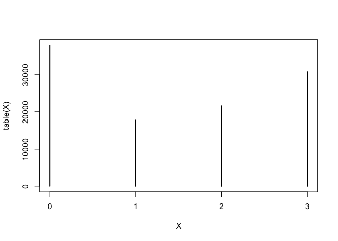

    print(table(X))

    ## X
    ##     0     1     2     3 
    ## 37953 17772 21559 30768

    print(table(X)/sum(table(X)))

    ## X
    ##         0         1         2         3 
    ## 0.3512475 0.1644764 0.1995243 0.2847518

On constate que nous avons 108052 nucléotides en tout. Toutefois, on
peut voir une plus grande représentation de nucléotides `A` et `G`,
comparé aux nucléotides `C` et `U`. Cette information pourra
potentiellement avoir son influence, même si nous avons une quantité
assez importante de chaque nucléotide ainsi que les valeurs de labels
associés.

### Visualisation lien nucléotides - Labels

    min=0
    max=11
    ggplot(,aes(x=as.factor(X), y=Y_reactivity)) + geom_boxplot() + coord_flip() + labs(x= "nucléotides",y="reactivity") + ylim(min, max)

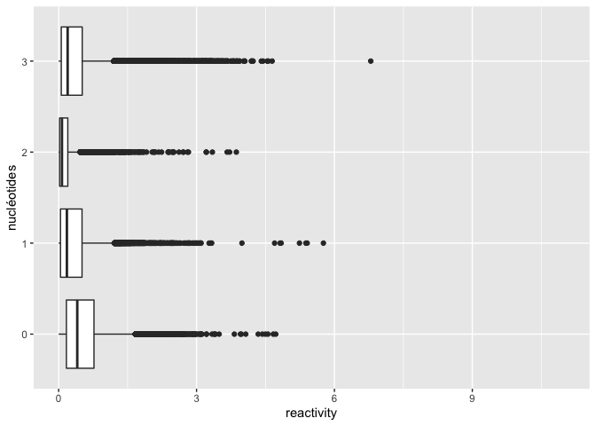

    ggplot(,aes(x=as.factor(X), y=Y_score_mg_ph10)) + geom_boxplot() + coord_flip() + labs(x= "nucléotides",y="score_mg_ph10") + ylim(min, max)

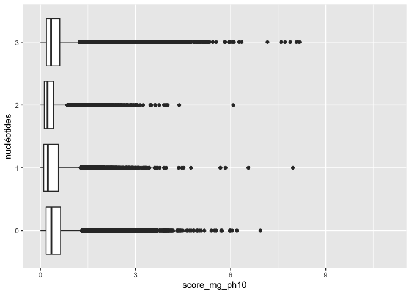

    ggplot(,aes(x=as.factor(X), y=Y_score_ph10)) + geom_boxplot() + coord_flip() + labs(x= "nucléotides",y="score_ph10") + ylim(min, max)

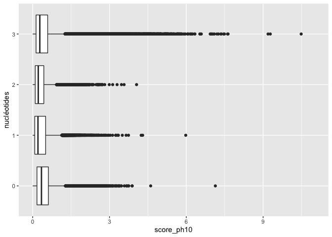

    ggplot(,aes(x=as.factor(X), y=Y_score_mg_50c)) + geom_boxplot() + coord_flip() + labs(x= "nucléotides",y="score_mg_50c") + ylim(min, max)

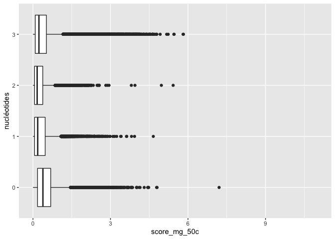

    ggplot(,aes(x=as.factor(X), y=Y_score_50c)) + geom_boxplot() + coord_flip() + labs(x= "nucléotides",y="score_50c") + ylim(min, max)

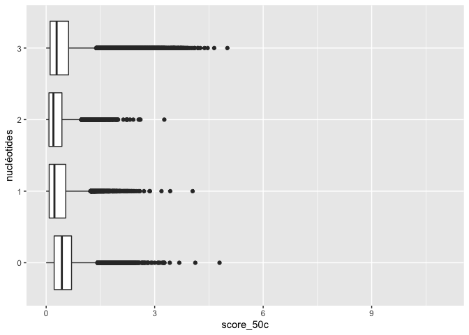

#### reactivity

    Y_reactivity_density <- ggplot(, aes(Y_reactivity, fill=as.factor(X))) + 
      geom_density(alpha=.5) + 
      scale_fill_manual(values = c('#999999','#E69F00','#FC4D27','#2773FC')) + 
      theme(legend.position ="right")+labs(title="reactivity", fill="nucléotide")
    Y_reactivity_density

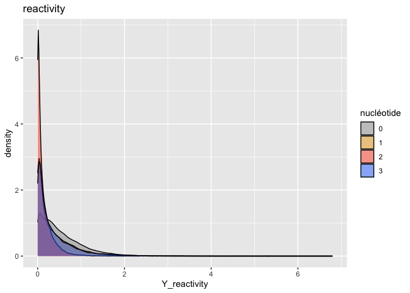

    xdensity <- ggplot(, aes(Y_reactivity)) + 
      geom_density(alpha=.5)
    xdensity

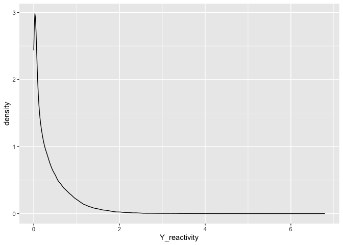

#### score\_mg\_ph10

    Y_score_mg_ph10_density <- ggplot(, aes(Y_score_mg_ph10, fill=as.factor(X))) + 
      geom_density(alpha=.5) + 
      scale_fill_manual(values = c('#999999','#E69F00','#FC4D27','#2773FC')) + 
      theme(legend.position ="right")+labs(title="score_mg_ph10", fill="nucléotide")
    Y_score_mg_ph10_density

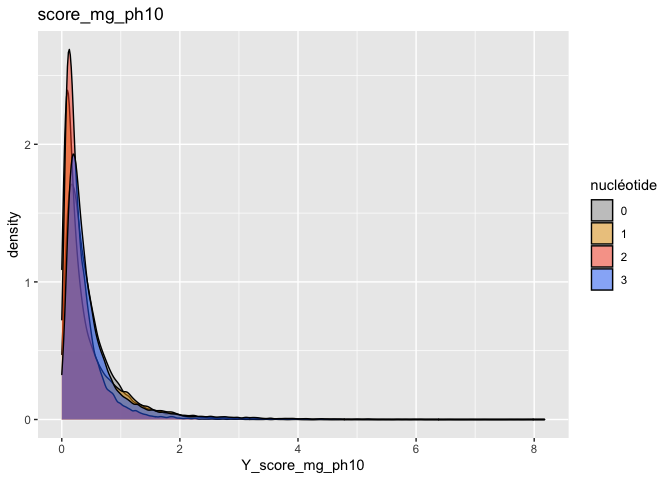

    ggplot(, aes(Y_score_mg_ph10)) + 
      geom_density(alpha=.5)

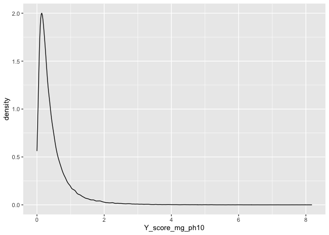

#### score\_ph10

    Y_score_ph10_density <- ggplot(, aes(Y_score_ph10, fill=as.factor(X))) + 
      geom_density(alpha=.5) + 
      scale_fill_manual(values = c('#999999','#E69F00','#FC4D27','#2773FC')) + 
      theme(legend.position ="right")+labs(title="score_ph10", fill="nucléotide")
    Y_score_ph10_density

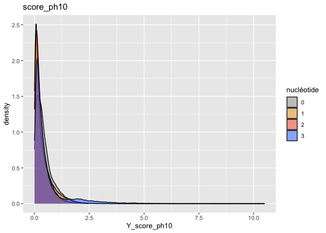

    ggplot(, aes(Y_score_ph10)) + 
      geom_density(alpha=.5)

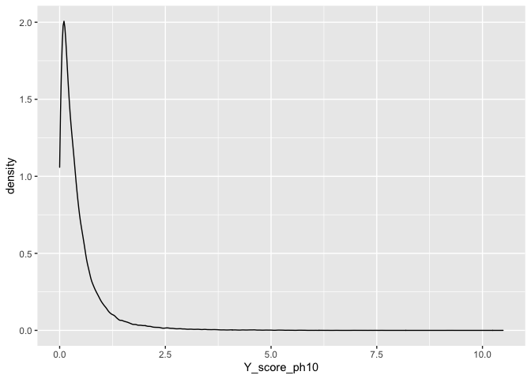

#### score\_mg\_50c

    Y_score_mg_50c_density <- ggplot(, aes(Y_score_mg_50c, fill=as.factor(X))) + 
      geom_density(alpha=.5) + 
      scale_fill_manual(values = c('#999999','#E69F00','#FC4D27','#2773FC')) + 
      theme(legend.position ="right")+labs(title="score_mg_50c", fill="nucléotide")
    Y_score_mg_50c_density

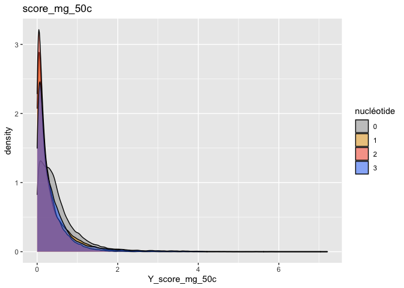

    ggplot(, aes(Y_score_mg_50c)) + 
      geom_density(alpha=.5)

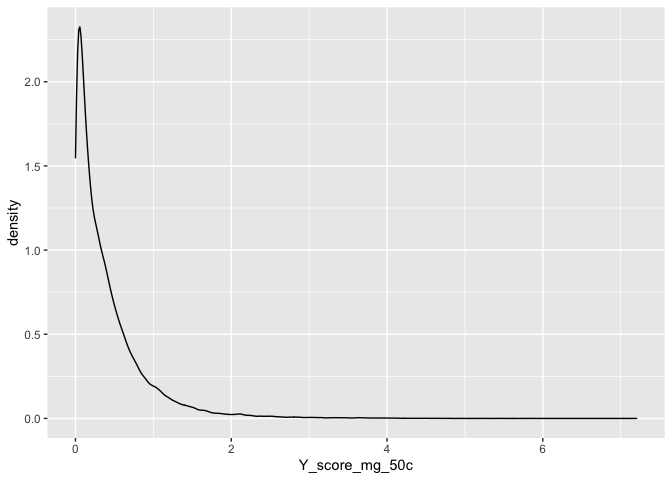

#### score\_50c

    Y_score_50c_density <- ggplot(, aes(Y_score_50c, fill=as.factor(X))) + 
      geom_density(alpha=.5) + 
      scale_fill_manual(values = c('#999999','#E69F00','#FC4D27','#2773FC')) + 
      theme(legend.position ="right")+labs(title="score_50c", fill="nucléotide")
    Y_score_50c_density

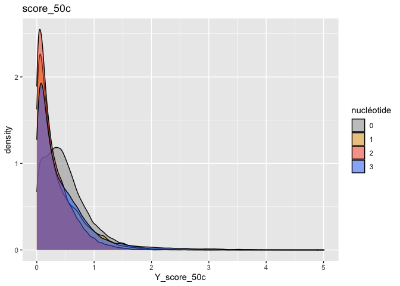

    ggplot(, aes(Y_score_50c)) + 
      geom_density(alpha=.5)

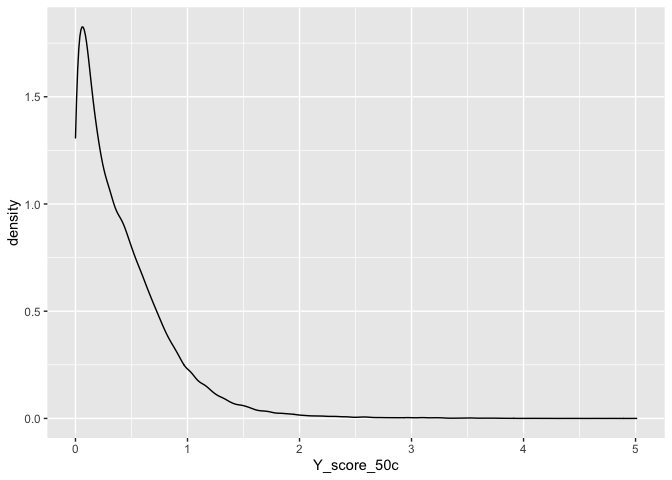

### Visualisation lien les Labels

<!-- ## Pour chaque position -->
<!-- ```{r} -->
<!-- idx= 1*12 -->
<!-- X=t(data_filtered[1+idx,]) #Nucléotide -->
<!-- Y=t(data_filtered[11+idx,]) # Score -->
<!-- X=X[c(-1,-2)] -->
<!-- Y=Y[c(-1,-2)] -->
<!-- plot(X,Y) -->
<!-- ``` -->
<!-- ## Pour chaque individu -->
<!-- ```{r} -->
<!-- X=rep(0,68) -->
<!-- Y=rep(0,68) -->
<!-- ``` -->
