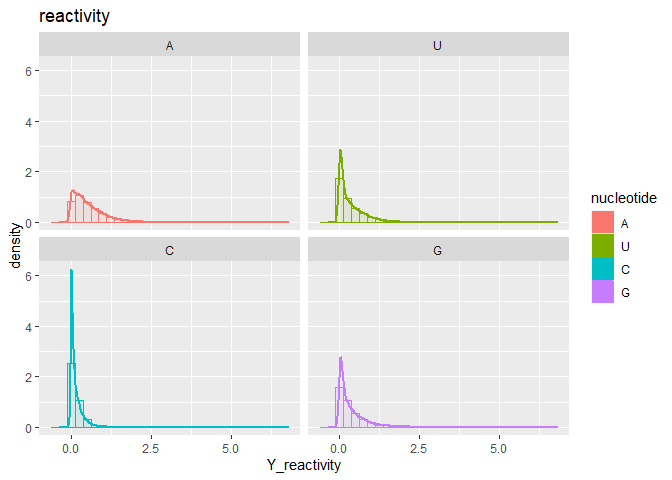
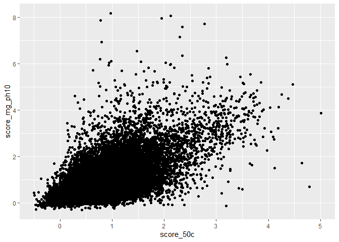

# Data Camp Open Vaccine: Statistiques descriptives

### AKROUT Leyth, BOULAHFA Jawad, DE SANTIAGO Kylliann

#### M2 Data Science: Santé, Assurance, Finance

#### Université d’Evry Val d’Essonne

### 12 février 2021

> [Réorganisation des données](#data)

> [Data visualisation](#visualisation)

<a id="data"></a>

# Réorganisation des données

Tout d’abord, nous avons filtré la base de données initiale en ne
gardant que les individus ayant un rapport Signal/Noise \> 1. Nous
voulons, pour l’instant, nous focaliser sur des données qui ne sont pas
trop perturbées par le bruit, afin de pouvoir comprendre au mieux la
base de données.

``` r
# We start by loading the data
data_filtered <- read_csv("data_filtered.csv")
# We add column names to the first two columns
colnames(data_filtered)[1] <- "Position"
colnames(data_filtered)[2] <- "Covariable"
```

Suite à un changement de nom de la variable `reactivity`, on la renomme
à nouveau pour rester cohérent avec les données initiales. On retire
également l’accent sur le mot “nucléotide” à cause d’un problème
d’affichage de ce caractère sur R. On construit diverses listes qui
nous serviront dans la construction des légendes de nos graphiques.

``` r
# We create a list which contains the names of the nucleotides:
# 0 = A, 1 = U, 2 = C, 3 = G
nucleotide_labels <- c("A", "U", "C", "G")
#↨Labeller for facet_wrap
nucleotide_labeller <- as_labeller(c("0" = "A", "1" = "U", "2" = "C", "3" = "G"))

# We create a list which contains the names of the predicted loop types:
# 0 = S, 1 = M, 2 = I, 3 = B, 4 = H, 5 = E, 6 = X
predicted_loop_type_labels <- c("S", "M", "I", "B", "H", "E", "X")
#↨Labeller for facet_wrap
predicted_loop_type_labeller <- as_labeller(c("0" = "S", "1" = "M", "2" = "I",
                                              "3" = "B", "4" = "H", "5" = "E", "6" = "X"))

# Removing the accent
data_filtered$Covariable[data_filtered$Covariable == "nucléotide"] <- "nucleotide"

# Recoding the factor
data_filtered$Covariable <-
  recode_factor(data_filtered$Covariable, "score_structure_boucle" = "reactivity")
```

On retire le mot “Position” dans chaque ligne de la colonne `Position`.

``` r
# As "Position" is the column name, we can just extract the number inside the strings to keep the position information.
data_filtered <- data_filtered %>%
  mutate(Position = as.factor(parse_number(as.character(Position))))
```

On affiche un aperçu du jeu de données modifié. Chaque colonne (sauf les
deux premières) indique les informations pour l’individu concerné. Par
exemple : ARN 1 nous donne l’information de l’individu du train 1. De
plus, la séquence d’ARN que nous disposons par individu est de longueur
68 (longueur dont nous possédont les labels).

Pour chaque nucléotide de la séquence, nous avons 12 informations:

  - Le type de nucléotide, codé avec des entiers: 0=“A”, 1 = “U”, 2 =
    “C”, 3=“G”.

  - Le type de la boucle, codé avec des entiers également: 0 = “S”, 1 =
    “M”, 2 = “I”, 3 = “B”, 4 = “H”, 5 = “E”, 6 = “X”. D’après la
    description du jeu de données sur Kaggle, on a plus précisément: S =
    paired “Stem”, M = Multiloop, I = Internal loop, B = Bulge, H =
    Hairpin loop, E = dangling End, X = eXternal loop.

  - Les erreurs de mesure des labels (5).

  - Les labels (5).

<!-- end list -->

``` r
# First 25 lines of the data frame
head(data_filtered, n = 25)
```

    ## # A tibble: 25 x 1,591
    ##    Position Covariable `ARN 1` `ARN 2` `ARN 3` `ARN 4` `ARN 5` `ARN 6` `ARN 7`
    ##    <fct>    <fct>        <dbl>   <dbl>   <dbl>   <dbl>   <dbl>   <dbl>   <dbl>
    ##  1 1        nucleotide   3      3        3       3       3       3       3    
    ##  2 1        structure~   5      5        5       5       5       5       5    
    ##  3 1        erreur_st~   0.136  0.0931   0.194   0.422   0.484   0.175   0.161
    ##  4 1        erreur_mg~   0.261  0.136    0.273   0.480   0.872   0.285   0.252
    ##  5 1        erreur_ph~   0.263  0.170    0.339   0.982   0.704   0.262   0.308
    ##  6 1        erreur_mg~   0.150  0.103    0.165   0.583   0.384   0.138   0.155
    ##  7 1        erreur_50c   0.217  0.150    0.286   0.931   0.743   0.264   0.261
    ##  8 1        reactivity   0.330  0.448    0.764   0.895   1.16    0.585   0.64 
    ##  9 1        score_mg_~   0.756  0.250    0.956   0.460   1.69    0.624   1.02 
    ## 10 1        score_ph10   2.34   2.24     1.96    2.77    1.86    1.90    2.60 
    ## # ... with 15 more rows, and 1,582 more variables: `ARN 8` <dbl>, `ARN
    ## #   9` <dbl>, `ARN 10` <dbl>, `ARN 11` <dbl>, `ARN 12` <dbl>, `ARN 13` <dbl>,
    ## #   `ARN 14` <dbl>, `ARN 15` <dbl>, `ARN 16` <dbl>, `ARN 17` <dbl>, `ARN
    ## #   18` <dbl>, `ARN 19` <dbl>, `ARN 20` <dbl>, `ARN 21` <dbl>, `ARN 22` <dbl>,
    ## #   `ARN 23` <dbl>, `ARN 24` <dbl>, `ARN 25` <dbl>, `ARN 26` <dbl>, `ARN
    ## #   27` <dbl>, `ARN 28` <dbl>, `ARN 29` <dbl>, `ARN 30` <dbl>, `ARN 31` <dbl>,
    ## #   `ARN 32` <dbl>, `ARN 33` <dbl>, `ARN 34` <dbl>, `ARN 35` <dbl>, `ARN
    ## #   36` <dbl>, `ARN 37` <dbl>, `ARN 38` <dbl>, `ARN 39` <dbl>, `ARN 40` <dbl>,
    ## #   `ARN 41` <dbl>, `ARN 42` <dbl>, `ARN 43` <dbl>, `ARN 44` <dbl>, `ARN
    ## #   45` <dbl>, `ARN 46` <dbl>, `ARN 47` <dbl>, `ARN 48` <dbl>, `ARN 49` <dbl>,
    ## #   `ARN 50` <dbl>, `ARN 51` <dbl>, `ARN 52` <dbl>, `ARN 53` <dbl>, `ARN
    ## #   54` <dbl>, `ARN 55` <dbl>, `ARN 56` <dbl>, `ARN 57` <dbl>, `ARN 58` <dbl>,
    ## #   `ARN 59` <dbl>, `ARN 60` <dbl>, `ARN 61` <dbl>, `ARN 62` <dbl>, `ARN
    ## #   63` <dbl>, `ARN 64` <dbl>, `ARN 65` <dbl>, `ARN 66` <dbl>, `ARN 67` <dbl>,
    ## #   `ARN 68` <dbl>, `ARN 69` <dbl>, `ARN 70` <dbl>, `ARN 71` <dbl>, `ARN
    ## #   72` <dbl>, `ARN 73` <dbl>, `ARN 74` <dbl>, `ARN 75` <dbl>, `ARN 76` <dbl>,
    ## #   `ARN 77` <dbl>, `ARN 78` <dbl>, `ARN 79` <dbl>, `ARN 80` <dbl>, `ARN
    ## #   81` <dbl>, `ARN 82` <dbl>, `ARN 83` <dbl>, `ARN 84` <dbl>, `ARN 85` <dbl>,
    ## #   `ARN 86` <dbl>, `ARN 87` <dbl>, `ARN 88` <dbl>, `ARN 89` <dbl>, `ARN
    ## #   90` <dbl>, `ARN 91` <dbl>, `ARN 92` <dbl>, `ARN 93` <dbl>, `ARN 94` <dbl>,
    ## #   `ARN 95` <dbl>, `ARN 96` <dbl>, `ARN 97` <dbl>, `ARN 98` <dbl>, `ARN
    ## #   99` <dbl>, `ARN 100` <dbl>, `ARN 101` <dbl>, `ARN 102` <dbl>, `ARN
    ## #   103` <dbl>, `ARN 104` <dbl>, `ARN 105` <dbl>, `ARN 106` <dbl>, `ARN
    ## #   107` <dbl>, ...

Ici nous constatons que nous n’avons aucune valeur manquante, donc nous
pouvons travailler avec le jeu de données sans avoir à gérer des `NaNs`.

``` r
sum(is.na(data_filtered))
```

    ## [1] 0

On peut apercevoir que pour l’individu n°3 nous avons des valeurs
négatives. Ces valeurs sont en fait celles des labels prédits qui sont
donc négatives. Or, les labels quantifient la dégradation des
nucléotides donc avoir une valeur négative implique une résistance à la
dégradation, d’où la mise à 0 de ces valeurs. Cela nous permettra ainsi
d’avoir les lois des labels sur \(\mathbb{R}^+\).

``` r
which(data_filtered[,5]<0)
```

    ## [1] 190 695

``` r
data_filtered[190,]
```

    ## # A tibble: 1 x 1,591
    ##   Position Covariable `ARN 1` `ARN 2` `ARN 3` `ARN 4` `ARN 5` `ARN 6` `ARN 7`
    ##   <fct>    <fct>        <dbl>   <dbl>   <dbl>   <dbl>   <dbl>   <dbl>   <dbl>
    ## 1 16       score_ph10   0.504   0.212 -0.0252       0       0   0.389  0.0953
    ## # ... with 1,582 more variables: `ARN 8` <dbl>, `ARN 9` <dbl>, `ARN 10` <dbl>,
    ## #   `ARN 11` <dbl>, `ARN 12` <dbl>, `ARN 13` <dbl>, `ARN 14` <dbl>, `ARN
    ## #   15` <dbl>, `ARN 16` <dbl>, `ARN 17` <dbl>, `ARN 18` <dbl>, `ARN 19` <dbl>,
    ## #   `ARN 20` <dbl>, `ARN 21` <dbl>, `ARN 22` <dbl>, `ARN 23` <dbl>, `ARN
    ## #   24` <dbl>, `ARN 25` <dbl>, `ARN 26` <dbl>, `ARN 27` <dbl>, `ARN 28` <dbl>,
    ## #   `ARN 29` <dbl>, `ARN 30` <dbl>, `ARN 31` <dbl>, `ARN 32` <dbl>, `ARN
    ## #   33` <dbl>, `ARN 34` <dbl>, `ARN 35` <dbl>, `ARN 36` <dbl>, `ARN 37` <dbl>,
    ## #   `ARN 38` <dbl>, `ARN 39` <dbl>, `ARN 40` <dbl>, `ARN 41` <dbl>, `ARN
    ## #   42` <dbl>, `ARN 43` <dbl>, `ARN 44` <dbl>, `ARN 45` <dbl>, `ARN 46` <dbl>,
    ## #   `ARN 47` <dbl>, `ARN 48` <dbl>, `ARN 49` <dbl>, `ARN 50` <dbl>, `ARN
    ## #   51` <dbl>, `ARN 52` <dbl>, `ARN 53` <dbl>, `ARN 54` <dbl>, `ARN 55` <dbl>,
    ## #   `ARN 56` <dbl>, `ARN 57` <dbl>, `ARN 58` <dbl>, `ARN 59` <dbl>, `ARN
    ## #   60` <dbl>, `ARN 61` <dbl>, `ARN 62` <dbl>, `ARN 63` <dbl>, `ARN 64` <dbl>,
    ## #   `ARN 65` <dbl>, `ARN 66` <dbl>, `ARN 67` <dbl>, `ARN 68` <dbl>, `ARN
    ## #   69` <dbl>, `ARN 70` <dbl>, `ARN 71` <dbl>, `ARN 72` <dbl>, `ARN 73` <dbl>,
    ## #   `ARN 74` <dbl>, `ARN 75` <dbl>, `ARN 76` <dbl>, `ARN 77` <dbl>, `ARN
    ## #   78` <dbl>, `ARN 79` <dbl>, `ARN 80` <dbl>, `ARN 81` <dbl>, `ARN 82` <dbl>,
    ## #   `ARN 83` <dbl>, `ARN 84` <dbl>, `ARN 85` <dbl>, `ARN 86` <dbl>, `ARN
    ## #   87` <dbl>, `ARN 88` <dbl>, `ARN 89` <dbl>, `ARN 90` <dbl>, `ARN 91` <dbl>,
    ## #   `ARN 92` <dbl>, `ARN 93` <dbl>, `ARN 94` <dbl>, `ARN 95` <dbl>, `ARN
    ## #   96` <dbl>, `ARN 97` <dbl>, `ARN 98` <dbl>, `ARN 99` <dbl>, `ARN 100` <dbl>,
    ## #   `ARN 101` <dbl>, `ARN 102` <dbl>, `ARN 103` <dbl>, `ARN 104` <dbl>, `ARN
    ## #   105` <dbl>, `ARN 106` <dbl>, `ARN 107` <dbl>, ...

``` r
data_filtered[695,]
```

    ## # A tibble: 1 x 1,591
    ##   Position Covariable `ARN 1` `ARN 2`  `ARN 3` `ARN 4` `ARN 5` `ARN 6` `ARN 7`
    ##   <fct>    <fct>        <dbl>   <dbl>    <dbl>   <dbl>   <dbl>   <dbl>   <dbl>
    ## 1 58       score_mg_~   0.203   0.176 -0.00480   0.167  0.0399   -0.01  0.0483
    ## # ... with 1,582 more variables: `ARN 8` <dbl>, `ARN 9` <dbl>, `ARN 10` <dbl>,
    ## #   `ARN 11` <dbl>, `ARN 12` <dbl>, `ARN 13` <dbl>, `ARN 14` <dbl>, `ARN
    ## #   15` <dbl>, `ARN 16` <dbl>, `ARN 17` <dbl>, `ARN 18` <dbl>, `ARN 19` <dbl>,
    ## #   `ARN 20` <dbl>, `ARN 21` <dbl>, `ARN 22` <dbl>, `ARN 23` <dbl>, `ARN
    ## #   24` <dbl>, `ARN 25` <dbl>, `ARN 26` <dbl>, `ARN 27` <dbl>, `ARN 28` <dbl>,
    ## #   `ARN 29` <dbl>, `ARN 30` <dbl>, `ARN 31` <dbl>, `ARN 32` <dbl>, `ARN
    ## #   33` <dbl>, `ARN 34` <dbl>, `ARN 35` <dbl>, `ARN 36` <dbl>, `ARN 37` <dbl>,
    ## #   `ARN 38` <dbl>, `ARN 39` <dbl>, `ARN 40` <dbl>, `ARN 41` <dbl>, `ARN
    ## #   42` <dbl>, `ARN 43` <dbl>, `ARN 44` <dbl>, `ARN 45` <dbl>, `ARN 46` <dbl>,
    ## #   `ARN 47` <dbl>, `ARN 48` <dbl>, `ARN 49` <dbl>, `ARN 50` <dbl>, `ARN
    ## #   51` <dbl>, `ARN 52` <dbl>, `ARN 53` <dbl>, `ARN 54` <dbl>, `ARN 55` <dbl>,
    ## #   `ARN 56` <dbl>, `ARN 57` <dbl>, `ARN 58` <dbl>, `ARN 59` <dbl>, `ARN
    ## #   60` <dbl>, `ARN 61` <dbl>, `ARN 62` <dbl>, `ARN 63` <dbl>, `ARN 64` <dbl>,
    ## #   `ARN 65` <dbl>, `ARN 66` <dbl>, `ARN 67` <dbl>, `ARN 68` <dbl>, `ARN
    ## #   69` <dbl>, `ARN 70` <dbl>, `ARN 71` <dbl>, `ARN 72` <dbl>, `ARN 73` <dbl>,
    ## #   `ARN 74` <dbl>, `ARN 75` <dbl>, `ARN 76` <dbl>, `ARN 77` <dbl>, `ARN
    ## #   78` <dbl>, `ARN 79` <dbl>, `ARN 80` <dbl>, `ARN 81` <dbl>, `ARN 82` <dbl>,
    ## #   `ARN 83` <dbl>, `ARN 84` <dbl>, `ARN 85` <dbl>, `ARN 86` <dbl>, `ARN
    ## #   87` <dbl>, `ARN 88` <dbl>, `ARN 89` <dbl>, `ARN 90` <dbl>, `ARN 91` <dbl>,
    ## #   `ARN 92` <dbl>, `ARN 93` <dbl>, `ARN 94` <dbl>, `ARN 95` <dbl>, `ARN
    ## #   96` <dbl>, `ARN 97` <dbl>, `ARN 98` <dbl>, `ARN 99` <dbl>, `ARN 100` <dbl>,
    ## #   `ARN 101` <dbl>, `ARN 102` <dbl>, `ARN 103` <dbl>, `ARN 104` <dbl>, `ARN
    ## #   105` <dbl>, `ARN 106` <dbl>, `ARN 107` <dbl>, ...

La séquence ARN étant un enchainement de nucléotides, on suppose
fortement que la position de ceux-ci dans la séquence ont une influence
sur les labels. Cependant, afin d’avoir une première approche sur cette
base de données, nous allons explorer l’information contenue dans
celle-ci sans prendre en compte la position des nucléotides pour le
moment.

La variable X contient la liste de tous les nucléotides pour toutes les
positions sur la séquence et pour tout les individus. La variable
predicted\_loop\_type contient la liste de tout les types de boucles
pour toutes les positions sur la séquence et pour tout les individus.
Les autres variables représentent chacun un label.

On construit ensuite un data frame score\_df qui regroupe toutes les
valeurs des labels, ainsi que tout les nucléotides et les types de
boucles de façon séquentielle (i.e. pour chaque individu et pour chaque
position sur la séquence). Ce data frame nous servira à construire tout
les graphiques qui suivent.

``` r
# We gather the nucleotides values for all positions in a dataframe.
nucleotide_df <- data_filtered %>% subset(Covariable == "nucleotide") %>%
  dplyr::select(-c(Position, Covariable)) %>% mutate_all(as.factor)
# The row index changed, so we change it back.
# The row index is now the position in the sequence.
rownames(nucleotide_df) <- NULL

# X is a vector which will contain all nucleotides values (for each position and each individual)
X <- c()
for (i in seq(1:nrow(nucleotide_df))){
  X <- c(X, nucleotide_df[i, ])
}
X <- unlist(X)

# We gather the predicted loop types values for all positions in a dataframe.
predicted_loop_type_df <- data_filtered %>% subset(Covariable == "structure_boucle") %>%
  dplyr::select(-c(Position, Covariable))
# The row index changed, so we change it back.
# The row index is now the position in the sequence.
rownames(predicted_loop_type_df) <- NULL

predicted_loop_type_vector <- c()
for (i in seq(1:nrow(predicted_loop_type_df))){
  predicted_loop_type_vector <- c(predicted_loop_type_vector, predicted_loop_type_df[i, ])
}
predicted_loop_type_vector <- unlist(predicted_loop_type_vector)

# We gather the reactivity values for all positions in a dataframe.
reactivity_df <- data_filtered %>%
  subset(Covariable == "reactivity") %>%
  dplyr::select(-c(Position, Covariable))
rownames(reactivity_df) <- NULL

# We gather the score_mg_ph10 values for all positions in a dataframe.
score_mg_ph10_df <- data_filtered %>%
  subset(Covariable == "score_mg_ph10") %>%
  dplyr::select(-c(Position, Covariable))
# The row index changed, so we change it back.
# The row index is now the position in the sequence.
rownames(score_mg_ph10_df) <- NULL

# We gather the score_ph10 values for all positions in a dataframe.
score_ph10_df <- data_filtered %>%
  subset(Covariable == "score_ph10") %>%
  dplyr::select(-c(Position, Covariable))
# The row index changed, so we change it back.
# The row index is now the position in the sequence.
rownames(score_ph10_df) <- NULL

# We gather the score_mg_50c values for all positions in a dataframe.
score_mg_50c_df <- (data_filtered[data_filtered[,2]=='score_mg_50c',]) %>% dplyr::select(-c(Position, Covariable))
```

    ## Warning: The `i` argument of ``[`()` can't be a matrix as of tibble 3.0.0.
    ## Convert to a vector.
    ## This warning is displayed once every 8 hours.
    ## Call `lifecycle::last_warnings()` to see where this warning was generated.

``` r
# The row index changed, so we change it back.
# The row index is now the position in the sequence.
rownames(score_mg_50c_df) <- NULL

# We gather the score_50c values for all positions in a dataframe.
score_50c_df <- data_filtered %>%
  subset(Covariable == "score_50c") %>%
  dplyr::select(-c(Position, Covariable))
# The row index changed, so we change it back.
# The row index is now the position in the sequence.
rownames(score_50c_df) <- NULL

# Y_reactivity, ... ,Y_score_50c are vector which will contain all score values (for each position and each individual)
Y_reactivity <- c()
Y_score_mg_ph10 <- c()
Y_score_ph10 <- c()
Y_score_mg_50c <- c()
Y_score_50c <- c()
for (i in seq(1:nrow(nucleotide_df)))
{
  Y_reactivity <- c(Y_reactivity, reactivity_df[i, ])
  Y_score_mg_ph10 <- c(Y_score_mg_ph10, score_mg_ph10_df[i, ])
  Y_score_ph10 <- c(Y_score_ph10, score_ph10_df[i, ])
  Y_score_mg_50c <- c(Y_score_mg_50c, score_mg_50c_df[i, ])
  Y_score_50c <- c(Y_score_50c, score_50c_df[i, ])
} 
Y_reactivity <- unlist(Y_reactivity)
Y_score_mg_ph10 <- unlist(Y_score_mg_ph10)
Y_score_ph10 <- unlist(Y_score_ph10)
Y_score_mg_50c <- unlist(Y_score_mg_50c)
Y_score_50c <- unlist(Y_score_50c)

scores_df <- data.frame(X, predicted_loop_type_vector, 
                        Y_reactivity, Y_score_mg_ph10,
                        Y_score_ph10, Y_score_mg_50c, Y_score_50c) %>%
  mutate(predicted_loop_type_vector = as.factor(predicted_loop_type_vector))
```

``` r
head(scores_df)
```

    ##   X predicted_loop_type_vector Y_reactivity Y_score_mg_ph10 Y_score_ph10
    ## 1 3                          5       0.3297          0.7556       2.3375
    ## 2 3                          5       0.4482          0.2504       2.2430
    ## 3 3                          5       0.7642          0.9559       1.9554
    ## 4 3                          5       0.8950          0.4604       2.7711
    ## 5 3                          5       1.1576          1.6912       1.8641
    ## 6 3                          5       0.5850          0.6237       1.8982
    ##   Y_score_mg_50c Y_score_50c
    ## 1         0.3581      0.6382
    ## 2         0.5163      0.9501
    ## 3         0.2246      0.5882
    ## 4         1.0730      2.0964
    ## 5         0.4906      1.2852
    ## 6         0.2314      1.0121

<a id="visualisation"></a>

# Data visualisation

## Nucleotides

### Pie plot

``` r
nucleotide_table <- data.frame(table(X)) %>% mutate(Proportion = Freq/sum(Freq)) %>%
  mutate(Percent = 100*Proportion) %>% mutate(Nucleotide = nucleotide_labels) %>%
  dplyr::select(X, Nucleotide, everything())
colnames(nucleotide_table)[3] <- "Count" 
```

On constate que nous avons \(108052\) nucléotides en tout. Toutefois, on
peut voir une plus grande représentation de nucléotides `A` et `G`,
comparé aux nucléotides `C` et `U`. Cette information pourra
potentiellement avoir son influence, même si nous avons une quantité
assez importante de chaque nucléotide ainsi que les valeurs de labels
associés.

``` r
nucleotide_table
```

    ##   X Nucleotide Count Proportion  Percent
    ## 1 0          A 37953  0.3512475 35.12475
    ## 2 1          U 17772  0.1644764 16.44764
    ## 3 2          C 21559  0.1995243 19.95243
    ## 4 3          G 30768  0.2847518 28.47518

``` r
# There are 108 052 nucleotides in the dataset
nucleotide_table$Count %>% sum()
```

    ## [1] 108052

``` r
nucleotide_table %>%
  mutate(ypos = cumsum(Proportion) - 0.5 * Proportion) %>%
  ggplot(aes(x="", y=Proportion, fill=Nucleotide)) +
  geom_bar(stat="identity", width=1, color="black") +
  coord_polar(theta = "y", direction = 1) + theme_void() +
  geom_text(aes(label = paste0(round(100*Proportion, 2), "%")),
            position = position_stack(vjust = 0.5),
            color = "white", size = 5) +
  ggtitle("Nucleotides pie plot")
```

<!-- -->

### Boxplots

``` r
scores_df %>% ggplot(aes(x = X, y = Y_reactivity)) + geom_boxplot(aes(color = X)) +
  labs(x = "nucleotides", y = "reactivity", color = "nucleotides") +
  scale_x_discrete(labels = nucleotide_labels) +
  scale_color_discrete(labels = nucleotide_labels)
```

<!-- -->

``` r
scores_df %>% ggplot(aes(x = X, y = Y_score_mg_ph10)) +
  geom_boxplot(aes(color = X)) +
  labs(x = "nucleotides", y = "score_mg_ph10", color = "nucleotides") +
  scale_x_discrete(labels = nucleotide_labels) +
  scale_color_discrete(labels = nucleotide_labels)
```

<!-- -->

``` r
scores_df %>% ggplot(aes(x = X, y = Y_score_ph10)) +
  geom_boxplot(aes(color = X)) +
  labs(x = "nucleotides", y = "score_ph10", color = "nucleotides") +
  scale_x_discrete(labels = nucleotide_labels) +
  scale_color_discrete(labels = nucleotide_labels)
```

<!-- -->

``` r
scores_df %>% ggplot(aes(x = X, y = Y_score_mg_50c)) +
  geom_boxplot(aes(color = X)) +
  labs(x = "nucleotides", y = "score_mg_50c", color = "nucleotides") +
  scale_x_discrete(labels = nucleotide_labels) +
  scale_color_discrete(labels = nucleotide_labels)
```

<!-- -->

``` r
scores_df %>% ggplot(aes(x = X, y = Y_score_50c)) +
  geom_boxplot(aes(color = X)) +
  labs(x = "nucleotides", y ="score_50c", color = "nucleotides") +
  scale_x_discrete(labels = nucleotide_labels) +
  scale_color_discrete(labels = nucleotide_labels)
```

<!-- -->

## Predicted loop types

### Pie plot

``` r
predicted_loop_type_table <- data.frame(table(predicted_loop_type_vector)) %>%
  mutate(Proportion = Freq/sum(Freq)) %>%
  arrange(predicted_loop_type_vector) %>%
  mutate(Percent = 100*Proportion) %>%
  mutate(Predicted_loop_type = predicted_loop_type_labels) %>%
  dplyr::select(predicted_loop_type_vector, Predicted_loop_type, everything())
colnames(predicted_loop_type_table)[3] <- "Count"
```

``` r
predicted_loop_type_table
```

    ##   predicted_loop_type_vector Predicted_loop_type Count Proportion   Percent
    ## 1                          0                   S 57598 0.53305816 53.305816
    ## 2                          1                   M  3645 0.03373376  3.373376
    ## 3                          2                   I  8885 0.08222893  8.222893
    ## 4                          3                   B  2224 0.02058268  2.058268
    ## 5                          4                   H 13670 0.12651316 12.651316
    ## 6                          5                   E 17945 0.16607744 16.607744
    ## 7                          6                   X  4085 0.03780587  3.780587

On obtient le même nombre que le nombre de nucléotides. C’est cohérent.

``` r
predicted_loop_type_table$Count %>% sum()
```

    ## [1] 108052

``` r
predicted_loop_type_table %>%
  mutate(ypos = cumsum(Proportion) - 0.5 * Proportion) %>%
  ggplot(aes(x="", y=Proportion, fill=Predicted_loop_type)) +
  geom_bar(stat="identity", width=1, color="black") +
  coord_polar(theta = "y", direction = 1, start = 0) + theme_void() +
  geom_text(aes(x = 1.63, label = paste0(round(100*Proportion, 2), "%")),
            position = position_stack(vjust = 0.5),
            color = "black", size = 4.5) +
  ggtitle("Predicted loop type pie plot")
```

<!-- -->

### Boxplots

``` r
scores_df %>% ggplot(aes(x = predicted_loop_type_vector, y = Y_reactivity)) +
  geom_boxplot(aes(color = predicted_loop_type_vector)) +
  labs(x = "predicted_loop_type", y = "reactivity", color = "predicted_loop_type") +
  scale_x_discrete(labels = predicted_loop_type_labels) +
  scale_color_discrete(labels = predicted_loop_type_labels)
```

<!-- -->

``` r
scores_df %>% ggplot(aes(x = predicted_loop_type_vector, y = Y_score_mg_ph10)) +
  geom_boxplot(aes(color = predicted_loop_type_vector)) +
  labs(x = "predicted loop type", y = "score_mg_ph10", color = "predicted_loop_type") +
  scale_x_discrete(labels = predicted_loop_type_labels) +
  scale_color_discrete(labels = predicted_loop_type_labels)
```

<!-- -->

``` r
scores_df %>% ggplot(aes(x = predicted_loop_type_vector, y = Y_score_ph10)) +
  geom_boxplot(aes(color = predicted_loop_type_vector)) +
  labs(x = "predicted_loop_type", y = "score_ph10", color = "predicted_loop_type") +
  scale_x_discrete(labels = predicted_loop_type_labels) +
  scale_color_discrete(labels = predicted_loop_type_labels)
```

<!-- -->

``` r
scores_df %>% ggplot(aes(x = predicted_loop_type_vector, y = Y_score_mg_50c)) +
  geom_boxplot(aes(color = predicted_loop_type_vector)) +
  labs(x = "predicted_loop_type", y = "score_mg_50c", color = "predicted_loop_type") +
  scale_x_discrete(labels = predicted_loop_type_labels) +
  scale_color_discrete(labels = predicted_loop_type_labels)
```

<!-- -->

``` r
scores_df %>% ggplot(aes(x = predicted_loop_type_vector, y = Y_score_50c)) +
  geom_boxplot(aes(color = predicted_loop_type_vector)) +
  labs(x = "predicted_loop_type", y = "score_50c", color = "predicted_loop_type") +
  scale_x_discrete(labels = predicted_loop_type_labels) +
  scale_color_discrete(labels = predicted_loop_type_labels)
```

<!-- -->

## Histograms and density functions

### Reactivity

``` r
# Density function without grouping.
scores_df %>% ggplot(aes(x = Y_reactivity)) +
  geom_histogram(aes(y = ..density..), color = "black", fill = "red", alpha = 0.1) +
  geom_density(color = "red", size = 1)
```

    ## `stat_bin()` using `bins = 30`. Pick better value with `binwidth`.

<!-- -->

``` r
# We use facet_wrap to have a better look on each function.
scores_df %>% ggplot(aes(x = Y_reactivity, group = X, colour = X)) + 
  geom_histogram(aes(y = ..density.., fill = X), alpha = 0.1) +
  geom_density(size = 1) + facet_wrap(~X, labeller = nucleotide_labeller) + 
  theme(legend.position ="right")+
  labs(title = "reactivity", color = "nucleotide", fill = "nucleotide") +
  scale_fill_discrete(labels = nucleotide_labels) +
  scale_color_discrete(labels = nucleotide_labels)
```

    ## `stat_bin()` using `bins = 30`. Pick better value with `binwidth`.

<!-- -->

``` r
# We use facet_wrap to have a better look on each function.
scores_df %>% ggplot(aes(x = Y_reactivity,
                         group = predicted_loop_type_vector,
                         colour = predicted_loop_type_vector)) + 
  geom_histogram(aes(y = ..density.., fill = predicted_loop_type_vector), alpha = 0.1) +
  geom_density(size = 1) +
  facet_wrap(~predicted_loop_type_vector, labeller = predicted_loop_type_labeller) + 
  theme(legend.position ="right")+
  labs(title = "reactivity", color = "predicted_loop_type", fill = "predicted_loop_type") +
  scale_fill_discrete(labels = predicted_loop_type_labels) +
  scale_color_discrete(labels = predicted_loop_type_labels)
```

    ## `stat_bin()` using `bins = 30`. Pick better value with `binwidth`.

<!-- -->

### score\_mg\_ph10

``` r
# Density function without grouping.
scores_df %>% ggplot(aes(Y_score_mg_ph10)) +
  geom_histogram(aes(y = ..density..), color = "black", fill = "blue", alpha = 0.1) +
  geom_density(color = "blue", size = 1)
```

    ## `stat_bin()` using `bins = 30`. Pick better value with `binwidth`.

<!-- -->

``` r
# We use facet_wrap to have a better look on each function.
scores_df %>% ggplot(aes(x = Y_score_mg_ph10, group = X, colour = X)) + 
  geom_histogram(aes(y = ..density.., fill = X), alpha = 0.1) +
  geom_density(size = 1) + facet_wrap(~X, labeller = nucleotide_labeller) + 
  theme(legend.position ="right")+
  labs(title = "score_mg_ph10", color = "nucleotide", fill = "nucleotide") +
  scale_fill_discrete(labels = nucleotide_labels) +
  scale_color_discrete(labels = nucleotide_labels)
```

    ## `stat_bin()` using `bins = 30`. Pick better value with `binwidth`.

<!-- -->

``` r
# We use facet_wrap to have a better look on each function.
scores_df %>% ggplot(aes(x = Y_score_mg_ph10,
                         group = predicted_loop_type_vector,
                         colour = predicted_loop_type_vector)) + 
  geom_histogram(aes(y = ..density.., fill = predicted_loop_type_vector), alpha = 0.1) +
  geom_density(size = 1) +
  facet_wrap(~predicted_loop_type_vector, labeller = predicted_loop_type_labeller) + 
  theme(legend.position ="right")+
  labs(title = "score_mg_ph10", color = "predicted_loop_type", fill = "predicted_loop_type") +
  scale_fill_discrete(labels = predicted_loop_type_labels) +
  scale_color_discrete(labels = predicted_loop_type_labels)
```

    ## `stat_bin()` using `bins = 30`. Pick better value with `binwidth`.

<!-- -->

### score\_ph10

``` r
# Density function without grouping.
scores_df %>% ggplot(aes(Y_score_ph10)) +
  geom_histogram(aes(y = ..density..), color = "black", fill = "orange", alpha = 0.1) +
  geom_density(color = "darkorange", size = 1)
```

    ## `stat_bin()` using `bins = 30`. Pick better value with `binwidth`.

<!-- -->

``` r
# We use facet_wrap to have a better look on each function.
scores_df %>% ggplot(aes(x = Y_score_ph10, group = X, colour = X)) + 
  geom_histogram(aes(y = ..density.., fill = X), alpha = 0.1) +
  geom_density(size = 1) + facet_wrap(~X, labeller = nucleotide_labeller) + 
  theme(legend.position ="right")+
  labs(title = "score_ph10", color = "nucleotide", fill = "nucleotide") +
  scale_fill_discrete(labels = nucleotide_labels) +
  scale_color_discrete(labels = nucleotide_labels)
```

    ## `stat_bin()` using `bins = 30`. Pick better value with `binwidth`.

<!-- -->

``` r
# We use facet_wrap to have a better look on each function.
scores_df %>% ggplot(aes(x = Y_score_ph10,
                         group = predicted_loop_type_vector,
                         colour = predicted_loop_type_vector)) + 
  geom_histogram(aes(y = ..density.., fill = predicted_loop_type_vector), alpha = 0.1) +
  geom_density(size = 1) +
  facet_wrap(~predicted_loop_type_vector, labeller = predicted_loop_type_labeller) + 
  theme(legend.position ="right")+
  labs(title = "score_ph10", color = "predicted_loop_type", fill = "predicted_loop_type") +
  scale_fill_discrete(labels = predicted_loop_type_labels) +
  scale_color_discrete(labels = predicted_loop_type_labels)
```

    ## `stat_bin()` using `bins = 30`. Pick better value with `binwidth`.

<!-- -->

### score\_mg\_50c

``` r
scores_df %>% ggplot(aes(Y_score_mg_50c)) +
  geom_histogram(aes(y = ..density..), color = "black", fill = "purple", alpha = 0.1) +
  geom_density(color = "purple", size = 1)
```

    ## `stat_bin()` using `bins = 30`. Pick better value with `binwidth`.

<!-- -->

``` r
# We use facet_wrap to have a better look on each function.
scores_df %>% ggplot(aes(x = Y_score_mg_50c, group = X, colour = X)) + 
  geom_histogram(aes(y = ..density.., fill = X), alpha = 0.1) +
  geom_density(size = 1) + facet_wrap(~X, labeller = nucleotide_labeller) + 
  theme(legend.position ="right")+
  labs(title = "score_mg_50c", color = "nucleotide", fill = "nucleotide") +
  scale_fill_discrete(labels = nucleotide_labels) +
  scale_color_discrete(labels = nucleotide_labels)
```

    ## `stat_bin()` using `bins = 30`. Pick better value with `binwidth`.

<!-- -->

``` r
# We use facet_wrap to have a better look on each function.
scores_df %>% ggplot(aes(x = Y_score_mg_50c,
                         group = predicted_loop_type_vector,
                         colour = predicted_loop_type_vector)) + 
  geom_histogram(aes(y = ..density.., fill = predicted_loop_type_vector), alpha = 0.1) +
  geom_density(size = 1) +
  facet_wrap(~predicted_loop_type_vector, labeller = predicted_loop_type_labeller) + 
  theme(legend.position ="right")+
  labs(title = "score_mg_50c", color = "predicted_loop_type", fill = "predicted_loop_type") +
  scale_fill_discrete(labels = predicted_loop_type_labels) +
  scale_color_discrete(labels = predicted_loop_type_labels)
```

    ## `stat_bin()` using `bins = 30`. Pick better value with `binwidth`.

<!-- -->

### score\_50c

``` r
scores_df %>% ggplot(aes(Y_score_50c)) +
  geom_histogram(aes(y = ..density..), color = "black", fill = "brown", alpha = 0.1) +
  geom_density(color = "brown", size = 1)
```

    ## `stat_bin()` using `bins = 30`. Pick better value with `binwidth`.

<!-- -->

``` r
# We use facet_wrap to have a better look on each function.
scores_df %>% ggplot(aes(x = Y_score_50c, group = X, colour = X)) + 
  geom_histogram(aes(y = ..density.., fill = X), alpha = 0.1) +
  geom_density(size = 1) + facet_wrap(~X, labeller = nucleotide_labeller) + 
  theme(legend.position ="right")+
  labs(title = "score_50c", color = "nucleotide", fill = "nucleotide") +
  scale_fill_discrete(labels = nucleotide_labels) +
  scale_color_discrete(labels = nucleotide_labels)
```

    ## `stat_bin()` using `bins = 30`. Pick better value with `binwidth`.

<!-- -->

``` r
# We use facet_wrap to have a better look on each function.
scores_df %>% ggplot(aes(x = Y_score_50c,
                         group = predicted_loop_type_vector,
                         colour = predicted_loop_type_vector)) + 
  geom_histogram(aes(y = ..density.., fill = predicted_loop_type_vector), alpha = 0.1) +
  geom_density(size = 1) +
  facet_wrap(~predicted_loop_type_vector, labeller = predicted_loop_type_labeller) + 
  theme(legend.position ="right")+
  labs(title = "score_50c", color = "predicted_loop_type", fill = "predicted_loop_type") +
  scale_fill_discrete(labels = predicted_loop_type_labels) +
  scale_color_discrete(labels = predicted_loop_type_labels)
```

    ## `stat_bin()` using `bins = 30`. Pick better value with `binwidth`.

<!-- -->

## Scatter plots

### score\_mg\_50c depending on score\_50c

``` r
scores_df %>% ggplot(aes(x = Y_score_50c, y = Y_score_mg_50c)) + 
  geom_point() +
  theme(legend.position ="right") +
  labs(x = "score_50c", y = "score_mg_50c")
```

<!-- -->

``` r
scores_df %>% ggplot(aes(x = Y_score_50c, y = Y_score_mg_50c, group = X, color = X)) + 
  geom_point() + facet_wrap(~X, labeller = nucleotide_labeller) + 
  theme(legend.position ="right") +
  labs(x = "score_50c", y = "score_mg_50c", color="nucleotide") +
  scale_color_discrete(labels = nucleotide_labels)
```

<!-- -->

``` r
scores_df %>% ggplot(aes(x = Y_score_50c, y = Y_score_mg_50c,
                         group = predicted_loop_type_vector,
                         color = predicted_loop_type_vector)) + geom_point() +
  facet_wrap(~predicted_loop_type_vector, labeller = predicted_loop_type_labeller) + 
  theme(legend.position ="right") +
  labs(x = "score_50c", y = "score_mg_50c", color="predicted_loop_type") +
  scale_color_discrete(labels = predicted_loop_type_labels)
```

<!-- -->

### score\_mg\_50c depending on score\_mg\_ph10

``` r
scores_df %>% ggplot(aes(x = Y_score_mg_ph10, y = Y_score_mg_50c)) + 
  geom_point() +
  theme(legend.position ="right") +
  labs(x="score_mg_ph10", y = "score_mg_50c")
```

<!-- -->

``` r
scores_df %>% ggplot(aes(x = Y_score_mg_ph10, y = Y_score_mg_50c, group = X, color = X)) + 
  geom_point() + facet_wrap(~X, labeller = nucleotide_labeller) + 
  theme(legend.position ="right") +
  labs(x="score_mg_ph10", y = "score_mg_50c", color="nucleotide") +
  scale_color_discrete(labels = nucleotide_labels)
```

<!-- -->

``` r
scores_df %>% ggplot(aes(x = Y_score_mg_ph10, y = Y_score_mg_50c,
                         group = predicted_loop_type_vector,
                         color = predicted_loop_type_vector)) + geom_point() +
  facet_wrap(~predicted_loop_type_vector, labeller = predicted_loop_type_labeller) + 
  theme(legend.position ="right") +
  labs(x = "score_mg_ph10", y = "score_mg_50c", color="predicted_loop_type") +
  scale_color_discrete(labels = predicted_loop_type_labels)
```

<!-- -->

### score\_mg\_50c depending on score\_ph10

``` r
scores_df %>% ggplot(aes(x = Y_score_ph10, y = Y_score_mg_50c)) + 
  geom_point() +
  theme(legend.position ="right") +
  labs(x="score_ph10", y = "score_mg_50c")
```

<!-- -->

``` r
scores_df %>% ggplot(aes(x = Y_score_ph10, y = Y_score_mg_50c, group = X, color = X)) + 
  geom_point() + facet_wrap(~X, labeller = nucleotide_labeller) + 
  theme(legend.position ="right") +
  labs(x="score_ph10", y = "score_mg_50c", color="nucleotide") +
  scale_color_discrete(labels = nucleotide_labels)
```

<!-- -->

``` r
scores_df %>% ggplot(aes(x = Y_score_ph10, y = Y_score_mg_50c,
                         group = predicted_loop_type_vector,
                         color = predicted_loop_type_vector)) + geom_point() +
  facet_wrap(~predicted_loop_type_vector, labeller = predicted_loop_type_labeller) + 
  theme(legend.position ="right") +
  labs(x = "score_ph10", y = "score_mg_50c", color="predicted_loop_type") +
  scale_color_discrete(labels = predicted_loop_type_labels)
```

<!-- -->

### score\_mg\_ph10 depending on score\_ph10

``` r
scores_df %>% ggplot(aes(x = Y_score_ph10, y = Y_score_mg_ph10)) + 
  geom_point() +
  theme(legend.position ="right") +
  labs(x = "score_ph10", y = "score_mg_ph10")
```

<!-- -->

``` r
scores_df %>% ggplot(aes(x = Y_score_ph10, y = Y_score_mg_ph10, group = X, color = X)) + 
  geom_point() + facet_wrap(~X, labeller = nucleotide_labeller) + 
  theme(legend.position ="right") +
  labs(x = "score_ph10", y = "score_mg_ph10", color="nucleotide") +
  scale_color_discrete(labels = nucleotide_labels)
```

<!-- -->

``` r
scores_df %>% ggplot(aes(x = Y_score_ph10, y = Y_score_mg_ph10,
                         group = predicted_loop_type_vector,
                         color = predicted_loop_type_vector)) + geom_point() +
  facet_wrap(~predicted_loop_type_vector, labeller = predicted_loop_type_labeller) + 
  theme(legend.position ="right") +
  labs(x = "score_ph10", y = "score_mg_ph10", color="predicted_loop_type") +
  scale_color_discrete(labels = predicted_loop_type_labels)
```

<!-- -->

### score\_mg\_ph10 depending on score\_50c

``` r
scores_df %>% ggplot(aes(x = Y_score_50c, y = Y_score_mg_ph10)) + 
  geom_point() +
  theme(legend.position ="right") +
  labs(x = "score_50c", y = "score_mg_ph10")
```

<!-- -->

``` r
scores_df %>% ggplot(aes(x = Y_score_50c, y = Y_score_mg_ph10, group = X, color = X)) + 
  geom_point() + facet_wrap(~X, labeller = nucleotide_labeller) + 
  theme(legend.position ="right") +
  labs(x = "score_50c", y = "score_mg_ph10", color="nucleotide") +
  scale_color_discrete(labels = nucleotide_labels)
```

<!-- -->

``` r
scores_df %>% ggplot(aes(x = Y_score_50c, y = Y_score_mg_ph10,
                         group = predicted_loop_type_vector,
                         color = predicted_loop_type_vector)) + geom_point() +
  facet_wrap(~predicted_loop_type_vector, labeller = predicted_loop_type_labeller) + 
  theme(legend.position ="right") +
  labs(x = "score_50c", y = "score_mg_ph10", color="predicted_loop_type") +
  scale_color_discrete(labels = predicted_loop_type_labels)
```

<!-- -->

### score\_50c depending on score\_ph10

``` r
scores_df %>% ggplot(aes(x = Y_score_ph10, y = Y_score_50c)) + 
  geom_point() +
  theme(legend.position ="right") +
  labs(x = "score_ph10", y = "score_50c")
```

<!-- -->

``` r
scores_df %>% ggplot(aes(x = Y_score_ph10, y = Y_score_50c, group = X, color = X)) + 
  geom_point() + facet_wrap(~X, labeller = nucleotide_labeller) + 
  theme(legend.position ="right") +
  labs(x = "score_ph10", y = "score_50c", color="nucleotide") +
  scale_color_discrete(labels = nucleotide_labels)
```

<!-- -->

``` r
scores_df %>% ggplot(aes(x = Y_score_ph10, y = Y_score_50c,
                         group = predicted_loop_type_vector,
                         color = predicted_loop_type_vector)) + geom_point() +
  facet_wrap(~predicted_loop_type_vector, labeller = predicted_loop_type_labeller) + 
  theme(legend.position ="right") +
  labs(x = "score_ph10", y = "score_50c", color="predicted_loop_type") +
  scale_color_discrete(labels = predicted_loop_type_labels)
```

<!-- -->

### reactivity depending on score\_mg\_50c

``` r
scores_df %>% ggplot(aes(x = Y_score_mg_50c, y = Y_reactivity)) + 
  geom_point() +
  theme(legend.position ="right") +
  labs(x = "score_mg_50c", y = "reactivity")
```

<!-- -->

``` r
scores_df %>% ggplot(aes(x = Y_score_mg_50c, y = Y_reactivity, group = X, color = X)) + 
  geom_point() + facet_wrap(~X, labeller = nucleotide_labeller) + 
  theme(legend.position ="right") +
  labs(x = "score_mg_50c", y = "reactivity", color="nucleotide") +
  scale_color_discrete(labels = nucleotide_labels)
```

<!-- -->

``` r
scores_df %>% ggplot(aes(x = Y_score_mg_50c, y = Y_reactivity,
                         group = predicted_loop_type_vector,
                         color = predicted_loop_type_vector)) + geom_point() +
  facet_wrap(~predicted_loop_type_vector, labeller = predicted_loop_type_labeller) + 
  theme(legend.position ="right") +
  labs(x = "score_mg_50c", y = "reactivity", color="predicted_loop_type") +
  scale_color_discrete(labels = predicted_loop_type_labels)
```

<!-- -->

### reactivity depending on score\_50c

``` r
scores_df %>% ggplot(aes(x = Y_score_50c, y = Y_reactivity)) + 
  geom_point() +
  theme(legend.position ="right") +
  labs(x = "score_50c", y = "reactivity")
```

<!-- -->

``` r
scores_df %>% ggplot(aes(x = Y_score_50c, y = Y_reactivity, group = X, color = X)) + 
  geom_point() + facet_wrap(~X, labeller = nucleotide_labeller) + 
  theme(legend.position ="right") +
  labs(x = "score_50c", y = "reactivity", color="nucleotide") +
  scale_color_discrete(labels = nucleotide_labels)
```

<!-- -->

``` r
scores_df %>% ggplot(aes(x = Y_score_50c, y = Y_reactivity,
                         group = predicted_loop_type_vector,
                         color = predicted_loop_type_vector)) + geom_point() +
  facet_wrap(~predicted_loop_type_vector, labeller = predicted_loop_type_labeller) + 
  theme(legend.position ="right") +
  labs(x = "score_50c", y = "reactivity", color="predicted_loop_type") +
  scale_color_discrete(labels = predicted_loop_type_labels)
```

<!-- -->

### reactivity depending on score\_mg\_ph10

``` r
scores_df %>% ggplot(aes(x = Y_score_mg_ph10, y = Y_reactivity)) + 
  geom_point() +
  theme(legend.position ="right") +
  labs(x = "score_mg_ph10", y = "reactivity")
```

<!-- -->

``` r
scores_df %>% ggplot(aes(x = Y_score_mg_ph10, y = Y_reactivity, group = X, color = X)) + 
  geom_point() + facet_wrap(~X, labeller = nucleotide_labeller) + 
  theme(legend.position ="right") +
  labs(x = "score_mg_ph10", y = "reactivity", color="nucleotide") +
  scale_color_discrete(labels = nucleotide_labels)
```

<!-- -->

``` r
scores_df %>% ggplot(aes(x = Y_score_mg_ph10, y = Y_reactivity,
                         group = predicted_loop_type_vector,
                         color = predicted_loop_type_vector)) + geom_point() +
  facet_wrap(~predicted_loop_type_vector, labeller = predicted_loop_type_labeller) + 
  theme(legend.position ="right") +
  labs(x = "score_mg_ph10", y = "reactivity", color="predicted_loop_type") +
  scale_color_discrete(labels = predicted_loop_type_labels)
```

<!-- -->

### reactivity depending on score\_ph10

``` r
scores_df %>% ggplot(aes(x = Y_score_ph10, y = Y_reactivity)) + 
  geom_point() +
  theme(legend.position ="right") +
  labs(x = "score_ph10", y = "reactivity")
```

<!-- -->

``` r
scores_df %>% ggplot(aes(x = Y_score_ph10, y = Y_reactivity, group = X, color = X)) + 
  geom_point() + facet_wrap(~X, labeller = nucleotide_labeller) + 
  theme(legend.position ="right") +
  labs(x = "score_ph10", y = "reactivity", color="nucleotide") +
  scale_color_discrete(labels = nucleotide_labels)
```

<!-- -->

``` r
scores_df %>% ggplot(aes(x = Y_score_ph10, y = Y_reactivity,
                         group = predicted_loop_type_vector,
                         color = predicted_loop_type_vector)) + geom_point() +
  facet_wrap(~predicted_loop_type_vector, labeller = predicted_loop_type_labeller) + 
  theme(legend.position ="right") +
  labs(x = "score_ph10", y = "reactivity", color="predicted_loop_type") +
  scale_color_discrete(labels = predicted_loop_type_labels)
```

<!-- -->

## Visualisation du lien entre les labels

``` r
cor_label = cor(cbind(Y_reactivity, Y_score_mg_ph10, Y_score_ph10, Y_score_mg_50c, Y_score_50c))
```

On constate que quasiment tous les labels sont assez fortement corrélés,
et dans le même sens. Cela indique qu’une augmentation d’une dégradation
est certainement en lien avec l’augmentation des autres. Cela rejoint ce
que l’on voyait graphiquement.

``` r
corrplot(cor_label, type="upper", order="hclust", tl.col="black", tl.srt=45)
```

<!-- -->

``` r
symnum(cor_label, abbr.colnames=FALSE)
```

    ##                 Y_reactivity Y_score_mg_ph10 Y_score_ph10 Y_score_mg_50c
    ## Y_reactivity    1                                                       
    ## Y_score_mg_ph10 ,            1                                          
    ## Y_score_ph10    .            ,               1                          
    ## Y_score_mg_50c  ,            +               ,            1             
    ## Y_score_50c     ,            ,               ,            +             
    ##                 Y_score_50c
    ## Y_reactivity               
    ## Y_score_mg_ph10            
    ## Y_score_ph10               
    ## Y_score_mg_50c             
    ## Y_score_50c     1          
    ## attr(,"legend")
    ## [1] 0 ' ' 0.3 '.' 0.6 ',' 0.8 '+' 0.9 '*' 0.95 'B' 1

Les p\_values étant toutes extrêment faibles (même ici égales à 0), on
réfute l’hypothèse H0 du test de corrélation (non-correlation des
variables). Donc, de par ce test, on peut affirmer que les labels sont
corrélés. Cela est cohérent avec les graphes précédents.

``` r
rcorr(cbind(Y_reactivity,Y_score_mg_ph10,Y_score_ph10,Y_score_mg_50c,Y_score_50c))
```

    ##                 Y_reactivity Y_score_mg_ph10 Y_score_ph10 Y_score_mg_50c
    ## Y_reactivity            1.00            0.64         0.58           0.68
    ## Y_score_mg_ph10         0.64            1.00         0.75           0.87
    ## Y_score_ph10            0.58            0.75         1.00           0.77
    ## Y_score_mg_50c          0.68            0.87         0.77           1.00
    ## Y_score_50c             0.67            0.73         0.77           0.82
    ##                 Y_score_50c
    ## Y_reactivity           0.67
    ## Y_score_mg_ph10        0.73
    ## Y_score_ph10           0.77
    ## Y_score_mg_50c         0.82
    ## Y_score_50c            1.00
    ## 
    ## n= 108052 
    ## 
    ## 
    ## P
    ##                 Y_reactivity Y_score_mg_ph10 Y_score_ph10 Y_score_mg_50c
    ## Y_reactivity                  0               0            0            
    ## Y_score_mg_ph10  0                            0            0            
    ## Y_score_ph10     0            0                            0            
    ## Y_score_mg_50c   0            0               0                         
    ## Y_score_50c      0            0               0            0            
    ##                 Y_score_50c
    ## Y_reactivity     0         
    ## Y_score_mg_ph10  0         
    ## Y_score_ph10     0         
    ## Y_score_mg_50c   0         
    ## Y_score_50c
