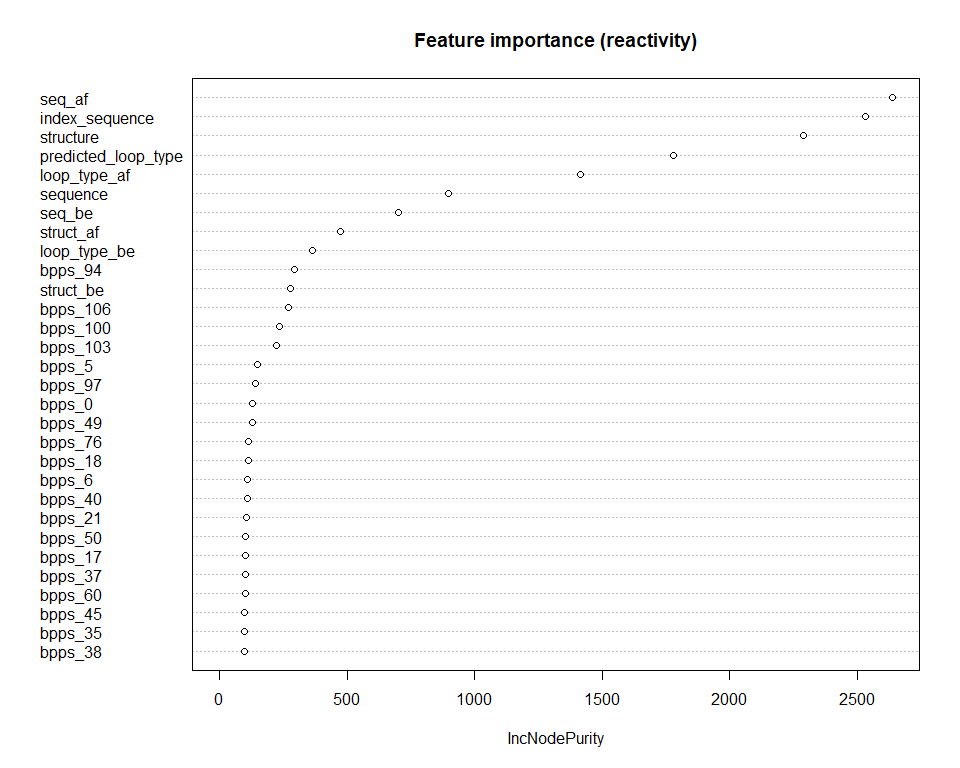
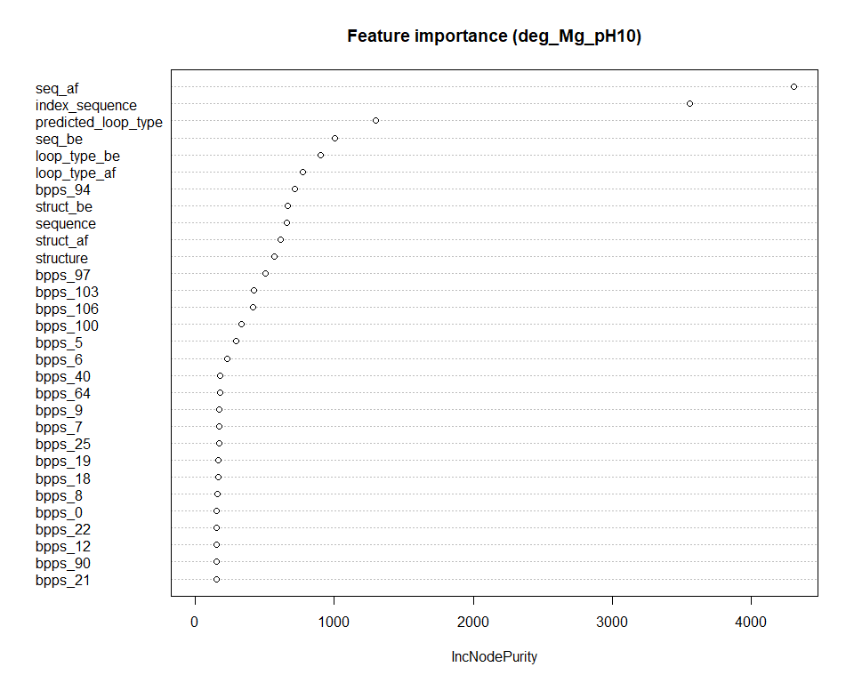
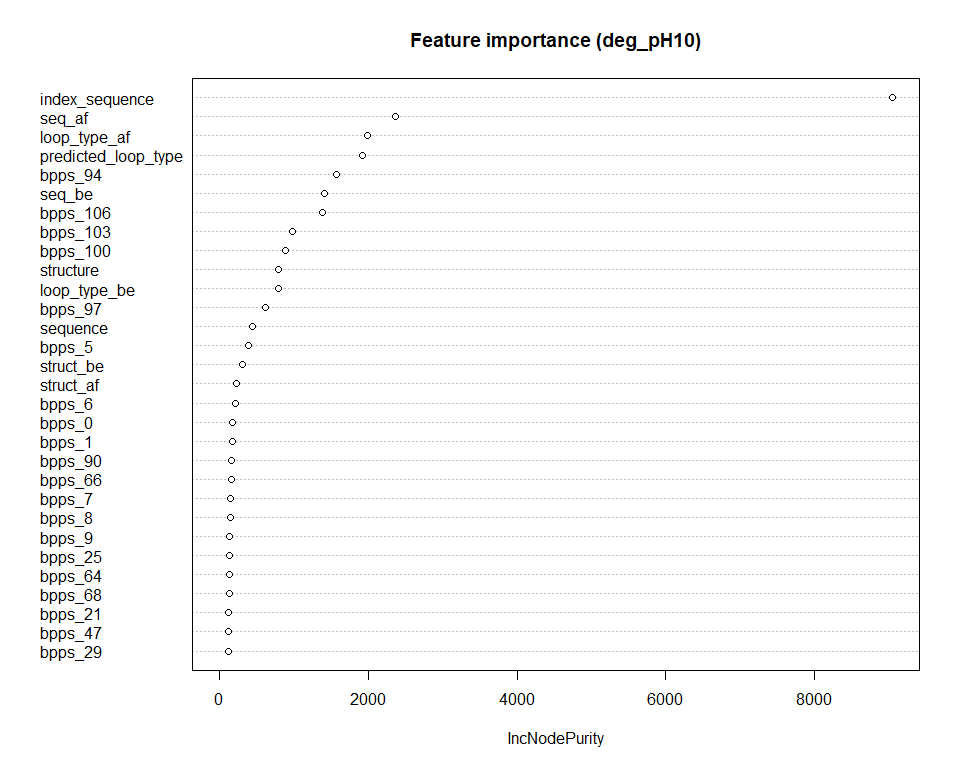
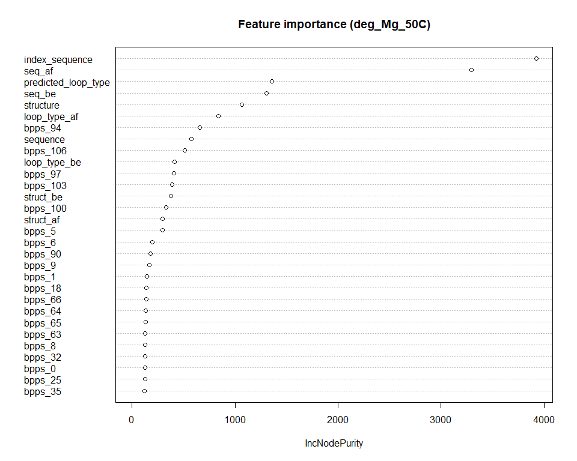
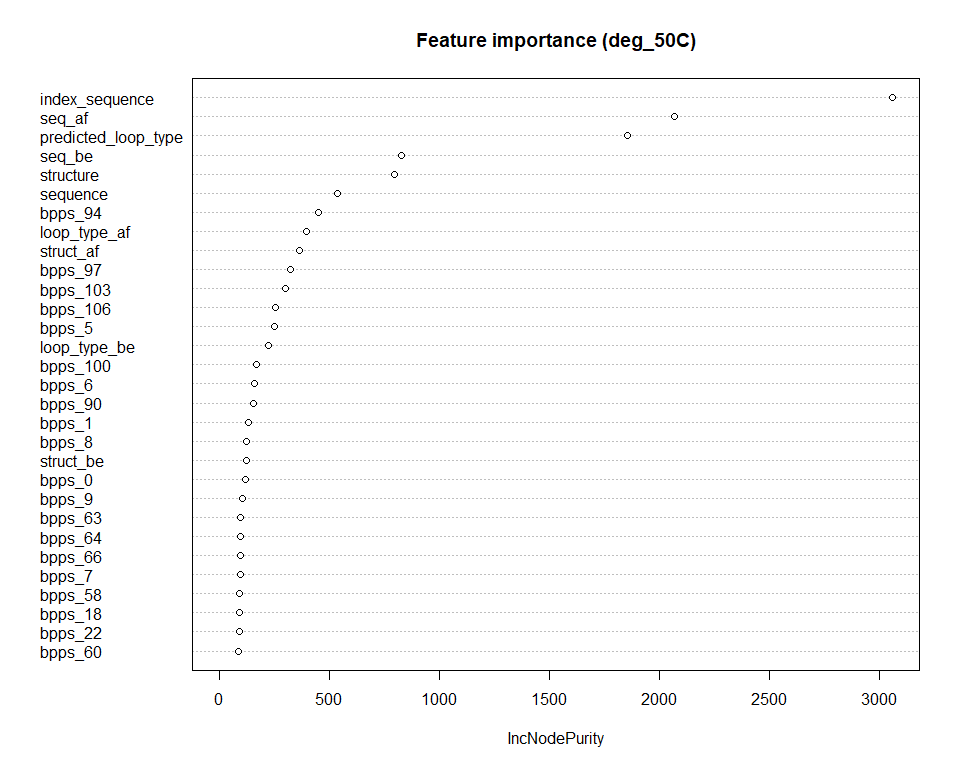

# Data Camp Open Vaccine: Modèles basiques

### AKROUT Leyth, BOULAHFA Jawad, DE SANTIAGO Kylliann

#### M2 Data Science: Santé, Assurance, Finance

#### Université d’Evry Val d’Essonne

### 21 Mars 2021

> [Premier chargement des données](#data1)

> [Séparation train/validation](#split1)

> [Régression Linéaire Multiple](#lm)

> [Soumission Régression Linéaire Multiple](#soumission1)

> [Deuxième chargement des données](#data2)

> [Séparation train/validation](#split2)

> [GLM: loi Gamma](#glm)

> [Soumission GLM](#soumission2)

> [Troisième chargement des données](#data3)

> [Séparation train/validation](#split3)

> [Random Forest](#rf)

> [Soumission Random Forest](#soumission3)

> [Feature importance](#importance)

<a id="data1"></a>

# Premier chargement des données

Chargement du jeu de données.

``` r
# data = read.csv("~/suivi-du-data-camp-DeSantiago_Boulahfa_Akrout/code/data_train.csv")
data = read.csv("data_train.csv")
head(data) # une colonne en trop
```

    ##   X             id sequence index_sequence seq_be seq_af structure struct_be
    ## 1 0 id_001f94081_0        G              1      O      G         .         O
    ## 2 1 id_001f94081_1        G              2      G      A         .         .
    ## 3 2 id_001f94081_2        A              3      G      A         .         .
    ## 4 3 id_001f94081_3        A              4      A      A         .         .
    ## 5 4 id_001f94081_4        A              5      A      A         .         .
    ## 6 5 id_001f94081_5        A              6      A      G         (         .
    ##   struct_af predicted_loop_type loop_type_be loop_type_af bpps_0 bpps_1 bpps_2
    ## 1         .                   E            O            E      0      0      0
    ## 2         .                   E            E            E      0      0      0
    ## 3         .                   E            E            E      0      0      0
    ## 4         .                   E            E            E      0      0      0
    ## 5         (                   E            E            S      0      0      0
    ## 6         (                   S            E            S      0      0      0
    ##   bpps_3 bpps_4 bpps_5 bpps_6     bpps_7     bpps_8     bpps_9    bpps_10
    ## 1      0      0      0      0 0.00655413 0.00922102 0.00809437 0.02178570
    ## 2      0      0      0      0 0.01820530 0.00511209 0.03865270 0.00000000
    ## 3      0      0      0      0 0.00000000 0.02759040 0.00000000 0.00000000
    ## 4      0      0      0      0 0.00000000 0.00000000 0.00000000 0.00000000
    ## 5      0      0      0      0 0.00000000 0.00000000 0.00000000 0.00000000
    ## 6      0      0      0      0 0.00000000 0.00310716 0.00000000 0.00117008
    ##   bpps_11 bpps_12 bpps_13 bpps_14 bpps_15    bpps_16 bpps_17 bpps_18 bpps_19
    ## 1       0       0       0       0       0 0.00112002       0       0       0
    ## 2       0       0       0       0       0 0.00000000       0       0       0
    ## 3       0       0       0       0       0 0.00000000       0       0       0
    ## 4       0       0       0       0       0 0.00000000       0       0       0
    ## 5       0       0       0       0       0 0.00000000       0       0       0
    ## 6       0       0       0       0       0 0.00000000       0       0       0
    ##   bpps_20 bpps_21 bpps_22    bpps_23    bpps_24 bpps_25 bpps_26 bpps_27 bpps_28
    ## 1       0       0       0 0.00465301 0.00241507       0       0       0       0
    ## 2       0       0       0 0.00432340 0.00000000       0       0       0       0
    ## 3       0       0       0 0.00000000 0.00000000       0       0       0       0
    ## 4       0       0       0 0.00000000 0.00127806       0       0       0       0
    ## 5       0       0       0 0.00000000 0.00284297       0       0       0       0
    ## 6       0       0       0 0.00000000 0.06989900       0       0       0       0
    ##      bpps_29    bpps_30 bpps_31    bpps_32 bpps_33 bpps_34 bpps_35    bpps_36
    ## 1 0.01146960 0.00492862       0 0.00353196       0       0       0 0.00000000
    ## 2 0.00856126 0.00000000       0 0.00113814       0       0       0 0.00000000
    ## 3 0.00000000 0.00000000       0 0.00000000       0       0       0 0.00000000
    ## 4 0.00000000 0.00000000       0 0.00000000       0       0       0 0.00105140
    ## 5 0.00000000 0.00000000       0 0.00000000       0       0       0 0.00702873
    ## 6 0.00000000 0.00685149       0 0.00000000       0       0       0 0.00000000
    ##      bpps_37    bpps_38    bpps_39    bpps_40 bpps_41 bpps_42 bpps_43 bpps_44
    ## 1 0.00000000 0.00000000 0.00159406 0.00629747       0       0       0       0
    ## 2 0.00000000 0.00144827 0.01117350 0.00000000       0       0       0       0
    ## 3 0.00132569 0.01070460 0.00000000 0.00000000       0       0       0       0
    ## 4 0.00947066 0.00000000 0.00000000 0.00000000       0       0       0       0
    ## 5 0.00000000 0.00000000 0.00000000 0.00000000       0       0       0       0
    ## 6 0.00000000 0.00000000 0.00000000 0.00000000       0       0       0       0
    ##   bpps_45 bpps_46 bpps_47 bpps_48 bpps_49 bpps_50 bpps_51 bpps_52 bpps_53
    ## 1       0       0       0       0       0       0       0       0       0
    ## 2       0       0       0       0       0       0       0       0       0
    ## 3       0       0       0       0       0       0       0       0       0
    ## 4       0       0       0       0       0       0       0       0       0
    ## 5       0       0       0       0       0       0       0       0       0
    ## 6       0       0       0       0       0       0       0       0       0
    ##   bpps_54 bpps_55    bpps_56    bpps_57    bpps_58 bpps_59    bpps_60 bpps_61
    ## 1       0       0 0.00000000 0.00529590 0.00605378       0 0.00000000       0
    ## 2       0       0 0.00515096 0.00579555 0.00000000       0 0.00000000       0
    ## 3       0       0 0.00000000 0.00000000 0.00000000       0 0.00000000       0
    ## 4       0       0 0.00000000 0.00000000 0.00000000       0 0.00132209       0
    ## 5       0       0 0.00000000 0.00000000 0.00000000       0 0.00000000       0
    ## 6       0       0 0.00000000 0.00000000 0.00000000       0 0.00000000       0
    ##     bpps_62   bpps_63 bpps_64 bpps_65    bpps_66 bpps_67 bpps_68 bpps_69
    ## 1 0.0012753 0.0136668       0       0 0.00152313       0       0       0
    ## 2 0.0133479 0.0000000       0       0 0.00000000       0       0       0
    ## 3 0.0000000 0.0000000       0       0 0.00000000       0       0       0
    ## 4 0.0000000 0.0000000       0       0 0.00000000       0       0       0
    ## 5 0.0000000 0.0000000       0       0 0.00000000       0       0       0
    ## 6 0.0000000 0.0000000       0       0 0.00000000       0       0       0
    ##   bpps_70 bpps_71 bpps_72 bpps_73 bpps_74 bpps_75    bpps_76    bpps_77 bpps_78
    ## 1       0       0       0       0       0       0 0.00000000 0.00141133       0
    ## 2       0       0       0       0       0       0 0.00000000 0.00443669       0
    ## 3       0       0       0       0       0       0 0.00287931 0.00000000       0
    ## 4       0       0       0       0       0       0 0.00000000 0.00000000       0
    ## 5       0       0       0       0       0       0 0.00140816 0.00000000       0
    ## 6       0       0       0       0       0       0 0.04401610 0.00000000       0
    ##      bpps_79    bpps_80    bpps_81   bpps_82 bpps_83 bpps_84    bpps_85 bpps_86
    ## 1 0.00275790 0.00598010 0.00597894 0.0138868       0       0 0.00152801       0
    ## 2 0.00969451 0.00376965 0.02291480 0.0000000       0       0 0.00000000       0
    ## 3 0.00000000 0.01750240 0.00000000 0.0000000       0       0 0.00000000       0
    ## 4 0.00000000 0.00000000 0.00000000 0.0000000       0       0 0.00000000       0
    ## 5 0.00000000 0.00000000 0.00000000 0.0000000       0       0 0.00000000       0
    ## 6 0.00000000 0.00235197 0.00000000 0.0000000       0       0 0.00000000       0
    ##   bpps_87 bpps_88 bpps_89 bpps_90 bpps_91 bpps_92 bpps_93    bpps_94 bpps_95
    ## 1       0       0       0       0       0       0       0 0.00952557       0
    ## 2       0       0       0       0       0       0       0 0.00578259       0
    ## 3       0       0       0       0       0       0       0 0.00000000       0
    ## 4       0       0       0       0       0       0       0 0.00000000       0
    ## 5       0       0       0       0       0       0       0 0.00000000       0
    ## 6       0       0       0       0       0       0       0 0.00000000       0
    ##   bpps_96    bpps_97 bpps_98 bpps_99   bpps_100 bpps_101 bpps_102   bpps_103
    ## 1       0 0.01114590       0       0 0.01163650        0        0 0.01053770
    ## 2       0 0.00633638       0       0 0.00603195        0        0 0.00563282
    ## 3       0 0.00000000       0       0 0.00000000        0        0 0.00000000
    ## 4       0 0.00000000       0       0 0.00000000        0        0 0.00000000
    ## 5       0 0.00000000       0       0 0.00000000        0        0 0.00000000
    ## 6       0 0.00000000       0       0 0.00000000        0        0 0.00000000
    ##   bpps_104 bpps_105   bpps_106 signal_to_noise SN_filter reactivity deg_Mg_pH10
    ## 1        0        0 0.01467360           6.894         1     0.3297      0.7556
    ## 2        0        0 0.00620374           6.894         1     1.5693      2.9830
    ## 3        0        0 0.00000000           6.894         1     1.1227      0.2526
    ## 4        0        0 0.00000000           6.894         1     0.8686      1.3789
    ## 5        0        0 0.00000000           6.894         1     0.7217      0.6376
    ## 6        0        0 0.00000000           6.894         1     0.4384      0.3313
    ##   deg_pH10 deg_Mg_50C deg_50C
    ## 1   2.3375     0.3581  0.6382
    ## 2   3.5060     2.9683  3.4773
    ## 3   0.3008     0.2589  0.9988
    ## 4   1.0108     1.4552  1.3228
    ## 5   0.2635     0.7244  0.7877
    ## 6   0.3403     0.4971  0.5890

``` r
data = data[,-1]
head(data)
```

    ##               id sequence index_sequence seq_be seq_af structure struct_be
    ## 1 id_001f94081_0        G              1      O      G         .         O
    ## 2 id_001f94081_1        G              2      G      A         .         .
    ## 3 id_001f94081_2        A              3      G      A         .         .
    ## 4 id_001f94081_3        A              4      A      A         .         .
    ## 5 id_001f94081_4        A              5      A      A         .         .
    ## 6 id_001f94081_5        A              6      A      G         (         .
    ##   struct_af predicted_loop_type loop_type_be loop_type_af bpps_0 bpps_1 bpps_2
    ## 1         .                   E            O            E      0      0      0
    ## 2         .                   E            E            E      0      0      0
    ## 3         .                   E            E            E      0      0      0
    ## 4         .                   E            E            E      0      0      0
    ## 5         (                   E            E            S      0      0      0
    ## 6         (                   S            E            S      0      0      0
    ##   bpps_3 bpps_4 bpps_5 bpps_6     bpps_7     bpps_8     bpps_9    bpps_10
    ## 1      0      0      0      0 0.00655413 0.00922102 0.00809437 0.02178570
    ## 2      0      0      0      0 0.01820530 0.00511209 0.03865270 0.00000000
    ## 3      0      0      0      0 0.00000000 0.02759040 0.00000000 0.00000000
    ## 4      0      0      0      0 0.00000000 0.00000000 0.00000000 0.00000000
    ## 5      0      0      0      0 0.00000000 0.00000000 0.00000000 0.00000000
    ## 6      0      0      0      0 0.00000000 0.00310716 0.00000000 0.00117008
    ##   bpps_11 bpps_12 bpps_13 bpps_14 bpps_15    bpps_16 bpps_17 bpps_18 bpps_19
    ## 1       0       0       0       0       0 0.00112002       0       0       0
    ## 2       0       0       0       0       0 0.00000000       0       0       0
    ## 3       0       0       0       0       0 0.00000000       0       0       0
    ## 4       0       0       0       0       0 0.00000000       0       0       0
    ## 5       0       0       0       0       0 0.00000000       0       0       0
    ## 6       0       0       0       0       0 0.00000000       0       0       0
    ##   bpps_20 bpps_21 bpps_22    bpps_23    bpps_24 bpps_25 bpps_26 bpps_27 bpps_28
    ## 1       0       0       0 0.00465301 0.00241507       0       0       0       0
    ## 2       0       0       0 0.00432340 0.00000000       0       0       0       0
    ## 3       0       0       0 0.00000000 0.00000000       0       0       0       0
    ## 4       0       0       0 0.00000000 0.00127806       0       0       0       0
    ## 5       0       0       0 0.00000000 0.00284297       0       0       0       0
    ## 6       0       0       0 0.00000000 0.06989900       0       0       0       0
    ##      bpps_29    bpps_30 bpps_31    bpps_32 bpps_33 bpps_34 bpps_35    bpps_36
    ## 1 0.01146960 0.00492862       0 0.00353196       0       0       0 0.00000000
    ## 2 0.00856126 0.00000000       0 0.00113814       0       0       0 0.00000000
    ## 3 0.00000000 0.00000000       0 0.00000000       0       0       0 0.00000000
    ## 4 0.00000000 0.00000000       0 0.00000000       0       0       0 0.00105140
    ## 5 0.00000000 0.00000000       0 0.00000000       0       0       0 0.00702873
    ## 6 0.00000000 0.00685149       0 0.00000000       0       0       0 0.00000000
    ##      bpps_37    bpps_38    bpps_39    bpps_40 bpps_41 bpps_42 bpps_43 bpps_44
    ## 1 0.00000000 0.00000000 0.00159406 0.00629747       0       0       0       0
    ## 2 0.00000000 0.00144827 0.01117350 0.00000000       0       0       0       0
    ## 3 0.00132569 0.01070460 0.00000000 0.00000000       0       0       0       0
    ## 4 0.00947066 0.00000000 0.00000000 0.00000000       0       0       0       0
    ## 5 0.00000000 0.00000000 0.00000000 0.00000000       0       0       0       0
    ## 6 0.00000000 0.00000000 0.00000000 0.00000000       0       0       0       0
    ##   bpps_45 bpps_46 bpps_47 bpps_48 bpps_49 bpps_50 bpps_51 bpps_52 bpps_53
    ## 1       0       0       0       0       0       0       0       0       0
    ## 2       0       0       0       0       0       0       0       0       0
    ## 3       0       0       0       0       0       0       0       0       0
    ## 4       0       0       0       0       0       0       0       0       0
    ## 5       0       0       0       0       0       0       0       0       0
    ## 6       0       0       0       0       0       0       0       0       0
    ##   bpps_54 bpps_55    bpps_56    bpps_57    bpps_58 bpps_59    bpps_60 bpps_61
    ## 1       0       0 0.00000000 0.00529590 0.00605378       0 0.00000000       0
    ## 2       0       0 0.00515096 0.00579555 0.00000000       0 0.00000000       0
    ## 3       0       0 0.00000000 0.00000000 0.00000000       0 0.00000000       0
    ## 4       0       0 0.00000000 0.00000000 0.00000000       0 0.00132209       0
    ## 5       0       0 0.00000000 0.00000000 0.00000000       0 0.00000000       0
    ## 6       0       0 0.00000000 0.00000000 0.00000000       0 0.00000000       0
    ##     bpps_62   bpps_63 bpps_64 bpps_65    bpps_66 bpps_67 bpps_68 bpps_69
    ## 1 0.0012753 0.0136668       0       0 0.00152313       0       0       0
    ## 2 0.0133479 0.0000000       0       0 0.00000000       0       0       0
    ## 3 0.0000000 0.0000000       0       0 0.00000000       0       0       0
    ## 4 0.0000000 0.0000000       0       0 0.00000000       0       0       0
    ## 5 0.0000000 0.0000000       0       0 0.00000000       0       0       0
    ## 6 0.0000000 0.0000000       0       0 0.00000000       0       0       0
    ##   bpps_70 bpps_71 bpps_72 bpps_73 bpps_74 bpps_75    bpps_76    bpps_77 bpps_78
    ## 1       0       0       0       0       0       0 0.00000000 0.00141133       0
    ## 2       0       0       0       0       0       0 0.00000000 0.00443669       0
    ## 3       0       0       0       0       0       0 0.00287931 0.00000000       0
    ## 4       0       0       0       0       0       0 0.00000000 0.00000000       0
    ## 5       0       0       0       0       0       0 0.00140816 0.00000000       0
    ## 6       0       0       0       0       0       0 0.04401610 0.00000000       0
    ##      bpps_79    bpps_80    bpps_81   bpps_82 bpps_83 bpps_84    bpps_85 bpps_86
    ## 1 0.00275790 0.00598010 0.00597894 0.0138868       0       0 0.00152801       0
    ## 2 0.00969451 0.00376965 0.02291480 0.0000000       0       0 0.00000000       0
    ## 3 0.00000000 0.01750240 0.00000000 0.0000000       0       0 0.00000000       0
    ## 4 0.00000000 0.00000000 0.00000000 0.0000000       0       0 0.00000000       0
    ## 5 0.00000000 0.00000000 0.00000000 0.0000000       0       0 0.00000000       0
    ## 6 0.00000000 0.00235197 0.00000000 0.0000000       0       0 0.00000000       0
    ##   bpps_87 bpps_88 bpps_89 bpps_90 bpps_91 bpps_92 bpps_93    bpps_94 bpps_95
    ## 1       0       0       0       0       0       0       0 0.00952557       0
    ## 2       0       0       0       0       0       0       0 0.00578259       0
    ## 3       0       0       0       0       0       0       0 0.00000000       0
    ## 4       0       0       0       0       0       0       0 0.00000000       0
    ## 5       0       0       0       0       0       0       0 0.00000000       0
    ## 6       0       0       0       0       0       0       0 0.00000000       0
    ##   bpps_96    bpps_97 bpps_98 bpps_99   bpps_100 bpps_101 bpps_102   bpps_103
    ## 1       0 0.01114590       0       0 0.01163650        0        0 0.01053770
    ## 2       0 0.00633638       0       0 0.00603195        0        0 0.00563282
    ## 3       0 0.00000000       0       0 0.00000000        0        0 0.00000000
    ## 4       0 0.00000000       0       0 0.00000000        0        0 0.00000000
    ## 5       0 0.00000000       0       0 0.00000000        0        0 0.00000000
    ## 6       0 0.00000000       0       0 0.00000000        0        0 0.00000000
    ##   bpps_104 bpps_105   bpps_106 signal_to_noise SN_filter reactivity deg_Mg_pH10
    ## 1        0        0 0.01467360           6.894         1     0.3297      0.7556
    ## 2        0        0 0.00620374           6.894         1     1.5693      2.9830
    ## 3        0        0 0.00000000           6.894         1     1.1227      0.2526
    ## 4        0        0 0.00000000           6.894         1     0.8686      1.3789
    ## 5        0        0 0.00000000           6.894         1     0.7217      0.6376
    ## 6        0        0 0.00000000           6.894         1     0.4384      0.3313
    ##   deg_pH10 deg_Mg_50C deg_50C
    ## 1   2.3375     0.3581  0.6382
    ## 2   3.5060     2.9683  3.4773
    ## 3   0.3008     0.2589  0.9988
    ## 4   1.0108     1.4552  1.3228
    ## 5   0.2635     0.7244  0.7877
    ## 6   0.3403     0.4971  0.5890

On change les types des variables qui sont mal codées.

``` r
data=data %>% mutate(sequence = as.factor(sequence)) %>% 
  mutate(seq_be = as.factor(seq_be)) %>% 
  mutate(seq_af = as.factor(seq_af)) %>% 
  mutate(sequence = as.factor(sequence)) %>% 
  mutate(structure = as.factor(structure)) %>%
  mutate(struct_be = as.factor(struct_be)) %>% 
  mutate(struct_af = as.factor(struct_af)) %>% 
  mutate(predicted_loop_type = as.factor(predicted_loop_type)) %>% 
  mutate(loop_type_be = as.factor(loop_type_be)) %>% 
  mutate(loop_type_af = as.factor(loop_type_af)) 
```

``` r
length_sequence_train <- 68
```

On filtre maintenant les données qui ont SN\_filter=0.

``` r
print(sum(is.na(data)))
```

    ## [1] 0

``` r
print(sum(data$SN_filter==0)/length_sequence_train) # Nombre d'individus dont le SN_filter=0
```

    ## [1] 811

``` r
data=data[data$SN_filter==1,]
rownames(data)=NULL#1:108052
```

``` r
p = dim(data)[2]
```

<a id="lm"></a>

# Séparation train/validation

``` r
tamp=train_test_split(data)
index_train = tamp$index_train

data_train=tamp$train
rownames(data_train) <- NULL

data_val=tamp$val
rownames(data_val) <- NULL

rm(tamp)
```

``` r
sum(is.na(data_train))
```

    ## [1] 0

``` r
sum(is.na(data_val))
```

    ## [1] 0

``` r
dim(data_train)[1]+dim(data_val)[1]-dim(data)[1]
```

    ## [1] 0

<a id="split1"></a>

# Régression Linéaire Multiple

Initialisation de vecteurs pour stocker nos résultats.

Résultats pour le label `reactivity`.

``` r
models_reactivity <- c()
errors_reactivity_train <- c()
errors_reactivity_val <- c()
```

Résultats pour le label `deg_Mg_pH10`.

``` r
models_deg_Mg_pH10 <- c()
errors_deg_Mg_pH10_train <- c()
errors_deg_Mg_pH10_val <- c()
```

Résultats pour le label `deg_pH10`.

``` r
models_deg_pH10 <- c()
errors_deg_pH10_train <- c()
errors_deg_pH10_val <- c()
```

Résultats pour le label `deg_Mg_50C`.

``` r
models_deg_Mg_50C <- c()
errors_deg_Mg_50C_train <- c()
errors_deg_Mg_50C_val <- c()
```

Résultats pour le label `deg_50C`.

``` r
models_deg_50C <- c()
errors_deg_50C_train <- c()
errors_deg_50C_val <- c()
```

Formule du modèle initial utilisé.

``` r
formula_model_full <- " ~ sequence + index_sequence + structure + predicted_loop_type + seq_be + seq_af + struct_be + struct_af + loop_type_be + loop_type_af"
for(i in 0:106)
{
  formula_model_full <- paste0(formula_model_full, " + bpps_", i)
}
print(formula_model_full)
```

    ## [1] " ~ sequence + index_sequence + structure + predicted_loop_type + seq_be + seq_af + struct_be + struct_af + loop_type_be + loop_type_af + bpps_0 + bpps_1 + bpps_2 + bpps_3 + bpps_4 + bpps_5 + bpps_6 + bpps_7 + bpps_8 + bpps_9 + bpps_10 + bpps_11 + bpps_12 + bpps_13 + bpps_14 + bpps_15 + bpps_16 + bpps_17 + bpps_18 + bpps_19 + bpps_20 + bpps_21 + bpps_22 + bpps_23 + bpps_24 + bpps_25 + bpps_26 + bpps_27 + bpps_28 + bpps_29 + bpps_30 + bpps_31 + bpps_32 + bpps_33 + bpps_34 + bpps_35 + bpps_36 + bpps_37 + bpps_38 + bpps_39 + bpps_40 + bpps_41 + bpps_42 + bpps_43 + bpps_44 + bpps_45 + bpps_46 + bpps_47 + bpps_48 + bpps_49 + bpps_50 + bpps_51 + bpps_52 + bpps_53 + bpps_54 + bpps_55 + bpps_56 + bpps_57 + bpps_58 + bpps_59 + bpps_60 + bpps_61 + bpps_62 + bpps_63 + bpps_64 + bpps_65 + bpps_66 + bpps_67 + bpps_68 + bpps_69 + bpps_70 + bpps_71 + bpps_72 + bpps_73 + bpps_74 + bpps_75 + bpps_76 + bpps_77 + bpps_78 + bpps_79 + bpps_80 + bpps_81 + bpps_82 + bpps_83 + bpps_84 + bpps_85 + bpps_86 + bpps_87 + bpps_88 + bpps_89 + bpps_90 + bpps_91 + bpps_92 + bpps_93 + bpps_94 + bpps_95 + bpps_96 + bpps_97 + bpps_98 + bpps_99 + bpps_100 + bpps_101 + bpps_102 + bpps_103 + bpps_104 + bpps_105 + bpps_106"

## Reactivity

### Premier modèle

``` r
formula_reactivity = paste0("reactivity", formula_model_full)
```

``` r
model_reactivity = lm(formula = formula_reactivity, data = data_train)
```

``` r
summary(model_reactivity)
```

    ## 
    ## Call:
    ## lm(formula = formula_reactivity, data = data_train)
    ## 
    ## Residuals:
    ##     Min      1Q  Median      3Q     Max 
    ## -1.0616 -0.1943 -0.0314  0.1259  5.8158 
    ## 
    ## Coefficients: (7 not defined because of singularities)
    ##                        Estimate Std. Error t value Pr(>|t|)    
    ## (Intercept)           7.287e-01  6.937e-03 105.039  < 2e-16 ***
    ## sequenceC            -1.194e-01  3.777e-03 -31.610  < 2e-16 ***
    ## sequenceG             3.515e-02  3.318e-03  10.594  < 2e-16 ***
    ## sequenceU             3.279e-02  3.894e-03   8.420  < 2e-16 ***
    ## index_sequence       -5.072e-03  8.495e-05 -59.707  < 2e-16 ***
    ## structure)            7.476e-02  7.035e-03  10.627  < 2e-16 ***
    ## structure.            1.879e-01  1.083e-02  17.352  < 2e-16 ***
    ## predicted_loop_typeE -1.672e-01  1.739e-02  -9.617  < 2e-16 ***
    ## predicted_loop_typeH -1.074e-01  1.199e-02  -8.959  < 2e-16 ***
    ## predicted_loop_typeI -2.335e-01  1.076e-02 -21.697  < 2e-16 ***
    ## predicted_loop_typeM -1.399e-01  1.409e-02  -9.925  < 2e-16 ***
    ## predicted_loop_typeS         NA         NA      NA       NA    
    ## predicted_loop_typeX -1.498e-01  1.596e-02  -9.389  < 2e-16 ***
    ## seq_beC               3.646e-03  3.575e-03   1.020 0.307773    
    ## seq_beG               8.591e-02  3.136e-03  27.392  < 2e-16 ***
    ## seq_beO              -3.840e-02  1.625e-02  -2.363 0.018112 *  
    ## seq_beU               6.905e-02  3.717e-03  18.578  < 2e-16 ***
    ## seq_afC              -2.192e-01  3.584e-03 -61.147  < 2e-16 ***
    ## seq_afG              -2.375e-01  3.313e-03 -71.684  < 2e-16 ***
    ## seq_afO              -7.280e-02  1.251e-02  -5.821 5.85e-09 ***
    ## seq_afU               4.231e-02  3.746e-03  11.295  < 2e-16 ***
    ## struct_be)            1.052e-02  5.681e-03   1.853 0.063942 .  
    ## struct_be.            5.801e-02  9.444e-03   6.143 8.14e-10 ***
    ## struct_beO                   NA         NA      NA       NA    
    ## struct_af)            5.286e-02  5.677e-03   9.312  < 2e-16 ***
    ## struct_af.            1.241e-01  9.454e-03  13.123  < 2e-16 ***
    ## struct_afO                   NA         NA      NA       NA    
    ## loop_type_beE        -4.444e-02  1.420e-02  -3.130 0.001749 ** 
    ## loop_type_beH        -5.740e-02  1.051e-02  -5.461 4.74e-08 ***
    ## loop_type_beI        -5.622e-03  1.002e-02  -0.561 0.574679    
    ## loop_type_beM         1.009e-02  1.264e-02   0.798 0.425088    
    ## loop_type_beO                NA         NA      NA       NA    
    ## loop_type_beS                NA         NA      NA       NA    
    ## loop_type_beX         1.002e-02  1.445e-02   0.694 0.487915    
    ## loop_type_afE        -2.051e-02  1.374e-02  -1.493 0.135330    
    ## loop_type_afH         6.401e-02  1.050e-02   6.095 1.10e-09 ***
    ## loop_type_afI        -5.650e-02  1.002e-02  -5.638 1.72e-08 ***
    ## loop_type_afM        -1.421e-02  1.235e-02  -1.151 0.249822    
    ## loop_type_afO                NA         NA      NA       NA    
    ## loop_type_afS                NA         NA      NA       NA    
    ## loop_type_afX        -1.055e-02  1.332e-02  -0.792 0.428293    
    ## bpps_0               -1.301e+00  1.281e-01 -10.157  < 2e-16 ***
    ## bpps_1               -8.716e-01  1.254e-01  -6.949 3.70e-12 ***
    ## bpps_2               -2.943e-01  2.002e-01  -1.470 0.141542    
    ## bpps_3               -9.129e-01  2.641e-01  -3.457 0.000546 ***
    ## bpps_4               -5.104e-01  1.860e-01  -2.745 0.006053 ** 
    ## bpps_5               -3.671e-01  2.152e-02 -17.063  < 2e-16 ***
    ## bpps_6               -3.818e-01  1.675e-02 -22.794  < 2e-16 ***
    ## bpps_7               -4.076e-01  1.574e-02 -25.896  < 2e-16 ***
    ## bpps_8               -4.030e-01  1.517e-02 -26.562  < 2e-16 ***
    ## bpps_9               -4.742e-01  1.573e-02 -30.145  < 2e-16 ***
    ## bpps_10              -4.699e-01  1.550e-02 -30.309  < 2e-16 ***
    ## bpps_11              -4.795e-01  1.606e-02 -29.859  < 2e-16 ***
    ## bpps_12              -4.702e-01  1.632e-02 -28.815  < 2e-16 ***
    ## bpps_13              -4.686e-01  1.717e-02 -27.289  < 2e-16 ***
    ## bpps_14              -4.865e-01  1.746e-02 -27.861  < 2e-16 ***
    ## bpps_15              -4.583e-01  1.790e-02 -25.606  < 2e-16 ***
    ## bpps_16              -4.486e-01  1.775e-02 -25.271  < 2e-16 ***
    ## bpps_17              -4.721e-01  1.616e-02 -29.223  < 2e-16 ***
    ## bpps_18              -4.446e-01  1.630e-02 -27.282  < 2e-16 ***
    ## bpps_19              -4.696e-01  1.639e-02 -28.659  < 2e-16 ***
    ## bpps_20              -4.989e-01  1.608e-02 -31.018  < 2e-16 ***
    ## bpps_21              -4.911e-01  1.593e-02 -30.828  < 2e-16 ***
    ## bpps_22              -5.070e-01  1.595e-02 -31.781  < 2e-16 ***
    ## bpps_23              -4.659e-01  1.674e-02 -27.822  < 2e-16 ***
    ## bpps_24              -4.446e-01  1.626e-02 -27.349  < 2e-16 ***
    ## bpps_25              -4.645e-01  1.665e-02 -27.906  < 2e-16 ***
    ## bpps_26              -4.592e-01  1.603e-02 -28.641  < 2e-16 ***
    ## bpps_27              -4.453e-01  1.590e-02 -28.007  < 2e-16 ***
    ## bpps_28              -4.617e-01  1.610e-02 -28.683  < 2e-16 ***
    ## bpps_29              -5.029e-01  1.591e-02 -31.597  < 2e-16 ***
    ## bpps_30              -4.961e-01  1.557e-02 -31.856  < 2e-16 ***
    ## bpps_31              -4.658e-01  1.538e-02 -30.284  < 2e-16 ***
    ## bpps_32              -4.669e-01  1.566e-02 -29.808  < 2e-16 ***
    ## bpps_33              -4.934e-01  1.645e-02 -29.999  < 2e-16 ***
    ## bpps_34              -4.272e-01  1.839e-02 -23.233  < 2e-16 ***
    ## bpps_35              -4.381e-01  2.010e-02 -21.799  < 2e-16 ***
    ## bpps_36              -3.881e-01  1.815e-02 -21.390  < 2e-16 ***
    ## bpps_37              -3.701e-01  1.809e-02 -20.464  < 2e-16 ***
    ## bpps_38              -4.130e-01  1.648e-02 -25.070  < 2e-16 ***
    ## bpps_39              -3.906e-01  1.654e-02 -23.615  < 2e-16 ***
    ## bpps_40              -4.156e-01  1.553e-02 -26.753  < 2e-16 ***
    ## bpps_41              -4.531e-01  1.513e-02 -29.957  < 2e-16 ***
    ## bpps_42              -4.469e-01  1.517e-02 -29.457  < 2e-16 ***
    ## bpps_43              -4.326e-01  1.575e-02 -27.466  < 2e-16 ***
    ## bpps_44              -4.342e-01  1.672e-02 -25.973  < 2e-16 ***
    ## bpps_45              -4.363e-01  1.691e-02 -25.798  < 2e-16 ***
    ## bpps_46              -4.101e-01  1.699e-02 -24.132  < 2e-16 ***
    ## bpps_47              -4.307e-01  1.600e-02 -26.918  < 2e-16 ***
    ## bpps_48              -3.910e-01  1.585e-02 -24.675  < 2e-16 ***
    ## bpps_49              -3.319e-01  1.546e-02 -21.466  < 2e-16 ***
    ## bpps_50              -3.983e-01  1.509e-02 -26.394  < 2e-16 ***
    ## bpps_51              -4.035e-01  1.610e-02 -25.062  < 2e-16 ***
    ## bpps_52              -4.262e-01  1.601e-02 -26.625  < 2e-16 ***
    ## bpps_53              -4.774e-01  1.643e-02 -29.048  < 2e-16 ***
    ## bpps_54              -4.389e-01  1.616e-02 -27.152  < 2e-16 ***
    ## bpps_55              -4.138e-01  1.715e-02 -24.123  < 2e-16 ***
    ## bpps_56              -4.419e-01  1.698e-02 -26.025  < 2e-16 ***
    ## bpps_57              -4.006e-01  1.650e-02 -24.276  < 2e-16 ***
    ## bpps_58              -4.468e-01  1.667e-02 -26.804  < 2e-16 ***
    ## bpps_59              -4.239e-01  1.638e-02 -25.886  < 2e-16 ***
    ## bpps_60              -4.086e-01  1.613e-02 -25.323  < 2e-16 ***
    ## bpps_61              -4.424e-01  1.558e-02 -28.392  < 2e-16 ***
    ## bpps_62              -4.551e-01  1.517e-02 -29.996  < 2e-16 ***
    ## bpps_63              -4.864e-01  1.530e-02 -31.790  < 2e-16 ***
    ## bpps_64              -4.590e-01  1.581e-02 -29.039  < 2e-16 ***
    ## bpps_65              -4.575e-01  1.687e-02 -27.118  < 2e-16 ***
    ## bpps_66              -4.422e-01  1.881e-02 -23.512  < 2e-16 ***
    ## bpps_67              -4.152e-01  2.527e-02 -16.433  < 2e-16 ***
    ## bpps_68              -3.432e-01  1.096e-01  -3.130 0.001746 ** 
    ## bpps_69              -5.293e-01  1.114e-01  -4.751 2.02e-06 ***
    ## bpps_70              -4.534e-01  1.127e-01  -4.025 5.71e-05 ***
    ## bpps_71              -4.871e-01  1.117e-01  -4.359 1.31e-05 ***
    ## bpps_72              -5.605e-01  1.131e-01  -4.953 7.31e-07 ***
    ## bpps_73              -5.653e-01  1.180e-01  -4.790 1.67e-06 ***
    ## bpps_74              -4.725e-01  1.108e-01  -4.264 2.01e-05 ***
    ## bpps_75              -5.575e-01  1.181e-01  -4.721 2.35e-06 ***
    ## bpps_76              -8.659e-01  1.164e-01  -7.436 1.04e-13 ***
    ## bpps_77              -6.992e-01  1.071e-01  -6.530 6.62e-11 ***
    ## bpps_78              -5.998e-01  1.204e-01  -4.982 6.29e-07 ***
    ## bpps_79              -7.638e-01  1.241e-01  -6.156 7.50e-10 ***
    ## bpps_80              -3.102e-01  1.301e-01  -2.384 0.017136 *  
    ## bpps_81              -6.744e-01  1.327e-01  -5.081 3.76e-07 ***
    ## bpps_82              -4.379e-01  1.372e-01  -3.192 0.001415 ** 
    ## bpps_83              -6.224e-01  1.356e-01  -4.590 4.43e-06 ***
    ## bpps_84              -5.781e-01  1.507e-01  -3.836 0.000125 ***
    ## bpps_85              -4.973e-01  1.808e-01  -2.751 0.005948 ** 
    ## bpps_86              -2.484e-01  1.882e-01  -1.320 0.186944    
    ## bpps_87               5.122e-01  2.768e-01   1.851 0.064196 .  
    ## bpps_88              -3.913e-01  2.506e-01  -1.561 0.118438    
    ## bpps_89              -2.865e-01  2.182e-01  -1.313 0.189107    
    ## bpps_90              -9.810e-01  1.535e-01  -6.391 1.66e-10 ***
    ## bpps_91              -7.232e-01  1.960e-01  -3.690 0.000224 ***
    ## bpps_92               2.154e-01  3.613e-01   0.596 0.551162    
    ## bpps_93              -1.555e-01  2.725e-01  -0.571 0.568289    
    ## bpps_94               3.486e-01  2.248e-01   1.551 0.120993    
    ## bpps_95               3.683e-01  3.384e-01   1.088 0.276399    
    ## bpps_96              -1.297e+00  5.899e-01  -2.199 0.027868 *  
    ## bpps_97              -1.034e+00  4.793e-01  -2.157 0.031014 *  
    ## bpps_98              -1.062e+00  7.670e-01  -1.384 0.166235    
    ## bpps_99              -1.867e+00  9.046e-01  -2.064 0.039032 *  
    ## bpps_100             -1.088e+00  7.349e-01  -1.480 0.138925    
    ## bpps_101             -1.238e+00  1.076e+00  -1.151 0.249941    
    ## bpps_102              7.803e-01  9.889e-01   0.789 0.430082    
    ## bpps_103              3.029e+00  7.125e-01   4.252 2.12e-05 ***
    ## bpps_104              8.180e-03  9.942e-01   0.008 0.993436    
    ## bpps_105             -1.329e+00  8.416e-01  -1.580 0.114194    
    ## bpps_106             -4.601e-01  5.543e-01  -0.830 0.406472    
    ## ---
    ## Signif. codes:  0 '***' 0.001 '**' 0.01 '*' 0.05 '.' 0.1 ' ' 1
    ## 
    ## Residual standard error: 0.3382 on 86287 degrees of freedom
    ## Multiple R-squared:  0.4551, Adjusted R-squared:  0.4542 
    ## F-statistic: 514.7 on 140 and 86287 DF,  p-value: < 2.2e-16

Il est important de noter que le premier modèle n’est pas de plein rang,
donc on ne peut pas se fier à ses prédictions. <br> Cependant, la
pénalisation va nous aider à résoudre ce problème.

``` r
y_pred_train = predict.lm(model_reactivity,data_train,type="response")
```

    ## Warning in predict.lm(model_reactivity, data_train, type = "response"):
    ## prediction from a rank-deficient fit may be misleading

``` r
error_train <- mean((y_pred_train-data_train$reactivity)^2,na.rm=TRUE)
print(error_train)
```

    ## [1] 0.1141799

``` r
y_pred_val=predict.lm(model_reactivity,data_val,type="response")
```

    ## Warning in predict.lm(model_reactivity, data_val, type = "response"): prediction
    ## from a rank-deficient fit may be misleading

``` r
error_val <- mean((y_pred_val-data_val$reactivity)^2,na.rm=TRUE)
print(error_val)
```

    ## [1] 0.1092866

``` r
models_reactivity <- c(models_reactivity, "model_full")
errors_reactivity_train <- c(errors_reactivity_train, error_train)
errors_reactivity_val <- c(errors_reactivity_val, error_val)
rm(error_val, error_train, y_pred_train, y_pred_val)
```

### Pénalisation ridge et lasso

On commence par calculer la matrice de design du model\_reactivity sur
le train et le test.

``` r
# Matrice de design du train
data_train_pen = model.matrix(model_reactivity)
#head(data_train_pen)
```

``` r
# Pour faire la matrice de design de la validation
model_reactivity_val = lm(formula = formula_reactivity, data = data_val)
data_val_pen = model.matrix(model_reactivity_val)
#head(data_val_pen)

# On supprime le modèle sur le test
rm(model_reactivity_val)
```

On pénalise le model\_reactivity avec une pénalité ridge. On choisira
dans la suite le \(\lambda\) qui minimise l’erreur de cross validation
avec `s = "lambda.min"`. On peut afficher les coefficients du modèle
correspondant.

``` r
#model_reactivity_pen_ridge = cv.glmnet(data_train_pen, data_train$reactivity,
#                                       type.measure = "mse",
#                                       alpha = 0,
#                                       trace.it = 1)
```

Sauvegarde du modèle.

``` r
#saveRDS(model_reactivity_pen_ridge, "model_reactivity_pen_ridge.rds")
```

Chargement du modèle.

``` r
model_reactivity_pen_ridge <- readRDS("model_reactivity_pen_ridge.rds")
```

``` r
coef(model_reactivity_pen_ridge, s = "lambda.min")
```

    ## 149 x 1 sparse Matrix of class "dgCMatrix"
    ##                                  1
    ## (Intercept)           0.7935622185
    ## (Intercept)           .           
    ## sequenceC            -0.1328994583
    ## sequenceG             0.0216523427
    ## sequenceU             0.0216305990
    ## index_sequence       -0.0044879502
    ## structure)            0.0507295230
    ## structure.            0.0780241110
    ## predicted_loop_typeE -0.0480957051
    ## predicted_loop_typeH -0.0004723771
    ## predicted_loop_typeI -0.1247645540
    ## predicted_loop_typeM -0.0374363351
    ## predicted_loop_typeS -0.0865190954
    ## predicted_loop_typeX -0.0458950735
    ## seq_beC              -0.0038828913
    ## seq_beG               0.0770569886
    ## seq_beO              -0.0241045775
    ## seq_beU               0.0577063810
    ## seq_afC              -0.2049616017
    ## seq_afG              -0.2211032111
    ## seq_afO              -0.0447441713
    ## seq_afU               0.0471460817
    ## struct_be)            0.0107950953
    ## struct_be.            0.0288905626
    ## struct_beO           -0.0211023473
    ## struct_af)            0.0417627640
    ## struct_af.            0.0650899866
    ## struct_afO           -0.0435198294
    ## loop_type_beE        -0.0393476042
    ## loop_type_beH        -0.0460132253
    ## loop_type_beI        -0.0046888368
    ## loop_type_beM         0.0010281560
    ## loop_type_beO        -0.0212012080
    ## loop_type_beS        -0.0297592324
    ## loop_type_beX        -0.0047051742
    ## loop_type_afE        -0.0245122410
    ## loop_type_afH         0.0514587942
    ## loop_type_afI        -0.0554592105
    ## loop_type_afM        -0.0113371044
    ## loop_type_afO        -0.0448990668
    ## loop_type_afS        -0.0647534782
    ## loop_type_afX        -0.0126112979
    ## bpps_0               -1.0899896677
    ## bpps_1               -0.7540941322
    ## bpps_2               -0.2206824866
    ## bpps_3               -0.7306859236
    ## bpps_4               -0.3341901220
    ## bpps_5               -0.2178107035
    ## bpps_6               -0.2345924065
    ## bpps_7               -0.2576452046
    ## bpps_8               -0.2554470895
    ## bpps_9               -0.3212980391
    ## bpps_10              -0.3133676437
    ## bpps_11              -0.3231094520
    ## bpps_12              -0.3163377783
    ## bpps_13              -0.3122903824
    ## bpps_14              -0.3303853045
    ## bpps_15              -0.3043358350
    ## bpps_16              -0.2957633564
    ## bpps_17              -0.3201366904
    ## bpps_18              -0.2969757517
    ## bpps_19              -0.3164331559
    ## bpps_20              -0.3464526822
    ## bpps_21              -0.3393922475
    ## bpps_22              -0.3538004812
    ## bpps_23              -0.3157573104
    ## bpps_24              -0.2977109673
    ## bpps_25              -0.3133221261
    ## bpps_26              -0.3108726177
    ## bpps_27              -0.2998983632
    ## bpps_28              -0.3151876781
    ## bpps_29              -0.3512394971
    ## bpps_30              -0.3471132555
    ## bpps_31              -0.3161422931
    ## bpps_32              -0.3190200524
    ## bpps_33              -0.3437266872
    ## bpps_34              -0.2843988801
    ## bpps_35              -0.2935846067
    ## bpps_36              -0.2483022529
    ## bpps_37              -0.2331825132
    ## bpps_38              -0.2734008495
    ## bpps_39              -0.2576561927
    ## bpps_40              -0.2851971176
    ## bpps_41              -0.3171132728
    ## bpps_42              -0.3104586012
    ## bpps_43              -0.2956939529
    ## bpps_44              -0.2965371549
    ## bpps_45              -0.3013886707
    ## bpps_46              -0.2787777395
    ## bpps_47              -0.2980719929
    ## bpps_48              -0.2605516031
    ## bpps_49              -0.2055605214
    ## bpps_50              -0.2698123049
    ## bpps_51              -0.2741090904
    ## bpps_52              -0.2952986764
    ## bpps_53              -0.3424583895
    ## bpps_54              -0.3070821708
    ## bpps_55              -0.2841115245
    ## bpps_56              -0.3112444737
    ## bpps_57              -0.2726227904
    ## bpps_58              -0.3155808253
    ## bpps_59              -0.2957384140
    ## bpps_60              -0.2834898342
    ## bpps_61              -0.3107053761
    ## bpps_62              -0.3241729761
    ## bpps_63              -0.3514989106
    ## bpps_64              -0.3273876671
    ## bpps_65              -0.3240056241
    ## bpps_66              -0.3053773801
    ## bpps_67              -0.2810912812
    ## bpps_68              -0.2235402808
    ## bpps_69              -0.4016908449
    ## bpps_70              -0.3322165564
    ## bpps_71              -0.3465613911
    ## bpps_72              -0.4115517766
    ## bpps_73              -0.3983870974
    ## bpps_74              -0.3238495190
    ## bpps_75              -0.4779792149
    ## bpps_76              -0.7186274089
    ## bpps_77              -0.5171714917
    ## bpps_78              -0.4448884645
    ## bpps_79              -0.5960634277
    ## bpps_80              -0.2032825795
    ## bpps_81              -0.5366458017
    ## bpps_82              -0.3200173400
    ## bpps_83              -0.4978097219
    ## bpps_84              -0.4271410163
    ## bpps_85              -0.3384947065
    ## bpps_86              -0.1189730062
    ## bpps_87               0.6381242416
    ## bpps_88              -0.2786886085
    ## bpps_89              -0.1670528653
    ## bpps_90              -0.7976171216
    ## bpps_91              -0.6242298878
    ## bpps_92               0.3529354096
    ## bpps_93              -0.1552040436
    ## bpps_94               0.4562596503
    ## bpps_95               0.3347893922
    ## bpps_96              -1.0415106723
    ## bpps_97              -0.7748114743
    ## bpps_98              -0.8524953341
    ## bpps_99              -1.3439733286
    ## bpps_100             -0.3703759451
    ## bpps_101             -1.0007330334
    ## bpps_102              0.1859643276
    ## bpps_103              2.2078107203
    ## bpps_104              0.0512690147
    ## bpps_105             -0.4952535448
    ## bpps_106              0.1022374789

On calcule les prédictions et les erreurs pour le modèle avec
pénalisation ridge.

``` r
y_pred_ridge_train = predict(model_reactivity_pen_ridge, data_train_pen,
                                   type = "response", s = "lambda.min")
y_pred_ridge_val = predict(model_reactivity_pen_ridge, data_val_pen,
                                 type = "response", s = "lambda.min")
error_ridge_train <- mean((y_pred_ridge_train-data_train$reactivity)^2,na.rm=TRUE)
print(error_ridge_train)
```

    ## [1] 0.1152234

``` r
error_ridge_val <- mean((y_pred_ridge_val-data_val$reactivity)^2,na.rm=TRUE)
print(error_ridge_val)
```

    ## [1] 0.1104566

On pénalise le model\_reactivity avec une pénalité lasso. On choisira
dans la suite le \(\lambda\) qui minimise l’erreur de cross validation
avec `s = "lambda.min"`. On peut afficher les coefficients du modèle
correspondant.

``` r
#model_reactivity_pen_lasso = cv.glmnet(data_train_pen, data_train$reactivity,
#                                       type.measure = "mse",
#                                       alpha = 1,
#                                       trace.it = 1)
```

Sauvegarde du modèle.

``` r
#saveRDS(model_reactivity_pen_lasso, "model_reactivity_pen_lasso.rds")
```

Chargement du modèle.

``` r
model_reactivity_pen_lasso <- readRDS("model_reactivity_pen_lasso.rds")
```

``` r
coef(model_reactivity_pen_lasso, s = "lambda.min")
```

    ## 149 x 1 sparse Matrix of class "dgCMatrix"
    ##                                  1
    ## (Intercept)           0.7579457923
    ## (Intercept)           .           
    ## sequenceC            -0.1212098958
    ## sequenceG             0.0335706262
    ## sequenceU             0.0313183422
    ## index_sequence       -0.0050559425
    ## structure)            0.0744663959
    ## structure.            0.1525531653
    ## predicted_loop_typeE -0.1604756068
    ## predicted_loop_typeH -0.0983803725
    ## predicted_loop_typeI -0.2262518716
    ## predicted_loop_typeM -0.1318329181
    ## predicted_loop_typeS -0.0353058116
    ## predicted_loop_typeX -0.1411490974
    ## seq_beC               0.0028621398
    ## seq_beG               0.0852259515
    ## seq_beO              -0.0350513443
    ## seq_beU               0.0682784070
    ## seq_afC              -0.2196406498
    ## seq_afG              -0.2377864490
    ## seq_afO               .           
    ## seq_afU               0.0417078526
    ## struct_be)            0.0095321655
    ## struct_be.            0.0562474329
    ## struct_beO           -0.0008642420
    ## struct_af)            0.0526484459
    ## struct_af.            0.1226828664
    ## struct_afO            .           
    ## loop_type_beE        -0.0426602951
    ## loop_type_beH        -0.0573706248
    ## loop_type_beI        -0.0048419446
    ## loop_type_beM         0.0089424439
    ## loop_type_beO        -0.0009710586
    ## loop_type_beS        -0.0010830072
    ## loop_type_beX         0.0074592077
    ## loop_type_afE        -0.0195655007
    ## loop_type_afH         0.0640471511
    ## loop_type_afI        -0.0547207278
    ## loop_type_afM        -0.0125062758
    ## loop_type_afO        -0.0724587030
    ## loop_type_afS        -0.0002948314
    ## loop_type_afX        -0.0086558794
    ## bpps_0               -1.2800334735
    ## bpps_1               -0.8546971758
    ## bpps_2               -0.2798576756
    ## bpps_3               -0.8888219458
    ## bpps_4               -0.4898229137
    ## bpps_5               -0.3552651845
    ## bpps_6               -0.3700373384
    ## bpps_7               -0.3956477547
    ## bpps_8               -0.3913283777
    ## bpps_9               -0.4626345093
    ## bpps_10              -0.4580692358
    ## bpps_11              -0.4674933286
    ## bpps_12              -0.4582868700
    ## bpps_13              -0.4565192821
    ## bpps_14              -0.4744704528
    ## bpps_15              -0.4462636311
    ## bpps_16              -0.4365627502
    ## bpps_17              -0.4602472105
    ## bpps_18              -0.4331477159
    ## bpps_19              -0.4578628315
    ## bpps_20              -0.4873526719
    ## bpps_21              -0.4794703826
    ## bpps_22              -0.4953778422
    ## bpps_23              -0.4540216041
    ## bpps_24              -0.4330280850
    ## bpps_25              -0.4528030414
    ## bpps_26              -0.4475992951
    ## bpps_27              -0.4338547410
    ## bpps_28              -0.4503309949
    ## bpps_29              -0.4913147897
    ## bpps_30              -0.4846379227
    ## bpps_31              -0.4541771952
    ## bpps_32              -0.4551156065
    ## bpps_33              -0.4817474854
    ## bpps_34              -0.4154360236
    ## bpps_35              -0.4264464942
    ## bpps_36              -0.3767183524
    ## bpps_37              -0.3586229741
    ## bpps_38              -0.4016556713
    ## bpps_39              -0.3793532439
    ## bpps_40              -0.4048608247
    ## bpps_41              -0.4423931099
    ## bpps_42              -0.4359361716
    ## bpps_43              -0.4213869593
    ## bpps_44              -0.4229164271
    ## bpps_45              -0.4250159667
    ## bpps_46              -0.3992059435
    ## bpps_47              -0.4198293158
    ## bpps_48              -0.3799984092
    ## bpps_49              -0.3208422341
    ## bpps_50              -0.3874944118
    ## bpps_51              -0.3927100458
    ## bpps_52              -0.4153930650
    ## bpps_53              -0.4665329160
    ## bpps_54              -0.4279442383
    ## bpps_55              -0.4026332361
    ## bpps_56              -0.4310143296
    ## bpps_57              -0.3899624962
    ## bpps_58              -0.4359495411
    ## bpps_59              -0.4130125994
    ## bpps_60              -0.3980509457
    ## bpps_61              -0.4318358240
    ## bpps_62              -0.4444865946
    ## bpps_63              -0.4756309090
    ## bpps_64              -0.4483851503
    ## bpps_65              -0.4468571658
    ## bpps_66              -0.4306525679
    ## bpps_67              -0.4037938308
    ## bpps_68              -0.3278897381
    ## bpps_69              -0.5141986402
    ## bpps_70              -0.4392633930
    ## bpps_71              -0.4714295441
    ## bpps_72              -0.5446089247
    ## bpps_73              -0.5473862236
    ## bpps_74              -0.4564081258
    ## bpps_75              -0.5470896406
    ## bpps_76              -0.8547475894
    ## bpps_77              -0.6836770998
    ## bpps_78              -0.5802913267
    ## bpps_79              -0.7453699823
    ## bpps_80              -0.2944446249
    ## bpps_81              -0.6580821237
    ## bpps_82              -0.4228347705
    ## bpps_83              -0.6074232899
    ## bpps_84              -0.5596689383
    ## bpps_85              -0.4759808497
    ## bpps_86              -0.2279977691
    ## bpps_87               0.5074072767
    ## bpps_88              -0.3704698145
    ## bpps_89              -0.2648953713
    ## bpps_90              -0.9589404697
    ## bpps_91              -0.7047464869
    ## bpps_92               0.2007315493
    ## bpps_93              -0.1423235979
    ## bpps_94               0.3381593653
    ## bpps_95               0.3349556539
    ## bpps_96              -1.2703476079
    ## bpps_97              -1.0221340165
    ## bpps_98              -1.0065744039
    ## bpps_99              -1.6212705181
    ## bpps_100             -0.8352990288
    ## bpps_101             -1.1830878884
    ## bpps_102              0.4535609526
    ## bpps_103              2.7566657758
    ## bpps_104              .           
    ## bpps_105             -1.1736903269
    ## bpps_106             -0.3830092375

On calcule les prédictions et les erreurs pour le modèle avec
pénalisation lasso.

``` r
y_pred_lasso_train = predict(model_reactivity_pen_lasso, data_train_pen,
                             type="response", s="lambda.min")
error_lasso_train <- mean((y_pred_lasso_train-data_train$reactivity)^2,na.rm=TRUE)
print(error_lasso_train)
```

    ## [1] 0.1141861

``` r
y_pred_lasso_val = predict(model_reactivity_pen_lasso, data_val_pen,
                           type="response", s="lambda.min")
error_lasso_val <- mean((y_pred_lasso_val-data_val$reactivity)^2,na.rm=TRUE)
print(error_lasso_val)
```

    ## [1] 0.1092906

On stocke les résultats et on supprime les variables temporaires.

``` r
models_reactivity <- c(models_reactivity, "model_ridge", "model_lasso")
errors_reactivity_train <- c(errors_reactivity_train, error_ridge_train,
                             error_lasso_train)
errors_reactivity_val <- c(errors_reactivity_val, error_ridge_val, error_lasso_val)
rm(error_ridge_val, error_lasso_val,
   error_ridge_train, error_lasso_train,
   y_pred_ridge_train, y_pred_ridge_val,
   y_pred_lasso_train, y_pred_lasso_val)
```

### Pénalisation elastic-net

On choisit \(\alpha\) qui minimise le MSE sur la validation.

``` r
#alpha_opti_enet_reactivity =
#  alpha_opti_enet(data_train = data_train_pen, data_val = data_val_pen,
#                  y_true_train = data_train$reactivity,
#                  y_true_val = data_val$reactivity)
```

On trouve \(\alpha = 0.8\).

``` r
#print(alpha_opti_enet_reactivity)
```

On construit le modèle avec le choix optimal pour \(\alpha\).

``` r
#model_reactivity_pen_enet = cv.glmnet(data_train_pen, data_train$reactivity,
#                                             type.measure = "mse",
#                                             alpha = alpha_opti_enet_reactivity,
#                                             trace.it = 1)
```

Sauvegarde du modèle.

``` r
#saveRDS(model_reactivity_pen_enet, "model_reactivity_pen_enet.rds")
```

Chargement du modèle.

``` r
model_reactivity_pen_enet <- readRDS("model_reactivity_pen_enet.rds")
```

``` r
coef(model_reactivity_pen_enet, s = "lambda.min")
```

    ## 149 x 1 sparse Matrix of class "dgCMatrix"
    ##                                  1
    ## (Intercept)           0.8599601195
    ## (Intercept)           .           
    ## sequenceC            -0.1209893905
    ## sequenceG             0.0337615060
    ## sequenceU             0.0314995380
    ## index_sequence       -0.0050575310
    ## structure)            0.0743060383
    ## structure.            0.0498297724
    ## predicted_loop_typeE -0.1593885784
    ## predicted_loop_typeH -0.0983368341
    ## predicted_loop_typeI -0.2260432758
    ## predicted_loop_typeM -0.1315558803
    ## predicted_loop_typeS -0.1368545547
    ## predicted_loop_typeX -0.1411598833
    ## seq_beC               0.0029691724
    ## seq_beG               0.0853221995
    ## seq_beO              -0.0355671065
    ## seq_beU               0.0683836503
    ## seq_afC              -0.2195739051
    ## seq_afG              -0.2377455170
    ## seq_afO               .           
    ## seq_afU               0.0417926443
    ## struct_be)            0.0097794934
    ## struct_be.            0.0576473301
    ## struct_beO            .           
    ## struct_af)            0.0527375226
    ## struct_af.            0.1227717906
    ## struct_afO            .           
    ## loop_type_beE        -0.0436332068
    ## loop_type_beH        -0.0577367871
    ## loop_type_beI        -0.0052517944
    ## loop_type_beM         0.0088152856
    ## loop_type_beO        -0.0010870854
    ## loop_type_beS        -0.0001151405
    ## loop_type_beX         0.0075592011
    ## loop_type_afE        -0.0204833725
    ## loop_type_afH         0.0636076118
    ## loop_type_afI        -0.0553833372
    ## loop_type_afM        -0.0132986633
    ## loop_type_afO        -0.0731139397
    ## loop_type_afS        -0.0007852596
    ## loop_type_afX        -0.0093770963
    ## bpps_0               -1.2827650036
    ## bpps_1               -0.8570574601
    ## bpps_2               -0.2821064285
    ## bpps_3               -0.8925935443
    ## bpps_4               -0.4927235134
    ## bpps_5               -0.3566618658
    ## bpps_6               -0.3714997168
    ## bpps_7               -0.3971546088
    ## bpps_8               -0.3928168703
    ## bpps_9               -0.4641148893
    ## bpps_10              -0.4595618257
    ## bpps_11              -0.4690138931
    ## bpps_12              -0.4597765249
    ## bpps_13              -0.4580379813
    ## bpps_14              -0.4759848495
    ## bpps_15              -0.4478100371
    ## bpps_16              -0.4380946367
    ## bpps_17              -0.4617401024
    ## bpps_18              -0.4346115709
    ## bpps_19              -0.4593597110
    ## bpps_20              -0.4888124075
    ## bpps_21              -0.4809459551
    ## bpps_22              -0.4968512061
    ## bpps_23              -0.4555195003
    ## bpps_24              -0.4344719246
    ## bpps_25              -0.4542647792
    ## bpps_26              -0.4490571156
    ## bpps_27              -0.4353059120
    ## bpps_28              -0.4517820345
    ## bpps_29              -0.4927897061
    ## bpps_30              -0.4861042933
    ## bpps_31              -0.4556607429
    ## bpps_32              -0.4566134008
    ## bpps_33              -0.4832287611
    ## bpps_34              -0.4169240481
    ## bpps_35              -0.4279375267
    ## bpps_36              -0.3781637676
    ## bpps_37              -0.3601130069
    ## bpps_38              -0.4031046462
    ## bpps_39              -0.3808024376
    ## bpps_40              -0.4062479501
    ## bpps_41              -0.4437724553
    ## bpps_42              -0.4373531372
    ## bpps_43              -0.4228300712
    ## bpps_44              -0.4243987500
    ## bpps_45              -0.4265022232
    ## bpps_46              -0.4006174606
    ## bpps_47              -0.4212344861
    ## bpps_48              -0.3814277327
    ## bpps_49              -0.3222952294
    ## bpps_50              -0.3889059051
    ## bpps_51              -0.3941227726
    ## bpps_52              -0.4168088152
    ## bpps_53              -0.4679564860
    ## bpps_54              -0.4293615721
    ## bpps_55              -0.4041044570
    ## bpps_56              -0.4324402786
    ## bpps_57              -0.3913671067
    ## bpps_58              -0.4373813727
    ## bpps_59              -0.4144501882
    ## bpps_60              -0.3994298108
    ## bpps_61              -0.4332177702
    ## bpps_62              -0.4458690400
    ## bpps_63              -0.4770292756
    ## bpps_64              -0.4497706196
    ## bpps_65              -0.4481930715
    ## bpps_66              -0.4321033826
    ## bpps_67              -0.4050062531
    ## bpps_68              -0.3301022722
    ## bpps_69              -0.5163411619
    ## bpps_70              -0.4413568771
    ## bpps_71              -0.4736133377
    ## bpps_72              -0.5468126906
    ## bpps_73              -0.5498587140
    ## bpps_74              -0.4586881753
    ## bpps_75              -0.5485695944
    ## bpps_76              -0.8564527024
    ## bpps_77              -0.6858199627
    ## bpps_78              -0.5828492341
    ## bpps_79              -0.7479304139
    ## bpps_80              -0.2967807679
    ## bpps_81              -0.6604112234
    ## bpps_82              -0.4249450349
    ## bpps_83              -0.6096375273
    ## bpps_84              -0.5624668469
    ## bpps_85              -0.4789912596
    ## bpps_86              -0.2309686831
    ## bpps_87               0.5086875623
    ## bpps_88              -0.3737524801
    ## bpps_89              -0.2682430487
    ## bpps_90              -0.9620124457
    ## bpps_91              -0.7075814411
    ## bpps_92               0.2036670103
    ## bpps_93              -0.1452804297
    ## bpps_94               0.3410804249
    ## bpps_95               0.3404962929
    ## bpps_96              -1.2764699159
    ## bpps_97              -1.0290812469
    ## bpps_98              -1.0174181286
    ## bpps_99              -1.6469118847
    ## bpps_100             -0.8639434790
    ## bpps_101             -1.1878018965
    ## bpps_102              0.4934701995
    ## bpps_103              2.7922521806
    ## bpps_104              .           
    ## bpps_105             -1.1962825983
    ## bpps_106             -0.3930820385

On calcule les prédictions et les erreurs pour le modèle avec
pénalisation elastic-net.

``` r
y_pred_enet_train = predict(model_reactivity_pen_enet, data_train_pen,
                                   type = "response", s = "lambda.min")
error_enet_train <- mean((y_pred_enet_train - data_train$reactivity)^2, na.rm=TRUE)
print(error_enet_train)
```

    ## [1] 0.1141849

``` r
y_pred_enet_val = predict(model_reactivity_pen_enet, data_val_pen,
                                 type = "response", s = "lambda.min")
error_enet_val <- mean((y_pred_enet_val - data_val$reactivity)^2, na.rm=TRUE)
print(error_enet_val)
```

    ## [1] 0.1092896

On stocke les résultats et on supprime les variables temporaires.

``` r
models_reactivity <- c(models_reactivity, "model_enet")
errors_reactivity_train <- c(errors_reactivity_train, error_enet_train)
errors_reactivity_val <- c(errors_reactivity_val, error_enet_val)
rm(error_enet_train, error_enet_val,
   y_pred_enet_train, y_pred_enet_val)
```

### Récapitulatif des résultats

``` r
models_reactivity_errors_df <- data.frame(models_reactivity,
                                          errors_reactivity_train,
                                          errors_reactivity_val)
```

``` r
models_reactivity_errors_df
```

    ##   models_reactivity errors_reactivity_train errors_reactivity_val
    ## 1        model_full               0.1141799             0.1092866
    ## 2       model_ridge               0.1152234             0.1104566
    ## 3       model_lasso               0.1141861             0.1092906
    ## 4        model_enet               0.1141849             0.1092896

Le meilleur modèle (au sens de la minimisation du MSE sur la validation)
est le `model_enet` (si on exclut le premier modèle qui n’était pas de
plein rang).

``` r
models_reactivity_errors_df[which.min(errors_reactivity_val[-1]) + 1, ]
```

    ##   models_reactivity errors_reactivity_train errors_reactivity_val
    ## 4        model_enet               0.1141849             0.1092896

## deg\_Mg\_pH10

### Premier modèle

``` r
formula_deg_Mg_pH10 = paste0("deg_Mg_pH10", formula_model_full)
```

``` r
model_deg_Mg_pH10 = lm(formula = formula_deg_Mg_pH10, data = data_train)
```

``` r
summary(model_deg_Mg_pH10)
```

    ## 
    ## Call:
    ## lm(formula = formula_deg_Mg_pH10, data = data_train)
    ## 
    ## Residuals:
    ##     Min      1Q  Median      3Q     Max 
    ## -1.4576 -0.2299 -0.0498  0.1241  7.1432 
    ## 
    ## Coefficients: (7 not defined because of singularities)
    ##                        Estimate Std. Error t value Pr(>|t|)    
    ## (Intercept)           0.6107506  0.0088145  69.289  < 2e-16 ***
    ## sequenceC             0.0642154  0.0047986  13.382  < 2e-16 ***
    ## sequenceG             0.2047296  0.0042155  48.566  < 2e-16 ***
    ## sequenceU             0.1471984  0.0049483  29.747  < 2e-16 ***
    ## index_sequence       -0.0050688  0.0001079 -46.959  < 2e-16 ***
    ## structure)            0.0264694  0.0089384   2.961 0.003064 ** 
    ## structure.            0.1392084  0.0137571  10.119  < 2e-16 ***
    ## predicted_loop_typeE  0.0307196  0.0220944   1.390 0.164416    
    ## predicted_loop_typeH -0.1859299  0.0152288 -12.209  < 2e-16 ***
    ## predicted_loop_typeI -0.2679892  0.0136751 -19.597  < 2e-16 ***
    ## predicted_loop_typeM -0.0463315  0.0179080  -2.587 0.009677 ** 
    ## predicted_loop_typeS         NA         NA      NA       NA    
    ## predicted_loop_typeX -0.0291631  0.0202730  -1.439 0.150289    
    ## seq_beC              -0.0229139  0.0045419  -5.045 4.54e-07 ***
    ## seq_beG               0.0913306  0.0039851  22.918  < 2e-16 ***
    ## seq_beO              -0.1583911  0.0206431  -7.673 1.70e-14 ***
    ## seq_beU               0.0850625  0.0047226  18.012  < 2e-16 ***
    ## seq_afC              -0.1650090  0.0045545 -36.230  < 2e-16 ***
    ## seq_afG              -0.1935941  0.0042093 -45.992  < 2e-16 ***
    ## seq_afO               0.2827020  0.0158891  17.792  < 2e-16 ***
    ## seq_afU               0.2991984  0.0047594  62.864  < 2e-16 ***
    ## struct_be)            0.0890928  0.0072178  12.343  < 2e-16 ***
    ## struct_be.            0.1080520  0.0119995   9.005  < 2e-16 ***
    ## struct_beO                   NA         NA      NA       NA    
    ## struct_af)            0.0651644  0.0072136   9.034  < 2e-16 ***
    ## struct_af.            0.1510343  0.0120122  12.573  < 2e-16 ***
    ## struct_afO                   NA         NA      NA       NA    
    ## loop_type_beE        -0.0908867  0.0180414  -5.038 4.72e-07 ***
    ## loop_type_beH         0.0118223  0.0133554   0.885 0.376046    
    ## loop_type_beI        -0.0179731  0.0127292  -1.412 0.157964    
    ## loop_type_beM        -0.0124807  0.0160665  -0.777 0.437271    
    ## loop_type_beO                NA         NA      NA       NA    
    ## loop_type_beS                NA         NA      NA       NA    
    ## loop_type_beX        -0.0361383  0.0183598  -1.968 0.049032 *  
    ## loop_type_afE        -0.1770858  0.0174534 -10.146  < 2e-16 ***
    ## loop_type_afH        -0.0543494  0.0133441  -4.073 4.65e-05 ***
    ## loop_type_afI        -0.0578165  0.0127323  -4.541 5.61e-06 ***
    ## loop_type_afM        -0.0231526  0.0156939  -1.475 0.140146    
    ## loop_type_afO                NA         NA      NA       NA    
    ## loop_type_afS                NA         NA      NA       NA    
    ## loop_type_afX        -0.0053443  0.0169298  -0.316 0.752250    
    ## bpps_0               -1.0859152  0.1627416  -6.673 2.53e-11 ***
    ## bpps_1               -0.9017758  0.1593704  -5.658 1.53e-08 ***
    ## bpps_2               -0.8437992  0.2543537  -3.317 0.000909 ***
    ## bpps_3               -1.4427236  0.3355134  -4.300 1.71e-05 ***
    ## bpps_4               -0.6450624  0.2362749  -2.730 0.006332 ** 
    ## bpps_5               -0.2296184  0.0273405  -8.398  < 2e-16 ***
    ## bpps_6               -0.2575253  0.0212834 -12.100  < 2e-16 ***
    ## bpps_7               -0.3266273  0.0199979 -16.333  < 2e-16 ***
    ## bpps_8               -0.3351232  0.0192800 -17.382  < 2e-16 ***
    ## bpps_9               -0.3788539  0.0199876 -18.954  < 2e-16 ***
    ## bpps_10              -0.4400363  0.0196984 -22.339  < 2e-16 ***
    ## bpps_11              -0.4605934  0.0204055 -22.572  < 2e-16 ***
    ## bpps_12              -0.4027399  0.0207322 -19.426  < 2e-16 ***
    ## bpps_13              -0.4372651  0.0218210 -20.039  < 2e-16 ***
    ## bpps_14              -0.4695677  0.0221859 -21.165  < 2e-16 ***
    ## bpps_15              -0.4543643  0.0227427 -19.978  < 2e-16 ***
    ## bpps_16              -0.4480400  0.0225554 -19.864  < 2e-16 ***
    ## bpps_17              -0.4451974  0.0205273 -21.688  < 2e-16 ***
    ## bpps_18              -0.4103887  0.0207077 -19.818  < 2e-16 ***
    ## bpps_19              -0.4425437  0.0208204 -21.255  < 2e-16 ***
    ## bpps_20              -0.4634481  0.0204355 -22.679  < 2e-16 ***
    ## bpps_21              -0.4955114  0.0202399 -24.482  < 2e-16 ***
    ## bpps_22              -0.4662895  0.0202707 -23.003  < 2e-16 ***
    ## bpps_23              -0.4762860  0.0212753 -22.387  < 2e-16 ***
    ## bpps_24              -0.4658851  0.0206557 -22.555  < 2e-16 ***
    ## bpps_25              -0.4380665  0.0211511 -20.711  < 2e-16 ***
    ## bpps_26              -0.4370391  0.0203703 -21.455  < 2e-16 ***
    ## bpps_27              -0.4217424  0.0202002 -20.878  < 2e-16 ***
    ## bpps_28              -0.4476493  0.0204543 -21.885  < 2e-16 ***
    ## bpps_29              -0.4822700  0.0202217 -23.849  < 2e-16 ***
    ## bpps_30              -0.4862287  0.0197883 -24.572  < 2e-16 ***
    ## bpps_31              -0.4578479  0.0195450 -23.425  < 2e-16 ***
    ## bpps_32              -0.4851738  0.0199003 -24.380  < 2e-16 ***
    ## bpps_33              -0.4978954  0.0208983 -23.825  < 2e-16 ***
    ## bpps_34              -0.4321945  0.0233630 -18.499  < 2e-16 ***
    ## bpps_35              -0.4694251  0.0255347 -18.384  < 2e-16 ***
    ## bpps_36              -0.3741296  0.0230563 -16.227  < 2e-16 ***
    ## bpps_37              -0.3619756  0.0229803 -15.752  < 2e-16 ***
    ## bpps_38              -0.4368490  0.0209335 -20.868  < 2e-16 ***
    ## bpps_39              -0.3731714  0.0210167 -17.756  < 2e-16 ***
    ## bpps_40              -0.3916690  0.0197378 -19.844  < 2e-16 ***
    ## bpps_41              -0.3910716  0.0192181 -20.349  < 2e-16 ***
    ## bpps_42              -0.4150643  0.0192759 -21.533  < 2e-16 ***
    ## bpps_43              -0.4330805  0.0200136 -21.639  < 2e-16 ***
    ## bpps_44              -0.4160481  0.0212436 -19.585  < 2e-16 ***
    ## bpps_45              -0.4111667  0.0214878 -19.135  < 2e-16 ***
    ## bpps_46              -0.3598575  0.0215920 -16.666  < 2e-16 ***
    ## bpps_47              -0.3625712  0.0203306 -17.834  < 2e-16 ***
    ## bpps_48              -0.3790996  0.0201331 -18.830  < 2e-16 ***
    ## bpps_49              -0.3779321  0.0196453 -19.238  < 2e-16 ***
    ## bpps_50              -0.4182343  0.0191765 -21.810  < 2e-16 ***
    ## bpps_51              -0.3505705  0.0204592 -17.135  < 2e-16 ***
    ## bpps_52              -0.4198122  0.0203378 -20.642  < 2e-16 ***
    ## bpps_53              -0.4266205  0.0208814 -20.431  < 2e-16 ***
    ## bpps_54              -0.4461405  0.0205377 -21.723  < 2e-16 ***
    ## bpps_55              -0.3908853  0.0217951 -17.935  < 2e-16 ***
    ## bpps_56              -0.4339167  0.0215759 -20.111  < 2e-16 ***
    ## bpps_57              -0.3846970  0.0209686 -18.346  < 2e-16 ***
    ## bpps_58              -0.4288538  0.0211807 -20.247  < 2e-16 ***
    ## bpps_59              -0.3793203  0.0208072 -18.230  < 2e-16 ***
    ## bpps_60              -0.3757183  0.0205002 -18.328  < 2e-16 ***
    ## bpps_61              -0.4038078  0.0198006 -20.394  < 2e-16 ***
    ## bpps_62              -0.4190516  0.0192766 -21.739  < 2e-16 ***
    ## bpps_63              -0.4349346  0.0194406 -22.372  < 2e-16 ***
    ## bpps_64              -0.4134170  0.0200852 -20.583  < 2e-16 ***
    ## bpps_65              -0.4000734  0.0214377 -18.662  < 2e-16 ***
    ## bpps_66              -0.3840146  0.0238950 -16.071  < 2e-16 ***
    ## bpps_67              -0.3224624  0.0321025 -10.045  < 2e-16 ***
    ## bpps_68              -0.3368429  0.1393088  -2.418 0.015610 *  
    ## bpps_69              -0.3936406  0.1415448  -2.781 0.005420 ** 
    ## bpps_70              -0.3668578  0.1431446  -2.563 0.010383 *  
    ## bpps_71              -0.4718331  0.1419901  -3.323 0.000891 ***
    ## bpps_72              -0.4656212  0.1437699  -3.239 0.001201 ** 
    ## bpps_73              -0.4636010  0.1499651  -3.091 0.001993 ** 
    ## bpps_74              -0.4016766  0.1408028  -2.853 0.004335 ** 
    ## bpps_75              -0.4092537  0.1500224  -2.728 0.006374 ** 
    ## bpps_76              -0.9286544  0.1479593  -6.276 3.48e-10 ***
    ## bpps_77              -0.3800100  0.1360613  -2.793 0.005224 ** 
    ## bpps_78              -0.5889610  0.1529723  -3.850 0.000118 ***
    ## bpps_79              -0.7933519  0.1576625  -5.032 4.86e-07 ***
    ## bpps_80              -0.4032641  0.1653477  -2.439 0.014735 *  
    ## bpps_81              -0.6523099  0.1686466  -3.868 0.000110 ***
    ## bpps_82              -0.3913698  0.1743319  -2.245 0.024773 *  
    ## bpps_83              -0.4058913  0.1722690  -2.356 0.018468 *  
    ## bpps_84              -0.1697313  0.1914745  -0.886 0.375381    
    ## bpps_85              -0.5096899  0.2296949  -2.219 0.026490 *  
    ## bpps_86              -0.4596012  0.2391566  -1.922 0.054639 .  
    ## bpps_87               0.9993690  0.3516575   2.842 0.004486 ** 
    ## bpps_88              -0.0335690  0.3184375  -0.105 0.916044    
    ## bpps_89               0.2800042  0.2772452   1.010 0.312521    
    ## bpps_90              -0.3401334  0.1950503  -1.744 0.081193 .  
    ## bpps_91              -0.8453182  0.2490088  -3.395 0.000687 ***
    ## bpps_92               1.8626981  0.4591063   4.057 4.97e-05 ***
    ## bpps_93               1.1051195  0.3462747   3.191 0.001416 ** 
    ## bpps_94               0.5365998  0.2856190   1.879 0.060285 .  
    ## bpps_95               0.1573350  0.4299767   0.366 0.714429    
    ## bpps_96              -2.2611358  0.7494816  -3.017 0.002554 ** 
    ## bpps_97               2.4508053  0.6089647   4.025 5.71e-05 ***
    ## bpps_98              -0.7479548  0.9746121  -0.767 0.442823    
    ## bpps_99              -0.2938659  1.1493487  -0.256 0.798198    
    ## bpps_100             -3.6234953  0.9338192  -3.880 0.000104 ***
    ## bpps_101             -1.3292939  1.3670519  -0.972 0.330864    
    ## bpps_102             -0.8387929  1.2564706  -0.668 0.504404    
    ## bpps_103              5.3340862  0.9053517   5.892 3.84e-09 ***
    ## bpps_104             -1.0423840  1.2632401  -0.825 0.409279    
    ## bpps_105             -3.2988011  1.0693176  -3.085 0.002036 ** 
    ## bpps_106              0.9059719  0.7042545   1.286 0.198298    
    ## ---
    ## Signif. codes:  0 '***' 0.001 '**' 0.01 '*' 0.05 '.' 0.1 ' ' 1
    ## 
    ## Residual standard error: 0.4297 on 86287 degrees of freedom
    ## Multiple R-squared:  0.3113, Adjusted R-squared:  0.3101 
    ## F-statistic: 278.5 on 140 and 86287 DF,  p-value: < 2.2e-16

Il est important de noter que le premier modèle n’est pas de plein rang,
donc on ne peut pas se fier à ses prédictions. <br> Cependant, la
pénalisation va nous aider à résoudre ce problème.

``` r
y_pred_train = predict.lm(model_deg_Mg_pH10,data_train,type="response")
```

    ## Warning in predict.lm(model_deg_Mg_pH10, data_train, type = "response"):
    ## prediction from a rank-deficient fit may be misleading

``` r
error_train <- mean((y_pred_train-data_train$deg_Mg_pH10)^2,na.rm=TRUE)
print(error_train)
```

    ## [1] 0.1843394

``` r
y_pred_val=predict.lm(model_deg_Mg_pH10,data_val,type="response")
```

    ## Warning in predict.lm(model_deg_Mg_pH10, data_val, type = "response"):
    ## prediction from a rank-deficient fit may be misleading

``` r
error_val <- mean((y_pred_val-data_val$deg_Mg_pH10)^2,na.rm=TRUE)
print(error_val)
```

    ## [1] 0.1868938

``` r
models_deg_Mg_pH10 <- c(models_deg_Mg_pH10, "model_full")
errors_deg_Mg_pH10_train <- c(errors_deg_Mg_pH10_train, error_train)
errors_deg_Mg_pH10_val <- c(errors_deg_Mg_pH10_val, error_val)
rm(error_val, error_train, y_pred_train, y_pred_val)
```

### Pénalisation ridge et lasso

On commence par calculer la matrice de design du model\_deg\_Mg\_pH10
sur le train et le test.

``` r
# Matrice de design du train
data_train_pen = model.matrix(model_deg_Mg_pH10)
#head(data_train_pen)
```

``` r
# Pour faire la matrice de design de la validation
model_deg_Mg_pH10_val = lm(formula = formula_deg_Mg_pH10, data = data_val)
data_val_pen = model.matrix(model_deg_Mg_pH10_val)
#head(data_val_pen)

# On supprime le modèle sur le test
rm(model_deg_Mg_pH10_val)
```

On pénalise le model\_deg\_Mg\_pH10 avec une pénalité ridge. On choisira
dans la suite le \(\lambda\) qui minimise l’erreur de cross validation
avec `s = "lambda.min"`. On peut afficher les coefficients du modèle
correspondant.

``` r
#model_deg_Mg_pH10_pen_ridge = cv.glmnet(data_train_pen, data_train$deg_Mg_pH10,
#                                             type.measure = "mse",
#                                             alpha = 0,
#                                             trace.it = 1)
```

Sauvegarde du modèle.

``` r
#saveRDS(model_deg_Mg_pH10_pen_ridge, "model_deg_Mg_pH10_pen_ridge.rds")
```

Chargement du modèle.

``` r
model_deg_Mg_pH10_pen_ridge <- readRDS("model_deg_Mg_pH10_pen_ridge.rds")
```

``` r
coef(model_deg_Mg_pH10_pen_ridge, s = "lambda.min")
```

    ## 149 x 1 sparse Matrix of class "dgCMatrix"
    ##                                 1
    ## (Intercept)           0.740014287
    ## (Intercept)           .          
    ## sequenceC             0.037803193
    ## sequenceG             0.179041385
    ## sequenceU             0.123894670
    ## index_sequence       -0.004678260
    ## structure)            0.033170056
    ## structure.            0.067872858
    ## predicted_loop_typeE  0.014016607
    ## predicted_loop_typeH -0.110761887
    ## predicted_loop_typeI -0.200051537
    ## predicted_loop_typeM  0.007448353
    ## predicted_loop_typeS -0.076582676
    ## predicted_loop_typeX  0.022799166
    ## seq_beC              -0.028073871
    ## seq_beG               0.084035833
    ## seq_beO              -0.060061945
    ## seq_beU               0.076180039
    ## seq_afC              -0.164338636
    ## seq_afG              -0.190351046
    ## seq_afO               0.069253768
    ## seq_afU               0.288330926
    ## struct_be)            0.074741426
    ## struct_be.            0.051458249
    ## struct_beO           -0.053393397
    ## struct_af)            0.049954700
    ## struct_af.            0.056554309
    ## struct_afO            0.071027997
    ## loop_type_beE        -0.051259295
    ## loop_type_beH         0.006876073
    ## loop_type_beI        -0.018295858
    ## loop_type_beM        -0.014079689
    ## loop_type_beO        -0.051738085
    ## loop_type_beS        -0.050214998
    ## loop_type_beX        -0.038756276
    ## loop_type_afE        -0.105184957
    ## loop_type_afH        -0.037321394
    ## loop_type_afI        -0.033584157
    ## loop_type_afM         0.004080343
    ## loop_type_afO         0.067730524
    ## loop_type_afS        -0.066237570
    ## loop_type_afX         0.019067449
    ## bpps_0               -0.894699563
    ## bpps_1               -0.749581551
    ## bpps_2               -0.733782354
    ## bpps_3               -1.243157696
    ## bpps_4               -0.477132735
    ## bpps_5               -0.129852046
    ## bpps_6               -0.154665469
    ## bpps_7               -0.219758500
    ## bpps_8               -0.229983642
    ## bpps_9               -0.273246464
    ## bpps_10              -0.328837847
    ## bpps_11              -0.346537085
    ## bpps_12              -0.290888155
    ## bpps_13              -0.322773934
    ## bpps_14              -0.356376252
    ## bpps_15              -0.341650414
    ## bpps_16              -0.336422559
    ## bpps_17              -0.333017847
    ## bpps_18              -0.304629271
    ## bpps_19              -0.332968056
    ## bpps_20              -0.354410206
    ## bpps_21              -0.385421470
    ## bpps_22              -0.353273059
    ## bpps_23              -0.363972187
    ## bpps_24              -0.358779376
    ## bpps_25              -0.328908204
    ## bpps_26              -0.328824502
    ## bpps_27              -0.315747131
    ## bpps_28              -0.341379943
    ## bpps_29              -0.372236590
    ## bpps_30              -0.376749570
    ## bpps_31              -0.347908893
    ## bpps_32              -0.373567385
    ## bpps_33              -0.384949950
    ## bpps_34              -0.323648535
    ## bpps_35              -0.361056670
    ## bpps_36              -0.271637283
    ## bpps_37              -0.260282700
    ## bpps_38              -0.331218515
    ## bpps_39              -0.272372703
    ## bpps_40              -0.296121679
    ## bpps_41              -0.294273847
    ## bpps_42              -0.314842216
    ## bpps_43              -0.328979376
    ## bpps_44              -0.310947126
    ## bpps_45              -0.309682163
    ## bpps_46              -0.262466188
    ## bpps_47              -0.265186095
    ## bpps_48              -0.279333035
    ## bpps_49              -0.278511910
    ## bpps_50              -0.317759946
    ## bpps_51              -0.255142280
    ## bpps_52              -0.321184772
    ## bpps_53              -0.326147244
    ## bpps_54              -0.343538221
    ## bpps_55              -0.290929938
    ## bpps_56              -0.333960149
    ## bpps_57              -0.288051727
    ## bpps_58              -0.329091382
    ## bpps_59              -0.280601053
    ## bpps_60              -0.282368721
    ## bpps_61              -0.305138343
    ## bpps_62              -0.322642042
    ## bpps_63              -0.335507530
    ## bpps_64              -0.316603400
    ## bpps_65              -0.306078979
    ## bpps_66              -0.286716383
    ## bpps_67              -0.240677082
    ## bpps_68              -0.213155384
    ## bpps_69              -0.287919924
    ## bpps_70              -0.273700087
    ## bpps_71              -0.360323386
    ## bpps_72              -0.353337112
    ## bpps_73              -0.341200798
    ## bpps_74              -0.276804432
    ## bpps_75              -0.375028138
    ## bpps_76              -0.856630914
    ## bpps_77              -0.252694921
    ## bpps_78              -0.446028800
    ## bpps_79              -0.644093846
    ## bpps_80              -0.302335835
    ## bpps_81              -0.539699191
    ## bpps_82              -0.300175543
    ## bpps_83              -0.306142426
    ## bpps_84              -0.056445995
    ## bpps_85              -0.364593475
    ## bpps_86              -0.347593462
    ## bpps_87               1.107474588
    ## bpps_88               0.076453342
    ## bpps_89               0.405913673
    ## bpps_90              -0.135870233
    ## bpps_91              -0.724034220
    ## bpps_92               1.988756964
    ## bpps_93               1.106476814
    ## bpps_94               0.742397225
    ## bpps_95               0.192385119
    ## bpps_96              -1.862047674
    ## bpps_97               2.133561171
    ## bpps_98              -0.595131483
    ## bpps_99              -0.302293181
    ## bpps_100             -1.961368944
    ## bpps_101             -1.183543544
    ## bpps_102             -0.869736136
    ## bpps_103              4.033177441
    ## bpps_104             -0.888253260
    ## bpps_105             -2.562488696
    ## bpps_106              1.380385862

On calcule les prédictions et les erreurs pour le modèle avec
pénalisation ridge.

``` r
y_pred_ridge_train = predict(model_deg_Mg_pH10_pen_ridge, data_train_pen,
                                   type = "response", s = "lambda.min")
y_pred_ridge_val = predict(model_deg_Mg_pH10_pen_ridge, data_val_pen,
                                 type = "response", s = "lambda.min")
error_ridge_train <- mean((y_pred_ridge_train-data_train$deg_Mg_pH10)^2,na.rm=TRUE)
print(error_ridge_train)
```

    ## [1] 0.1849441

``` r
error_ridge_val <- mean((y_pred_ridge_val-data_val$deg_Mg_pH10)^2,na.rm=TRUE)
print(error_ridge_val)
```

    ## [1] 0.1875455

On pénalise le model\_deg\_Mg\_pH10 avec une pénalité lasso. On choisira
dans la suite le \(\lambda\) qui minimise l’erreur de cross validation
avec `s = "lambda.min"`. On peut afficher les coefficients du modèle
correspondant.

``` r
#model_deg_Mg_pH10_pen_lasso = cv.glmnet(data_train_pen, data_train$deg_Mg_pH10,
#                                             type.measure = "mse",
#                                             alpha = 1,
#                                             trace.it = 1)
```

Sauvegarde du modèle.

``` r
#saveRDS(model_deg_Mg_pH10_pen_lasso, "model_deg_Mg_pH10_pen_lasso.rds")
```

Chargement du modèle.

``` r
model_deg_Mg_pH10_pen_lasso <- readRDS("model_deg_Mg_pH10_pen_lasso.rds")
```

``` r
coef(model_deg_Mg_pH10_pen_lasso, s = "lambda.min")
```

    ## 149 x 1 sparse Matrix of class "dgCMatrix"
    ##                                  1
    ## (Intercept)           7.498661e-01
    ## (Intercept)           .           
    ## sequenceC             6.223983e-02
    ## sequenceG             2.031866e-01
    ## sequenceU             1.458218e-01
    ## index_sequence       -5.059159e-03
    ## structure)            2.794498e-02
    ## structure.            1.471848e-01
    ## predicted_loop_typeE  1.626971e-02
    ## predicted_loop_typeH -1.864277e-01
    ## predicted_loop_typeI -2.691632e-01
    ## predicted_loop_typeM -4.757876e-02
    ## predicted_loop_typeS  .           
    ## predicted_loop_typeX -2.956039e-02
    ## seq_beC              -2.320769e-02
    ## seq_beG               9.088033e-02
    ## seq_beO              -1.485170e-01
    ## seq_beU               8.459922e-02
    ## seq_afC              -1.654973e-01
    ## seq_afG              -1.938534e-01
    ## seq_afO               1.096067e-01
    ## seq_afU               2.986827e-01
    ## struct_be)            8.775802e-02
    ## struct_be.            1.038563e-01
    ## struct_beO           -8.519751e-04
    ## struct_af)            6.438566e-02
    ## struct_af.            9.280744e-04
    ## struct_afO            2.781254e-02
    ## loop_type_beE        -7.929145e-02
    ## loop_type_beH         1.440723e-02
    ## loop_type_beI        -1.434576e-02
    ## loop_type_beM        -9.198340e-03
    ## loop_type_beO        -6.337166e-05
    ## loop_type_beS        -6.057590e-04
    ## loop_type_beX        -3.378584e-02
    ## loop_type_afE        -1.665724e-01
    ## loop_type_afH        -4.902440e-02
    ## loop_type_afI        -5.214339e-02
    ## loop_type_afM        -1.773374e-02
    ## loop_type_afO         .           
    ## loop_type_afS        -1.447844e-01
    ## loop_type_afX        -2.531297e-04
    ## bpps_0               -1.069418e+00
    ## bpps_1               -8.860816e-01
    ## bpps_2               -8.310213e-01
    ## bpps_3               -1.423194e+00
    ## bpps_4               -6.272998e-01
    ## bpps_5               -2.198886e-01
    ## bpps_6               -2.478465e-01
    ## bpps_7               -3.167726e-01
    ## bpps_8               -3.255552e-01
    ## bpps_9               -3.694794e-01
    ## bpps_10              -4.305217e-01
    ## bpps_11              -4.509110e-01
    ## bpps_12              -3.931056e-01
    ## bpps_13              -4.274379e-01
    ## bpps_14              -4.598532e-01
    ## bpps_15              -4.444315e-01
    ## bpps_16              -4.382749e-01
    ## bpps_17              -4.355774e-01
    ## bpps_18              -4.010933e-01
    ## bpps_19              -4.329822e-01
    ## bpps_20              -4.540975e-01
    ## bpps_21              -4.861335e-01
    ## bpps_22              -4.567487e-01
    ## bpps_23              -4.666874e-01
    ## bpps_24              -4.569401e-01
    ## bpps_25              -4.290650e-01
    ## bpps_26              -4.276331e-01
    ## bpps_27              -4.124750e-01
    ## bpps_28              -4.383692e-01
    ## bpps_29              -4.728353e-01
    ## bpps_30              -4.768785e-01
    ## bpps_31              -4.483286e-01
    ## bpps_32              -4.755482e-01
    ## bpps_33              -4.882818e-01
    ## bpps_34              -4.225424e-01
    ## bpps_35              -4.599144e-01
    ## bpps_36              -3.649832e-01
    ## bpps_37              -3.524769e-01
    ## bpps_38              -4.274994e-01
    ## bpps_39              -3.638147e-01
    ## bpps_40              -3.827258e-01
    ## bpps_41              -3.821427e-01
    ## bpps_42              -4.058858e-01
    ## bpps_43              -4.235906e-01
    ## bpps_44              -4.063545e-01
    ## bpps_45              -4.016651e-01
    ## bpps_46              -3.505869e-01
    ## bpps_47              -3.534278e-01
    ## bpps_48              -3.698160e-01
    ## bpps_49              -3.684778e-01
    ## bpps_50              -4.088681e-01
    ## bpps_51              -3.413018e-01
    ## bpps_52              -4.105833e-01
    ## bpps_53              -4.172238e-01
    ## bpps_54              -4.368073e-01
    ## bpps_55              -3.813225e-01
    ## bpps_56              -4.245986e-01
    ## bpps_57              -3.754714e-01
    ## bpps_58              -4.194601e-01
    ## bpps_59              -3.698995e-01
    ## bpps_60              -3.667363e-01
    ## bpps_61              -3.946119e-01
    ## bpps_62              -4.100914e-01
    ## bpps_63              -4.259140e-01
    ## bpps_64              -4.045906e-01
    ## bpps_65              -3.920350e-01
    ## bpps_66              -3.756672e-01
    ## bpps_67              -3.182659e-01
    ## bpps_68              -3.230786e-01
    ## bpps_69              -3.813731e-01
    ## bpps_70              -3.551333e-01
    ## bpps_71              -4.593244e-01
    ## bpps_72              -4.528246e-01
    ## bpps_73              -4.493185e-01
    ## bpps_74              -3.872169e-01
    ## bpps_75              -4.021657e-01
    ## bpps_76              -9.204792e-01
    ## bpps_77              -3.678357e-01
    ## bpps_78              -5.729552e-01
    ## bpps_79              -7.772517e-01
    ## bpps_80              -3.890483e-01
    ## bpps_81              -6.383522e-01
    ## bpps_82              -3.796171e-01
    ## bpps_83              -3.931876e-01
    ## bpps_84              -1.529308e-01
    ## bpps_85              -4.925513e-01
    ## bpps_86              -4.426297e-01
    ## bpps_87               9.951969e-01
    ## bpps_88              -1.570808e-02
    ## bpps_89               2.800862e-01
    ## bpps_90              -3.194599e-01
    ## bpps_91              -8.293011e-01
    ## bpps_92               1.857342e+00
    ## bpps_93               1.095380e+00
    ## bpps_94               5.427054e-01
    ## bpps_95               1.352125e-01
    ## bpps_96              -2.226465e+00
    ## bpps_97               2.361621e+00
    ## bpps_98              -6.933447e-01
    ## bpps_99              -2.644152e-01
    ## bpps_100             -3.310798e+00
    ## bpps_101             -1.325176e+00
    ## bpps_102             -8.614248e-01
    ## bpps_103              5.097771e+00
    ## bpps_104             -1.022711e+00
    ## bpps_105             -3.238616e+00
    ## bpps_106              9.065648e-01

On calcule les prédictions et les erreurs pour le modèle avec
pénalisation lasso.

``` r
y_pred_lasso_train = predict(model_deg_Mg_pH10_pen_lasso, data_train_pen,
                                   type="response", s="lambda.min")
error_lasso_train <- mean((y_pred_lasso_train-data_train$deg_Mg_pH10)^2,na.rm=TRUE)
print(error_lasso_train)
```

    ## [1] 0.1843446

``` r
y_pred_lasso_val = predict(model_deg_Mg_pH10_pen_lasso, data_val_pen,
                                 type="response", s="lambda.min")
error_lasso_val <- mean((y_pred_lasso_val-data_val$deg_Mg_pH10)^2,na.rm=TRUE)
print(error_lasso_val)
```

    ## [1] 0.1868774

On stocke les résultats et on supprime les variables temporaires.

``` r
models_deg_Mg_pH10 <- c(models_deg_Mg_pH10, "model_ridge", "model_lasso")
errors_deg_Mg_pH10_train <- c(errors_deg_Mg_pH10_train, error_ridge_train,
                             error_lasso_train)
errors_deg_Mg_pH10_val <- c(errors_deg_Mg_pH10_val, error_ridge_val, error_lasso_val)
rm(error_ridge_val, error_lasso_val,
   error_ridge_train, error_lasso_train,
   y_pred_ridge_train, y_pred_ridge_val,
   y_pred_lasso_train, y_pred_lasso_val)
```

### Pénalisation elastic-net

On choisit \(\alpha\) qui minimise le MSE sur la validation.

``` r
#alpha_opti_enet_deg_Mg_pH10 =
#  alpha_opti_enet(data_train = data_train_pen, data_val = data_val_pen,
#                  y_true_train = data_train$deg_Mg_pH10,
#                  y_true_val = data_val$deg_Mg_pH10)
```

On trouve \(\alpha = 0.7\).

``` r
#print(alpha_opti_enet_deg_Mg_pH10)
```

On construit le modèle avec le choix optimal pour \(\alpha\).

``` r
#model_deg_Mg_pH10_pen_enet = cv.glmnet(data_train_pen, data_train$deg_Mg_pH10,
#                                             type.measure = "mse",
#                                             alpha = alpha_opti_enet_deg_Mg_pH10,
#                                             trace.it = 1)
```

Sauvegarde du modèle.

``` r
#saveRDS(model_deg_Mg_pH10_pen_enet, "model_deg_Mg_pH10_pen_enet.rds")
```

Chargement du modèle.

``` r
model_deg_Mg_pH10_pen_enet <- readRDS("model_deg_Mg_pH10_pen_enet.rds")
```

``` r
coef(model_deg_Mg_pH10_pen_enet, s = "lambda.min")
```

    ## 149 x 1 sparse Matrix of class "dgCMatrix"
    ##                                  1
    ## (Intercept)           8.676344e-01
    ## (Intercept)           .           
    ## sequenceC             6.217344e-02
    ## sequenceG             2.031237e-01
    ## sequenceU             1.457676e-01
    ## index_sequence       -5.057055e-03
    ## structure)            2.789980e-02
    ## structure.            2.736379e-02
    ## predicted_loop_typeE  1.702414e-02
    ## predicted_loop_typeH -1.852430e-01
    ## predicted_loop_typeI -2.682227e-01
    ## predicted_loop_typeM -4.665419e-02
    ## predicted_loop_typeS -1.189451e-01
    ## predicted_loop_typeX -2.861798e-02
    ## seq_beC              -2.322335e-02
    ## seq_beG               9.087351e-02
    ## seq_beO              -1.363352e-01
    ## seq_beU               8.457656e-02
    ## seq_afC              -1.655008e-01
    ## seq_afG              -1.938531e-01
    ## seq_afO               4.315315e-02
    ## seq_afU               2.986614e-01
    ## struct_be)            8.766365e-02
    ## struct_be.            1.041034e-01
    ## struct_beO           -1.283279e-02
    ## struct_af)            6.435407e-02
    ## struct_af.            2.383042e-03
    ## struct_afO            5.830235e-02
    ## loop_type_beE        -7.941203e-02
    ## loop_type_beH         1.413184e-02
    ## loop_type_beI        -1.459551e-02
    ## loop_type_beM        -9.474603e-03
    ## loop_type_beO        -7.801004e-05
    ## loop_type_beS        -5.571743e-04
    ## loop_type_beX        -3.412672e-02
    ## loop_type_afE        -1.668739e-01
    ## loop_type_afH        -4.961404e-02
    ## loop_type_afI        -5.254021e-02
    ## loop_type_afM        -1.810531e-02
    ## loop_type_afO         3.691134e-02
    ## loop_type_afS        -1.437174e-01
    ## loop_type_afX        -6.205567e-04
    ## bpps_0               -1.068875e+00
    ## bpps_1               -8.857367e-01
    ## bpps_2               -8.307489e-01
    ## bpps_3               -1.422879e+00
    ## bpps_4               -6.270150e-01
    ## bpps_5               -2.196486e-01
    ## bpps_6               -2.476231e-01
    ## bpps_7               -3.165541e-01
    ## bpps_8               -3.253440e-01
    ## bpps_9               -3.692611e-01
    ## bpps_10              -4.302976e-01
    ## bpps_11              -4.506749e-01
    ## bpps_12              -3.928726e-01
    ## bpps_13              -4.271974e-01
    ## bpps_14              -4.596245e-01
    ## bpps_15              -4.442216e-01
    ## bpps_16              -4.380587e-01
    ## bpps_17              -4.353374e-01
    ## bpps_18              -4.008867e-01
    ## bpps_19              -4.327722e-01
    ## bpps_20              -4.538916e-01
    ## bpps_21              -4.859314e-01
    ## bpps_22              -4.565454e-01
    ## bpps_23              -4.664734e-01
    ## bpps_24              -4.567495e-01
    ## bpps_25              -4.288597e-01
    ## bpps_26              -4.274288e-01
    ## bpps_27              -4.122723e-01
    ## bpps_28              -4.381772e-01
    ## bpps_29              -4.726351e-01
    ## bpps_30              -4.766745e-01
    ## bpps_31              -4.481201e-01
    ## bpps_32              -4.753464e-01
    ## bpps_33              -4.880764e-01
    ## bpps_34              -4.223576e-01
    ## bpps_35              -4.597409e-01
    ## bpps_36              -3.648054e-01
    ## bpps_37              -3.523101e-01
    ## bpps_38              -4.273088e-01
    ## bpps_39              -3.636443e-01
    ## bpps_40              -3.825901e-01
    ## bpps_41              -3.820050e-01
    ## bpps_42              -4.057398e-01
    ## bpps_43              -4.234401e-01
    ## bpps_44              -4.062260e-01
    ## bpps_45              -4.015334e-01
    ## bpps_46              -3.504611e-01
    ## bpps_47              -3.532898e-01
    ## bpps_48              -3.696779e-01
    ## bpps_49              -3.683486e-01
    ## bpps_50              -4.087490e-01
    ## bpps_51              -3.411916e-01
    ## bpps_52              -4.104759e-01
    ## bpps_53              -4.171201e-01
    ## bpps_54              -4.366850e-01
    ## bpps_55              -3.812072e-01
    ## bpps_56              -4.244817e-01
    ## bpps_57              -3.753769e-01
    ## bpps_58              -4.193648e-01
    ## bpps_59              -3.697894e-01
    ## bpps_60              -3.666505e-01
    ## bpps_61              -3.945166e-01
    ## bpps_62              -4.099972e-01
    ## bpps_63              -4.258156e-01
    ## bpps_64              -4.044936e-01
    ## bpps_65              -3.919423e-01
    ## bpps_66              -3.755468e-01
    ## bpps_67              -3.181662e-01
    ## bpps_68              -3.228552e-01
    ## bpps_69              -3.811474e-01
    ## bpps_70              -3.549969e-01
    ## bpps_71              -4.590707e-01
    ## bpps_72              -4.526042e-01
    ## bpps_73              -4.491067e-01
    ## bpps_74              -3.870675e-01
    ## bpps_75              -4.020043e-01
    ## bpps_76              -9.204382e-01
    ## bpps_77              -3.676078e-01
    ## bpps_78              -5.726063e-01
    ## bpps_79              -7.770677e-01
    ## bpps_80              -3.889228e-01
    ## bpps_81              -6.382368e-01
    ## bpps_82              -3.794370e-01
    ## bpps_83              -3.930982e-01
    ## bpps_84              -1.528734e-01
    ## bpps_85              -4.922299e-01
    ## bpps_86              -4.423263e-01
    ## bpps_87               9.953375e-01
    ## bpps_88              -1.550623e-02
    ## bpps_89               2.802235e-01
    ## bpps_90              -3.190352e-01
    ## bpps_91              -8.291457e-01
    ## bpps_92               1.857703e+00
    ## bpps_93               1.095440e+00
    ## bpps_94               5.432502e-01
    ## bpps_95               1.350038e-01
    ## bpps_96              -2.226189e+00
    ## bpps_97               2.360426e+00
    ## bpps_98              -6.932861e-01
    ## bpps_99              -2.638867e-01
    ## bpps_100             -3.305646e+00
    ## bpps_101             -1.324613e+00
    ## bpps_102             -8.618846e-01
    ## bpps_103              5.093658e+00
    ## bpps_104             -1.022387e+00
    ## bpps_105             -3.237314e+00
    ## bpps_106              9.076623e-01

On calcule les prédictions et les erreurs pour le modèle avec
pénalisation elastic-net.

``` r
y_pred_enet_train = predict(model_deg_Mg_pH10_pen_enet, data_train_pen,
                                   type = "response", s = "lambda.min")
error_enet_train <- mean((y_pred_enet_train - data_train$deg_Mg_pH10)^2, na.rm=TRUE)
print(error_enet_train)
```

    ## [1] 0.1843448

``` r
y_pred_enet_val = predict(model_deg_Mg_pH10_pen_enet, data_val_pen,
                                 type = "response", s = "lambda.min")
error_enet_val <- mean((y_pred_enet_val - data_val$deg_Mg_pH10)^2, na.rm=TRUE)
print(error_enet_val)
```

    ## [1] 0.1868764

On stocke les résultats et on supprime les variables temporaires.

``` r
models_deg_Mg_pH10 <- c(models_deg_Mg_pH10, "model_enet")
errors_deg_Mg_pH10_train <- c(errors_deg_Mg_pH10_train, error_enet_train)
errors_deg_Mg_pH10_val <- c(errors_deg_Mg_pH10_val, error_enet_val)
rm(error_enet_train, error_enet_val,
   y_pred_enet_train, y_pred_enet_val)
```

### Récapitulatif des résultats

``` r
models_deg_Mg_pH10_errors_df <- data.frame(models_deg_Mg_pH10,
                                          errors_deg_Mg_pH10_train,
                                          errors_deg_Mg_pH10_val)
```

``` r
models_deg_Mg_pH10_errors_df
```

    ##   models_deg_Mg_pH10 errors_deg_Mg_pH10_train errors_deg_Mg_pH10_val
    ## 1         model_full                0.1843394              0.1868938
    ## 2        model_ridge                0.1849441              0.1875455
    ## 3        model_lasso                0.1843446              0.1868774
    ## 4         model_enet                0.1843448              0.1868764

Le meilleur modèle (au sens de la minimisation du MSE sur la validation)
est le `model_lasso` (si on exclut le premier modèle qui n’était pas de
plein rang).

``` r
models_deg_Mg_pH10_errors_df[which.min(errors_deg_Mg_pH10_val[-1]) + 1, ]
```

    ##   models_deg_Mg_pH10 errors_deg_Mg_pH10_train errors_deg_Mg_pH10_val
    ## 4         model_enet                0.1843448              0.1868764

## deg\_pH10

### Premier modèle

``` r
formula_deg_pH10 =  paste0("deg_pH10", formula_model_full)
```

``` r
model_deg_pH10 = lm(formula = formula_deg_pH10, data = data_train)
```

``` r
summary(model_deg_pH10)
```

    ## 
    ## Call:
    ## lm(formula = formula_deg_pH10, data = data_train)
    ## 
    ## Residuals:
    ##     Min      1Q  Median      3Q     Max 
    ## -1.8017 -0.2200 -0.0447  0.1358 10.0078 
    ## 
    ## Coefficients: (7 not defined because of singularities)
    ##                        Estimate Std. Error t value Pr(>|t|)    
    ## (Intercept)           0.5322541  0.0089232  59.649  < 2e-16 ***
    ## sequenceC             0.1298483  0.0048578  26.730  < 2e-16 ***
    ## sequenceG             0.2462366  0.0042675  57.701  < 2e-16 ***
    ## sequenceU             0.1689459  0.0050093  33.726  < 2e-16 ***
    ## index_sequence       -0.0060890  0.0001093 -55.724  < 2e-16 ***
    ## structure)            0.0324568  0.0090486   3.587 0.000335 ***
    ## structure.            0.0833792  0.0139267   5.987 2.15e-09 ***
    ## predicted_loop_typeE  0.0764772  0.0223668   3.419 0.000628 ***
    ## predicted_loop_typeH -0.1408206  0.0154165  -9.134  < 2e-16 ***
    ## predicted_loop_typeI -0.1954698  0.0138437 -14.120  < 2e-16 ***
    ## predicted_loop_typeM  0.0444337  0.0181287   2.451 0.014247 *  
    ## predicted_loop_typeS         NA         NA      NA       NA    
    ## predicted_loop_typeX  0.0904277  0.0205229   4.406 1.05e-05 ***
    ## seq_beC               0.0054212  0.0045979   1.179 0.238378    
    ## seq_beG               0.1454456  0.0040342  36.053  < 2e-16 ***
    ## seq_beO               1.1150440  0.0208976  53.357  < 2e-16 ***
    ## seq_beU               0.0850118  0.0047808  17.782  < 2e-16 ***
    ## seq_afC              -0.1738491  0.0046106 -37.706  < 2e-16 ***
    ## seq_afG              -0.1661910  0.0042612 -39.001  < 2e-16 ***
    ## seq_afO               0.4857031  0.0160850  30.196  < 2e-16 ***
    ## seq_afU               0.1531082  0.0048181  31.778  < 2e-16 ***
    ## struct_be)            0.1204065  0.0073068  16.479  < 2e-16 ***
    ## struct_be.            0.1247940  0.0121474  10.273  < 2e-16 ***
    ## struct_beO                   NA         NA      NA       NA    
    ## struct_af)            0.0473168  0.0073025   6.480 9.25e-11 ***
    ## struct_af.            0.0476517  0.0121603   3.919 8.91e-05 ***
    ## struct_afO                   NA         NA      NA       NA    
    ## loop_type_beE        -0.0046313  0.0182639  -0.254 0.799825    
    ## loop_type_beH         0.0371540  0.0135200   2.748 0.005996 ** 
    ## loop_type_beI        -0.0103285  0.0128861  -0.802 0.422831    
    ## loop_type_beM         0.0323905  0.0162646   1.991 0.046432 *  
    ## loop_type_beO                NA         NA      NA       NA    
    ## loop_type_beS                NA         NA      NA       NA    
    ## loop_type_beX         0.0072996  0.0185861   0.393 0.694511    
    ## loop_type_afE         0.0742157  0.0176685   4.200 2.67e-05 ***
    ## loop_type_afH        -0.0316527  0.0135086  -2.343 0.019124 *  
    ## loop_type_afI        -0.0025778  0.0128892  -0.200 0.841486    
    ## loop_type_afM        -0.0231088  0.0158874  -1.455 0.145801    
    ## loop_type_afO                NA         NA      NA       NA    
    ## loop_type_afS                NA         NA      NA       NA    
    ## loop_type_afX         0.0276158  0.0171385   1.611 0.107112    
    ## bpps_0               -0.3193031  0.1647478  -1.938 0.052610 .  
    ## bpps_1               -0.4739087  0.1613351  -2.937 0.003310 ** 
    ## bpps_2                0.0792405  0.2574893   0.308 0.758279    
    ## bpps_3               -0.6742161  0.3396495  -1.985 0.047144 *  
    ## bpps_4               -0.5359632  0.2391876  -2.241 0.025044 *  
    ## bpps_5                0.0331189  0.0276775   1.197 0.231466    
    ## bpps_6               -0.2132561  0.0215458  -9.898  < 2e-16 ***
    ## bpps_7               -0.2719715  0.0202445 -13.434  < 2e-16 ***
    ## bpps_8               -0.2972730  0.0195176 -15.231  < 2e-16 ***
    ## bpps_9               -0.3465492  0.0202340 -17.127  < 2e-16 ***
    ## bpps_10              -0.4249025  0.0199412 -21.308  < 2e-16 ***
    ## bpps_11              -0.4318377  0.0206570 -20.905  < 2e-16 ***
    ## bpps_12              -0.4137676  0.0209878 -19.715  < 2e-16 ***
    ## bpps_13              -0.4451969  0.0220900 -20.154  < 2e-16 ***
    ## bpps_14              -0.4355817  0.0224594 -19.394  < 2e-16 ***
    ## bpps_15              -0.4391154  0.0230231 -19.073  < 2e-16 ***
    ## bpps_16              -0.4221163  0.0228335 -18.487  < 2e-16 ***
    ## bpps_17              -0.4281622  0.0207804 -20.604  < 2e-16 ***
    ## bpps_18              -0.4087883  0.0209630 -19.500  < 2e-16 ***
    ## bpps_19              -0.4516036  0.0210771 -21.426  < 2e-16 ***
    ## bpps_20              -0.4567230  0.0206874 -22.077  < 2e-16 ***
    ## bpps_21              -0.4755488  0.0204894 -23.209  < 2e-16 ***
    ## bpps_22              -0.4600570  0.0205206 -22.419  < 2e-16 ***
    ## bpps_23              -0.4404082  0.0215375 -20.448  < 2e-16 ***
    ## bpps_24              -0.4171172  0.0209103 -19.948  < 2e-16 ***
    ## bpps_25              -0.4312173  0.0214118 -20.139  < 2e-16 ***
    ## bpps_26              -0.4070250  0.0206214 -19.738  < 2e-16 ***
    ## bpps_27              -0.4186518  0.0204492 -20.473  < 2e-16 ***
    ## bpps_28              -0.4364338  0.0207065 -21.077  < 2e-16 ***
    ## bpps_29              -0.4854717  0.0204710 -23.715  < 2e-16 ***
    ## bpps_30              -0.4772817  0.0200323 -23.826  < 2e-16 ***
    ## bpps_31              -0.4533804  0.0197860 -22.914  < 2e-16 ***
    ## bpps_32              -0.4668280  0.0201457 -23.173  < 2e-16 ***
    ## bpps_33              -0.4743591  0.0211560 -22.422  < 2e-16 ***
    ## bpps_34              -0.4276694  0.0236510 -18.082  < 2e-16 ***
    ## bpps_35              -0.4607392  0.0258495 -17.824  < 2e-16 ***
    ## bpps_36              -0.3712782  0.0233405 -15.907  < 2e-16 ***
    ## bpps_37              -0.3642552  0.0232635 -15.658  < 2e-16 ***
    ## bpps_38              -0.4323253  0.0211916 -20.401  < 2e-16 ***
    ## bpps_39              -0.3734087  0.0212757 -17.551  < 2e-16 ***
    ## bpps_40              -0.3670014  0.0199812 -18.367  < 2e-16 ***
    ## bpps_41              -0.3722471  0.0194550 -19.134  < 2e-16 ***
    ## bpps_42              -0.3912141  0.0195135 -20.048  < 2e-16 ***
    ## bpps_43              -0.4101478  0.0202603 -20.244  < 2e-16 ***
    ## bpps_44              -0.3872200  0.0215054 -18.006  < 2e-16 ***
    ## bpps_45              -0.3533900  0.0217527 -16.246  < 2e-16 ***
    ## bpps_46              -0.3386403  0.0218582 -15.493  < 2e-16 ***
    ## bpps_47              -0.3656599  0.0205813 -17.767  < 2e-16 ***
    ## bpps_48              -0.3930447  0.0203813 -19.285  < 2e-16 ***
    ## bpps_49              -0.3709249  0.0198875 -18.651  < 2e-16 ***
    ## bpps_50              -0.3983578  0.0194129 -20.520  < 2e-16 ***
    ## bpps_51              -0.3498824  0.0207114 -16.893  < 2e-16 ***
    ## bpps_52              -0.3928368  0.0205885 -19.080  < 2e-16 ***
    ## bpps_53              -0.4119309  0.0211388 -19.487  < 2e-16 ***
    ## bpps_54              -0.4316656  0.0207908 -20.762  < 2e-16 ***
    ## bpps_55              -0.3822693  0.0220638 -17.326  < 2e-16 ***
    ## bpps_56              -0.4034280  0.0218418 -18.470  < 2e-16 ***
    ## bpps_57              -0.3661924  0.0212271 -17.251  < 2e-16 ***
    ## bpps_58              -0.3929978  0.0214418 -18.329  < 2e-16 ***
    ## bpps_59              -0.3537480  0.0210637 -16.794  < 2e-16 ***
    ## bpps_60              -0.3335056  0.0207530 -16.070  < 2e-16 ***
    ## bpps_61              -0.3473113  0.0200447 -17.327  < 2e-16 ***
    ## bpps_62              -0.3227417  0.0195143 -16.539  < 2e-16 ***
    ## bpps_63              -0.3328063  0.0196803 -16.911  < 2e-16 ***
    ## bpps_64              -0.2959398  0.0203329 -14.555  < 2e-16 ***
    ## bpps_65              -0.3088415  0.0217019 -14.231  < 2e-16 ***
    ## bpps_66              -0.2710763  0.0241896 -11.206  < 2e-16 ***
    ## bpps_67              -0.2609591  0.0324982  -8.030 9.87e-16 ***
    ## bpps_68              -0.2874136  0.1410262  -2.038 0.041551 *  
    ## bpps_69              -0.4655666  0.1432897  -3.249 0.001158 ** 
    ## bpps_70              -0.4628239  0.1449093  -3.194 0.001404 ** 
    ## bpps_71              -0.4904114  0.1437405  -3.412 0.000646 ***
    ## bpps_72              -0.3917023  0.1455422  -2.691 0.007118 ** 
    ## bpps_73              -0.3676297  0.1518139  -2.422 0.015455 *  
    ## bpps_74              -0.4807685  0.1425386  -3.373 0.000744 ***
    ## bpps_75              -0.3263791  0.1518718  -2.149 0.031634 *  
    ## bpps_76              -0.7481058  0.1497833  -4.995 5.91e-07 ***
    ## bpps_77              -0.4140488  0.1377386  -3.006 0.002647 ** 
    ## bpps_78              -0.4826122  0.1548581  -3.116 0.001831 ** 
    ## bpps_79              -0.6881698  0.1596061  -4.312 1.62e-05 ***
    ## bpps_80              -0.1673865  0.1673861  -1.000 0.317312    
    ## bpps_81              -0.6064489  0.1707257  -3.552 0.000382 ***
    ## bpps_82              -0.3754294  0.1764811  -2.127 0.033397 *  
    ## bpps_83              -0.3162894  0.1743927  -1.814 0.069733 .  
    ## bpps_84              -0.0907479  0.1938349  -0.468 0.639663    
    ## bpps_85              -0.6196469  0.2325265  -2.665 0.007704 ** 
    ## bpps_86              -0.5158637  0.2421048  -2.131 0.033113 *  
    ## bpps_87               0.6334286  0.3559927   1.779 0.075189 .  
    ## bpps_88              -0.4049422  0.3223632  -1.256 0.209059    
    ## bpps_89              -0.2158118  0.2806630  -0.769 0.441934    
    ## bpps_90              -0.4707767  0.1974548  -2.384 0.017117 *  
    ## bpps_91              -1.3076578  0.2520786  -5.188 2.14e-07 ***
    ## bpps_92               1.8933314  0.4647660   4.074 4.63e-05 ***
    ## bpps_93               0.4581636  0.3505435   1.307 0.191213    
    ## bpps_94               0.6659195  0.2891401   2.303 0.021275 *  
    ## bpps_95               0.3803222  0.4352774   0.874 0.382259    
    ## bpps_96              -1.9693494  0.7587211  -2.596 0.009444 ** 
    ## bpps_97               0.8944805  0.6164719   1.451 0.146793    
    ## bpps_98              -0.9474410  0.9866269  -0.960 0.336916    
    ## bpps_99              -1.5258308  1.1635176  -1.311 0.189728    
    ## bpps_100             -4.5034328  0.9453311  -4.764 1.90e-06 ***
    ## bpps_101             -2.1261781  1.3839047  -1.536 0.124453    
    ## bpps_102             -0.0740496  1.2719601  -0.058 0.953576    
    ## bpps_103              7.2983763  0.9165127   7.963 1.70e-15 ***
    ## bpps_104             -0.4017455  1.2788131  -0.314 0.753404    
    ## bpps_105             -2.2796571  1.0824999  -2.106 0.035214 *  
    ## bpps_106              3.4870877  0.7129364   4.891 1.00e-06 ***
    ## ---
    ## Signif. codes:  0 '***' 0.001 '**' 0.01 '*' 0.05 '.' 0.1 ' ' 1
    ## 
    ## Residual standard error: 0.435 on 86287 degrees of freedom
    ## Multiple R-squared:  0.4157, Adjusted R-squared:  0.4147 
    ## F-statistic: 438.5 on 140 and 86287 DF,  p-value: < 2.2e-16

Il est important de noter que le premier modèle n’est pas de plein rang,
donc on ne peut pas se fier à ses prédictions. <br> Cependant, la
pénalisation va nous aider à résoudre ce problème.

``` r
y_pred_train = predict.lm(model_deg_pH10,data_train,type="response")
```

    ## Warning in predict.lm(model_deg_pH10, data_train, type = "response"): prediction
    ## from a rank-deficient fit may be misleading

``` r
error_train <- mean((y_pred_train-data_train$deg_pH10)^2,na.rm=TRUE)
print(error_train)
```

    ## [1] 0.1889124

``` r
y_pred_val=predict.lm(model_deg_pH10,data_val,type="response")
```

    ## Warning in predict.lm(model_deg_pH10, data_val, type = "response"): prediction
    ## from a rank-deficient fit may be misleading

``` r
error_val <- mean((y_pred_val-data_val$deg_pH10)^2,na.rm=TRUE)
print(error_val)
```

    ## [1] 0.1827026

``` r
models_deg_pH10 <- c(models_deg_pH10, "model_full")
errors_deg_pH10_train <- c(errors_deg_pH10_train, error_train)
errors_deg_pH10_val <- c(errors_deg_pH10_val, error_val)
rm(error_val, error_train, y_pred_train, y_pred_val)
```

### Pénalisation ridge et lasso

On commence par calculer la matrice de design du model\_deg\_pH10 sur le
train et le test.

``` r
# Matrice de design du train
data_train_pen = model.matrix(model_deg_pH10)
#head(data_train_pen)
```

``` r
# Pour faire la matrice de design de la validation
model_deg_pH10_val = lm(formula = formula_deg_pH10, data = data_val)
data_val_pen = model.matrix(model_deg_pH10_val)
#head(data_val_pen)

# On supprime le modèle sur le test
rm(model_deg_pH10_val)
```

On pénalise le model\_deg\_pH10 avec une pénalité ridge. On choisira
dans la suite le \(\lambda\) qui minimise l’erreur de cross validation
avec `s = "lambda.min"`. On peut afficher les coefficients du modèle
correspondant.

``` r
#model_deg_pH10_pen_ridge = cv.glmnet(data_train_pen, data_train$deg_pH10,
#                                           type.measure = "mse",
#                                           alpha = 0,
#                                           trace.it = 1)
```

Sauvegarde du modèle.

``` r
#saveRDS(model_deg_pH10_pen_ridge, "model_deg_pH10_pen_ridge.rds")
```

Chargement du modèle.

``` r
model_deg_pH10_pen_ridge <- readRDS("model_deg_pH10_pen_ridge.rds")
```

``` r
coef(model_deg_pH10_pen_ridge, s = "lambda.min")
```

    ## 149 x 1 sparse Matrix of class "dgCMatrix"
    ##                                  1
    ## (Intercept)           0.6247664530
    ## (Intercept)           .           
    ## sequenceC             0.0914838796
    ## sequenceG             0.2112828829
    ## sequenceU             0.1361268525
    ## index_sequence       -0.0055476572
    ## structure)            0.0374701028
    ## structure.            0.0516459906
    ## predicted_loop_typeE  0.0826013830
    ## predicted_loop_typeH -0.0799102109
    ## predicted_loop_typeI -0.1407182868
    ## predicted_loop_typeM  0.0757527148
    ## predicted_loop_typeS -0.0609152284
    ## predicted_loop_typeX  0.1142675688
    ## seq_beC              -0.0055558198
    ## seq_beG               0.1321285235
    ## seq_beO               0.3509261766
    ## seq_beU               0.0696206286
    ## seq_afC              -0.1701529770
    ## seq_afG              -0.1596331861
    ## seq_afO               0.1503358253
    ## seq_afU               0.1461714590
    ## struct_be)            0.0950802611
    ## struct_be.            0.0484081604
    ## struct_beO            0.3570367057
    ## struct_af)            0.0371235365
    ## struct_af.            0.0264030859
    ## struct_afO            0.1490295822
    ## loop_type_beE         0.0237564168
    ## loop_type_beH         0.0252415587
    ## loop_type_beI        -0.0153342461
    ## loop_type_beM         0.0246007548
    ## loop_type_beO         0.3582674938
    ## loop_type_beS        -0.0695241960
    ## loop_type_beX         0.0004047355
    ## loop_type_afE         0.0748288831
    ## loop_type_afH        -0.0518486773
    ## loop_type_afI        -0.0162227452
    ## loop_type_afM        -0.0252382300
    ## loop_type_afO         0.1481358830
    ## loop_type_afS        -0.0368614358
    ## loop_type_afX         0.0234200069
    ## bpps_0               -0.0759433041
    ## bpps_1               -0.2788311722
    ## bpps_2                0.1899622622
    ## bpps_3               -0.4490882748
    ## bpps_4               -0.3348179447
    ## bpps_5                0.1461082319
    ## bpps_6               -0.0889399710
    ## bpps_7               -0.1439599923
    ## bpps_8               -0.1717579289
    ## bpps_9               -0.2198194779
    ## bpps_10              -0.2895190415
    ## bpps_11              -0.2939925053
    ## bpps_12              -0.2774943256
    ## bpps_13              -0.3060404014
    ## bpps_14              -0.3000681541
    ## bpps_15              -0.3038045142
    ## bpps_16              -0.2882683543
    ## bpps_17              -0.2942463917
    ## bpps_18              -0.2802346424
    ## bpps_19              -0.3174648751
    ## bpps_20              -0.3242018493
    ## bpps_21              -0.3415835541
    ## bpps_22              -0.3224475868
    ## bpps_23              -0.3048154928
    ## bpps_24              -0.2874109029
    ## bpps_25              -0.2967802874
    ## bpps_26              -0.2766635482
    ## bpps_27              -0.2907007347
    ## bpps_28              -0.3084524018
    ## bpps_29              -0.3507194726
    ## bpps_30              -0.3440502264
    ## bpps_31              -0.3186719596
    ## bpps_32              -0.3316760122
    ## bpps_33              -0.3387160354
    ## bpps_34              -0.2969708510
    ## bpps_35              -0.3296067197
    ## bpps_36              -0.2465667620
    ## bpps_37              -0.2410696752
    ## bpps_38              -0.3053360545
    ## bpps_39              -0.2535770407
    ## bpps_40              -0.2539565413
    ## bpps_41              -0.2559877062
    ## bpps_42              -0.2700505879
    ## bpps_43              -0.2848910760
    ## bpps_44              -0.2638025314
    ## bpps_45              -0.2357685855
    ## bpps_46              -0.2222869682
    ## bpps_47              -0.2478160319
    ## bpps_48              -0.2718812651
    ## bpps_49              -0.2524721172
    ## bpps_50              -0.2795803349
    ## bpps_51              -0.2362189940
    ## bpps_52              -0.2756226621
    ## bpps_53              -0.2920086231
    ## bpps_54              -0.3087832764
    ## bpps_55              -0.2625898404
    ## bpps_56              -0.2845855996
    ## bpps_57              -0.2506455898
    ## bpps_58              -0.2741449166
    ## bpps_59              -0.2367963601
    ## bpps_60              -0.2234136147
    ## bpps_61              -0.2314679540
    ## bpps_62              -0.2100045147
    ## bpps_63              -0.2164288742
    ## bpps_64              -0.1825872521
    ## bpps_65              -0.1947266649
    ## bpps_66              -0.1527458770
    ## bpps_67              -0.1491607441
    ## bpps_68              -0.1398466366
    ## bpps_69              -0.3390927239
    ## bpps_70              -0.3458483086
    ## bpps_71              -0.3558883288
    ## bpps_72              -0.2583574095
    ## bpps_73              -0.2211680048
    ## bpps_74              -0.3295033930
    ## bpps_75              -0.3075427825
    ## bpps_76              -0.6708098362
    ## bpps_77              -0.2511091573
    ## bpps_78              -0.3144539249
    ## bpps_79              -0.5108916939
    ## bpps_80              -0.0616146484
    ## bpps_81              -0.4762099027
    ## bpps_82              -0.2666433183
    ## bpps_83              -0.2042318830
    ## bpps_84               0.0420922847
    ## bpps_85              -0.4213878399
    ## bpps_86              -0.3676655074
    ## bpps_87               0.7773832785
    ## bpps_88              -0.2510201773
    ## bpps_89              -0.0284686000
    ## bpps_90              -0.2130077902
    ## bpps_91              -1.1290149381
    ## bpps_92               2.0211634923
    ## bpps_93               0.5013230151
    ## bpps_94               0.8685510861
    ## bpps_95               0.3933709479
    ## bpps_96              -1.5884341449
    ## bpps_97               0.7207144658
    ## bpps_98              -0.7780642940
    ## bpps_99              -1.1853530991
    ## bpps_100             -2.1050411590
    ## bpps_101             -1.7234023991
    ## bpps_102             -0.4203183619
    ## bpps_103              5.3215032020
    ## bpps_104             -0.3626848013
    ## bpps_105             -1.4379149607
    ## bpps_106              4.0511749310

On calcule les prédictions et les erreurs pour le modèle avec
pénalisation ridge.

``` r
y_pred_ridge_train = predict(model_deg_pH10_pen_ridge, data_train_pen,
                                   type = "response", s = "lambda.min")
y_pred_ridge_val = predict(model_deg_pH10_pen_ridge, data_val_pen,
                                 type = "response", s = "lambda.min")
error_ridge_train <- mean((y_pred_ridge_train-data_train$deg_pH10)^2,na.rm=TRUE)
print(error_ridge_train)
```

    ## [1] 0.1896827

``` r
error_ridge_val <- mean((y_pred_ridge_val-data_val$deg_pH10)^2,na.rm=TRUE)
print(error_ridge_val)
```

    ## [1] 0.1838563

On pénalise le model\_deg\_pH10 avec une pénalité lasso. On choisira
dans la suite le \(\lambda\) qui minimise l’erreur de cross validation
avec `s = "lambda.min"`. On peut afficher les coefficients du modèle
correspondant.

``` r
#model_deg_pH10_pen_lasso = cv.glmnet(data_train_pen, data_train$deg_pH10,
#                                           type.measure = "mse",
#                                           alpha = 1,
#                                           trace.it = 1)
```

Sauvegarde du modèle.

``` r
#saveRDS(model_deg_pH10_pen_lasso, "model_deg_pH10_pen_lasso.rds")
```

Chargement du modèle.

``` r
model_deg_pH10_pen_lasso <- readRDS("model_deg_pH10_pen_lasso.rds")
```

``` r
coef(model_deg_pH10_pen_lasso, s = "lambda.min")
```

    ## 149 x 1 sparse Matrix of class "dgCMatrix"
    ##                                  1
    ## (Intercept)           6.974182e-01
    ## (Intercept)           .           
    ## sequenceC             1.269388e-01
    ## sequenceG             2.441172e-01
    ## sequenceU             1.669320e-01
    ## index_sequence       -6.074389e-03
    ## structure)            3.341012e-02
    ## structure.            8.946692e-02
    ## predicted_loop_typeE  7.145036e-02
    ## predicted_loop_typeH -1.374494e-01
    ## predicted_loop_typeI -1.936527e-01
    ## predicted_loop_typeM  4.527015e-02
    ## predicted_loop_typeS -1.242276e-03
    ## predicted_loop_typeX  9.272921e-02
    ## seq_beC               4.447848e-03
    ## seq_beG               1.446481e-01
    ## seq_beO               9.903334e-01
    ## seq_beU               8.404546e-02
    ## seq_afC              -1.746104e-01
    ## seq_afG              -1.666138e-01
    ## seq_afO               4.222282e-01
    ## seq_afU               1.522663e-01
    ## struct_be)            1.190987e-01
    ## struct_be.            .           
    ## struct_beO            4.181905e-03
    ## struct_af)            4.654486e-02
    ## struct_af.            2.306568e-05
    ## struct_afO            4.892566e-04
    ## loop_type_beE        -8.231351e-04
    ## loop_type_beH         3.400561e-02
    ## loop_type_beI        -1.187089e-02
    ## loop_type_beM         2.969654e-02
    ## loop_type_beO         5.049074e-04
    ## loop_type_beS        -1.264595e-01
    ## loop_type_beX         3.532966e-03
    ## loop_type_afE         7.693351e-02
    ## loop_type_afH        -3.034271e-02
    ## loop_type_afI        -4.266337e-04
    ## loop_type_afM        -2.037196e-02
    ## loop_type_afO         1.654469e-02
    ## loop_type_afS        -4.614591e-02
    ## loop_type_afX         2.915086e-02
    ## bpps_0               -2.915674e-01
    ## bpps_1               -4.488411e-01
    ## bpps_2                7.495847e-02
    ## bpps_3               -6.421899e-01
    ## bpps_4               -5.086289e-01
    ## bpps_5                4.503339e-02
    ## bpps_6               -1.992449e-01
    ## bpps_7               -2.578409e-01
    ## bpps_8               -2.836260e-01
    ## bpps_9               -3.330837e-01
    ## bpps_10              -4.112134e-01
    ## bpps_11              -4.179050e-01
    ## bpps_12              -3.999106e-01
    ## bpps_13              -4.310811e-01
    ## bpps_14              -4.217260e-01
    ## bpps_15              -4.251563e-01
    ## bpps_16              -4.081696e-01
    ## bpps_17              -4.143755e-01
    ## bpps_18              -3.954317e-01
    ## bpps_19              -4.378181e-01
    ## bpps_20              -4.432461e-01
    ## bpps_21              -4.620159e-01
    ## bpps_22              -4.463012e-01
    ## bpps_23              -4.265245e-01
    ## bpps_24              -4.038192e-01
    ## bpps_25              -4.177734e-01
    ## bpps_26              -3.934799e-01
    ## bpps_27              -4.052711e-01
    ## bpps_28              -4.231118e-01
    ## bpps_29              -4.719219e-01
    ## bpps_30              -4.637711e-01
    ## bpps_31              -4.396205e-01
    ## bpps_32              -4.529035e-01
    ## bpps_33              -4.605273e-01
    ## bpps_34              -4.137096e-01
    ## bpps_35              -4.470460e-01
    ## bpps_36              -3.579626e-01
    ## bpps_37              -3.505921e-01
    ## bpps_38              -4.189327e-01
    ## bpps_39              -3.600736e-01
    ## bpps_40              -3.543024e-01
    ## bpps_41              -3.594680e-01
    ## bpps_42              -3.780993e-01
    ## bpps_43              -3.966864e-01
    ## bpps_44              -3.737543e-01
    ## bpps_45              -3.400347e-01
    ## bpps_46              -3.254736e-01
    ## bpps_47              -3.525910e-01
    ## bpps_48              -3.798344e-01
    ## bpps_49              -3.577609e-01
    ## bpps_50              -3.852458e-01
    ## bpps_51              -3.368679e-01
    ## bpps_52              -3.799330e-01
    ## bpps_53              -3.988217e-01
    ## bpps_54              -4.184634e-01
    ## bpps_55              -3.688070e-01
    ## bpps_56              -3.902258e-01
    ## bpps_57              -3.532482e-01
    ## bpps_58              -3.798293e-01
    ## bpps_59              -3.406008e-01
    ## bpps_60              -3.208790e-01
    ## bpps_61              -3.344158e-01
    ## bpps_62              -3.100616e-01
    ## bpps_63              -3.199802e-01
    ## bpps_64              -2.832293e-01
    ## bpps_65              -2.964479e-01
    ## bpps_66              -2.580297e-01
    ## bpps_67              -2.504558e-01
    ## bpps_68              -2.682780e-01
    ## bpps_69              -4.476579e-01
    ## bpps_70              -4.461640e-01
    ## bpps_71              -4.721957e-01
    ## bpps_72              -3.729206e-01
    ## bpps_73              -3.462268e-01
    ## bpps_74              -4.613715e-01
    ## bpps_75              -3.157507e-01
    ## bpps_76              -7.367043e-01
    ## bpps_77              -3.964166e-01
    ## bpps_78              -4.592954e-01
    ## bpps_79              -6.656438e-01
    ## bpps_80              -1.484910e-01
    ## bpps_81              -5.873192e-01
    ## bpps_82              -3.580766e-01
    ## bpps_83              -2.981699e-01
    ## bpps_84              -6.835420e-02
    ## bpps_85              -5.932981e-01
    ## bpps_86              -4.906631e-01
    ## bpps_87               6.290754e-01
    ## bpps_88              -3.786630e-01
    ## bpps_89              -1.875338e-01
    ## bpps_90              -4.403978e-01
    ## bpps_91              -1.279825e+00
    ## bpps_92               1.883595e+00
    ## bpps_93               4.419859e-01
    ## bpps_94               6.817254e-01
    ## bpps_95               3.482047e-01
    ## bpps_96              -1.915098e+00
    ## bpps_97               7.782424e-01
    ## bpps_98              -8.709264e-01
    ## bpps_99              -1.503097e+00
    ## bpps_100             -4.105951e+00
    ## bpps_101             -2.117146e+00
    ## bpps_102             -9.587705e-02
    ## bpps_103              7.012911e+00
    ## bpps_104             -3.685886e-01
    ## bpps_105             -2.194492e+00
    ## bpps_106              3.501761e+00

On calcule les prédictions et les erreurs pour le modèle avec
pénalisation lasso.

``` r
y_pred_lasso_train = predict(model_deg_pH10_pen_lasso, data_train_pen,
                                   type="response", s="lambda.min")
error_lasso_train <- mean((y_pred_lasso_train-data_train$deg_pH10)^2,na.rm=TRUE)
print(error_lasso_train)
```

    ## [1] 0.1889196

``` r
y_pred_lasso_val = predict(model_deg_pH10_pen_lasso, data_val_pen,
                                 type="response", s="lambda.min")
error_lasso_val <- mean((y_pred_lasso_val-data_val$deg_pH10)^2,na.rm=TRUE)
print(error_lasso_val)
```

    ## [1] 0.1827357

On stocke les résultats et on supprime les variables temporaires.

``` r
models_deg_pH10 <- c(models_deg_pH10, "model_ridge", "model_lasso")
errors_deg_pH10_train <- c(errors_deg_pH10_train, error_ridge_train,
                             error_lasso_train)
errors_deg_pH10_val <- c(errors_deg_pH10_val, error_ridge_val, error_lasso_val)
rm(error_ridge_val, error_lasso_val,
   error_ridge_train, error_lasso_train,
   y_pred_ridge_train, y_pred_ridge_val,
   y_pred_lasso_train, y_pred_lasso_val)
```

### Pénalisation elastic-net

On choisit \(\alpha\) qui minimise le MSE sur la validation.

``` r
#alpha_opti_enet_deg_pH10 =
#  alpha_opti_enet(data_train = data_train_pen, data_val = data_val_pen,
#                  y_true_train = data_train$deg_pH10,
#                  y_true_val = data_val$deg_pH10)
```

On trouve \(\alpha = 0.5\).

``` r
#print(alpha_opti_enet_deg_pH10)
```

On construit le modèle avec le choix optimal pour \(\alpha\).

``` r
#model_deg_pH10_pen_enet = cv.glmnet(data_train_pen, data_train$deg_pH10,
#                                          type.measure = "mse",
#                                          alpha = alpha_opti_enet_deg_pH10,
#                                          trace.it = 1)
```

Sauvegarde du modèle.

``` r
#saveRDS(model_deg_pH10_pen_enet, "model_deg_pH10_pen_enet.rds")
```

Chargement du modèle.

``` r
model_deg_pH10_pen_enet <- readRDS("model_deg_pH10_pen_enet.rds")
```

``` r
coef(model_deg_pH10_pen_enet, s = "lambda.min")
```

    ## 149 x 1 sparse Matrix of class "dgCMatrix"
    ##                                  1
    ## (Intercept)           7.831443e-01
    ## (Intercept)           .           
    ## sequenceC             1.270007e-01
    ## sequenceG             2.441481e-01
    ## sequenceU             1.669606e-01
    ## index_sequence       -6.074396e-03
    ## structure)            3.337244e-02
    ## structure.            3.781657e-03
    ## predicted_loop_typeE  7.198911e-02
    ## predicted_loop_typeH -1.373374e-01
    ## predicted_loop_typeI -1.935283e-01
    ## predicted_loop_typeM  4.546383e-02
    ## predicted_loop_typeS -8.655974e-02
    ## predicted_loop_typeX  9.283716e-02
    ## seq_beC               4.472915e-03
    ## seq_beG               1.446563e-01
    ## seq_beO               3.276055e-01
    ## seq_beU               8.406167e-02
    ## seq_afC              -1.745679e-01
    ## seq_afG              -1.665806e-01
    ## seq_afO               1.540931e-01
    ## seq_afU               1.522943e-01
    ## struct_be)            1.190830e-01
    ## struct_be.            .           
    ## struct_beO            3.351504e-01
    ## struct_af)            4.657191e-02
    ## struct_af.            3.000095e-05
    ## struct_afO            1.473523e-01
    ## loop_type_beE        -1.174583e-03
    ## loop_type_beH         3.413816e-02
    ## loop_type_beI        -1.181538e-02
    ## loop_type_beM         2.980177e-02
    ## loop_type_beO         3.318360e-01
    ## loop_type_beS        -1.263531e-01
    ## loop_type_beX         3.659566e-03
    ## loop_type_afE         7.670415e-02
    ## loop_type_afH        -3.064391e-02
    ## loop_type_afI        -7.066973e-04
    ## loop_type_afM        -2.070100e-02
    ## loop_type_afO         1.375989e-01
    ## loop_type_afS        -4.638787e-02
    ## loop_type_afX         2.892155e-02
    ## bpps_0               -2.924891e-01
    ## bpps_1               -4.498044e-01
    ## bpps_2                7.610696e-02
    ## bpps_3               -6.439748e-01
    ## bpps_4               -5.098717e-01
    ## bpps_5                4.480872e-02
    ## bpps_6               -1.996325e-01
    ## bpps_7               -2.582278e-01
    ## bpps_8               -2.839973e-01
    ## bpps_9               -3.334468e-01
    ## bpps_10              -4.115639e-01
    ## bpps_11              -4.182646e-01
    ## bpps_12              -4.002742e-01
    ## bpps_13              -4.314487e-01
    ## bpps_14              -4.220895e-01
    ## bpps_15              -4.255308e-01
    ## bpps_16              -4.085422e-01
    ## bpps_17              -4.147342e-01
    ## bpps_18              -3.957877e-01
    ## bpps_19              -4.381850e-01
    ## bpps_20              -4.436011e-01
    ## bpps_21              -4.623708e-01
    ## bpps_22              -4.466598e-01
    ## bpps_23              -4.268914e-01
    ## bpps_24              -4.041558e-01
    ## bpps_25              -4.181046e-01
    ## bpps_26              -3.938356e-01
    ## bpps_27              -4.056296e-01
    ## bpps_28              -4.234673e-01
    ## bpps_29              -4.722755e-01
    ## bpps_30              -4.641260e-01
    ## bpps_31              -4.399847e-01
    ## bpps_32              -4.532788e-01
    ## bpps_33              -4.608991e-01
    ## bpps_34              -4.141081e-01
    ## bpps_35              -4.474248e-01
    ## bpps_36              -3.583226e-01
    ## bpps_37              -3.509882e-01
    ## bpps_38              -4.192923e-01
    ## bpps_39              -3.604562e-01
    ## bpps_40              -3.546700e-01
    ## bpps_41              -3.598318e-01
    ## bpps_42              -3.784693e-01
    ## bpps_43              -3.970689e-01
    ## bpps_44              -3.741457e-01
    ## bpps_45              -3.404336e-01
    ## bpps_46              -3.258676e-01
    ## bpps_47              -3.529669e-01
    ## bpps_48              -3.802122e-01
    ## bpps_49              -3.581409e-01
    ## bpps_50              -3.856294e-01
    ## bpps_51              -3.372609e-01
    ## bpps_52              -3.803122e-01
    ## bpps_53              -3.992089e-01
    ## bpps_54              -4.188444e-01
    ## bpps_55              -3.692151e-01
    ## bpps_56              -3.906187e-01
    ## bpps_57              -3.536396e-01
    ## bpps_58              -3.802245e-01
    ## bpps_59              -3.409982e-01
    ## bpps_60              -3.212681e-01
    ## bpps_61              -3.348061e-01
    ## bpps_62              -3.104412e-01
    ## bpps_63              -3.203580e-01
    ## bpps_64              -2.836063e-01
    ## bpps_65              -2.967886e-01
    ## bpps_66              -2.583814e-01
    ## bpps_67              -2.505731e-01
    ## bpps_68              -2.690954e-01
    ## bpps_69              -4.484619e-01
    ## bpps_70              -4.469372e-01
    ## bpps_71              -4.729892e-01
    ## bpps_72              -3.737400e-01
    ## bpps_73              -3.471497e-01
    ## bpps_74              -4.621811e-01
    ## bpps_75              -3.164814e-01
    ## bpps_76              -7.373394e-01
    ## bpps_77              -3.971461e-01
    ## bpps_78              -4.602328e-01
    ## bpps_79              -6.665220e-01
    ## bpps_80              -1.494206e-01
    ## bpps_81              -5.882016e-01
    ## bpps_82              -3.589615e-01
    ## bpps_83              -2.991113e-01
    ## bpps_84              -6.947861e-02
    ## bpps_85              -5.944974e-01
    ## bpps_86              -4.919549e-01
    ## bpps_87               6.304920e-01
    ## bpps_88              -3.801851e-01
    ## bpps_89              -1.890110e-01
    ## bpps_90              -4.415388e-01
    ## bpps_91              -1.281345e+00
    ## bpps_92               1.885433e+00
    ## bpps_93               4.438950e-01
    ## bpps_94               6.819473e-01
    ## bpps_95               3.513832e-01
    ## bpps_96              -1.918532e+00
    ## bpps_97               7.833037e-01
    ## bpps_98              -8.763274e-01
    ## bpps_99              -1.503654e+00
    ## bpps_100             -4.123220e+00
    ## bpps_101             -2.116908e+00
    ## bpps_102             -9.507695e-02
    ## bpps_103              7.025561e+00
    ## bpps_104             -3.704265e-01
    ## bpps_105             -2.197229e+00
    ## bpps_106              3.503753e+00

On calcule les prédictions et les erreurs pour le modèle avec
pénalisation elastic-net.

``` r
y_pred_enet_train = predict(model_deg_pH10_pen_enet, data_train_pen,
                                   type = "response", s = "lambda.min")
error_enet_train <- mean((y_pred_enet_train - data_train$deg_pH10)^2, na.rm=TRUE)
print(error_enet_train)
```

    ## [1] 0.1889191

``` r
y_pred_enet_val = predict(model_deg_pH10_pen_enet, data_val_pen,
                                 type = "response", s = "lambda.min")
error_enet_val <- mean((y_pred_enet_val - data_val$deg_pH10)^2, na.rm=TRUE)
print(error_enet_val)
```

    ## [1] 0.1827355

On stocke les résultats et on supprime les variables temporaires.

``` r
models_deg_pH10 <- c(models_deg_pH10, "model_enet")
errors_deg_pH10_train <- c(errors_deg_pH10_train, error_enet_train)
errors_deg_pH10_val <- c(errors_deg_pH10_val, error_enet_val)
rm(error_enet_train, error_enet_val,
   y_pred_enet_train, y_pred_enet_val)
```

### Récapitulatif des résultats

``` r
models_deg_pH10_errors_df <- data.frame(models_deg_pH10,
                                          errors_deg_pH10_train,
                                          errors_deg_pH10_val)
```

``` r
models_deg_pH10_errors_df
```

    ##   models_deg_pH10 errors_deg_pH10_train errors_deg_pH10_val
    ## 1      model_full             0.1889124           0.1827026
    ## 2     model_ridge             0.1896827           0.1838563
    ## 3     model_lasso             0.1889196           0.1827357
    ## 4      model_enet             0.1889191           0.1827355

Le meilleur modèle (au sens de la minimisation du MSE sur la validation)
est le `model_lasso` (si on exclut le premier modèle qui n’était pas de
plein rang).

``` r
models_deg_pH10_errors_df[which.min(errors_deg_pH10_val[-1]) + 1, ]
```

    ##   models_deg_pH10 errors_deg_pH10_train errors_deg_pH10_val
    ## 4      model_enet             0.1889191           0.1827355

## deg\_Mg\_50C

### Premier modèle

``` r
formula_deg_Mg_50C =  paste0("deg_Mg_50C", formula_model_full)
```

``` r
model_deg_Mg_50C = lm(formula = formula_deg_Mg_50C, data = data_train)
```

``` r
summary(model_deg_Mg_50C)
```

    ## 
    ## Call:
    ## lm(formula = formula_deg_Mg_50C, data = data_train)
    ## 
    ## Residuals:
    ##     Min      1Q  Median      3Q     Max 
    ## -1.4487 -0.2087 -0.0344  0.1291  6.0895 
    ## 
    ## Coefficients: (7 not defined because of singularities)
    ##                        Estimate Std. Error t value Pr(>|t|)    
    ## (Intercept)           6.676e-01  7.949e-03  83.989  < 2e-16 ***
    ## sequenceC             1.075e-02  4.327e-03   2.484 0.012987 *  
    ## sequenceG             1.035e-01  3.801e-03  27.234  < 2e-16 ***
    ## sequenceU             6.075e-02  4.462e-03  13.615  < 2e-16 ***
    ## index_sequence       -5.599e-03  9.734e-05 -57.523  < 2e-16 ***
    ## structure)            2.917e-02  8.060e-03   3.620 0.000295 ***
    ## structure.            6.568e-02  1.241e-02   5.295 1.20e-07 ***
    ## predicted_loop_typeE  6.598e-02  1.992e-02   3.312 0.000928 ***
    ## predicted_loop_typeH -1.750e-01  1.373e-02 -12.740  < 2e-16 ***
    ## predicted_loop_typeI -2.067e-01  1.233e-02 -16.760  < 2e-16 ***
    ## predicted_loop_typeM -3.974e-02  1.615e-02  -2.461 0.013866 *  
    ## predicted_loop_typeS         NA         NA      NA       NA    
    ## predicted_loop_typeX -5.237e-02  1.828e-02  -2.864 0.004178 ** 
    ## seq_beC              -2.969e-02  4.096e-03  -7.250 4.20e-13 ***
    ## seq_beG               7.499e-02  3.594e-03  20.869  < 2e-16 ***
    ## seq_beO              -3.123e-01  1.862e-02 -16.779  < 2e-16 ***
    ## seq_beU               6.168e-02  4.259e-03  14.482  < 2e-16 ***
    ## seq_afC              -1.740e-01  4.107e-03 -42.367  < 2e-16 ***
    ## seq_afG              -1.962e-01  3.796e-03 -51.679  < 2e-16 ***
    ## seq_afO               1.094e-01  1.433e-02   7.636 2.26e-14 ***
    ## seq_afU               2.065e-01  4.292e-03  48.119  < 2e-16 ***
    ## struct_be)            8.067e-02  6.509e-03  12.394  < 2e-16 ***
    ## struct_be.            1.055e-01  1.082e-02   9.750  < 2e-16 ***
    ## struct_beO                   NA         NA      NA       NA    
    ## struct_af)            7.451e-02  6.505e-03  11.454  < 2e-16 ***
    ## struct_af.            1.325e-01  1.083e-02  12.230  < 2e-16 ***
    ## struct_afO                   NA         NA      NA       NA    
    ## loop_type_beE        -5.508e-02  1.627e-02  -3.386 0.000710 ***
    ## loop_type_beH         9.668e-03  1.204e-02   0.803 0.422132    
    ## loop_type_beI        -1.513e-02  1.148e-02  -1.318 0.187607    
    ## loop_type_beM         5.897e-03  1.449e-02   0.407 0.683999    
    ## loop_type_beO                NA         NA      NA       NA    
    ## loop_type_beS                NA         NA      NA       NA    
    ## loop_type_beX         1.402e-02  1.656e-02   0.847 0.397005    
    ## loop_type_afE        -4.562e-02  1.574e-02  -2.899 0.003750 ** 
    ## loop_type_afH        -1.157e-02  1.203e-02  -0.962 0.336237    
    ## loop_type_afI        -1.750e-02  1.148e-02  -1.524 0.127442    
    ## loop_type_afM         3.674e-02  1.415e-02   2.596 0.009424 ** 
    ## loop_type_afO                NA         NA      NA       NA    
    ## loop_type_afS                NA         NA      NA       NA    
    ## loop_type_afX         8.983e-02  1.527e-02   5.884 4.01e-09 ***
    ## bpps_0               -7.852e-01  1.468e-01  -5.350 8.80e-08 ***
    ## bpps_1               -7.772e-01  1.437e-01  -5.408 6.39e-08 ***
    ## bpps_2               -6.894e-01  2.294e-01  -3.006 0.002649 ** 
    ## bpps_3               -1.385e+00  3.026e-01  -4.578 4.71e-06 ***
    ## bpps_4               -8.700e-01  2.131e-01  -4.083 4.44e-05 ***
    ## bpps_5               -3.096e-01  2.465e-02 -12.558  < 2e-16 ***
    ## bpps_6               -2.926e-01  1.919e-02 -15.247  < 2e-16 ***
    ## bpps_7               -3.659e-01  1.803e-02 -20.293  < 2e-16 ***
    ## bpps_8               -3.675e-01  1.739e-02 -21.135  < 2e-16 ***
    ## bpps_9               -4.184e-01  1.802e-02 -23.211  < 2e-16 ***
    ## bpps_10              -4.917e-01  1.776e-02 -27.679  < 2e-16 ***
    ## bpps_11              -4.852e-01  1.840e-02 -26.368  < 2e-16 ***
    ## bpps_12              -4.409e-01  1.870e-02 -23.582  < 2e-16 ***
    ## bpps_13              -4.739e-01  1.968e-02 -24.084  < 2e-16 ***
    ## bpps_14              -4.972e-01  2.001e-02 -24.850  < 2e-16 ***
    ## bpps_15              -4.670e-01  2.051e-02 -22.773  < 2e-16 ***
    ## bpps_16              -4.626e-01  2.034e-02 -22.746  < 2e-16 ***
    ## bpps_17              -4.709e-01  1.851e-02 -25.439  < 2e-16 ***
    ## bpps_18              -4.405e-01  1.867e-02 -23.592  < 2e-16 ***
    ## bpps_19              -4.843e-01  1.878e-02 -25.792  < 2e-16 ***
    ## bpps_20              -4.875e-01  1.843e-02 -26.454  < 2e-16 ***
    ## bpps_21              -5.071e-01  1.825e-02 -27.783  < 2e-16 ***
    ## bpps_22              -4.931e-01  1.828e-02 -26.976  < 2e-16 ***
    ## bpps_23              -4.755e-01  1.919e-02 -24.784  < 2e-16 ***
    ## bpps_24              -4.873e-01  1.863e-02 -26.163  < 2e-16 ***
    ## bpps_25              -4.642e-01  1.907e-02 -24.335  < 2e-16 ***
    ## bpps_26              -4.542e-01  1.837e-02 -24.724  < 2e-16 ***
    ## bpps_27              -4.498e-01  1.822e-02 -24.694  < 2e-16 ***
    ## bpps_28              -4.758e-01  1.845e-02 -25.793  < 2e-16 ***
    ## bpps_29              -5.184e-01  1.824e-02 -28.430  < 2e-16 ***
    ## bpps_30              -5.107e-01  1.784e-02 -28.621  < 2e-16 ***
    ## bpps_31              -4.675e-01  1.763e-02 -26.523  < 2e-16 ***
    ## bpps_32              -5.109e-01  1.795e-02 -28.468  < 2e-16 ***
    ## bpps_33              -5.217e-01  1.885e-02 -27.685  < 2e-16 ***
    ## bpps_34              -4.746e-01  2.107e-02 -22.526  < 2e-16 ***
    ## bpps_35              -4.883e-01  2.303e-02 -21.207  < 2e-16 ***
    ## bpps_36              -3.952e-01  2.079e-02 -19.010  < 2e-16 ***
    ## bpps_37              -3.801e-01  2.072e-02 -18.344  < 2e-16 ***
    ## bpps_38              -4.627e-01  1.888e-02 -24.511  < 2e-16 ***
    ## bpps_39              -4.001e-01  1.895e-02 -21.109  < 2e-16 ***
    ## bpps_40              -4.222e-01  1.780e-02 -23.721  < 2e-16 ***
    ## bpps_41              -4.279e-01  1.733e-02 -24.688  < 2e-16 ***
    ## bpps_42              -4.416e-01  1.738e-02 -25.408  < 2e-16 ***
    ## bpps_43              -4.521e-01  1.805e-02 -25.052  < 2e-16 ***
    ## bpps_44              -4.397e-01  1.916e-02 -22.954  < 2e-16 ***
    ## bpps_45              -4.354e-01  1.938e-02 -22.468  < 2e-16 ***
    ## bpps_46              -3.833e-01  1.947e-02 -19.687  < 2e-16 ***
    ## bpps_47              -3.950e-01  1.833e-02 -21.547  < 2e-16 ***
    ## bpps_48              -4.106e-01  1.816e-02 -22.618  < 2e-16 ***
    ## bpps_49              -3.938e-01  1.772e-02 -22.232  < 2e-16 ***
    ## bpps_50              -4.400e-01  1.729e-02 -25.447  < 2e-16 ***
    ## bpps_51              -3.886e-01  1.845e-02 -21.065  < 2e-16 ***
    ## bpps_52              -4.505e-01  1.834e-02 -24.563  < 2e-16 ***
    ## bpps_53              -4.498e-01  1.883e-02 -23.889  < 2e-16 ***
    ## bpps_54              -4.684e-01  1.852e-02 -25.292  < 2e-16 ***
    ## bpps_55              -4.042e-01  1.965e-02 -20.566  < 2e-16 ***
    ## bpps_56              -4.523e-01  1.946e-02 -23.249  < 2e-16 ***
    ## bpps_57              -4.045e-01  1.891e-02 -21.394  < 2e-16 ***
    ## bpps_58              -4.308e-01  1.910e-02 -22.556  < 2e-16 ***
    ## bpps_59              -4.099e-01  1.876e-02 -21.846  < 2e-16 ***
    ## bpps_60              -3.890e-01  1.849e-02 -21.041  < 2e-16 ***
    ## bpps_61              -4.421e-01  1.786e-02 -24.760  < 2e-16 ***
    ## bpps_62              -4.305e-01  1.738e-02 -24.764  < 2e-16 ***
    ## bpps_63              -4.455e-01  1.753e-02 -25.413  < 2e-16 ***
    ## bpps_64              -4.223e-01  1.811e-02 -23.316  < 2e-16 ***
    ## bpps_65              -4.117e-01  1.933e-02 -21.297  < 2e-16 ***
    ## bpps_66              -3.651e-01  2.155e-02 -16.943  < 2e-16 ***
    ## bpps_67              -3.455e-01  2.895e-02 -11.935  < 2e-16 ***
    ## bpps_68              -3.084e-01  1.256e-01  -2.455 0.014096 *  
    ## bpps_69              -3.686e-01  1.276e-01  -2.888 0.003878 ** 
    ## bpps_70              -4.611e-01  1.291e-01  -3.572 0.000354 ***
    ## bpps_71              -4.272e-01  1.280e-01  -3.337 0.000848 ***
    ## bpps_72              -3.932e-01  1.296e-01  -3.033 0.002423 ** 
    ## bpps_73              -5.011e-01  1.352e-01  -3.705 0.000211 ***
    ## bpps_74              -3.850e-01  1.270e-01  -3.032 0.002429 ** 
    ## bpps_75              -3.340e-01  1.353e-01  -2.469 0.013564 *  
    ## bpps_76              -7.586e-01  1.334e-01  -5.686 1.31e-08 ***
    ## bpps_77              -2.459e-01  1.227e-01  -2.004 0.045080 *  
    ## bpps_78              -4.207e-01  1.379e-01  -3.050 0.002288 ** 
    ## bpps_79              -6.707e-01  1.422e-01  -4.718 2.39e-06 ***
    ## bpps_80              -3.878e-01  1.491e-01  -2.601 0.009306 ** 
    ## bpps_81              -6.905e-01  1.521e-01  -4.540 5.63e-06 ***
    ## bpps_82              -3.377e-01  1.572e-01  -2.148 0.031682 *  
    ## bpps_83              -3.398e-01  1.553e-01  -2.187 0.028720 *  
    ## bpps_84              -4.567e-02  1.727e-01  -0.265 0.791382    
    ## bpps_85              -3.537e-01  2.071e-01  -1.707 0.087750 .  
    ## bpps_86              -3.816e-01  2.157e-01  -1.769 0.076846 .  
    ## bpps_87               5.252e-01  3.171e-01   1.656 0.097695 .  
    ## bpps_88               1.305e-02  2.872e-01   0.045 0.963739    
    ## bpps_89               6.954e-01  2.500e-01   2.782 0.005409 ** 
    ## bpps_90               1.456e-01  1.759e-01   0.828 0.407645    
    ## bpps_91              -7.986e-01  2.245e-01  -3.556 0.000376 ***
    ## bpps_92               1.273e+00  4.140e-01   3.075 0.002104 ** 
    ## bpps_93               7.306e-01  3.123e-01   2.340 0.019294 *  
    ## bpps_94               4.480e-01  2.576e-01   1.740 0.081937 .  
    ## bpps_95               4.142e-03  3.877e-01   0.011 0.991477    
    ## bpps_96              -1.623e+00  6.759e-01  -2.402 0.016313 *  
    ## bpps_97               1.294e+00  5.491e-01   2.357 0.018440 *  
    ## bpps_98              -1.059e+00  8.789e-01  -1.205 0.228329    
    ## bpps_99              -1.353e+00  1.036e+00  -1.306 0.191627    
    ## bpps_100             -2.318e+00  8.421e-01  -2.753 0.005903 ** 
    ## bpps_101             -9.549e-01  1.233e+00  -0.775 0.438555    
    ## bpps_102              4.919e-01  1.133e+00   0.434 0.664217    
    ## bpps_103              4.813e+00  8.164e-01   5.895 3.75e-09 ***
    ## bpps_104             -1.006e+00  1.139e+00  -0.883 0.377297    
    ## bpps_105             -2.235e+00  9.643e-01  -2.318 0.020456 *  
    ## bpps_106              1.520e+00  6.351e-01   2.393 0.016704 *  
    ## ---
    ## Signif. codes:  0 '***' 0.001 '**' 0.01 '*' 0.05 '.' 0.1 ' ' 1
    ## 
    ## Residual standard error: 0.3875 on 86287 degrees of freedom
    ## Multiple R-squared:  0.3779, Adjusted R-squared:  0.3769 
    ## F-statistic: 374.4 on 140 and 86287 DF,  p-value: < 2.2e-16

Il est important de noter que le premier modèle n’est pas de plein rang,
donc on ne peut pas se fier à ses prédictions. <br> Cependant, la
pénalisation va nous aider à résoudre ce problème.

``` r
y_pred_train = predict.lm(model_deg_Mg_50C,data_train,type="response")
```

    ## Warning in predict.lm(model_deg_Mg_50C, data_train, type = "response"):
    ## prediction from a rank-deficient fit may be misleading

``` r
error_train <- mean((y_pred_train-data_train$deg_Mg_50C)^2,na.rm=TRUE)
print(error_train)
```

    ## [1] 0.1499019

``` r
y_pred_val=predict.lm(model_deg_Mg_50C,data_val,type="response")
```

    ## Warning in predict.lm(model_deg_Mg_50C, data_val, type = "response"): prediction
    ## from a rank-deficient fit may be misleading

``` r
error_val <- mean((y_pred_val-data_val$deg_Mg_50C)^2,na.rm=TRUE)
print(error_val)
```

    ## [1] 0.1503065

``` r
models_deg_Mg_50C <- c(models_deg_Mg_50C, "model_full")
errors_deg_Mg_50C_train <- c(errors_deg_Mg_50C_train, error_train)
errors_deg_Mg_50C_val <- c(errors_deg_Mg_50C_val, error_val)
rm(error_val, error_train, y_pred_train, y_pred_val)
```

### Pénalisation ridge et lasso

On commence par calculer la matrice de design du model\_deg\_Mg\_50C sur
le train et le test.

``` r
# Matrice de design du train
data_train_pen = model.matrix(model_deg_Mg_50C)
#head(data_train_pen)
```

``` r
# Pour faire la matrice de design de la validation
model_deg_Mg_50C_val = lm(formula = formula_deg_Mg_50C, data = data_val)
data_val_pen = model.matrix(model_deg_Mg_50C_val)
#head(data_val_pen)

# On supprime le modèle sur le test
rm(model_deg_Mg_50C_val)
```

On pénalise le model\_deg\_Mg\_50C avec une pénalité ridge. On choisira
dans la suite le \(\lambda\) qui minimise l’erreur de cross validation
avec `s = "lambda.min"`. On peut afficher les coefficients du modèle
correspondant.

``` r
#model_deg_Mg_50C_pen_ridge = cv.glmnet(data_train_pen, data_train$deg_Mg_50C,
#                                             type.measure = "mse",
#                                             alpha = 0,
#                                             trace.it = 1)
```

Sauvegarde du modèle.

``` r
#saveRDS(model_deg_Mg_50C_pen_ridge, "model_deg_Mg_50C_pen_ridge.rds")
```

Chargement du modèle.

``` r
model_deg_Mg_50C_pen_ridge <- readRDS("model_deg_Mg_50C_pen_ridge.rds")
```

``` r
coef(model_deg_Mg_50C_pen_ridge, s = "lambda.min")
```

    ## 149 x 1 sparse Matrix of class "dgCMatrix"
    ##                                 1
    ## (Intercept)           0.738455454
    ## (Intercept)           .          
    ## sequenceC            -0.012970503
    ## sequenceG             0.081885535
    ## sequenceU             0.042174338
    ## index_sequence       -0.005084986
    ## structure)            0.037565563
    ## structure.            0.042908450
    ## predicted_loop_typeE  0.049706836
    ## predicted_loop_typeH -0.100941544
    ## predicted_loop_typeI -0.144211905
    ## predicted_loop_typeM  0.012374042
    ## predicted_loop_typeS -0.051935102
    ## predicted_loop_typeX  0.006409215
    ## seq_beC              -0.034753592
    ## seq_beG               0.068382207
    ## seq_beO              -0.106361415
    ## seq_beU               0.053225650
    ## seq_afC              -0.171012009
    ## seq_afG              -0.190199962
    ## seq_afO               0.011749879
    ## seq_afU               0.198488842
    ## struct_be)            0.063244122
    ## struct_be.            0.051171310
    ## struct_beO           -0.099971232
    ## struct_af)            0.055353906
    ## struct_af.            0.061291657
    ## struct_afO            0.012133860
    ## loop_type_beE        -0.004781565
    ## loop_type_beH         0.005013189
    ## loop_type_beI        -0.014189579
    ## loop_type_beM         0.002573754
    ## loop_type_beO        -0.097208317
    ## loop_type_beS        -0.047636022
    ## loop_type_beX         0.004120558
    ## loop_type_afE        -0.009276175
    ## loop_type_afH        -0.019199358
    ## loop_type_afI        -0.014151273
    ## loop_type_afM         0.040199963
    ## loop_type_afO         0.009607603
    ## loop_type_afS        -0.064817373
    ## loop_type_afX         0.084257728
    ## bpps_0               -0.574513594
    ## bpps_1               -0.611581089
    ## bpps_2               -0.576765615
    ## bpps_3               -1.174354502
    ## bpps_4               -0.672477516
    ## bpps_5               -0.178534496
    ## bpps_6               -0.162504558
    ## bpps_7               -0.231771767
    ## bpps_8               -0.236306477
    ## bpps_9               -0.285458525
    ## bpps_10              -0.352802374
    ## bpps_11              -0.344923869
    ## bpps_12              -0.303064447
    ## bpps_13              -0.332719110
    ## bpps_14              -0.357433989
    ## bpps_15              -0.328941486
    ## bpps_16              -0.325267922
    ## bpps_17              -0.332054958
    ## bpps_18              -0.307866149
    ## bpps_19              -0.346562612
    ## bpps_20              -0.351239023
    ## bpps_21              -0.370365372
    ## bpps_22              -0.354098072
    ## bpps_23              -0.337771989
    ## bpps_24              -0.354368314
    ## bpps_25              -0.329720363
    ## bpps_26              -0.319461296
    ## bpps_27              -0.317892242
    ## bpps_28              -0.343010673
    ## bpps_29              -0.381409337
    ## bpps_30              -0.374837411
    ## bpps_31              -0.331499536
    ## bpps_32              -0.373048751
    ## bpps_33              -0.382797567
    ## bpps_34              -0.340318083
    ## bpps_35              -0.354380294
    ## bpps_36              -0.267865182
    ## bpps_37              -0.253846189
    ## bpps_38              -0.331841734
    ## bpps_39              -0.275158441
    ## bpps_40              -0.302084672
    ## bpps_41              -0.305505681
    ## bpps_42              -0.316551630
    ## bpps_43              -0.323765215
    ## bpps_44              -0.311121044
    ## bpps_45              -0.309616856
    ## bpps_46              -0.262088850
    ## bpps_47              -0.273110394
    ## bpps_48              -0.287249757
    ## bpps_49              -0.271625633
    ## bpps_50              -0.316606967
    ## bpps_51              -0.268963539
    ## bpps_52              -0.327660158
    ## bpps_53              -0.325642303
    ## bpps_54              -0.342469339
    ## bpps_55              -0.281345631
    ## bpps_56              -0.328182168
    ## bpps_57              -0.284237254
    ## bpps_58              -0.307808884
    ## bpps_59              -0.287955122
    ## bpps_60              -0.272824045
    ## bpps_61              -0.318604494
    ## bpps_62              -0.310009848
    ## bpps_63              -0.322531868
    ## bpps_64              -0.301977296
    ## bpps_65              -0.294646614
    ## bpps_66              -0.245065818
    ## bpps_67              -0.245289033
    ## bpps_68              -0.177837643
    ## bpps_69              -0.247281695
    ## bpps_70              -0.346070835
    ## bpps_71              -0.294464286
    ## bpps_72              -0.259895588
    ## bpps_73              -0.349532108
    ## bpps_74              -0.238418127
    ## bpps_75              -0.280102508
    ## bpps_76              -0.664088985
    ## bpps_77              -0.108384386
    ## bpps_78              -0.263150531
    ## bpps_79              -0.503151143
    ## bpps_80              -0.270921493
    ## bpps_81              -0.557579332
    ## bpps_82              -0.233053448
    ## bpps_83              -0.229248627
    ## bpps_84               0.084776199
    ## bpps_85              -0.196371213
    ## bpps_86              -0.250908919
    ## bpps_87               0.659004889
    ## bpps_88               0.125714387
    ## bpps_89               0.805473354
    ## bpps_90               0.340086021
    ## bpps_91              -0.672474999
    ## bpps_92               1.417108726
    ## bpps_93               0.729482303
    ## bpps_94               0.630649067
    ## bpps_95               0.030044559
    ## bpps_96              -1.287497854
    ## bpps_97               1.152540900
    ## bpps_98              -0.845638229
    ## bpps_99              -1.005017494
    ## bpps_100             -0.893950533
    ## bpps_101             -0.854614372
    ## bpps_102              0.094774350
    ## bpps_103              3.599565860
    ## bpps_104             -0.806699269
    ## bpps_105             -1.400592485
    ## bpps_106              1.995925204

On calcule les prédictions et les erreurs pour le modèle avec
pénalisation ridge.

``` r
y_pred_ridge_train = predict(model_deg_Mg_50C_pen_ridge, data_train_pen,
                                   type = "response", s = "lambda.min")
y_pred_ridge_val = predict(model_deg_Mg_50C_pen_ridge, data_val_pen,
                                 type = "response", s = "lambda.min")
error_ridge_train <- mean((y_pred_ridge_train-data_train$deg_Mg_50C)^2,na.rm=TRUE)
print(error_ridge_train)
```

    ## [1] 0.1506517

``` r
error_ridge_val <- mean((y_pred_ridge_val-data_val$deg_Mg_50C)^2,na.rm=TRUE)
print(error_ridge_val)
```

    ## [1] 0.1511386

On pénalise le model\_deg\_Mg\_50C avec une pénalité lasso. On choisira
dans la suite le \(\lambda\) qui minimise l’erreur de cross validation
avec `s = "lambda.min"`. On peut afficher les coefficients du modèle
correspondant.

``` r
#model_deg_Mg_50C_pen_lasso = cv.glmnet(data_train_pen, data_train$deg_Mg_50C,
#                                             type.measure = "mse",
#                                             alpha = 1,
#                                             trace.it = 1)
```

Sauvegarde du modèle.

``` r
#saveRDS(model_deg_Mg_50C_pen_lasso, "model_deg_Mg_50C_pen_lasso.rds")
```

Chargement du modèle.

``` r
model_deg_Mg_50C_pen_lasso <- readRDS("model_deg_Mg_50C_pen_lasso.rds")
```

``` r
coef(model_deg_Mg_50C_pen_lasso, s = "lambda.min")
```

    ## 149 x 1 sparse Matrix of class "dgCMatrix"
    ##                                  1
    ## (Intercept)           7.960041e-01
    ## (Intercept)           .           
    ## sequenceC             8.697616e-03
    ## sequenceG             1.018875e-01
    ## sequenceU             5.925357e-02
    ## index_sequence       -5.586581e-03
    ## structure)            3.092706e-02
    ## structure.            4.164020e-02
    ## predicted_loop_typeE  5.635770e-02
    ## predicted_loop_typeH -1.705596e-01
    ## predicted_loop_typeI -2.036249e-01
    ## predicted_loop_typeM -3.508104e-02
    ## predicted_loop_typeS -2.817345e-02
    ## predicted_loop_typeX -4.574366e-02
    ## seq_beC              -3.000253e-02
    ## seq_beG               7.456794e-02
    ## seq_beO              -2.987061e-01
    ## seq_beU               6.124121e-02
    ## seq_afC              -1.745516e-01
    ## seq_afG              -1.964889e-01
    ## seq_afO               6.912844e-04
    ## seq_afU               2.059224e-01
    ## struct_be)            7.946300e-02
    ## struct_be.            1.068768e-01
    ## struct_beO           -2.785229e-03
    ## struct_af)            7.308909e-02
    ## struct_af.            2.202441e-02
    ## struct_afO            3.439315e-05
    ## loop_type_beE        -4.969796e-02
    ## loop_type_beH         7.049765e-03
    ## loop_type_beI        -1.650292e-02
    ## loop_type_beM         2.981501e-03
    ## loop_type_beO        -2.482834e-03
    ## loop_type_beS         .           
    ## loop_type_beX         9.737745e-03
    ## loop_type_afE        -3.623573e-02
    ## loop_type_afH        -8.421953e-03
    ## loop_type_afI        -1.370371e-02
    ## loop_type_afM         3.912331e-02
    ## loop_type_afO         .           
    ## loop_type_afS        -1.067190e-01
    ## loop_type_afX         9.128240e-02
    ## bpps_0               -7.656037e-01
    ## bpps_1               -7.592197e-01
    ## bpps_2               -6.758234e-01
    ## bpps_3               -1.364899e+00
    ## bpps_4               -8.504545e-01
    ## bpps_5               -2.985281e-01
    ## bpps_6               -2.821593e-01
    ## bpps_7               -3.555334e-01
    ## bpps_8               -3.574578e-01
    ## bpps_9               -4.086219e-01
    ## bpps_10              -4.817081e-01
    ## bpps_11              -4.749970e-01
    ## bpps_12              -4.308224e-01
    ## bpps_13              -4.635992e-01
    ## bpps_14              -4.871055e-01
    ## bpps_15              -4.568332e-01
    ## bpps_16              -4.525267e-01
    ## bpps_17              -4.607528e-01
    ## bpps_18              -4.308631e-01
    ## bpps_19              -4.742723e-01
    ## bpps_20              -4.777273e-01
    ## bpps_21              -4.972910e-01
    ## bpps_22              -4.831127e-01
    ## bpps_23              -4.653955e-01
    ## bpps_24              -4.778345e-01
    ## bpps_25              -4.545914e-01
    ## bpps_26              -4.441596e-01
    ## bpps_27              -4.401218e-01
    ## bpps_28              -4.660011e-01
    ## bpps_29              -5.085552e-01
    ## bpps_30              -5.009488e-01
    ## bpps_31              -4.575120e-01
    ## bpps_32              -5.007064e-01
    ## bpps_33              -5.116237e-01
    ## bpps_34              -4.643500e-01
    ## bpps_35              -4.783363e-01
    ## bpps_36              -3.856305e-01
    ## bpps_37              -3.702073e-01
    ## bpps_38              -4.528519e-01
    ## bpps_39              -3.902495e-01
    ## bpps_40              -4.129353e-01
    ## bpps_41              -4.185086e-01
    ## bpps_42              -4.321068e-01
    ## bpps_43              -4.422962e-01
    ## bpps_44              -4.298001e-01
    ## bpps_45              -4.254003e-01
    ## bpps_46              -3.736765e-01
    ## bpps_47              -3.853940e-01
    ## bpps_48              -4.010089e-01
    ## bpps_49              -3.841497e-01
    ## bpps_50              -4.303774e-01
    ## bpps_51              -3.790690e-01
    ## bpps_52              -4.410288e-01
    ## bpps_53              -4.401600e-01
    ## bpps_54              -4.587584e-01
    ## bpps_55              -3.942327e-01
    ## bpps_56              -4.426876e-01
    ## bpps_57              -3.949914e-01
    ## bpps_58              -4.211429e-01
    ## bpps_59              -4.001676e-01
    ## bpps_60              -3.797077e-01
    ## bpps_61              -4.325522e-01
    ## bpps_62              -4.212470e-01
    ## bpps_63              -4.361414e-01
    ## bpps_64              -4.130551e-01
    ## bpps_65              -4.031114e-01
    ## bpps_66              -3.558546e-01
    ## bpps_67              -3.396734e-01
    ## bpps_68              -2.942858e-01
    ## bpps_69              -3.549642e-01
    ## bpps_70              -4.490852e-01
    ## bpps_71              -4.138714e-01
    ## bpps_72              -3.793343e-01
    ## bpps_73              -4.856774e-01
    ## bpps_74              -3.700913e-01
    ## bpps_75              -3.256672e-01
    ## bpps_76              -7.500943e-01
    ## bpps_77              -2.332230e-01
    ## bpps_78              -4.032545e-01
    ## bpps_79              -6.539795e-01
    ## bpps_80              -3.732926e-01
    ## bpps_81              -6.762668e-01
    ## bpps_82              -3.249646e-01
    ## bpps_83              -3.265991e-01
    ## bpps_84              -2.855704e-02
    ## bpps_85              -3.346927e-01
    ## bpps_86              -3.617567e-01
    ## bpps_87               5.245966e-01
    ## bpps_88               1.183404e-02
    ## bpps_89               6.964719e-01
    ## bpps_90               1.564044e-01
    ## bpps_91              -7.804134e-01
    ## bpps_92               1.270428e+00
    ## bpps_93               7.168232e-01
    ## bpps_94               4.564142e-01
    ## bpps_95               .           
    ## bpps_96              -1.577689e+00
    ## bpps_97               1.208879e+00
    ## bpps_98              -1.028441e+00
    ## bpps_99              -1.142385e+00
    ## bpps_100             -2.007158e+00
    ## bpps_101             -9.359674e-01
    ## bpps_102              2.192202e-01
    ## bpps_103              4.575785e+00
    ## bpps_104             -9.850832e-01
    ## bpps_105             -2.112747e+00
    ## bpps_106              1.523922e+00

On calcule les prédictions et les erreurs pour le modèle avec
pénalisation lasso.

``` r
y_pred_lasso_train = predict(model_deg_Mg_50C_pen_lasso, data_train_pen,
                                   type="response", s="lambda.min")
error_lasso_train <- mean((y_pred_lasso_train-data_train$deg_Mg_50C)^2,na.rm=TRUE)
print(error_lasso_train)
```

    ## [1] 0.1499072

``` r
y_pred_lasso_val = predict(model_deg_Mg_50C_pen_lasso, data_val_pen,
                                 type="response", s="lambda.min")
error_lasso_val <- mean((y_pred_lasso_val-data_val$deg_Mg_50C)^2,na.rm=TRUE)
print(error_lasso_val)
```

    ## [1] 0.1503065

On stocke les résultats et on supprime les variables temporaires.

``` r
models_deg_Mg_50C <- c(models_deg_Mg_50C, "model_ridge", "model_lasso")
errors_deg_Mg_50C_train <- c(errors_deg_Mg_50C_train, error_ridge_train,
                             error_lasso_train)
errors_deg_Mg_50C_val <- c(errors_deg_Mg_50C_val, error_ridge_val, error_lasso_val)
rm(error_ridge_val, error_lasso_val,
   error_ridge_train, error_lasso_train,
   y_pred_ridge_train, y_pred_ridge_val,
   y_pred_lasso_train, y_pred_lasso_val)
```

### Pénalisation elastic-net

On choisit \(\alpha\) qui minimise le MSE sur la validation.

``` r
#alpha_opti_enet_deg_Mg_50C =
#  alpha_opti_enet(data_train = data_train_pen, data_val = data_val_pen,
#                  y_true_train = data_train$deg_Mg_50C,
#                  y_true_val = data_val$deg_Mg_50C)
```

On trouve \(\alpha = 1\). Cela correspond à la pénalisation lasso.

``` r
#print(alpha_opti_enet_deg_Mg_50C)
```

On construit le modèle avec le choix optimal pour \(\alpha\).

``` r
#model_deg_Mg_50C_pen_enet = cv.glmnet(data_train_pen, data_train$deg_Mg_50C,
#                                            type.measure = "mse",
#                                            alpha = alpha_opti_enet_deg_Mg_50C,
#                                            trace.it = 1)
```

Sauvegarde du modèle.

``` r
#saveRDS(model_deg_Mg_50C_pen_enet, "model_deg_Mg_50C_pen_enet.rds")
```

Chargement du modèle.

``` r
model_deg_Mg_50C_pen_enet <- readRDS("model_deg_Mg_50C_pen_enet.rds")
```

``` r
coef(model_deg_Mg_50C_pen_enet, s = "lambda.min")
```

    ## 149 x 1 sparse Matrix of class "dgCMatrix"
    ##                                  1
    ## (Intercept)           7.960041e-01
    ## (Intercept)           .           
    ## sequenceC             8.697616e-03
    ## sequenceG             1.018875e-01
    ## sequenceU             5.925357e-02
    ## index_sequence       -5.586581e-03
    ## structure)            3.092706e-02
    ## structure.            4.164020e-02
    ## predicted_loop_typeE  5.635770e-02
    ## predicted_loop_typeH -1.705596e-01
    ## predicted_loop_typeI -2.036249e-01
    ## predicted_loop_typeM -3.508104e-02
    ## predicted_loop_typeS -2.817345e-02
    ## predicted_loop_typeX -4.574366e-02
    ## seq_beC              -3.000253e-02
    ## seq_beG               7.456794e-02
    ## seq_beO              -2.987061e-01
    ## seq_beU               6.124121e-02
    ## seq_afC              -1.745516e-01
    ## seq_afG              -1.964889e-01
    ## seq_afO               6.912844e-04
    ## seq_afU               2.059224e-01
    ## struct_be)            7.946300e-02
    ## struct_be.            1.068768e-01
    ## struct_beO           -2.785229e-03
    ## struct_af)            7.308909e-02
    ## struct_af.            2.202441e-02
    ## struct_afO            3.439315e-05
    ## loop_type_beE        -4.969796e-02
    ## loop_type_beH         7.049765e-03
    ## loop_type_beI        -1.650292e-02
    ## loop_type_beM         2.981501e-03
    ## loop_type_beO        -2.482834e-03
    ## loop_type_beS         .           
    ## loop_type_beX         9.737745e-03
    ## loop_type_afE        -3.623573e-02
    ## loop_type_afH        -8.421953e-03
    ## loop_type_afI        -1.370371e-02
    ## loop_type_afM         3.912331e-02
    ## loop_type_afO         .           
    ## loop_type_afS        -1.067190e-01
    ## loop_type_afX         9.128240e-02
    ## bpps_0               -7.656037e-01
    ## bpps_1               -7.592197e-01
    ## bpps_2               -6.758234e-01
    ## bpps_3               -1.364899e+00
    ## bpps_4               -8.504545e-01
    ## bpps_5               -2.985281e-01
    ## bpps_6               -2.821593e-01
    ## bpps_7               -3.555334e-01
    ## bpps_8               -3.574578e-01
    ## bpps_9               -4.086219e-01
    ## bpps_10              -4.817081e-01
    ## bpps_11              -4.749970e-01
    ## bpps_12              -4.308224e-01
    ## bpps_13              -4.635992e-01
    ## bpps_14              -4.871055e-01
    ## bpps_15              -4.568332e-01
    ## bpps_16              -4.525267e-01
    ## bpps_17              -4.607528e-01
    ## bpps_18              -4.308631e-01
    ## bpps_19              -4.742723e-01
    ## bpps_20              -4.777273e-01
    ## bpps_21              -4.972910e-01
    ## bpps_22              -4.831127e-01
    ## bpps_23              -4.653955e-01
    ## bpps_24              -4.778345e-01
    ## bpps_25              -4.545914e-01
    ## bpps_26              -4.441596e-01
    ## bpps_27              -4.401218e-01
    ## bpps_28              -4.660011e-01
    ## bpps_29              -5.085552e-01
    ## bpps_30              -5.009488e-01
    ## bpps_31              -4.575120e-01
    ## bpps_32              -5.007064e-01
    ## bpps_33              -5.116237e-01
    ## bpps_34              -4.643500e-01
    ## bpps_35              -4.783363e-01
    ## bpps_36              -3.856305e-01
    ## bpps_37              -3.702073e-01
    ## bpps_38              -4.528519e-01
    ## bpps_39              -3.902495e-01
    ## bpps_40              -4.129353e-01
    ## bpps_41              -4.185086e-01
    ## bpps_42              -4.321068e-01
    ## bpps_43              -4.422962e-01
    ## bpps_44              -4.298001e-01
    ## bpps_45              -4.254003e-01
    ## bpps_46              -3.736765e-01
    ## bpps_47              -3.853940e-01
    ## bpps_48              -4.010089e-01
    ## bpps_49              -3.841497e-01
    ## bpps_50              -4.303774e-01
    ## bpps_51              -3.790690e-01
    ## bpps_52              -4.410288e-01
    ## bpps_53              -4.401600e-01
    ## bpps_54              -4.587584e-01
    ## bpps_55              -3.942327e-01
    ## bpps_56              -4.426876e-01
    ## bpps_57              -3.949914e-01
    ## bpps_58              -4.211429e-01
    ## bpps_59              -4.001676e-01
    ## bpps_60              -3.797077e-01
    ## bpps_61              -4.325522e-01
    ## bpps_62              -4.212470e-01
    ## bpps_63              -4.361414e-01
    ## bpps_64              -4.130551e-01
    ## bpps_65              -4.031114e-01
    ## bpps_66              -3.558546e-01
    ## bpps_67              -3.396734e-01
    ## bpps_68              -2.942858e-01
    ## bpps_69              -3.549642e-01
    ## bpps_70              -4.490852e-01
    ## bpps_71              -4.138714e-01
    ## bpps_72              -3.793343e-01
    ## bpps_73              -4.856774e-01
    ## bpps_74              -3.700913e-01
    ## bpps_75              -3.256672e-01
    ## bpps_76              -7.500943e-01
    ## bpps_77              -2.332230e-01
    ## bpps_78              -4.032545e-01
    ## bpps_79              -6.539795e-01
    ## bpps_80              -3.732926e-01
    ## bpps_81              -6.762668e-01
    ## bpps_82              -3.249646e-01
    ## bpps_83              -3.265991e-01
    ## bpps_84              -2.855704e-02
    ## bpps_85              -3.346927e-01
    ## bpps_86              -3.617567e-01
    ## bpps_87               5.245966e-01
    ## bpps_88               1.183404e-02
    ## bpps_89               6.964719e-01
    ## bpps_90               1.564044e-01
    ## bpps_91              -7.804134e-01
    ## bpps_92               1.270428e+00
    ## bpps_93               7.168232e-01
    ## bpps_94               4.564142e-01
    ## bpps_95               .           
    ## bpps_96              -1.577689e+00
    ## bpps_97               1.208879e+00
    ## bpps_98              -1.028441e+00
    ## bpps_99              -1.142385e+00
    ## bpps_100             -2.007158e+00
    ## bpps_101             -9.359674e-01
    ## bpps_102              2.192202e-01
    ## bpps_103              4.575785e+00
    ## bpps_104             -9.850832e-01
    ## bpps_105             -2.112747e+00
    ## bpps_106              1.523922e+00

On calcule les prédictions et les erreurs pour le modèle avec
pénalisation elastic-net.

``` r
y_pred_enet_train = predict(model_deg_Mg_50C_pen_enet, data_train_pen,
                                   type = "response", s = "lambda.min")
error_enet_train <- mean((y_pred_enet_train - data_train$deg_Mg_50C)^2, na.rm=TRUE)
print(error_enet_train)
```

    ## [1] 0.1499072

``` r
y_pred_enet_val = predict(model_deg_Mg_50C_pen_enet, data_val_pen,
                                 type = "response", s = "lambda.min")
error_enet_val <- mean((y_pred_enet_val - data_val$deg_Mg_50C)^2, na.rm=TRUE)
print(error_enet_val)
```

    ## [1] 0.1503065

On stocke les résultats et on supprime les variables temporaires.

``` r
models_deg_Mg_50C <- c(models_deg_Mg_50C, "model_enet")
errors_deg_Mg_50C_train <- c(errors_deg_Mg_50C_train, error_enet_train)
errors_deg_Mg_50C_val <- c(errors_deg_Mg_50C_val, error_enet_val)
rm(error_enet_train, error_enet_val,
   y_pred_enet_train, y_pred_enet_val)
```

### Récapitulatif des résultats

``` r
models_deg_Mg_50C_errors_df <- data.frame(models_deg_Mg_50C,
                                          errors_deg_Mg_50C_train,
                                          errors_deg_Mg_50C_val)
```

``` r
models_deg_Mg_50C_errors_df
```

    ##   models_deg_Mg_50C errors_deg_Mg_50C_train errors_deg_Mg_50C_val
    ## 1        model_full               0.1499019             0.1503065
    ## 2       model_ridge               0.1506517             0.1511386
    ## 3       model_lasso               0.1499072             0.1503065
    ## 4        model_enet               0.1499072             0.1503065

Le meilleur modèle (au sens de la minimisation du MSE sur la validation)
est le `model_lasso` (si on exclut le premier modèle qui n’était pas de
plein rang).

``` r
models_deg_Mg_50C_errors_df[which.min(errors_deg_Mg_50C_val[-1]) + 1, ]
```

    ##   models_deg_Mg_50C errors_deg_Mg_50C_train errors_deg_Mg_50C_val
    ## 3       model_lasso               0.1499072             0.1503065

## deg\_50C

### Premier modèle

``` r
formula_deg_50C = paste0("deg_50C", formula_model_full)
```

``` r
model_deg_50C = lm(formula = formula_deg_50C, data = data_train)
```

``` r
summary(model_deg_50C)
```

    ## 
    ## Call:
    ## lm(formula = formula_deg_50C, data = data_train)
    ## 
    ## Residuals:
    ##     Min      1Q  Median      3Q     Max 
    ## -1.2294 -0.1881 -0.0312  0.1311  3.8232 
    ## 
    ## Coefficients: (7 not defined because of singularities)
    ##                        Estimate Std. Error t value Pr(>|t|)    
    ## (Intercept)           0.7296909  0.0066881 109.103  < 2e-16 ***
    ## sequenceC             0.0055225  0.0036410   1.517 0.129333    
    ## sequenceG             0.1051916  0.0031986  32.887  < 2e-16 ***
    ## sequenceU             0.0607847  0.0037546  16.189  < 2e-16 ***
    ## index_sequence       -0.0052211  0.0000819 -63.750  < 2e-16 ***
    ## structure)            0.0202295  0.0067821   2.983 0.002857 ** 
    ## structure.            0.0050346  0.0104384   0.482 0.629581    
    ## predicted_loop_typeE  0.0566796  0.0167644   3.381 0.000723 ***
    ## predicted_loop_typeH -0.0671814  0.0115550  -5.814 6.12e-09 ***
    ## predicted_loop_typeI -0.1290246  0.0103762 -12.435  < 2e-16 ***
    ## predicted_loop_typeM -0.0163871  0.0135879  -1.206 0.227818    
    ## predicted_loop_typeS         NA         NA      NA       NA    
    ## predicted_loop_typeX -0.0088121  0.0153824  -0.573 0.566735    
    ## seq_beC              -0.0254664  0.0034462  -7.390 1.49e-13 ***
    ## seq_beG               0.0517140  0.0030237  17.103  < 2e-16 ***
    ## seq_beO              -0.1323533  0.0156632  -8.450  < 2e-16 ***
    ## seq_beU               0.0586895  0.0035833  16.378  < 2e-16 ***
    ## seq_afC              -0.2689154  0.0034558 -77.816  < 2e-16 ***
    ## seq_afG              -0.1991838  0.0031939 -62.364  < 2e-16 ***
    ## seq_afO               0.1520621  0.0120561  12.613  < 2e-16 ***
    ## seq_afU               0.0590206  0.0036113  16.343  < 2e-16 ***
    ## struct_be)            0.0642359  0.0054766  11.729  < 2e-16 ***
    ## struct_be.            0.0773951  0.0091047   8.501  < 2e-16 ***
    ## struct_beO                   NA         NA      NA       NA    
    ## struct_af)            0.0546916  0.0054734   9.992  < 2e-16 ***
    ## struct_af.            0.0508759  0.0091144   5.582 2.39e-08 ***
    ## struct_afO                   NA         NA      NA       NA    
    ## loop_type_beE        -0.0119174  0.0136892  -0.871 0.383989    
    ## loop_type_beH         0.0278835  0.0101335   2.752 0.005932 ** 
    ## loop_type_beI         0.0002562  0.0096584   0.027 0.978836    
    ## loop_type_beM         0.0158491  0.0121907   1.300 0.193570    
    ## loop_type_beO                NA         NA      NA       NA    
    ## loop_type_beS                NA         NA      NA       NA    
    ## loop_type_beX        -0.0139611  0.0139307  -1.002 0.316259    
    ## loop_type_afE         0.0274093  0.0132429   2.070 0.038481 *  
    ## loop_type_afH        -0.0149210  0.0101250  -1.474 0.140573    
    ## loop_type_afI         0.0333873  0.0096608   3.456 0.000549 ***
    ## loop_type_afM         0.0492215  0.0119080   4.133 3.58e-05 ***
    ## loop_type_afO                NA         NA      NA       NA    
    ## loop_type_afS                NA         NA      NA       NA    
    ## loop_type_afX         0.0944788  0.0128457   7.355 1.93e-13 ***
    ## bpps_0               -0.1112867  0.1234822  -0.901 0.367465    
    ## bpps_1               -0.6325109  0.1209242  -5.231 1.69e-07 ***
    ## bpps_2               -0.4420410  0.1929939  -2.290 0.021998 *  
    ## bpps_3               -0.8554232  0.2545749  -3.360 0.000779 ***
    ## bpps_4               -0.5404826  0.1792764  -3.015 0.002572 ** 
    ## bpps_5               -0.1284741  0.0207449  -6.193 5.93e-10 ***
    ## bpps_6               -0.1988493  0.0161491 -12.313  < 2e-16 ***
    ## bpps_7               -0.2801028  0.0151737 -18.460  < 2e-16 ***
    ## bpps_8               -0.3091241  0.0146289 -21.131  < 2e-16 ***
    ## bpps_9               -0.3641263  0.0151658 -24.010  < 2e-16 ***
    ## bpps_10              -0.4299065  0.0149464 -28.763  < 2e-16 ***
    ## bpps_11              -0.4327311  0.0154829 -27.949  < 2e-16 ***
    ## bpps_12              -0.3835404  0.0157308 -24.382  < 2e-16 ***
    ## bpps_13              -0.4076729  0.0165570 -24.622  < 2e-16 ***
    ## bpps_14              -0.4220974  0.0168338 -25.074  < 2e-16 ***
    ## bpps_15              -0.4000062  0.0172563 -23.180  < 2e-16 ***
    ## bpps_16              -0.3892718  0.0171142 -22.746  < 2e-16 ***
    ## bpps_17              -0.3830351  0.0155754 -24.592  < 2e-16 ***
    ## bpps_18              -0.3877843  0.0157123 -24.680  < 2e-16 ***
    ## bpps_19              -0.4332774  0.0157977 -27.427  < 2e-16 ***
    ## bpps_20              -0.4441807  0.0155057 -28.646  < 2e-16 ***
    ## bpps_21              -0.4560490  0.0153573 -29.696  < 2e-16 ***
    ## bpps_22              -0.4190460  0.0153806 -27.245  < 2e-16 ***
    ## bpps_23              -0.4208832  0.0161429 -26.072  < 2e-16 ***
    ## bpps_24              -0.3998944  0.0156728 -25.515  < 2e-16 ***
    ## bpps_25              -0.4209528  0.0160486 -26.230  < 2e-16 ***
    ## bpps_26              -0.3927157  0.0154562 -25.408  < 2e-16 ***
    ## bpps_27              -0.3958913  0.0153271 -25.829  < 2e-16 ***
    ## bpps_28              -0.4169481  0.0155199 -26.865  < 2e-16 ***
    ## bpps_29              -0.4524161  0.0153435 -29.486  < 2e-16 ***
    ## bpps_30              -0.4495576  0.0150146 -29.941  < 2e-16 ***
    ## bpps_31              -0.4390191  0.0148300 -29.603  < 2e-16 ***
    ## bpps_32              -0.4456410  0.0150996 -29.513  < 2e-16 ***
    ## bpps_33              -0.4673246  0.0158569 -29.471  < 2e-16 ***
    ## bpps_34              -0.4030798  0.0177270 -22.738  < 2e-16 ***
    ## bpps_35              -0.4270335  0.0193748 -22.041  < 2e-16 ***
    ## bpps_36              -0.3028071  0.0174942 -17.309  < 2e-16 ***
    ## bpps_37              -0.3445546  0.0174365 -19.760  < 2e-16 ***
    ## bpps_38              -0.3968896  0.0158836 -24.987  < 2e-16 ***
    ## bpps_39              -0.3533341  0.0159466 -22.157  < 2e-16 ***
    ## bpps_40              -0.3719090  0.0149763 -24.833  < 2e-16 ***
    ## bpps_41              -0.3868005  0.0145820 -26.526  < 2e-16 ***
    ## bpps_42              -0.3987388  0.0146258 -27.263  < 2e-16 ***
    ## bpps_43              -0.4023286  0.0151856 -26.494  < 2e-16 ***
    ## bpps_44              -0.3960089  0.0161188 -24.568  < 2e-16 ***
    ## bpps_45              -0.3732931  0.0163041 -22.896  < 2e-16 ***
    ## bpps_46              -0.3416959  0.0163832 -20.856  < 2e-16 ***
    ## bpps_47              -0.3699504  0.0154261 -23.982  < 2e-16 ***
    ## bpps_48              -0.3883434  0.0152762 -25.421  < 2e-16 ***
    ## bpps_49              -0.3476353  0.0149061 -23.322  < 2e-16 ***
    ## bpps_50              -0.3968523  0.0145504 -27.274  < 2e-16 ***
    ## bpps_51              -0.3600903  0.0155237 -23.196  < 2e-16 ***
    ## bpps_52              -0.4067413  0.0154316 -26.358  < 2e-16 ***
    ## bpps_53              -0.4200763  0.0158440 -26.513  < 2e-16 ***
    ## bpps_54              -0.4223547  0.0155832 -27.103  < 2e-16 ***
    ## bpps_55              -0.3696784  0.0165373 -22.354  < 2e-16 ***
    ## bpps_56              -0.4143148  0.0163709 -25.308  < 2e-16 ***
    ## bpps_57              -0.3540579  0.0159102 -22.254  < 2e-16 ***
    ## bpps_58              -0.3947042  0.0160711 -24.560  < 2e-16 ***
    ## bpps_59              -0.3675222  0.0157877 -23.279  < 2e-16 ***
    ## bpps_60              -0.3528489  0.0155548 -22.684  < 2e-16 ***
    ## bpps_61              -0.3978020  0.0150239 -26.478  < 2e-16 ***
    ## bpps_62              -0.3568683  0.0146264 -24.399  < 2e-16 ***
    ## bpps_63              -0.3969411  0.0147508 -26.910  < 2e-16 ***
    ## bpps_64              -0.3420728  0.0152399 -22.446  < 2e-16 ***
    ## bpps_65              -0.3608862  0.0162661 -22.186  < 2e-16 ***
    ## bpps_66              -0.2920510  0.0181306 -16.108  < 2e-16 ***
    ## bpps_67              -0.2649564  0.0243581 -10.878  < 2e-16 ***
    ## bpps_68              -0.1693885  0.1057023  -1.603 0.109048    
    ## bpps_69              -0.2721229  0.1073989  -2.534 0.011286 *  
    ## bpps_70              -0.3704679  0.1086127  -3.411 0.000648 ***
    ## bpps_71              -0.3055188  0.1077367  -2.836 0.004572 ** 
    ## bpps_72              -0.3070661  0.1090871  -2.815 0.004881 ** 
    ## bpps_73              -0.2798981  0.1137879  -2.460 0.013902 *  
    ## bpps_74              -0.2292688  0.1068358  -2.146 0.031876 *  
    ## bpps_75              -0.0790263  0.1138313  -0.694 0.487533    
    ## bpps_76              -0.5957768  0.1122659  -5.307 1.12e-07 ***
    ## bpps_77              -0.0782228  0.1032382  -0.758 0.448637    
    ## bpps_78              -0.3245350  0.1160696  -2.796 0.005174 ** 
    ## bpps_79              -0.5311438  0.1196283  -4.440 9.01e-06 ***
    ## bpps_80              -0.0716202  0.1254596  -0.571 0.568094    
    ## bpps_81              -0.3880198  0.1279627  -3.032 0.002428 ** 
    ## bpps_82              -0.3673758  0.1322765  -2.777 0.005482 ** 
    ## bpps_83              -0.1948632  0.1307112  -1.491 0.136020    
    ## bpps_84              -0.1093928  0.1452836  -0.753 0.451476    
    ## bpps_85              -0.4572868  0.1742838  -2.624 0.008697 ** 
    ## bpps_86              -0.2273251  0.1814630  -1.253 0.210305    
    ## bpps_87               0.1274551  0.2668244   0.478 0.632883    
    ## bpps_88              -0.2734409  0.2416184  -1.132 0.257761    
    ## bpps_89               0.3938855  0.2103631   1.872 0.061154 .  
    ## bpps_90               0.1340685  0.1479968   0.906 0.364998    
    ## bpps_91              -0.7208715  0.1889385  -3.815 0.000136 ***
    ## bpps_92               1.4181146  0.3483525   4.071 4.69e-05 ***
    ## bpps_93               1.2299390  0.2627401   4.681 2.86e-06 ***
    ## bpps_94               0.3974000  0.2167169   1.834 0.066698 .  
    ## bpps_95               0.4329615  0.3262501   1.327 0.184484    
    ## bpps_96              -2.0572230  0.5686783  -3.618 0.000298 ***
    ## bpps_97               1.2817186  0.4620594   2.774 0.005540 ** 
    ## bpps_98              -0.8161795  0.7394988  -1.104 0.269729    
    ## bpps_99              -0.7777354  0.8720823  -0.892 0.372495    
    ## bpps_100             -1.6628390  0.7085467  -2.347 0.018936 *  
    ## bpps_101             -0.9537452  1.0372673  -0.919 0.357848    
    ## bpps_102              0.4339564  0.9533624   0.455 0.648977    
    ## bpps_103              3.6769233  0.6869467   5.353 8.69e-08 ***
    ## bpps_104             -0.4490277  0.9584989  -0.468 0.639450    
    ## bpps_105             -1.1405528  0.8113577  -1.406 0.159807    
    ## bpps_106              2.4202884  0.5343617   4.529 5.93e-06 ***
    ## ---
    ## Signif. codes:  0 '***' 0.001 '**' 0.01 '*' 0.05 '.' 0.1 ' ' 1
    ## 
    ## Residual standard error: 0.326 on 86287 degrees of freedom
    ## Multiple R-squared:  0.4131, Adjusted R-squared:  0.4122 
    ## F-statistic: 433.9 on 140 and 86287 DF,  p-value: < 2.2e-16

Il est important de noter que le premier modèle n’est pas de plein rang,
donc on ne peut pas se fier à ses prédictions. <br> Cependant, la
pénalisation va nous aider à résoudre ce problème.

``` r
y_pred_train = predict.lm(model_deg_50C,data_train,type="response")
```

    ## Warning in predict.lm(model_deg_50C, data_train, type = "response"): prediction
    ## from a rank-deficient fit may be misleading

``` r
error_train <- mean((y_pred_train-data_train$deg_50C)^2,na.rm=TRUE)
print(error_train)
```

    ## [1] 0.1061279

``` r
y_pred_val=predict.lm(model_deg_50C,data_val,type="response")
```

    ## Warning in predict.lm(model_deg_50C, data_val, type = "response"): prediction
    ## from a rank-deficient fit may be misleading

``` r
error_val <- mean((y_pred_val-data_val$deg_50C)^2,na.rm=TRUE)
print(error_val)
```

    ## [1] 0.1052346

``` r
models_deg_50C <- c(models_deg_50C, "model_full")
errors_deg_50C_train <- c(errors_deg_50C_train, error_train)
errors_deg_50C_val <- c(errors_deg_50C_val, error_val)
rm(error_val, error_train, y_pred_train, y_pred_val)
```

### Pénalisation ridge et lasso

On commence par calculer la matrice de design du model\_deg\_50C sur le
train et le test.

``` r
# Matrice de design du train
data_train_pen = model.matrix(model_deg_50C)
#head(data_train_pen)
```

``` r
# Pour faire la matrice de design de la validation
model_deg_50C_val = lm(formula = formula_deg_50C, data = data_val)
data_val_pen = model.matrix(model_deg_50C_val)
#head(data_val_pen)

# On supprime le modèle sur le test
rm(model_deg_50C_val)
```

On pénalise le model\_deg\_50C avec une pénalité ridge. On choisira dans
la suite le \(\lambda\) qui minimise l’erreur de cross validation avec
`s = "lambda.min"`. On peut afficher les coefficients du modèle
correspondant.

``` r
#model_deg_50C_pen_ridge = cv.glmnet(data_train_pen, data_train$deg_50C,
#                                          type.measure = "mse",
#                                          alpha = 0,
#                                          trace.it = 1)
```

Sauvegarde du modèle.

``` r
#saveRDS(model_deg_50C_pen_ridge, "model_deg_50C_pen_ridge.rds")
```

Chargement du modèle.

``` r
model_deg_50C_pen_ridge <- readRDS("model_deg_50C_pen_ridge.rds")
```

``` r
coef(model_deg_50C_pen_ridge, s = "lambda.min")
```

    ## 149 x 1 sparse Matrix of class "dgCMatrix"
    ##                                 1
    ## (Intercept)           0.737264010
    ## (Intercept)           .          
    ## sequenceC            -0.015650951
    ## sequenceG             0.085929931
    ## sequenceU             0.044556750
    ## index_sequence       -0.004774663
    ## structure)            0.027603616
    ## structure.            0.021505279
    ## predicted_loop_typeE  0.046013397
    ## predicted_loop_typeH -0.029841463
    ## predicted_loop_typeI -0.092784549
    ## predicted_loop_typeM  0.011034466
    ## predicted_loop_typeS -0.030225006
    ## predicted_loop_typeX  0.020090354
    ## seq_beC              -0.029898428
    ## seq_beG               0.046648189
    ## seq_beO              -0.048970833
    ## seq_beU               0.050613785
    ## seq_afC              -0.256156525
    ## seq_afG              -0.186761028
    ## seq_afO               0.039727388
    ## seq_afU               0.061863688
    ## struct_be)            0.049082780
    ## struct_be.            0.037749806
    ## struct_beO           -0.043505498
    ## struct_af)            0.040609463
    ## struct_af.            0.030739723
    ## struct_afO            0.038862225
    ## loop_type_beE         0.021143457
    ## loop_type_beH         0.023495309
    ## loop_type_beI        -0.001332178
    ## loop_type_beM         0.009904480
    ## loop_type_beO        -0.040438048
    ## loop_type_beS        -0.037221734
    ## loop_type_beX        -0.021520907
    ## loop_type_afE         0.030820581
    ## loop_type_afH        -0.030367078
    ## loop_type_afI         0.019993082
    ## loop_type_afM         0.038242054
    ## loop_type_afO         0.037887012
    ## loop_type_afS        -0.035090618
    ## loop_type_afX         0.076721605
    ## bpps_0                0.063804429
    ## bpps_1               -0.499116983
    ## bpps_2               -0.361069036
    ## bpps_3               -0.688370766
    ## bpps_4               -0.379321121
    ## bpps_5               -0.013839350
    ## bpps_6               -0.083717147
    ## bpps_7               -0.160924265
    ## bpps_8               -0.191851907
    ## bpps_9               -0.244328938
    ## bpps_10              -0.303944999
    ## bpps_11              -0.306371016
    ## bpps_12              -0.260767355
    ## bpps_13              -0.281868127
    ## bpps_14              -0.297354436
    ## bpps_15              -0.276251835
    ## bpps_16              -0.266803842
    ## bpps_17              -0.261021679
    ## bpps_18              -0.267968554
    ## bpps_19              -0.307766929
    ## bpps_20              -0.319586463
    ## bpps_21              -0.331397062
    ## bpps_22              -0.294033116
    ## bpps_23              -0.296755311
    ## bpps_24              -0.280449524
    ## bpps_25              -0.297658286
    ## bpps_26              -0.271192806
    ## bpps_27              -0.277424054
    ## bpps_28              -0.297287017
    ## bpps_29              -0.327741509
    ## bpps_30              -0.326872910
    ## bpps_31              -0.314360583
    ## bpps_32              -0.322080884
    ## bpps_33              -0.342436211
    ## bpps_34              -0.283021750
    ## bpps_35              -0.305219717
    ## bpps_36              -0.188142413
    ## bpps_37              -0.230195231
    ## bpps_38              -0.279694655
    ## bpps_39              -0.241247517
    ## bpps_40              -0.262864195
    ## bpps_41              -0.273453329
    ## bpps_42              -0.283552827
    ## bpps_43              -0.285548730
    ## bpps_44              -0.279489567
    ## bpps_45              -0.260037649
    ## bpps_46              -0.230122993
    ## bpps_47              -0.257561061
    ## bpps_48              -0.275176171
    ## bpps_49              -0.237226646
    ## bpps_50              -0.284704819
    ## bpps_51              -0.249830320
    ## bpps_52              -0.293627846
    ## bpps_53              -0.304936864
    ## bpps_54              -0.307318981
    ## bpps_55              -0.257024275
    ## bpps_56              -0.300430879
    ## bpps_57              -0.242959826
    ## bpps_58              -0.281008939
    ## bpps_59              -0.256424961
    ## bpps_60              -0.245906070
    ## bpps_61              -0.283241365
    ## bpps_62              -0.246889968
    ## bpps_63              -0.283240581
    ## bpps_64              -0.231841970
    ## bpps_65              -0.250692163
    ## bpps_66              -0.181303563
    ## bpps_67              -0.167653232
    ## bpps_68              -0.062137856
    ## bpps_69              -0.173221297
    ## bpps_70              -0.269809714
    ## bpps_71              -0.193041058
    ## bpps_72              -0.190158302
    ## bpps_73              -0.151659437
    ## bpps_74              -0.100575781
    ## bpps_75              -0.049218687
    ## bpps_76              -0.508057837
    ## bpps_77               0.054456316
    ## bpps_78              -0.193515248
    ## bpps_79              -0.390574729
    ## bpps_80               0.017803536
    ## bpps_81              -0.280515163
    ## bpps_82              -0.271901950
    ## bpps_83              -0.101773322
    ## bpps_84               0.009185620
    ## bpps_85              -0.307218029
    ## bpps_86              -0.113229810
    ## bpps_87               0.265769827
    ## bpps_88              -0.168553324
    ## bpps_89               0.498056846
    ## bpps_90               0.292632740
    ## bpps_91              -0.630309759
    ## bpps_92               1.518501271
    ## bpps_93               1.172977699
    ## bpps_94               0.551994334
    ## bpps_95               0.427392889
    ## bpps_96              -1.641758413
    ## bpps_97               1.162506222
    ## bpps_98              -0.620207030
    ## bpps_99              -0.599037317
    ## bpps_100             -0.535997123
    ## bpps_101             -0.786149810
    ## bpps_102              0.127912361
    ## bpps_103              2.784294855
    ## bpps_104             -0.342163250
    ## bpps_105             -0.486589776
    ## bpps_106              2.787837575

On calcule les prédictions et les erreurs pour le modèle avec
pénalisation ridge.

``` r
y_pred_ridge_train = predict(model_deg_50C_pen_ridge, data_train_pen,
                                   type = "response", s = "lambda.min")
y_pred_ridge_val = predict(model_deg_50C_pen_ridge, data_val_pen,
                                 type = "response", s = "lambda.min")
error_ridge_train <- mean((y_pred_ridge_train-data_train$deg_50C)^2,na.rm=TRUE)
print(error_ridge_train)
```

    ## [1] 0.1067088

``` r
error_ridge_val <- mean((y_pred_ridge_val-data_val$deg_50C)^2,na.rm=TRUE)
print(error_ridge_val)
```

    ## [1] 0.1060946

On pénalise le model\_deg\_50C avec une pénalité lasso. On choisira dans
la suite le \(\lambda\) qui minimise l’erreur de cross validation avec
`s = "lambda.min"`. On peut afficher les coefficients du modèle
correspondant.

``` r
#model_deg_50C_pen_lasso = cv.glmnet(data_train_pen, data_train$deg_50C,
#                                          type.measure = "mse",
#                                          alpha = 1,
#                                          trace.it = 1)
```

Sauvegarde du modèle.

``` r
#saveRDS(model_deg_50C_pen_lasso, "model_deg_50C_pen_lasso.rds")
```

Chargement du modèle.

``` r
model_deg_50C_pen_lasso <- readRDS("model_deg_50C_pen_lasso.rds")
```

``` r
coef(model_deg_50C_pen_lasso, s = "lambda.min")
```

    ## 149 x 1 sparse Matrix of class "dgCMatrix"
    ##                                  1
    ## (Intercept)           7.860836e-01
    ## (Intercept)           .           
    ## sequenceC             3.718663e-03
    ## sequenceG             1.037246e-01
    ## sequenceU             5.952255e-02
    ## index_sequence       -5.206251e-03
    ## structure)            2.127951e-02
    ## structure.           -3.458738e-04
    ## predicted_loop_typeE  5.245702e-02
    ## predicted_loop_typeH -6.133051e-02
    ## predicted_loop_typeI -1.243975e-01
    ## predicted_loop_typeM -1.064427e-02
    ## predicted_loop_typeS -7.387515e-03
    ## predicted_loop_typeX -2.815124e-03
    ## seq_beC              -2.566868e-02
    ## seq_beG               5.147492e-02
    ## seq_beO              -1.199854e-01
    ## seq_beU               5.834336e-02
    ## seq_afC              -2.694233e-01
    ## seq_afG              -1.994751e-01
    ## seq_afO               9.027109e-02
    ## seq_afU               5.851586e-02
    ## struct_be)            6.288936e-02
    ## struct_be.            7.728934e-02
    ## struct_beO           -2.600452e-03
    ## struct_af)            5.439860e-02
    ## struct_af.            .           
    ## struct_afO            7.804371e-04
    ## loop_type_beE        -4.426377e-03
    ## loop_type_beH         2.664321e-02
    ## loop_type_beI         .           
    ## loop_type_beM         1.471372e-02
    ## loop_type_beO        -3.460967e-04
    ## loop_type_beS        -2.085616e-05
    ## loop_type_beX        -1.474965e-02
    ## loop_type_afE         2.397737e-02
    ## loop_type_afH        -1.979410e-02
    ## loop_type_afI         2.908123e-02
    ## loop_type_afM         4.398996e-02
    ## loop_type_afO         4.111346e-03
    ## loop_type_afS        -5.531125e-02
    ## loop_type_afX         8.871278e-02
    ## bpps_0               -9.459019e-02
    ## bpps_1               -6.167621e-01
    ## bpps_2               -4.299283e-01
    ## bpps_3               -8.381779e-01
    ## bpps_4               -5.235118e-01
    ## bpps_5               -1.178186e-01
    ## bpps_6               -1.892294e-01
    ## bpps_7               -2.707000e-01
    ## bpps_8               -3.001418e-01
    ## bpps_9               -3.554490e-01
    ## bpps_10              -4.209561e-01
    ## bpps_11              -4.235744e-01
    ## bpps_12              -3.744919e-01
    ## bpps_13              -3.984377e-01
    ## bpps_14              -4.129905e-01
    ## bpps_15              -3.910702e-01
    ## bpps_16              -3.803015e-01
    ## bpps_17              -3.738701e-01
    ## bpps_18              -3.789449e-01
    ## bpps_19              -4.242709e-01
    ## bpps_20              -4.352348e-01
    ## bpps_21              -4.472094e-01
    ## bpps_22              -4.100709e-01
    ## bpps_23              -4.116974e-01
    ## bpps_24              -3.913525e-01
    ## bpps_25              -4.124298e-01
    ## bpps_26              -3.836267e-01
    ## bpps_27              -3.871612e-01
    ## bpps_28              -4.082075e-01
    ## bpps_29              -4.434939e-01
    ## bpps_30              -4.406671e-01
    ## bpps_31              -4.299502e-01
    ## bpps_32              -4.365355e-01
    ## bpps_33              -4.581738e-01
    ## bpps_34              -3.939107e-01
    ## bpps_35              -4.180013e-01
    ## bpps_36              -2.939948e-01
    ## bpps_37              -3.356989e-01
    ## bpps_38              -3.878809e-01
    ## bpps_39              -3.444521e-01
    ## bpps_40              -3.634125e-01
    ## bpps_41              -3.782913e-01
    ## bpps_42              -3.900677e-01
    ## bpps_43              -3.933728e-01
    ## bpps_44              -3.872110e-01
    ## bpps_45              -3.645889e-01
    ## bpps_46              -3.328915e-01
    ## bpps_47              -3.611474e-01
    ## bpps_48              -3.795169e-01
    ## bpps_49              -3.388926e-01
    ## bpps_50              -3.881788e-01
    ## bpps_51              -3.514465e-01
    ## bpps_52              -3.981582e-01
    ## bpps_53              -4.114511e-01
    ## bpps_54              -4.135476e-01
    ## bpps_55              -3.607168e-01
    ## bpps_56              -4.054503e-01
    ## bpps_57              -3.453852e-01
    ## bpps_58              -3.859105e-01
    ## bpps_59              -3.587202e-01
    ## bpps_60              -3.444192e-01
    ## bpps_61              -3.891447e-01
    ## bpps_62              -3.484261e-01
    ## bpps_63              -3.885622e-01
    ## bpps_64              -3.337895e-01
    ## bpps_65              -3.531705e-01
    ## bpps_66              -2.839380e-01
    ## bpps_67              -2.605462e-01
    ## bpps_68              -1.576285e-01
    ## bpps_69              -2.608014e-01
    ## bpps_70              -3.601370e-01
    ## bpps_71              -2.934492e-01
    ## bpps_72              -2.950483e-01
    ## bpps_73              -2.664007e-01
    ## bpps_74              -2.161911e-01
    ## bpps_75              -7.140513e-02
    ## bpps_76              -5.894704e-01
    ## bpps_77              -6.693949e-02
    ## bpps_78              -3.096341e-01
    ## bpps_79              -5.170362e-01
    ## bpps_80              -5.945307e-02
    ## bpps_81              -3.761995e-01
    ## bpps_82              -3.562767e-01
    ## bpps_83              -1.843134e-01
    ## bpps_84              -9.512559e-02
    ## bpps_85              -4.402390e-01
    ## bpps_86              -2.099450e-01
    ## bpps_87               1.250288e-01
    ## bpps_88              -2.563191e-01
    ## bpps_89               3.948119e-01
    ## bpps_90               1.422384e-01
    ## bpps_91              -7.067807e-01
    ## bpps_92               1.415668e+00
    ## bpps_93               1.219040e+00
    ## bpps_94               4.061061e-01
    ## bpps_95               4.146023e-01
    ## bpps_96              -2.028438e+00
    ## bpps_97               1.201849e+00
    ## bpps_98              -7.794030e-01
    ## bpps_99              -5.985034e-01
    ## bpps_100             -1.380261e+00
    ## bpps_101             -9.264376e-01
    ## bpps_102              2.054188e-01
    ## bpps_103              3.462633e+00
    ## bpps_104             -4.393403e-01
    ## bpps_105             -1.035173e+00
    ## bpps_106              2.424762e+00

On calcule les prédictions et les erreurs pour le modèle avec
pénalisation lasso.

``` r
y_pred_lasso_train = predict(model_deg_50C_pen_lasso, data_train_pen,
                                   type="response", s="lambda.min")
error_lasso_train <- mean((y_pred_lasso_train-data_train$deg_50C)^2,na.rm=TRUE)
print(error_lasso_train)
```

    ## [1] 0.1061319

``` r
y_pred_lasso_val = predict(model_deg_50C_pen_lasso, data_val_pen,
                                 type="response", s="lambda.min")
error_lasso_val <- mean((y_pred_lasso_val-data_val$deg_50C)^2,na.rm=TRUE)
print(error_lasso_val)
```

    ## [1] 0.1052459

On stocke les résultats et on supprime les variables temporaires.

``` r
models_deg_50C <- c(models_deg_50C, "model_ridge", "model_lasso")
errors_deg_50C_train <- c(errors_deg_50C_train, error_ridge_train,
                             error_lasso_train)
errors_deg_50C_val <- c(errors_deg_50C_val, error_ridge_val, error_lasso_val)
rm(error_ridge_val, error_lasso_val,
   error_ridge_train, error_lasso_train,
   y_pred_ridge_train, y_pred_ridge_val,
   y_pred_lasso_train, y_pred_lasso_val)
```

### Pénalisation elastic-net

On choisit \(\alpha\) qui minimise le MSE sur la validation.

``` r
#alpha_opti_enet_deg_50C =
#  alpha_opti_enet(data_train = data_train_pen, data_val = data_val_pen,
#                  y_true_train = data_train$deg_50C,
#                  y_true_val = data_val$deg_50C)
```

On trouve \(\alpha = 0.8\).

``` r
#print(alpha_opti_enet_deg_50C)
```

On construit le modèle avec le choix optimal pour \(\alpha\).

``` r
#model_deg_50C_pen_enet = cv.glmnet(data_train_pen, data_train$deg_50C,
#                                         type.measure = "mse",
#                                         alpha = alpha_opti_enet_deg_50C,
#                                         trace.it = 1)
```

Sauvegarde du modèle.

``` r
#saveRDS(model_deg_50C_pen_enet, "model_deg_50C_pen_enet.rds")
```

Chargement du modèle.

``` r
model_deg_50C_pen_enet <- readRDS("model_deg_50C_pen_enet.rds")
```

``` r
coef(model_deg_50C_pen_enet, s = "lambda.min")
```

    ## 149 x 1 sparse Matrix of class "dgCMatrix"
    ##                                 1
    ## (Intercept)           0.785196408
    ## (Intercept)           .          
    ## sequenceC             0.003590471
    ## sequenceG             0.103626441
    ## sequenceU             0.059420499
    ## index_sequence       -0.005204866
    ## structure)            0.020707708
    ## structure.            .          
    ## predicted_loop_typeE  0.056152152
    ## predicted_loop_typeH -0.059878720
    ## predicted_loop_typeI -0.122925943
    ## predicted_loop_typeM -0.009080636
    ## predicted_loop_typeS -0.005532821
    ## predicted_loop_typeX -0.001443957
    ## seq_beC              -0.025666366
    ## seq_beG               0.051469198
    ## seq_beO              -0.110053299
    ## seq_beU               0.058311162
    ## seq_afC              -0.269425641
    ## seq_afG              -0.199491562
    ## seq_afO               0.071285645
    ## seq_afU               0.058491321
    ## struct_be)            0.063132341
    ## struct_be.            0.077540879
    ## struct_beO           -0.012699191
    ## struct_af)            0.054639361
    ## struct_af.            .          
    ## struct_afO            0.017316294
    ## loop_type_beE        -0.005371185
    ## loop_type_beH         0.026503933
    ## loop_type_beI         .          
    ## loop_type_beM         0.014480158
    ## loop_type_beO        -0.000726418
    ## loop_type_beS         .          
    ## loop_type_beX        -0.014774979
    ## loop_type_afE         0.021448919
    ## loop_type_afH        -0.020884133
    ## loop_type_afI         0.027920120
    ## loop_type_afM         0.042822533
    ## loop_type_afO         0.005263992
    ## loop_type_afS        -0.056542558
    ## loop_type_afX         0.087573706
    ## bpps_0               -0.093488617
    ## bpps_1               -0.615764283
    ## bpps_2               -0.429230951
    ## bpps_3               -0.836818676
    ## bpps_4               -0.522427752
    ## bpps_5               -0.117102568
    ## bpps_6               -0.188714239
    ## bpps_7               -0.270226723
    ## bpps_8               -0.299697042
    ## bpps_9               -0.355030667
    ## bpps_10              -0.420491438
    ## bpps_11              -0.423082683
    ## bpps_12              -0.374001957
    ## bpps_13              -0.397945877
    ## bpps_14              -0.412498175
    ## bpps_15              -0.390631991
    ## bpps_16              -0.379842317
    ## bpps_17              -0.373428959
    ## bpps_18              -0.378520796
    ## bpps_19              -0.423831353
    ## bpps_20              -0.434784084
    ## bpps_21              -0.446764601
    ## bpps_22              -0.409634184
    ## bpps_23              -0.411228880
    ## bpps_24              -0.390852564
    ## bpps_25              -0.411927100
    ## bpps_26              -0.383155074
    ## bpps_27              -0.386732402
    ## bpps_28              -0.407782147
    ## bpps_29              -0.443050128
    ## bpps_30              -0.440226366
    ## bpps_31              -0.429494745
    ## bpps_32              -0.436091018
    ## bpps_33              -0.457725221
    ## bpps_34              -0.393444498
    ## bpps_35              -0.417547518
    ## bpps_36              -0.293516262
    ## bpps_37              -0.335293359
    ## bpps_38              -0.387470134
    ## bpps_39              -0.344067223
    ## bpps_40              -0.363030649
    ## bpps_41              -0.377909887
    ## bpps_42              -0.389692626
    ## bpps_43              -0.392951541
    ## bpps_44              -0.386842031
    ## bpps_45              -0.364260415
    ## bpps_46              -0.332514479
    ## bpps_47              -0.360761701
    ## bpps_48              -0.379140472
    ## bpps_49              -0.338543752
    ## bpps_50              -0.387832216
    ## bpps_51              -0.351091365
    ## bpps_52              -0.397813173
    ## bpps_53              -0.411108650
    ## bpps_54              -0.413181942
    ## bpps_55              -0.360374563
    ## bpps_56              -0.405090592
    ## bpps_57              -0.345047426
    ## bpps_58              -0.385565189
    ## bpps_59              -0.358389171
    ## bpps_60              -0.344064361
    ## bpps_61              -0.388792023
    ## bpps_62              -0.348067195
    ## bpps_63              -0.388187652
    ## bpps_64              -0.333426148
    ## bpps_65              -0.352668593
    ## bpps_66              -0.283421095
    ## bpps_67              -0.259586844
    ## bpps_68              -0.156992634
    ## bpps_69              -0.260171328
    ## bpps_70              -0.359459987
    ## bpps_71              -0.292621034
    ## bpps_72              -0.294243743
    ## bpps_73              -0.265557306
    ## bpps_74              -0.215411448
    ## bpps_75              -0.070705381
    ## bpps_76              -0.589007467
    ## bpps_77              -0.066004611
    ## bpps_78              -0.308681320
    ## bpps_79              -0.516341863
    ## bpps_80              -0.058930474
    ## bpps_81              -0.375532215
    ## bpps_82              -0.355366531
    ## bpps_83              -0.183701093
    ## bpps_84              -0.094443500
    ## bpps_85              -0.438978996
    ## bpps_86              -0.208468214
    ## bpps_87               0.124864183
    ## bpps_88              -0.254778945
    ## bpps_89               0.394577377
    ## bpps_90               0.142324652
    ## bpps_91              -0.705656038
    ## bpps_92               1.415275181
    ## bpps_93               1.217074181
    ## bpps_94               0.405780828
    ## bpps_95               0.412569363
    ## bpps_96              -2.024531418
    ## bpps_97               1.202069158
    ## bpps_98              -0.775967404
    ## bpps_99              -0.586732386
    ## bpps_100             -1.375897499
    ## bpps_101             -0.924830759
    ## bpps_102              0.186343303
    ## bpps_103              3.459253414
    ## bpps_104             -0.437630064
    ## bpps_105             -1.027340357
    ## bpps_106              2.426367843

On calcule les prédictions et les erreurs pour le modèle avec
pénalisation elastic-net.

``` r
y_pred_enet_train = predict(model_deg_50C_pen_enet, data_train_pen,
                                   type = "response", s = "lambda.min")
error_enet_train <- mean((y_pred_enet_train - data_train$deg_50C)^2, na.rm=TRUE)
print(error_enet_train)
```

    ## [1] 0.1061323

``` r
y_pred_enet_val = predict(model_deg_50C_pen_enet, data_val_pen,
                                 type = "response", s = "lambda.min")
error_enet_val <- mean((y_pred_enet_val - data_val$deg_50C)^2, na.rm=TRUE)
print(error_enet_val)
```

    ## [1] 0.1052458

On stocke les résultats et on supprime les variables temporaires.

``` r
models_deg_50C <- c(models_deg_50C, "model_enet")
errors_deg_50C_train <- c(errors_deg_50C_train, error_enet_train)
errors_deg_50C_val <- c(errors_deg_50C_val, error_enet_val)
rm(error_enet_train, error_enet_val,
   y_pred_enet_train, y_pred_enet_val)
```

### Récapitulatif des résultats

``` r
models_deg_50C_errors_df <- data.frame(models_deg_50C,
                                       errors_deg_50C_train,
                                       errors_deg_50C_val)
```

``` r
models_deg_50C_errors_df
```

    ##   models_deg_50C errors_deg_50C_train errors_deg_50C_val
    ## 1     model_full            0.1061279          0.1052346
    ## 2    model_ridge            0.1067088          0.1060946
    ## 3    model_lasso            0.1061319          0.1052459
    ## 4     model_enet            0.1061323          0.1052458

Le meilleur modèle (au sens de la minimisation du MSE sur la validation)
est le `model_lasso` (si on exclut le premier modèle qui n’était pas de
plein rang).

``` r
models_deg_50C_errors_df[which.min(errors_deg_50C_val[-1]) + 1, ]
```

    ##   models_deg_50C errors_deg_50C_train errors_deg_50C_val
    ## 4     model_enet            0.1061323          0.1052458

<a id="soumission1"></a>

# Soumission Régression Linéaire Multiple

``` r
#alpha_enet_lm_df <- data.frame(reactivity = alpha_opti_enet_reactivity,
#                            deg_Mg_pH10 = alpha_opti_enet_deg_Mg_pH10,
#                            deg_pH10 = alpha_opti_enet_deg_pH10,
#                            deg_Mg_50C = alpha_opti_enet_deg_Mg_50C,
#                            deg_50C = alpha_opti_enet_deg_50C)
```

``` r
#save(alpha_enet_lm_df, file = "alpha_enet_lm_df.Rda")
load(file = "alpha_enet_lm_df.Rda")
```

``` r
alpha_enet_lm_df
```

    ##   reactivity deg_Mg_pH10 deg_pH10 deg_Mg_50C deg_50C
    ## 1        0.8         0.7      0.5          1     0.8

``` r
alpha_opti_enet_reactivity <- alpha_enet_lm_df$reactivity
  
alpha_opti_enet_deg_Mg_pH10 <- alpha_enet_lm_df$deg_Mg_pH10
  
alpha_opti_enet_deg_pH10 <- alpha_enet_lm_df$deg_pH10
  
alpha_opti_enet_deg_Mg_50C <- alpha_enet_lm_df$deg_Mg_50C
  
alpha_opti_enet_deg_50C <- alpha_enet_lm_df$deg_50C
```

``` r
##data_test=read.csv("~/suivi-du-data-camp-DeSantiago_Boulahfa_Akrout/code/data_test.csv")
#data_test = read.csv("data_test.csv")
```

``` r
#data_test = data_test[,-1] %>% mutate(sequence = as.factor(sequence)) %>% 
#  mutate(seq_be = as.factor(seq_be)) %>% 
#  mutate(seq_af = as.factor(seq_af)) %>% 
#  mutate(structure = as.factor(structure)) %>% 
#  mutate(predicted_loop_type = as.factor(predicted_loop_type))
#
## On ajoute de "faux labels" pour pouvoir construire la matrice de design du test
## La matrice de design d'un modèle n'est pas influencée par la valeur des labels
## donc cette démarche est correcte
#data_test = data_test %>% mutate(reactivity = rep(0.5, nrow(data_test))) %>% 
#  mutate(deg_Mg_pH10 = rep(0.5, nrow(data_test))) %>% 
#  mutate(deg_pH10 = rep(0.5, nrow(data_test))) %>% 
#  mutate(deg_Mg_50C = rep(0.5, nrow(data_test))) %>% 
#  mutate(deg_50C = rep(0.5, nrow(data_test)))
```

``` r
#head(data_test)
```

``` r
#head(data_test[,119:123])
```

``` r
##y_test_pred=read.csv(file = "~/suivi-du-data-camp-DeSantiago_Boulahfa_Akrout/code/sample_submission.csv")

#y_test_pred = read.csv(file = "sample_submission.csv")
```

``` r
#model_reactivity = readRDS("model_reactivity_pen_enet.rds")
#model_deg_Mg_pH10 = readRDS("model_deg_Mg_pH10_pen_enet.rds")
#model_deg_pH10 = readRDS("model_deg_pH10_pen_enet.rds")
#model_deg_Mg_50C = readRDS("model_deg_Mg_50C_pen_enet.rds")
#model_deg_50C = readRDS("model_deg_50C_pen_enet.rds")
```

``` r
## Pour faire la matrice de design du train
#
#model_reactivity_train = lm(formula = formula_reactivity,
#                                data = data)
#data_pen_reactivity = model.matrix(model_reactivity_train)
#
#model_deg_Mg_pH10_train = lm(formula = formula_deg_Mg_pH10,
#                                data = data)
#data_pen_deg_Mg_pH10 = model.matrix(model_deg_Mg_pH10_train)
#
#model_deg_pH10_train = lm(formula = formula_deg_pH10,
#                                data = data)
#data_pen_deg_pH10 = model.matrix(model_deg_pH10_train)
#
#model_deg_Mg_50C_train = lm(formula = formula_deg_Mg_50C,
#                                   data = data)
#data_pen_deg_Mg_50C = model.matrix(model_deg_Mg_50C_train)
#
#model_deg_50C_train = lm(formula = formula_deg_50C,
#                                data = data)
#data_pen_deg_50C = model.matrix(model_deg_50C_train)
```

``` r
#model_reactivity = update(object = model_reactivity,
#                          x = data_pen_reactivity, y = data$reactivity)
#model_deg_Mg_pH10 = update(object = model_deg_Mg_pH10,
#                           x = data_pen_deg_Mg_pH10, y = data$deg_Mg_pH10)
#model_deg_pH10 = update(object = model_deg_pH10,
#                        x = data_pen_deg_pH10, y = data$deg_pH10)
#model_deg_Mg_50C = update(object = model_deg_Mg_50C,
#                          x = data_pen_deg_Mg_50C, y = data$deg_Mg_50C)
#model_deg_50C = update(object = model_deg_50C,
#                       x = data_pen_deg_50C, y = data$deg_50C)
```

``` r
#saveRDS(model_reactivity, file = "model_reactivity.rds")
#saveRDS(model_deg_Mg_pH10, file = "model_deg_Mg_pH10.rds")
#saveRDS(model_deg_pH10, file = "model_deg_pH10.rds")
#saveRDS(model_deg_Mg_50C, file = "model_deg_Mg_50C.rds")
#saveRDS(model_deg_50C, file = "model_deg_50C.rds")
```

``` r
#model_reactivity = readRDS("model_reactivity.rds")
#model_deg_Mg_pH10 = readRDS("model_deg_Mg_pH10.rds")
#model_deg_pH10 = readRDS("model_deg_pH10.rds")
#model_deg_Mg_50C = readRDS("model_deg_Mg_50C.rds")
#model_deg_50C = readRDS("model_deg_50C.rds")
```

``` r
### Pour faire la matrice de design du test
#
#model_reactivity_test = lm(formula = formula_reactivity,
#                                data = data_test)
#data_test_pen_reactivity = model.matrix(model_reactivity_test)
#
#model_deg_Mg_pH10_test = lm(formula = formula_deg_Mg_pH10,
#                                data = data_test)
#data_test_pen_deg_Mg_pH10 = model.matrix(model_deg_Mg_pH10_test)
#
#model_deg_pH10_test = lm(formula = formula_deg_pH10,
#                                data = data_test)
#data_test_pen_deg_pH10 = model.matrix(model_deg_pH10_test)
#
#model_deg_Mg_50C_test = lm(formula = formula_deg_Mg_50C,
#                                   data = data_test)
#data_test_pen_deg_Mg_50C = model.matrix(model_deg_Mg_50C_test)
#
#model_deg_50C_test = lm(formula = formula_deg_50C,
#                                data = data_test)
#data_test_pen_deg_50C = model.matrix(model_deg_50C_test)
```

``` r
### On supprime les modèles sur le test
#rm(model_reactivity_test, model_deg_Mg_pH10_test,
#   model_deg_pH10_test, model_deg_Mg_50C_test,
#   model_deg_50C_test)
```

``` r
#y_test_pred = y_test_pred %>%
#  mutate(reactivity = predict(model_reactivity, data_test_pen_reactivity,
#                              type="response", s="lambda.min")) %>%
#  mutate(deg_Mg_pH10 = predict(model_deg_Mg_pH10, data_test_pen_deg_Mg_pH10,
#                               type="response", s="lambda.min")) %>%
#  mutate(deg_pH10 = predict(model_deg_pH10, data_test_pen_deg_pH10,
#                            type="response", s="lambda.min")) %>%
#  mutate(deg_Mg_50C = predict(model_deg_Mg_50C, data_test_pen_deg_Mg_50C,
#                              type="response", s="lambda.min")) %>%
#  mutate(deg_50C = predict(model_deg_50C, data_test_pen_deg_50C,
#                           type="response", s="lambda.min")) %>%
#  mutate_all(unlist)
```

``` r
#save(y_test_pred, file = "sample_submission_LM.Rda")
```

``` r
#load(file = "sample_submission_LM.Rda")
```

``` r
#fwrite(y_test_pred, "sample_submission_LM.csv")
```

<a id="data2"></a>

# Second chargement des données

Chargement du jeu de données.

``` r
# data = read.csv("~/suivi-du-data-camp-DeSantiago_Boulahfa_Akrout/code/data_train.csv")
data = read.csv("data_train.csv")
head(data) # une colonne en trop
```

    ##   X             id sequence index_sequence seq_be seq_af structure struct_be
    ## 1 0 id_001f94081_0        G              1      O      G         .         O
    ## 2 1 id_001f94081_1        G              2      G      A         .         .
    ## 3 2 id_001f94081_2        A              3      G      A         .         .
    ## 4 3 id_001f94081_3        A              4      A      A         .         .
    ## 5 4 id_001f94081_4        A              5      A      A         .         .
    ## 6 5 id_001f94081_5        A              6      A      G         (         .
    ##   struct_af predicted_loop_type loop_type_be loop_type_af bpps_0 bpps_1 bpps_2
    ## 1         .                   E            O            E      0      0      0
    ## 2         .                   E            E            E      0      0      0
    ## 3         .                   E            E            E      0      0      0
    ## 4         .                   E            E            E      0      0      0
    ## 5         (                   E            E            S      0      0      0
    ## 6         (                   S            E            S      0      0      0
    ##   bpps_3 bpps_4 bpps_5 bpps_6     bpps_7     bpps_8     bpps_9    bpps_10
    ## 1      0      0      0      0 0.00655413 0.00922102 0.00809437 0.02178570
    ## 2      0      0      0      0 0.01820530 0.00511209 0.03865270 0.00000000
    ## 3      0      0      0      0 0.00000000 0.02759040 0.00000000 0.00000000
    ## 4      0      0      0      0 0.00000000 0.00000000 0.00000000 0.00000000
    ## 5      0      0      0      0 0.00000000 0.00000000 0.00000000 0.00000000
    ## 6      0      0      0      0 0.00000000 0.00310716 0.00000000 0.00117008
    ##   bpps_11 bpps_12 bpps_13 bpps_14 bpps_15    bpps_16 bpps_17 bpps_18 bpps_19
    ## 1       0       0       0       0       0 0.00112002       0       0       0
    ## 2       0       0       0       0       0 0.00000000       0       0       0
    ## 3       0       0       0       0       0 0.00000000       0       0       0
    ## 4       0       0       0       0       0 0.00000000       0       0       0
    ## 5       0       0       0       0       0 0.00000000       0       0       0
    ## 6       0       0       0       0       0 0.00000000       0       0       0
    ##   bpps_20 bpps_21 bpps_22    bpps_23    bpps_24 bpps_25 bpps_26 bpps_27 bpps_28
    ## 1       0       0       0 0.00465301 0.00241507       0       0       0       0
    ## 2       0       0       0 0.00432340 0.00000000       0       0       0       0
    ## 3       0       0       0 0.00000000 0.00000000       0       0       0       0
    ## 4       0       0       0 0.00000000 0.00127806       0       0       0       0
    ## 5       0       0       0 0.00000000 0.00284297       0       0       0       0
    ## 6       0       0       0 0.00000000 0.06989900       0       0       0       0
    ##      bpps_29    bpps_30 bpps_31    bpps_32 bpps_33 bpps_34 bpps_35    bpps_36
    ## 1 0.01146960 0.00492862       0 0.00353196       0       0       0 0.00000000
    ## 2 0.00856126 0.00000000       0 0.00113814       0       0       0 0.00000000
    ## 3 0.00000000 0.00000000       0 0.00000000       0       0       0 0.00000000
    ## 4 0.00000000 0.00000000       0 0.00000000       0       0       0 0.00105140
    ## 5 0.00000000 0.00000000       0 0.00000000       0       0       0 0.00702873
    ## 6 0.00000000 0.00685149       0 0.00000000       0       0       0 0.00000000
    ##      bpps_37    bpps_38    bpps_39    bpps_40 bpps_41 bpps_42 bpps_43 bpps_44
    ## 1 0.00000000 0.00000000 0.00159406 0.00629747       0       0       0       0
    ## 2 0.00000000 0.00144827 0.01117350 0.00000000       0       0       0       0
    ## 3 0.00132569 0.01070460 0.00000000 0.00000000       0       0       0       0
    ## 4 0.00947066 0.00000000 0.00000000 0.00000000       0       0       0       0
    ## 5 0.00000000 0.00000000 0.00000000 0.00000000       0       0       0       0
    ## 6 0.00000000 0.00000000 0.00000000 0.00000000       0       0       0       0
    ##   bpps_45 bpps_46 bpps_47 bpps_48 bpps_49 bpps_50 bpps_51 bpps_52 bpps_53
    ## 1       0       0       0       0       0       0       0       0       0
    ## 2       0       0       0       0       0       0       0       0       0
    ## 3       0       0       0       0       0       0       0       0       0
    ## 4       0       0       0       0       0       0       0       0       0
    ## 5       0       0       0       0       0       0       0       0       0
    ## 6       0       0       0       0       0       0       0       0       0
    ##   bpps_54 bpps_55    bpps_56    bpps_57    bpps_58 bpps_59    bpps_60 bpps_61
    ## 1       0       0 0.00000000 0.00529590 0.00605378       0 0.00000000       0
    ## 2       0       0 0.00515096 0.00579555 0.00000000       0 0.00000000       0
    ## 3       0       0 0.00000000 0.00000000 0.00000000       0 0.00000000       0
    ## 4       0       0 0.00000000 0.00000000 0.00000000       0 0.00132209       0
    ## 5       0       0 0.00000000 0.00000000 0.00000000       0 0.00000000       0
    ## 6       0       0 0.00000000 0.00000000 0.00000000       0 0.00000000       0
    ##     bpps_62   bpps_63 bpps_64 bpps_65    bpps_66 bpps_67 bpps_68 bpps_69
    ## 1 0.0012753 0.0136668       0       0 0.00152313       0       0       0
    ## 2 0.0133479 0.0000000       0       0 0.00000000       0       0       0
    ## 3 0.0000000 0.0000000       0       0 0.00000000       0       0       0
    ## 4 0.0000000 0.0000000       0       0 0.00000000       0       0       0
    ## 5 0.0000000 0.0000000       0       0 0.00000000       0       0       0
    ## 6 0.0000000 0.0000000       0       0 0.00000000       0       0       0
    ##   bpps_70 bpps_71 bpps_72 bpps_73 bpps_74 bpps_75    bpps_76    bpps_77 bpps_78
    ## 1       0       0       0       0       0       0 0.00000000 0.00141133       0
    ## 2       0       0       0       0       0       0 0.00000000 0.00443669       0
    ## 3       0       0       0       0       0       0 0.00287931 0.00000000       0
    ## 4       0       0       0       0       0       0 0.00000000 0.00000000       0
    ## 5       0       0       0       0       0       0 0.00140816 0.00000000       0
    ## 6       0       0       0       0       0       0 0.04401610 0.00000000       0
    ##      bpps_79    bpps_80    bpps_81   bpps_82 bpps_83 bpps_84    bpps_85 bpps_86
    ## 1 0.00275790 0.00598010 0.00597894 0.0138868       0       0 0.00152801       0
    ## 2 0.00969451 0.00376965 0.02291480 0.0000000       0       0 0.00000000       0
    ## 3 0.00000000 0.01750240 0.00000000 0.0000000       0       0 0.00000000       0
    ## 4 0.00000000 0.00000000 0.00000000 0.0000000       0       0 0.00000000       0
    ## 5 0.00000000 0.00000000 0.00000000 0.0000000       0       0 0.00000000       0
    ## 6 0.00000000 0.00235197 0.00000000 0.0000000       0       0 0.00000000       0
    ##   bpps_87 bpps_88 bpps_89 bpps_90 bpps_91 bpps_92 bpps_93    bpps_94 bpps_95
    ## 1       0       0       0       0       0       0       0 0.00952557       0
    ## 2       0       0       0       0       0       0       0 0.00578259       0
    ## 3       0       0       0       0       0       0       0 0.00000000       0
    ## 4       0       0       0       0       0       0       0 0.00000000       0
    ## 5       0       0       0       0       0       0       0 0.00000000       0
    ## 6       0       0       0       0       0       0       0 0.00000000       0
    ##   bpps_96    bpps_97 bpps_98 bpps_99   bpps_100 bpps_101 bpps_102   bpps_103
    ## 1       0 0.01114590       0       0 0.01163650        0        0 0.01053770
    ## 2       0 0.00633638       0       0 0.00603195        0        0 0.00563282
    ## 3       0 0.00000000       0       0 0.00000000        0        0 0.00000000
    ## 4       0 0.00000000       0       0 0.00000000        0        0 0.00000000
    ## 5       0 0.00000000       0       0 0.00000000        0        0 0.00000000
    ## 6       0 0.00000000       0       0 0.00000000        0        0 0.00000000
    ##   bpps_104 bpps_105   bpps_106 signal_to_noise SN_filter reactivity deg_Mg_pH10
    ## 1        0        0 0.01467360           6.894         1     0.3297      0.7556
    ## 2        0        0 0.00620374           6.894         1     1.5693      2.9830
    ## 3        0        0 0.00000000           6.894         1     1.1227      0.2526
    ## 4        0        0 0.00000000           6.894         1     0.8686      1.3789
    ## 5        0        0 0.00000000           6.894         1     0.7217      0.6376
    ## 6        0        0 0.00000000           6.894         1     0.4384      0.3313
    ##   deg_pH10 deg_Mg_50C deg_50C
    ## 1   2.3375     0.3581  0.6382
    ## 2   3.5060     2.9683  3.4773
    ## 3   0.3008     0.2589  0.9988
    ## 4   1.0108     1.4552  1.3228
    ## 5   0.2635     0.7244  0.7877
    ## 6   0.3403     0.4971  0.5890

``` r
data = data[,-1]
head(data)
```

    ##               id sequence index_sequence seq_be seq_af structure struct_be
    ## 1 id_001f94081_0        G              1      O      G         .         O
    ## 2 id_001f94081_1        G              2      G      A         .         .
    ## 3 id_001f94081_2        A              3      G      A         .         .
    ## 4 id_001f94081_3        A              4      A      A         .         .
    ## 5 id_001f94081_4        A              5      A      A         .         .
    ## 6 id_001f94081_5        A              6      A      G         (         .
    ##   struct_af predicted_loop_type loop_type_be loop_type_af bpps_0 bpps_1 bpps_2
    ## 1         .                   E            O            E      0      0      0
    ## 2         .                   E            E            E      0      0      0
    ## 3         .                   E            E            E      0      0      0
    ## 4         .                   E            E            E      0      0      0
    ## 5         (                   E            E            S      0      0      0
    ## 6         (                   S            E            S      0      0      0
    ##   bpps_3 bpps_4 bpps_5 bpps_6     bpps_7     bpps_8     bpps_9    bpps_10
    ## 1      0      0      0      0 0.00655413 0.00922102 0.00809437 0.02178570
    ## 2      0      0      0      0 0.01820530 0.00511209 0.03865270 0.00000000
    ## 3      0      0      0      0 0.00000000 0.02759040 0.00000000 0.00000000
    ## 4      0      0      0      0 0.00000000 0.00000000 0.00000000 0.00000000
    ## 5      0      0      0      0 0.00000000 0.00000000 0.00000000 0.00000000
    ## 6      0      0      0      0 0.00000000 0.00310716 0.00000000 0.00117008
    ##   bpps_11 bpps_12 bpps_13 bpps_14 bpps_15    bpps_16 bpps_17 bpps_18 bpps_19
    ## 1       0       0       0       0       0 0.00112002       0       0       0
    ## 2       0       0       0       0       0 0.00000000       0       0       0
    ## 3       0       0       0       0       0 0.00000000       0       0       0
    ## 4       0       0       0       0       0 0.00000000       0       0       0
    ## 5       0       0       0       0       0 0.00000000       0       0       0
    ## 6       0       0       0       0       0 0.00000000       0       0       0
    ##   bpps_20 bpps_21 bpps_22    bpps_23    bpps_24 bpps_25 bpps_26 bpps_27 bpps_28
    ## 1       0       0       0 0.00465301 0.00241507       0       0       0       0
    ## 2       0       0       0 0.00432340 0.00000000       0       0       0       0
    ## 3       0       0       0 0.00000000 0.00000000       0       0       0       0
    ## 4       0       0       0 0.00000000 0.00127806       0       0       0       0
    ## 5       0       0       0 0.00000000 0.00284297       0       0       0       0
    ## 6       0       0       0 0.00000000 0.06989900       0       0       0       0
    ##      bpps_29    bpps_30 bpps_31    bpps_32 bpps_33 bpps_34 bpps_35    bpps_36
    ## 1 0.01146960 0.00492862       0 0.00353196       0       0       0 0.00000000
    ## 2 0.00856126 0.00000000       0 0.00113814       0       0       0 0.00000000
    ## 3 0.00000000 0.00000000       0 0.00000000       0       0       0 0.00000000
    ## 4 0.00000000 0.00000000       0 0.00000000       0       0       0 0.00105140
    ## 5 0.00000000 0.00000000       0 0.00000000       0       0       0 0.00702873
    ## 6 0.00000000 0.00685149       0 0.00000000       0       0       0 0.00000000
    ##      bpps_37    bpps_38    bpps_39    bpps_40 bpps_41 bpps_42 bpps_43 bpps_44
    ## 1 0.00000000 0.00000000 0.00159406 0.00629747       0       0       0       0
    ## 2 0.00000000 0.00144827 0.01117350 0.00000000       0       0       0       0
    ## 3 0.00132569 0.01070460 0.00000000 0.00000000       0       0       0       0
    ## 4 0.00947066 0.00000000 0.00000000 0.00000000       0       0       0       0
    ## 5 0.00000000 0.00000000 0.00000000 0.00000000       0       0       0       0
    ## 6 0.00000000 0.00000000 0.00000000 0.00000000       0       0       0       0
    ##   bpps_45 bpps_46 bpps_47 bpps_48 bpps_49 bpps_50 bpps_51 bpps_52 bpps_53
    ## 1       0       0       0       0       0       0       0       0       0
    ## 2       0       0       0       0       0       0       0       0       0
    ## 3       0       0       0       0       0       0       0       0       0
    ## 4       0       0       0       0       0       0       0       0       0
    ## 5       0       0       0       0       0       0       0       0       0
    ## 6       0       0       0       0       0       0       0       0       0
    ##   bpps_54 bpps_55    bpps_56    bpps_57    bpps_58 bpps_59    bpps_60 bpps_61
    ## 1       0       0 0.00000000 0.00529590 0.00605378       0 0.00000000       0
    ## 2       0       0 0.00515096 0.00579555 0.00000000       0 0.00000000       0
    ## 3       0       0 0.00000000 0.00000000 0.00000000       0 0.00000000       0
    ## 4       0       0 0.00000000 0.00000000 0.00000000       0 0.00132209       0
    ## 5       0       0 0.00000000 0.00000000 0.00000000       0 0.00000000       0
    ## 6       0       0 0.00000000 0.00000000 0.00000000       0 0.00000000       0
    ##     bpps_62   bpps_63 bpps_64 bpps_65    bpps_66 bpps_67 bpps_68 bpps_69
    ## 1 0.0012753 0.0136668       0       0 0.00152313       0       0       0
    ## 2 0.0133479 0.0000000       0       0 0.00000000       0       0       0
    ## 3 0.0000000 0.0000000       0       0 0.00000000       0       0       0
    ## 4 0.0000000 0.0000000       0       0 0.00000000       0       0       0
    ## 5 0.0000000 0.0000000       0       0 0.00000000       0       0       0
    ## 6 0.0000000 0.0000000       0       0 0.00000000       0       0       0
    ##   bpps_70 bpps_71 bpps_72 bpps_73 bpps_74 bpps_75    bpps_76    bpps_77 bpps_78
    ## 1       0       0       0       0       0       0 0.00000000 0.00141133       0
    ## 2       0       0       0       0       0       0 0.00000000 0.00443669       0
    ## 3       0       0       0       0       0       0 0.00287931 0.00000000       0
    ## 4       0       0       0       0       0       0 0.00000000 0.00000000       0
    ## 5       0       0       0       0       0       0 0.00140816 0.00000000       0
    ## 6       0       0       0       0       0       0 0.04401610 0.00000000       0
    ##      bpps_79    bpps_80    bpps_81   bpps_82 bpps_83 bpps_84    bpps_85 bpps_86
    ## 1 0.00275790 0.00598010 0.00597894 0.0138868       0       0 0.00152801       0
    ## 2 0.00969451 0.00376965 0.02291480 0.0000000       0       0 0.00000000       0
    ## 3 0.00000000 0.01750240 0.00000000 0.0000000       0       0 0.00000000       0
    ## 4 0.00000000 0.00000000 0.00000000 0.0000000       0       0 0.00000000       0
    ## 5 0.00000000 0.00000000 0.00000000 0.0000000       0       0 0.00000000       0
    ## 6 0.00000000 0.00235197 0.00000000 0.0000000       0       0 0.00000000       0
    ##   bpps_87 bpps_88 bpps_89 bpps_90 bpps_91 bpps_92 bpps_93    bpps_94 bpps_95
    ## 1       0       0       0       0       0       0       0 0.00952557       0
    ## 2       0       0       0       0       0       0       0 0.00578259       0
    ## 3       0       0       0       0       0       0       0 0.00000000       0
    ## 4       0       0       0       0       0       0       0 0.00000000       0
    ## 5       0       0       0       0       0       0       0 0.00000000       0
    ## 6       0       0       0       0       0       0       0 0.00000000       0
    ##   bpps_96    bpps_97 bpps_98 bpps_99   bpps_100 bpps_101 bpps_102   bpps_103
    ## 1       0 0.01114590       0       0 0.01163650        0        0 0.01053770
    ## 2       0 0.00633638       0       0 0.00603195        0        0 0.00563282
    ## 3       0 0.00000000       0       0 0.00000000        0        0 0.00000000
    ## 4       0 0.00000000       0       0 0.00000000        0        0 0.00000000
    ## 5       0 0.00000000       0       0 0.00000000        0        0 0.00000000
    ## 6       0 0.00000000       0       0 0.00000000        0        0 0.00000000
    ##   bpps_104 bpps_105   bpps_106 signal_to_noise SN_filter reactivity deg_Mg_pH10
    ## 1        0        0 0.01467360           6.894         1     0.3297      0.7556
    ## 2        0        0 0.00620374           6.894         1     1.5693      2.9830
    ## 3        0        0 0.00000000           6.894         1     1.1227      0.2526
    ## 4        0        0 0.00000000           6.894         1     0.8686      1.3789
    ## 5        0        0 0.00000000           6.894         1     0.7217      0.6376
    ## 6        0        0 0.00000000           6.894         1     0.4384      0.3313
    ##   deg_pH10 deg_Mg_50C deg_50C
    ## 1   2.3375     0.3581  0.6382
    ## 2   3.5060     2.9683  3.4773
    ## 3   0.3008     0.2589  0.9988
    ## 4   1.0108     1.4552  1.3228
    ## 5   0.2635     0.7244  0.7877
    ## 6   0.3403     0.4971  0.5890

On change les types des variables qui sont mal codées.

``` r
data=data %>% mutate(sequence = as.factor(sequence)) %>% 
  mutate(seq_be = as.factor(seq_be)) %>% 
  mutate(seq_af = as.factor(seq_af)) %>% 
  mutate(sequence = as.factor(sequence)) %>% 
  mutate(structure = as.factor(structure)) %>%
  mutate(struct_be = as.factor(struct_be)) %>% 
  mutate(struct_af = as.factor(struct_af)) %>% 
  mutate(predicted_loop_type = as.factor(predicted_loop_type)) %>% 
  mutate(loop_type_be = as.factor(loop_type_be)) %>% 
  mutate(loop_type_af = as.factor(loop_type_af)) 
```

``` r
length_sequence_train <- 68
```

On filtre maintenant les données qui ont SN\_filter=0.

``` r
print(sum(is.na(data)))
```

    ## [1] 0

``` r
print(sum(data$SN_filter==0)/length_sequence_train) # Nombre d'individus dont le SN_filter=0
```

    ## [1] 811

``` r
data=data[data$SN_filter==1,]
rownames(data)=NULL#1:108052
```

Plutôt que mettre à 0 les valeurs négatives, on va effectuer une
translation sur chaque label en soustrayant chacune de ses valeurs par
la valeur minimale du label puis en ajoutant un bruit afin de se placer
sur \(\mathbb{R}_+^*\).

``` r
p = dim(data)[2]
bruit = 1e-12
```

Initialement, il existe des valeurs négatives pour nos labels.

``` r
sum(data[,(p-4):p] <= 0) # nb total de lignes où il existe des labels qui ont des valeurs négatives
```

    ## [1] 23008

On peut aussi afficher le nombre de lignes où il y a des valeurs
négatives pour chacun de nos labels. On peut remarquer que chaque label
en possède.

``` r
sum(data$reactivity <= 0)
```

    ## [1] 7070

``` r
sum(data$deg_50C <= 0)
```

    ## [1] 5512

``` r
sum(data$deg_Mg_50C <= 0)
```

    ## [1] 4495

``` r
sum(data$deg_pH10 <= 0)
```

    ## [1] 3937

``` r
sum(data$deg_Mg_pH10 <= 0)
```

    ## [1] 1994

On stocke une copie des données initiales dans un dataframe, afin de
pouvoir les utiliser pour calculer les erreurs de prédiction de nos
futurs modèles mais aussi pour construire les futurs modèles Random
Forest (il n’y a pas besoin de translater les labels pour ces modèle).

``` r
# original_data <- data
```

On effectue une translation pour se placer sur \(\mathbb{R}_+^*\).

``` r
translation_labels <- c()
for (i in (p-4):p)
{
  # On stocke les valeurs utilisées lors des translations de chaque label
  # afin de pouvoir revenir à leurs valeurs initiales
  translation_labels <- c(translation_labels, min(data[,i]) - bruit) 
  # On soustrait à chaque label son minimum (qui est une valeur strictement négative)
  # l'ajout du bruit permet ensuite d'éliminer les valeurs nulles.
  data[,i] <- data[,i] - min(data[,i]) + bruit 
}
translation_labels <- data.frame(t(translation_labels))
colnames(translation_labels) <- colnames(data)[(p-4):p]
```

On a bien retiré toutes les valeurs négatives.

``` r
sum(data[,(p-4):p] <= 0) # Il n'y a plus aucune valeur négative
```

    ## [1] 0

Il suffira d’ajouter pour chaque label sa valeur dans ce dataframe pour
revenir à ses valeurs initiales.

``` r
translation_labels
```

    ##   reactivity deg_Mg_pH10 deg_pH10 deg_Mg_50C deg_50C
    ## 1    -0.3851     -0.2853  -0.4997    -0.4982 -0.4965

<a id="split2"></a>

# Séparation train/validation

``` r
tamp=train_test_split(data)
index_train = tamp$index_train

data_train=tamp$train
rownames(data_train) <- NULL

data_val=tamp$val
rownames(data_val) <- NULL

rm(tamp)
```

``` r
# Valeurs initiales des labels pour le train
# original_data_train = original_data[index_train,]
# rownames(original_data_train) <- NULL

# Valeurs initiales des labels pour la validation
# original_data_val = original_data[-index_train,]
# rownames(original_data_val) <- NULL
```

``` r
sum(is.na(data_train))
```

    ## [1] 0

``` r
sum(is.na(data_val))
```

    ## [1] 0

``` r
dim(data_train)[1]+dim(data_val)[1]-dim(data)[1]
```

    ## [1] 0

<a id="glm"></a>

# GLM: loi Gamma

Initialisation de vecteurs pour stocker nos résultats.

Résultats pour le label `reactivity`.

``` r
models_reactivity <- c()
errors_reactivity_train <- c()
errors_reactivity_val <- c()
```

Résultats pour le label `deg_Mg_pH10`.

``` r
models_deg_Mg_pH10 <- c()
errors_deg_Mg_pH10_train <- c()
errors_deg_Mg_pH10_val <- c()
```

Résultats pour le label `deg_pH10`.

``` r
models_deg_pH10 <- c()
errors_deg_pH10_train <- c()
errors_deg_pH10_val <- c()
```

Résultats pour le label `deg_Mg_50C`.

``` r
models_deg_Mg_50C <- c()
errors_deg_Mg_50C_train <- c()
errors_deg_Mg_50C_val <- c()
```

Résultats pour le label `deg_50C`.

``` r
models_deg_50C <- c()
errors_deg_50C_train <- c()
errors_deg_50C_val <- c()
```

Formule du modèle initial utilisé.

``` r
formula_model_full <- " ~ sequence + index_sequence + structure + predicted_loop_type + seq_be + seq_af + struct_be + struct_af + loop_type_be + loop_type_af"
for(i in 0:106)
{
  formula_model_full <- paste0(formula_model_full, " + bpps_", i)
}
print(formula_model_full)
```

    ## [1] " ~ sequence + index_sequence + structure + predicted_loop_type + seq_be + seq_af + struct_be + struct_af + loop_type_be + loop_type_af + bpps_0 + bpps_1 + bpps_2 + bpps_3 + bpps_4 + bpps_5 + bpps_6 + bpps_7 + bpps_8 + bpps_9 + bpps_10 + bpps_11 + bpps_12 + bpps_13 + bpps_14 + bpps_15 + bpps_16 + bpps_17 + bpps_18 + bpps_19 + bpps_20 + bpps_21 + bpps_22 + bpps_23 + bpps_24 + bpps_25 + bpps_26 + bpps_27 + bpps_28 + bpps_29 + bpps_30 + bpps_31 + bpps_32 + bpps_33 + bpps_34 + bpps_35 + bpps_36 + bpps_37 + bpps_38 + bpps_39 + bpps_40 + bpps_41 + bpps_42 + bpps_43 + bpps_44 + bpps_45 + bpps_46 + bpps_47 + bpps_48 + bpps_49 + bpps_50 + bpps_51 + bpps_52 + bpps_53 + bpps_54 + bpps_55 + bpps_56 + bpps_57 + bpps_58 + bpps_59 + bpps_60 + bpps_61 + bpps_62 + bpps_63 + bpps_64 + bpps_65 + bpps_66 + bpps_67 + bpps_68 + bpps_69 + bpps_70 + bpps_71 + bpps_72 + bpps_73 + bpps_74 + bpps_75 + bpps_76 + bpps_77 + bpps_78 + bpps_79 + bpps_80 + bpps_81 + bpps_82 + bpps_83 + bpps_84 + bpps_85 + bpps_86 + bpps_87 + bpps_88 + bpps_89 + bpps_90 + bpps_91 + bpps_92 + bpps_93 + bpps_94 + bpps_95 + bpps_96 + bpps_97 + bpps_98 + bpps_99 + bpps_100 + bpps_101 + bpps_102 + bpps_103 + bpps_104 + bpps_105 + bpps_106"

## Reactivity

### Premier modèle

``` r
formula_gamma_reactivity = paste0("reactivity", formula_model_full)
```

``` r
model_gamma_reactivity = glm(formula = formula_gamma_reactivity,
                             family = Gamma(link = "log"), data = data_train)
```

``` r
summary(model_gamma_reactivity)
```

    ## 
    ## Call:
    ## glm(formula = formula_gamma_reactivity, family = Gamma(link = "log"), 
    ##     data = data_train)
    ## 
    ## Deviance Residuals: 
    ##      Min        1Q    Median        3Q       Max  
    ## -1.52221  -0.24591  -0.06322   0.13709   2.88840  
    ## 
    ## Coefficients: (7 not defined because of singularities)
    ##                        Estimate Std. Error t value Pr(>|t|)    
    ## (Intercept)           1.383e-01  7.177e-03  19.272  < 2e-16 ***
    ## sequenceC            -1.632e-01  3.953e-03 -41.276  < 2e-16 ***
    ## sequenceG             3.521e-02  3.457e-03  10.184  < 2e-16 ***
    ## sequenceU             4.055e-02  4.053e-03  10.004  < 2e-16 ***
    ## index_sequence       -5.066e-03  8.829e-05 -57.382  < 2e-16 ***
    ## structure)            5.614e-02  7.398e-03   7.589 3.26e-14 ***
    ## structure.            1.602e-01  1.152e-02  13.908  < 2e-16 ***
    ## predicted_loop_typeE -1.582e-01  1.833e-02  -8.634  < 2e-16 ***
    ## predicted_loop_typeH -1.444e-01  1.275e-02 -11.326  < 2e-16 ***
    ## predicted_loop_typeI -2.388e-01  1.153e-02 -20.714  < 2e-16 ***
    ## predicted_loop_typeM -1.528e-01  1.486e-02 -10.283  < 2e-16 ***
    ## predicted_loop_typeS         NA         NA      NA       NA    
    ## predicted_loop_typeX -1.533e-01  1.687e-02  -9.087  < 2e-16 ***
    ## seq_beC              -3.464e-03  3.743e-03  -0.925 0.354750    
    ## seq_beG               7.235e-02  3.271e-03  22.122  < 2e-16 ***
    ## seq_beO               7.392e-02  1.693e-02   4.366 1.27e-05 ***
    ## seq_beU               7.598e-02  3.874e-03  19.613  < 2e-16 ***
    ## seq_afC              -2.622e-01  3.749e-03 -69.949  < 2e-16 ***
    ## seq_afG              -2.879e-01  3.455e-03 -83.316  < 2e-16 ***
    ## seq_afO              -7.922e-02  1.307e-02  -6.059 1.37e-09 ***
    ## seq_afU               4.965e-02  3.903e-03  12.719  < 2e-16 ***
    ## struct_be)           -3.700e-03  5.966e-03  -0.620 0.535147    
    ## struct_be.            6.318e-02  1.007e-02   6.277 3.47e-10 ***
    ## struct_beO                   NA         NA      NA       NA    
    ## struct_af)            5.428e-02  5.957e-03   9.113  < 2e-16 ***
    ## struct_af.            1.627e-01  1.008e-02  16.148  < 2e-16 ***
    ## struct_afO                   NA         NA      NA       NA    
    ## loop_type_beE        -3.941e-02  1.498e-02  -2.631 0.008513 ** 
    ## loop_type_beH        -2.635e-02  1.118e-02  -2.358 0.018377 *  
    ## loop_type_beI         6.403e-03  1.069e-02   0.599 0.549123    
    ## loop_type_beM         1.011e-03  1.330e-02   0.076 0.939430    
    ## loop_type_beO                NA         NA      NA       NA    
    ## loop_type_beS                NA         NA      NA       NA    
    ## loop_type_beX        -1.207e-02  1.533e-02  -0.787 0.431231    
    ## loop_type_afE        -1.271e-01  1.449e-02  -8.776  < 2e-16 ***
    ## loop_type_afH         4.715e-02  1.117e-02   4.222 2.42e-05 ***
    ## loop_type_afI        -6.172e-02  1.069e-02  -5.774 7.77e-09 ***
    ## loop_type_afM        -1.469e-02  1.301e-02  -1.129 0.258851    
    ## loop_type_afO                NA         NA      NA       NA    
    ## loop_type_afS                NA         NA      NA       NA    
    ## loop_type_afX        -1.681e-02  1.410e-02  -1.192 0.233439    
    ## bpps_0               -1.139e+00  1.382e-01  -8.243  < 2e-16 ***
    ## bpps_1               -1.049e+00  1.346e-01  -7.793 6.60e-15 ***
    ## bpps_2               -3.014e-01  2.160e-01  -1.396 0.162861    
    ## bpps_3               -8.660e-01  2.823e-01  -3.068 0.002158 ** 
    ## bpps_4               -5.240e-01  1.722e-01  -3.044 0.002339 ** 
    ## bpps_5               -4.614e-01  2.260e-02 -20.415  < 2e-16 ***
    ## bpps_6               -5.320e-01  1.780e-02 -29.883  < 2e-16 ***
    ## bpps_7               -5.896e-01  1.659e-02 -35.543  < 2e-16 ***
    ## bpps_8               -5.725e-01  1.596e-02 -35.866  < 2e-16 ***
    ## bpps_9               -6.617e-01  1.643e-02 -40.266  < 2e-16 ***
    ## bpps_10              -6.317e-01  1.626e-02 -38.854  < 2e-16 ***
    ## bpps_11              -6.576e-01  1.680e-02 -39.146  < 2e-16 ***
    ## bpps_12              -6.511e-01  1.715e-02 -37.959  < 2e-16 ***
    ## bpps_13              -6.351e-01  1.823e-02 -34.838  < 2e-16 ***
    ## bpps_14              -6.582e-01  1.846e-02 -35.660  < 2e-16 ***
    ## bpps_15              -6.382e-01  1.889e-02 -33.783  < 2e-16 ***
    ## bpps_16              -6.240e-01  1.874e-02 -33.302  < 2e-16 ***
    ## bpps_17              -6.368e-01  1.696e-02 -37.549  < 2e-16 ***
    ## bpps_18              -6.150e-01  1.703e-02 -36.112  < 2e-16 ***
    ## bpps_19              -6.521e-01  1.709e-02 -38.167  < 2e-16 ***
    ## bpps_20              -6.790e-01  1.673e-02 -40.578  < 2e-16 ***
    ## bpps_21              -6.625e-01  1.650e-02 -40.147  < 2e-16 ***
    ## bpps_22              -6.930e-01  1.652e-02 -41.947  < 2e-16 ***
    ## bpps_23              -6.371e-01  1.744e-02 -36.532  < 2e-16 ***
    ## bpps_24              -6.065e-01  1.699e-02 -35.699  < 2e-16 ***
    ## bpps_25              -6.444e-01  1.750e-02 -36.813  < 2e-16 ***
    ## bpps_26              -6.353e-01  1.672e-02 -37.987  < 2e-16 ***
    ## bpps_27              -6.318e-01  1.652e-02 -38.235  < 2e-16 ***
    ## bpps_28              -6.488e-01  1.685e-02 -38.504  < 2e-16 ***
    ## bpps_29              -7.046e-01  1.671e-02 -42.170  < 2e-16 ***
    ## bpps_30              -7.123e-01  1.623e-02 -43.881  < 2e-16 ***
    ## bpps_31              -6.665e-01  1.605e-02 -41.521  < 2e-16 ***
    ## bpps_32              -6.594e-01  1.624e-02 -40.594  < 2e-16 ***
    ## bpps_33              -6.872e-01  1.695e-02 -40.537  < 2e-16 ***
    ## bpps_34              -6.018e-01  1.887e-02 -31.902  < 2e-16 ***
    ## bpps_35              -5.970e-01  2.081e-02 -28.682  < 2e-16 ***
    ## bpps_36              -5.335e-01  1.922e-02 -27.765  < 2e-16 ***
    ## bpps_37              -5.000e-01  1.933e-02 -25.861  < 2e-16 ***
    ## bpps_38              -5.684e-01  1.747e-02 -32.544  < 2e-16 ***
    ## bpps_39              -5.694e-01  1.748e-02 -32.572  < 2e-16 ***
    ## bpps_40              -6.197e-01  1.639e-02 -37.816  < 2e-16 ***
    ## bpps_41              -6.825e-01  1.589e-02 -42.964  < 2e-16 ***
    ## bpps_42              -6.625e-01  1.585e-02 -41.784  < 2e-16 ***
    ## bpps_43              -6.488e-01  1.656e-02 -39.189  < 2e-16 ***
    ## bpps_44              -6.238e-01  1.741e-02 -35.836  < 2e-16 ***
    ## bpps_45              -6.190e-01  1.760e-02 -35.169  < 2e-16 ***
    ## bpps_46              -6.014e-01  1.776e-02 -33.855  < 2e-16 ***
    ## bpps_47              -6.230e-01  1.679e-02 -37.109  < 2e-16 ***
    ## bpps_48              -5.599e-01  1.683e-02 -33.270  < 2e-16 ***
    ## bpps_49              -4.763e-01  1.637e-02 -29.094  < 2e-16 ***
    ## bpps_50              -5.882e-01  1.587e-02 -37.063  < 2e-16 ***
    ## bpps_51              -6.019e-01  1.679e-02 -35.857  < 2e-16 ***
    ## bpps_52              -6.189e-01  1.662e-02 -37.238  < 2e-16 ***
    ## bpps_53              -6.934e-01  1.703e-02 -40.713  < 2e-16 ***
    ## bpps_54              -6.480e-01  1.683e-02 -38.515  < 2e-16 ***
    ## bpps_55              -6.283e-01  1.798e-02 -34.954  < 2e-16 ***
    ## bpps_56              -6.549e-01  1.793e-02 -36.529  < 2e-16 ***
    ## bpps_57              -5.760e-01  1.749e-02 -32.941  < 2e-16 ***
    ## bpps_58              -6.488e-01  1.766e-02 -36.731  < 2e-16 ***
    ## bpps_59              -6.311e-01  1.724e-02 -36.605  < 2e-16 ***
    ## bpps_60              -6.152e-01  1.703e-02 -36.124  < 2e-16 ***
    ## bpps_61              -6.501e-01  1.641e-02 -39.617  < 2e-16 ***
    ## bpps_62              -6.652e-01  1.595e-02 -41.715  < 2e-16 ***
    ## bpps_63              -7.029e-01  1.611e-02 -43.625  < 2e-16 ***
    ## bpps_64              -6.625e-01  1.657e-02 -39.979  < 2e-16 ***
    ## bpps_65              -6.658e-01  1.762e-02 -37.790  < 2e-16 ***
    ## bpps_66              -6.236e-01  1.981e-02 -31.471  < 2e-16 ***
    ## bpps_67              -5.702e-01  2.647e-02 -21.539  < 2e-16 ***
    ## bpps_68              -4.433e-01  1.173e-01  -3.779 0.000158 ***
    ## bpps_69              -6.061e-01  1.260e-01  -4.812 1.49e-06 ***
    ## bpps_70              -5.962e-01  1.236e-01  -4.826 1.40e-06 ***
    ## bpps_71              -6.534e-01  1.203e-01  -5.430 5.63e-08 ***
    ## bpps_72              -7.662e-01  1.226e-01  -6.251 4.09e-10 ***
    ## bpps_73              -6.464e-01  1.189e-01  -5.436 5.47e-08 ***
    ## bpps_74              -5.496e-01  1.118e-01  -4.918 8.77e-07 ***
    ## bpps_75              -5.422e-01  1.209e-01  -4.484 7.35e-06 ***
    ## bpps_76              -7.957e-01  1.196e-01  -6.651 2.92e-11 ***
    ## bpps_77              -6.019e-01  1.102e-01  -5.464 4.68e-08 ***
    ## bpps_78              -8.552e-01  1.243e-01  -6.881 6.00e-12 ***
    ## bpps_79              -1.047e+00  1.262e-01  -8.294  < 2e-16 ***
    ## bpps_80              -3.298e-01  1.333e-01  -2.475 0.013339 *  
    ## bpps_81              -7.313e-01  1.393e-01  -5.248 1.54e-07 ***
    ## bpps_82              -6.469e-01  1.395e-01  -4.636 3.56e-06 ***
    ## bpps_83              -5.797e-01  1.411e-01  -4.109 3.98e-05 ***
    ## bpps_84              -5.179e-01  1.554e-01  -3.332 0.000862 ***
    ## bpps_85              -5.738e-01  1.772e-01  -3.238 0.001206 ** 
    ## bpps_86              -3.449e-01  2.204e-01  -1.565 0.117599    
    ## bpps_87               8.046e-01  2.993e-01   2.688 0.007185 ** 
    ## bpps_88              -3.163e-01  2.520e-01  -1.255 0.209426    
    ## bpps_89              -1.649e-01  2.153e-01  -0.766 0.443810    
    ## bpps_90              -1.010e+00  1.570e-01  -6.431 1.27e-10 ***
    ## bpps_91              -7.054e-01  1.975e-01  -3.572 0.000354 ***
    ## bpps_92               3.315e-01  3.595e-01   0.922 0.356501    
    ## bpps_93               6.805e-02  2.947e-01   0.231 0.817403    
    ## bpps_94               3.473e-01  2.450e-01   1.418 0.156262    
    ## bpps_95               7.993e-01  3.711e-01   2.154 0.031269 *  
    ## bpps_96              -1.148e+00  6.609e-01  -1.738 0.082299 .  
    ## bpps_97              -1.068e+00  5.154e-01  -2.072 0.038315 *  
    ## bpps_98              -9.888e-01  7.890e-01  -1.253 0.210128    
    ## bpps_99              -1.694e+00  9.153e-01  -1.850 0.064275 .  
    ## bpps_100             -5.700e-01  7.147e-01  -0.798 0.425156    
    ## bpps_101             -2.165e+00  1.030e+00  -2.102 0.035582 *  
    ## bpps_102              1.047e+00  9.418e-01   1.112 0.266048    
    ## bpps_103              2.398e+00  6.632e-01   3.616 0.000300 ***
    ## bpps_104              5.219e-01  9.725e-01   0.537 0.591520    
    ## bpps_105             -1.744e+00  8.173e-01  -2.134 0.032871 *  
    ## bpps_106             -1.146e+00  5.406e-01  -2.120 0.033998 *  
    ## ---
    ## Signif. codes:  0 '***' 0.001 '**' 0.01 '*' 0.05 '.' 0.1 ' ' 1
    ## 
    ## (Dispersion parameter for Gamma family taken to be 0.1249729)
    ## 
    ##     Null deviance: 22505.9  on 86427  degrees of freedom
    ## Residual deviance:  9119.9  on 86287  degrees of freedom
    ## AIC: -16734
    ## 
    ## Number of Fisher Scoring iterations: 6

Il est important de noter que le premier modèle n’est pas de plein rang,
donc on ne peut pas se fier à ses prédictions. <br> Cependant, la
pénalisation va nous aider à résoudre ce problème.

``` r
y_pred_gamma_train = predict.glm(model_gamma_reactivity,data_train,type="response")
```

    ## Warning in predict.lm(object, newdata, se.fit, scale = 1, type = if (type == :
    ## prediction from a rank-deficient fit may be misleading

``` r
error_gamma_train <- mean((y_pred_gamma_train-data_train$reactivity)^2,na.rm=TRUE)
print(error_gamma_train)
```

    ## [1] 0.1065729

``` r
y_pred_gamma_val=predict.glm(model_gamma_reactivity,data_val,type="response")
```

    ## Warning in predict.lm(object, newdata, se.fit, scale = 1, type = if (type == :
    ## prediction from a rank-deficient fit may be misleading

``` r
error_gamma_val <- mean((y_pred_gamma_val-data_val$reactivity)^2,na.rm=TRUE)
print(error_gamma_val)
```

    ## [1] 0.1040736

``` r
models_reactivity <- c(models_reactivity, "model_gamma")
errors_reactivity_train <- c(errors_reactivity_train, error_gamma_train)
errors_reactivity_val <- c(errors_reactivity_val, error_gamma_val)
rm(error_gamma_val, error_gamma_train, y_pred_gamma_train, y_pred_gamma_val)
```

### Pénalisation ridge et lasso

On commence par calculer la matrice de design du
model\_gamma\_reactivity sur le train et le test.

``` r
# Matrice de design du train
data_train_pen = model.matrix(model_gamma_reactivity)
#head(data_train_pen)
```

``` r
# Pour faire la matrice de design de la validation
model_gamma_reactivity_val = glm(formula = formula_gamma_reactivity,
                                 family = Gamma(link = "log"), data = data_val)
data_val_pen = model.matrix(model_gamma_reactivity_val)
#head(data_val_pen)

# On supprime le modèle sur le test
rm(model_gamma_reactivity_val)
```

On pénalise le model\_gamma\_reactivity avec une pénalité ridge. On
choisira dans la suite le \(\lambda\) qui minimise l’erreur de cross
validation avec `s = "lambda.min"`. On peut afficher les coefficients du
modèle correspondant.

``` r
#model_gamma_reactivity_pen_ridge = cv.glmnet(data_train_pen, data_train$reactivity,
#                                             type.measure = "mse",
#                                             alpha = 0,
#                                             trace.it = 1)
```

Sauvegarde du modèle.

``` r
#saveRDS(model_gamma_reactivity_pen_ridge, "model_gamma_reactivity_pen_ridge.rds")
```

Chargement du modèle.

``` r
model_gamma_reactivity_pen_ridge <- readRDS("model_gamma_reactivity_pen_ridge.rds")
```

``` r
coef(model_gamma_reactivity_pen_ridge, s = "lambda.min")
```

    ## 149 x 1 sparse Matrix of class "dgCMatrix"
    ##                                  1
    ## (Intercept)           1.1786622185
    ## (Intercept)           .           
    ## sequenceC            -0.1328994583
    ## sequenceG             0.0216523427
    ## sequenceU             0.0216305990
    ## index_sequence       -0.0044879502
    ## structure)            0.0507295230
    ## structure.            0.0780241110
    ## predicted_loop_typeE -0.0480957051
    ## predicted_loop_typeH -0.0004723771
    ## predicted_loop_typeI -0.1247645540
    ## predicted_loop_typeM -0.0374363351
    ## predicted_loop_typeS -0.0865190954
    ## predicted_loop_typeX -0.0458950735
    ## seq_beC              -0.0038828913
    ## seq_beG               0.0770569886
    ## seq_beO              -0.0241045775
    ## seq_beU               0.0577063810
    ## seq_afC              -0.2049616017
    ## seq_afG              -0.2211032111
    ## seq_afO              -0.0447441713
    ## seq_afU               0.0471460817
    ## struct_be)            0.0107950953
    ## struct_be.            0.0288905626
    ## struct_beO           -0.0211023473
    ## struct_af)            0.0417627640
    ## struct_af.            0.0650899866
    ## struct_afO           -0.0435198294
    ## loop_type_beE        -0.0393476042
    ## loop_type_beH        -0.0460132253
    ## loop_type_beI        -0.0046888368
    ## loop_type_beM         0.0010281560
    ## loop_type_beO        -0.0212012080
    ## loop_type_beS        -0.0297592324
    ## loop_type_beX        -0.0047051742
    ## loop_type_afE        -0.0245122410
    ## loop_type_afH         0.0514587942
    ## loop_type_afI        -0.0554592105
    ## loop_type_afM        -0.0113371044
    ## loop_type_afO        -0.0448990668
    ## loop_type_afS        -0.0647534782
    ## loop_type_afX        -0.0126112979
    ## bpps_0               -1.0899896677
    ## bpps_1               -0.7540941322
    ## bpps_2               -0.2206824866
    ## bpps_3               -0.7306859236
    ## bpps_4               -0.3341901220
    ## bpps_5               -0.2178107035
    ## bpps_6               -0.2345924065
    ## bpps_7               -0.2576452046
    ## bpps_8               -0.2554470895
    ## bpps_9               -0.3212980391
    ## bpps_10              -0.3133676437
    ## bpps_11              -0.3231094520
    ## bpps_12              -0.3163377783
    ## bpps_13              -0.3122903824
    ## bpps_14              -0.3303853045
    ## bpps_15              -0.3043358350
    ## bpps_16              -0.2957633564
    ## bpps_17              -0.3201366904
    ## bpps_18              -0.2969757517
    ## bpps_19              -0.3164331559
    ## bpps_20              -0.3464526822
    ## bpps_21              -0.3393922475
    ## bpps_22              -0.3538004812
    ## bpps_23              -0.3157573104
    ## bpps_24              -0.2977109673
    ## bpps_25              -0.3133221261
    ## bpps_26              -0.3108726177
    ## bpps_27              -0.2998983632
    ## bpps_28              -0.3151876781
    ## bpps_29              -0.3512394971
    ## bpps_30              -0.3471132555
    ## bpps_31              -0.3161422931
    ## bpps_32              -0.3190200524
    ## bpps_33              -0.3437266872
    ## bpps_34              -0.2843988801
    ## bpps_35              -0.2935846067
    ## bpps_36              -0.2483022529
    ## bpps_37              -0.2331825132
    ## bpps_38              -0.2734008495
    ## bpps_39              -0.2576561927
    ## bpps_40              -0.2851971176
    ## bpps_41              -0.3171132728
    ## bpps_42              -0.3104586012
    ## bpps_43              -0.2956939529
    ## bpps_44              -0.2965371549
    ## bpps_45              -0.3013886707
    ## bpps_46              -0.2787777395
    ## bpps_47              -0.2980719929
    ## bpps_48              -0.2605516031
    ## bpps_49              -0.2055605214
    ## bpps_50              -0.2698123049
    ## bpps_51              -0.2741090904
    ## bpps_52              -0.2952986764
    ## bpps_53              -0.3424583895
    ## bpps_54              -0.3070821708
    ## bpps_55              -0.2841115245
    ## bpps_56              -0.3112444737
    ## bpps_57              -0.2726227904
    ## bpps_58              -0.3155808253
    ## bpps_59              -0.2957384140
    ## bpps_60              -0.2834898342
    ## bpps_61              -0.3107053761
    ## bpps_62              -0.3241729761
    ## bpps_63              -0.3514989106
    ## bpps_64              -0.3273876671
    ## bpps_65              -0.3240056241
    ## bpps_66              -0.3053773801
    ## bpps_67              -0.2810912812
    ## bpps_68              -0.2235402808
    ## bpps_69              -0.4016908449
    ## bpps_70              -0.3322165564
    ## bpps_71              -0.3465613911
    ## bpps_72              -0.4115517766
    ## bpps_73              -0.3983870974
    ## bpps_74              -0.3238495190
    ## bpps_75              -0.4779792149
    ## bpps_76              -0.7186274089
    ## bpps_77              -0.5171714917
    ## bpps_78              -0.4448884645
    ## bpps_79              -0.5960634277
    ## bpps_80              -0.2032825795
    ## bpps_81              -0.5366458017
    ## bpps_82              -0.3200173400
    ## bpps_83              -0.4978097219
    ## bpps_84              -0.4271410163
    ## bpps_85              -0.3384947065
    ## bpps_86              -0.1189730062
    ## bpps_87               0.6381242416
    ## bpps_88              -0.2786886085
    ## bpps_89              -0.1670528653
    ## bpps_90              -0.7976171216
    ## bpps_91              -0.6242298878
    ## bpps_92               0.3529354096
    ## bpps_93              -0.1552040436
    ## bpps_94               0.4562596503
    ## bpps_95               0.3347893922
    ## bpps_96              -1.0415106723
    ## bpps_97              -0.7748114743
    ## bpps_98              -0.8524953341
    ## bpps_99              -1.3439733286
    ## bpps_100             -0.3703759451
    ## bpps_101             -1.0007330334
    ## bpps_102              0.1859643276
    ## bpps_103              2.2078107203
    ## bpps_104              0.0512690147
    ## bpps_105             -0.4952535448
    ## bpps_106              0.1022374789

On calcule les prédictions et les erreurs pour le modèle avec
pénalisation ridge.

``` r
y_pred_ridge_gamma_train = predict(model_gamma_reactivity_pen_ridge, data_train_pen,
                                   type = "response", s = "lambda.min")
y_pred_ridge_gamma_val = predict(model_gamma_reactivity_pen_ridge, data_val_pen,
                                 type = "response", s = "lambda.min")
error_ridge_gamma_train <- mean((y_pred_ridge_gamma_train-data_train$reactivity)^2,na.rm=TRUE)
print(error_ridge_gamma_train)
```

    ## [1] 0.1149666

``` r
error_ridge_gamma_val <- mean((y_pred_ridge_gamma_val-data_val$reactivity)^2,na.rm=TRUE)
print(error_ridge_gamma_val)
```

    ## [1] 0.111483

On pénalise le model\_gamma\_reactivity avec une pénalité lasso. On
choisira dans la suite le \(\lambda\) qui minimise l’erreur de cross
validation avec `s = "lambda.min"`. On peut afficher les coefficients du
modèle correspondant.

``` r
#model_gamma_reactivity_pen_lasso = cv.glmnet(data_train_pen, data_train$reactivity,
#                                             type.measure = "mse",
#                                             alpha = 1,
#                                             trace.it = 1)
```

Sauvegarde du modèle.

``` r
#saveRDS(model_gamma_reactivity_pen_lasso, "model_gamma_reactivity_pen_lasso.rds")
```

Chargement du modèle.

``` r
model_gamma_reactivity_pen_lasso <- readRDS("model_gamma_reactivity_pen_lasso.rds")
```

``` r
coef(model_gamma_reactivity_pen_lasso, s = "lambda.min")
```

    ## 149 x 1 sparse Matrix of class "dgCMatrix"
    ##                                  1
    ## (Intercept)           1.1430457923
    ## (Intercept)           .           
    ## sequenceC            -0.1212098958
    ## sequenceG             0.0335706262
    ## sequenceU             0.0313183422
    ## index_sequence       -0.0050559425
    ## structure)            0.0744663959
    ## structure.            0.1525531653
    ## predicted_loop_typeE -0.1604756068
    ## predicted_loop_typeH -0.0983803725
    ## predicted_loop_typeI -0.2262518716
    ## predicted_loop_typeM -0.1318329181
    ## predicted_loop_typeS -0.0353058116
    ## predicted_loop_typeX -0.1411490974
    ## seq_beC               0.0028621398
    ## seq_beG               0.0852259515
    ## seq_beO              -0.0350513443
    ## seq_beU               0.0682784070
    ## seq_afC              -0.2196406498
    ## seq_afG              -0.2377864490
    ## seq_afO               .           
    ## seq_afU               0.0417078526
    ## struct_be)            0.0095321655
    ## struct_be.            0.0562474329
    ## struct_beO           -0.0008642420
    ## struct_af)            0.0526484459
    ## struct_af.            0.1226828664
    ## struct_afO            .           
    ## loop_type_beE        -0.0426602951
    ## loop_type_beH        -0.0573706248
    ## loop_type_beI        -0.0048419446
    ## loop_type_beM         0.0089424439
    ## loop_type_beO        -0.0009710586
    ## loop_type_beS        -0.0010830072
    ## loop_type_beX         0.0074592077
    ## loop_type_afE        -0.0195655007
    ## loop_type_afH         0.0640471511
    ## loop_type_afI        -0.0547207278
    ## loop_type_afM        -0.0125062758
    ## loop_type_afO        -0.0724587030
    ## loop_type_afS        -0.0002948314
    ## loop_type_afX        -0.0086558794
    ## bpps_0               -1.2800334735
    ## bpps_1               -0.8546971758
    ## bpps_2               -0.2798576756
    ## bpps_3               -0.8888219458
    ## bpps_4               -0.4898229137
    ## bpps_5               -0.3552651845
    ## bpps_6               -0.3700373384
    ## bpps_7               -0.3956477547
    ## bpps_8               -0.3913283777
    ## bpps_9               -0.4626345093
    ## bpps_10              -0.4580692358
    ## bpps_11              -0.4674933286
    ## bpps_12              -0.4582868700
    ## bpps_13              -0.4565192821
    ## bpps_14              -0.4744704528
    ## bpps_15              -0.4462636311
    ## bpps_16              -0.4365627502
    ## bpps_17              -0.4602472105
    ## bpps_18              -0.4331477159
    ## bpps_19              -0.4578628315
    ## bpps_20              -0.4873526719
    ## bpps_21              -0.4794703826
    ## bpps_22              -0.4953778422
    ## bpps_23              -0.4540216041
    ## bpps_24              -0.4330280850
    ## bpps_25              -0.4528030414
    ## bpps_26              -0.4475992951
    ## bpps_27              -0.4338547410
    ## bpps_28              -0.4503309949
    ## bpps_29              -0.4913147897
    ## bpps_30              -0.4846379227
    ## bpps_31              -0.4541771952
    ## bpps_32              -0.4551156065
    ## bpps_33              -0.4817474854
    ## bpps_34              -0.4154360236
    ## bpps_35              -0.4264464942
    ## bpps_36              -0.3767183524
    ## bpps_37              -0.3586229741
    ## bpps_38              -0.4016556713
    ## bpps_39              -0.3793532439
    ## bpps_40              -0.4048608247
    ## bpps_41              -0.4423931099
    ## bpps_42              -0.4359361716
    ## bpps_43              -0.4213869593
    ## bpps_44              -0.4229164271
    ## bpps_45              -0.4250159667
    ## bpps_46              -0.3992059435
    ## bpps_47              -0.4198293158
    ## bpps_48              -0.3799984092
    ## bpps_49              -0.3208422341
    ## bpps_50              -0.3874944118
    ## bpps_51              -0.3927100458
    ## bpps_52              -0.4153930650
    ## bpps_53              -0.4665329160
    ## bpps_54              -0.4279442383
    ## bpps_55              -0.4026332361
    ## bpps_56              -0.4310143296
    ## bpps_57              -0.3899624962
    ## bpps_58              -0.4359495411
    ## bpps_59              -0.4130125994
    ## bpps_60              -0.3980509457
    ## bpps_61              -0.4318358240
    ## bpps_62              -0.4444865946
    ## bpps_63              -0.4756309090
    ## bpps_64              -0.4483851503
    ## bpps_65              -0.4468571658
    ## bpps_66              -0.4306525679
    ## bpps_67              -0.4037938308
    ## bpps_68              -0.3278897381
    ## bpps_69              -0.5141986402
    ## bpps_70              -0.4392633930
    ## bpps_71              -0.4714295441
    ## bpps_72              -0.5446089247
    ## bpps_73              -0.5473862236
    ## bpps_74              -0.4564081258
    ## bpps_75              -0.5470896406
    ## bpps_76              -0.8547475894
    ## bpps_77              -0.6836770998
    ## bpps_78              -0.5802913267
    ## bpps_79              -0.7453699823
    ## bpps_80              -0.2944446249
    ## bpps_81              -0.6580821237
    ## bpps_82              -0.4228347705
    ## bpps_83              -0.6074232899
    ## bpps_84              -0.5596689383
    ## bpps_85              -0.4759808497
    ## bpps_86              -0.2279977691
    ## bpps_87               0.5074072767
    ## bpps_88              -0.3704698145
    ## bpps_89              -0.2648953713
    ## bpps_90              -0.9589404697
    ## bpps_91              -0.7047464869
    ## bpps_92               0.2007315493
    ## bpps_93              -0.1423235979
    ## bpps_94               0.3381593653
    ## bpps_95               0.3349556539
    ## bpps_96              -1.2703476079
    ## bpps_97              -1.0221340165
    ## bpps_98              -1.0065744039
    ## bpps_99              -1.6212705181
    ## bpps_100             -0.8352990288
    ## bpps_101             -1.1830878884
    ## bpps_102              0.4535609526
    ## bpps_103              2.7566657758
    ## bpps_104              .           
    ## bpps_105             -1.1736903269
    ## bpps_106             -0.3830092375

On calcule les prédictions et les erreurs pour le modèle avec
pénalisation lasso.

``` r
y_pred_lasso_gamma_train = predict(model_gamma_reactivity_pen_lasso, data_train_pen,
                                   type="response", s="lambda.min")
error_lasso_gamma_train <- mean((y_pred_lasso_gamma_train-data_train$reactivity)^2,na.rm=TRUE)
print(error_lasso_gamma_train)
```

    ## [1] 0.1139542

``` r
y_pred_lasso_gamma_val = predict(model_gamma_reactivity_pen_lasso, data_val_pen,
                                 type="response", s="lambda.min")
error_lasso_gamma_val <- mean((y_pred_lasso_gamma_val-data_val$reactivity)^2,na.rm=TRUE)
print(error_lasso_gamma_val)
```

    ## [1] 0.1102178

On stocke les résultats et on supprime les variables temporaires.

``` r
models_reactivity <- c(models_reactivity, "model_gamma_ridge", "model_gamma_lasso")
errors_reactivity_train <- c(errors_reactivity_train, error_ridge_gamma_train,
                             error_lasso_gamma_train)
errors_reactivity_val <- c(errors_reactivity_val, error_ridge_gamma_val, error_lasso_gamma_val)
rm(error_ridge_gamma_val, error_lasso_gamma_val,
   error_ridge_gamma_train, error_lasso_gamma_train,
   y_pred_ridge_gamma_train, y_pred_ridge_gamma_val,
   y_pred_lasso_gamma_train, y_pred_lasso_gamma_val)
```

### Pénalisation elastic-net

On choisit \(\alpha\) qui minimise le MSE sur la validation.

``` r
#alpha_opti_enet_gamma_reactivity =
#  alpha_opti_enet(data_train = data_train_pen, data_val = data_val_pen,
#                  y_true_train = data_train$reactivity,
#                  y_true_val = data_val$reactivity)
```

On trouve \(\alpha = 0.6\).

``` r
#print(alpha_opti_enet_gamma_reactivity)
```

On construit le modèle avec le choix optimal pour \(\alpha\).

``` r
#model_gamma_reactivity_pen_enet = cv.glmnet(data_train_pen, data_train$reactivity,
#                                             type.measure = "mse",
#                                             alpha = alpha_opti_enet_gamma_reactivity,
#                                             trace.it = 1)
```

Sauvegarde du modèle.

``` r
#saveRDS(model_gamma_reactivity_pen_enet, "model_gamma_reactivity_pen_enet.rds")
```

Chargement du modèle.

``` r
model_gamma_reactivity_pen_enet <- readRDS("model_gamma_reactivity_pen_enet.rds")
```

``` r
coef(model_gamma_reactivity_pen_enet, s = "lambda.min")
```

    ## 149 x 1 sparse Matrix of class "dgCMatrix"
    ##                                  1
    ## (Intercept)           1.2338250073
    ## (Intercept)           .           
    ## sequenceC            -0.1211339592
    ## sequenceG             0.0336351736
    ## sequenceU             0.0313783470
    ## index_sequence       -0.0050550884
    ## structure)            0.0742273117
    ## structure.            0.0602108006
    ## predicted_loop_typeE -0.1584619712
    ## predicted_loop_typeH -0.0975787172
    ## predicted_loop_typeI -0.2254157303
    ## predicted_loop_typeM -0.1308664710
    ## predicted_loop_typeS -0.1264589337
    ## predicted_loop_typeX -0.1404222501
    ## seq_beC               0.0028795285
    ## seq_beG               0.0852441277
    ## seq_beO              -0.0325497436
    ## seq_beU               0.0682938323
    ## seq_afC              -0.2196039472
    ## seq_afG              -0.2377632662
    ## seq_afO              -0.0234997609
    ## seq_afU               0.0417424551
    ## struct_be)            0.0096317705
    ## struct_be.            0.0570953284
    ## struct_beO           -0.0023010068
    ## struct_af)            0.0527437922
    ## struct_af.            0.1229996651
    ## struct_afO           -0.0197062829
    ## loop_type_beE        -0.0433043447
    ## loop_type_beH        -0.0573998845
    ## loop_type_beI        -0.0048846107
    ## loop_type_beM         0.0089993727
    ## loop_type_beO        -0.0019233881
    ## loop_type_beS        -0.0002716945
    ## loop_type_beX         0.0075968223
    ## loop_type_afE        -0.0205625178
    ## loop_type_afH         0.0636306974
    ## loop_type_afI        -0.0551777340
    ## loop_type_afM        -0.0130848993
    ## loop_type_afO        -0.0294892758
    ## loop_type_afS        -0.0004265087
    ## loop_type_afX        -0.0091482119
    ## bpps_0               -1.2809938841
    ## bpps_1               -0.8556997641
    ## bpps_2               -0.2808850430
    ## bpps_3               -0.8904531023
    ## bpps_4               -0.4909161909
    ## bpps_5               -0.3555822856
    ## bpps_6               -0.3704418433
    ## bpps_7               -0.3960793941
    ## bpps_8               -0.3917625882
    ## bpps_9               -0.4630600632
    ## bpps_10              -0.4584873435
    ## bpps_11              -0.4679218071
    ## bpps_12              -0.4586990028
    ## bpps_13              -0.4569405365
    ## bpps_14              -0.4748902821
    ## bpps_15              -0.4467116208
    ## bpps_16              -0.4370017863
    ## bpps_17              -0.4606767985
    ## bpps_18              -0.4335785622
    ## bpps_19              -0.4583041611
    ## bpps_20              -0.4877771634
    ## bpps_21              -0.4798993249
    ## bpps_22              -0.4958047152
    ## bpps_23              -0.4544622680
    ## bpps_24              -0.4334245725
    ## bpps_25              -0.4532011024
    ## bpps_26              -0.4480143037
    ## bpps_27              -0.4342838534
    ## bpps_28              -0.4507571343
    ## bpps_29              -0.4917501766
    ## bpps_30              -0.4850694286
    ## bpps_31              -0.4546154508
    ## bpps_32              -0.4555657451
    ## bpps_33              -0.4821933878
    ## bpps_34              -0.4158941322
    ## bpps_35              -0.4269067625
    ## bpps_36              -0.3771453252
    ## bpps_37              -0.3590998106
    ## bpps_38              -0.4021050938
    ## bpps_39              -0.3798271334
    ## bpps_40              -0.4053116241
    ## bpps_41              -0.4428341933
    ## bpps_42              -0.4363917154
    ## bpps_43              -0.4218454198
    ## bpps_44              -0.4234025952
    ## bpps_45              -0.4255173330
    ## bpps_46              -0.3996790531
    ## bpps_47              -0.4202909461
    ## bpps_48              -0.3804730332
    ## bpps_49              -0.3213336946
    ## bpps_50              -0.3879677279
    ## bpps_51              -0.3931859700
    ## bpps_52              -0.4158680953
    ## bpps_53              -0.4670135583
    ## bpps_54              -0.4284159540
    ## bpps_55              -0.4031477923
    ## bpps_56              -0.4315015048
    ## bpps_57              -0.3904526032
    ## bpps_58              -0.4364421114
    ## bpps_59              -0.4135144344
    ## bpps_60              -0.3985216602
    ## bpps_61              -0.4323080651
    ## bpps_62              -0.4449467396
    ## bpps_63              -0.4760881139
    ## bpps_64              -0.4488385289
    ## bpps_65              -0.4472492160
    ## bpps_66              -0.4310761535
    ## bpps_67              -0.4038982896
    ## bpps_68              -0.3287813709
    ## bpps_69              -0.5150303536
    ## bpps_70              -0.4400907637
    ## bpps_71              -0.4722161625
    ## bpps_72              -0.5454108330
    ## bpps_73              -0.5482889223
    ## bpps_74              -0.4572801991
    ## bpps_75              -0.5476694768
    ## bpps_76              -0.8553589582
    ## bpps_77              -0.6844004065
    ## bpps_78              -0.5811753212
    ## bpps_79              -0.7463124324
    ## bpps_80              -0.2954261200
    ## bpps_81              -0.6589776922
    ## bpps_82              -0.4236481781
    ## bpps_83              -0.6083506737
    ## bpps_84              -0.5608534010
    ## bpps_85              -0.4771765464
    ## bpps_86              -0.2291931580
    ## bpps_87               0.5084052041
    ## bpps_88              -0.3719510315
    ## bpps_89              -0.2663092930
    ## bpps_90              -0.9601482043
    ## bpps_91              -0.7059577341
    ## bpps_92               0.2026045315
    ## bpps_93              -0.1439513132
    ## bpps_94               0.3401429151
    ## bpps_95               0.3376493725
    ## bpps_96              -1.2735229262
    ## bpps_97              -1.0255464680
    ## bpps_98              -1.0121001680
    ## bpps_99              -1.6317840927
    ## bpps_100             -0.8508638071
    ## bpps_101             -1.1842884561
    ## bpps_102              0.4712853773
    ## bpps_103              2.7760454150
    ## bpps_104              .           
    ## bpps_105             -1.1834883591
    ## bpps_106             -0.3864762828

On calcule les prédictions et les erreurs pour le modèle avec
pénalisation elastic-net.

``` r
y_pred_enet_gamma_train = predict(model_gamma_reactivity_pen_enet, data_train_pen,
                                   type = "response", s = "lambda.min")
error_enet_gamma_train <- mean((y_pred_enet_gamma_train - data_train$reactivity)^2, na.rm=TRUE)
print(error_enet_gamma_train)
```

    ## [1] 0.1139539

``` r
y_pred_enet_gamma_val = predict(model_gamma_reactivity_pen_enet, data_val_pen,
                                 type = "response", s = "lambda.min")
error_enet_gamma_val <- mean((y_pred_enet_gamma_val - data_val$reactivity)^2, na.rm=TRUE)
print(error_enet_gamma_val)
```

    ## [1] 0.1102172

On stocke les résultats et on supprime les variables temporaires.

``` r
models_reactivity <- c(models_reactivity, "model_gamma_enet")
errors_reactivity_train <- c(errors_reactivity_train, error_enet_gamma_train)
errors_reactivity_val <- c(errors_reactivity_val, error_enet_gamma_val)
rm(error_enet_gamma_train, error_enet_gamma_val,
   y_pred_enet_gamma_train, y_pred_enet_gamma_val)
```

### Récapitulatif des résultats

``` r
models_reactivity_errors_df <- data.frame(models_reactivity,
                                          errors_reactivity_train,
                                          errors_reactivity_val)
```

``` r
models_reactivity_errors_df
```

    ##   models_reactivity errors_reactivity_train errors_reactivity_val
    ## 1       model_gamma               0.1065729             0.1040736
    ## 2 model_gamma_ridge               0.1149666             0.1114830
    ## 3 model_gamma_lasso               0.1139542             0.1102178
    ## 4  model_gamma_enet               0.1139539             0.1102172

Le meilleur modèle (au sens de la minimisation du MSE sur la validation)
est le `model_gamma_enet` (si on exclut le premier modèle qui n’était
pas de plein rang).

``` r
models_reactivity_errors_df[which.min(errors_reactivity_val[-1]) + 1, ]
```

    ##   models_reactivity errors_reactivity_train errors_reactivity_val
    ## 4  model_gamma_enet               0.1139539             0.1102172

## deg\_Mg\_pH10

### Premier modèle

``` r
formula_gamma_deg_Mg_pH10 = paste0("deg_Mg_pH10", formula_model_full)
```

``` r
model_gamma_deg_Mg_pH10 = glm(formula = formula_gamma_deg_Mg_pH10,
                              family = Gamma(link = "log"), data = data_train)
```

``` r
summary(model_gamma_deg_Mg_pH10)
```

    ## 
    ## Call:
    ## glm(formula = formula_gamma_deg_Mg_pH10, family = Gamma(link = "log"), 
    ##     data = data_train)
    ## 
    ## Deviance Residuals: 
    ##     Min       1Q   Median       3Q      Max  
    ## -7.2321  -0.3094  -0.0966   0.1460   4.7787  
    ## 
    ## Coefficients: (7 not defined because of singularities)
    ##                        Estimate Std. Error t value Pr(>|t|)    
    ## (Intercept)          -0.0842573  0.0092728  -9.087  < 2e-16 ***
    ## sequenceC             0.0559476  0.0051074  10.954  < 2e-16 ***
    ## sequenceG             0.2206230  0.0044667  49.392  < 2e-16 ***
    ## sequenceU             0.1321148  0.0052362  25.231  < 2e-16 ***
    ## index_sequence       -0.0055542  0.0001141 -48.689  < 2e-16 ***
    ## structure)            0.0406425  0.0095580   4.252 2.12e-05 ***
    ## structure.            0.1442686  0.0148854   9.692  < 2e-16 ***
    ## predicted_loop_typeE  0.0445933  0.0236763   1.883 0.059641 .  
    ## predicted_loop_typeH -0.1889471  0.0164781 -11.467  < 2e-16 ***
    ## predicted_loop_typeI -0.3148961  0.0148917 -21.146  < 2e-16 ***
    ## predicted_loop_typeM -0.0529494  0.0192049  -2.757 0.005833 ** 
    ## predicted_loop_typeS         NA         NA      NA       NA    
    ## predicted_loop_typeX -0.0179735  0.0217958  -0.825 0.409583    
    ## seq_beC              -0.0491188  0.0048361 -10.157  < 2e-16 ***
    ## seq_beG               0.0698710  0.0042255  16.535  < 2e-16 ***
    ## seq_beO               0.0229177  0.0218755   1.048 0.294806    
    ## seq_beU               0.0857704  0.0050053  17.136  < 2e-16 ***
    ## seq_afC              -0.2449678  0.0048434 -50.577  < 2e-16 ***
    ## seq_afG              -0.3022142  0.0044642 -67.698  < 2e-16 ***
    ## seq_afO               0.3204753  0.0168919  18.972  < 2e-16 ***
    ## seq_afU               0.3317052  0.0050432  65.772  < 2e-16 ***
    ## struct_be)            0.0930679  0.0077083  12.074  < 2e-16 ***
    ## struct_be.            0.1144972  0.0130043   8.805  < 2e-16 ***
    ## struct_beO                   NA         NA      NA       NA    
    ## struct_af)            0.0646538  0.0076958   8.401  < 2e-16 ***
    ## struct_af.            0.1770565  0.0130196  13.599  < 2e-16 ***
    ## struct_afO                   NA         NA      NA       NA    
    ## loop_type_beE        -0.0826409  0.0193519  -4.270 1.95e-05 ***
    ## loop_type_beH         0.0252547  0.0144389   1.749 0.080282 .  
    ## loop_type_beI         0.0034290  0.0138091   0.248 0.803890    
    ## loop_type_beM        -0.0106355  0.0171890  -0.619 0.536093    
    ## loop_type_beO                NA         NA      NA       NA    
    ## loop_type_beS                NA         NA      NA       NA    
    ## loop_type_beX        -0.0552274  0.0198074  -2.788 0.005301 ** 
    ## loop_type_afE        -0.3184394  0.0187152 -17.015  < 2e-16 ***
    ## loop_type_afH        -0.0874754  0.0144288  -6.063 1.35e-09 ***
    ## loop_type_afI        -0.0578786  0.0138100  -4.191 2.78e-05 ***
    ## loop_type_afM        -0.0287300  0.0168143  -1.709 0.087516 .  
    ## loop_type_afO                NA         NA      NA       NA    
    ## loop_type_afS                NA         NA      NA       NA    
    ## loop_type_afX        -0.0136233  0.0182224  -0.748 0.454696    
    ## bpps_0               -1.0402578  0.1784987  -5.828 5.64e-09 ***
    ## bpps_1               -0.8738714  0.1739300  -5.024 5.06e-07 ***
    ## bpps_2               -0.7361381  0.2790832  -2.638 0.008349 ** 
    ## bpps_3               -1.3968067  0.3647112  -3.830 0.000128 ***
    ## bpps_4               -0.7230605  0.2224363  -3.251 0.001152 ** 
    ## bpps_5               -0.2729892  0.0291981  -9.350  < 2e-16 ***
    ## bpps_6               -0.3118879  0.0229990 -13.561  < 2e-16 ***
    ## bpps_7               -0.4219733  0.0214310 -19.690  < 2e-16 ***
    ## bpps_8               -0.4332034  0.0206226 -21.006  < 2e-16 ***
    ## bpps_9               -0.4784927  0.0212305 -22.538  < 2e-16 ***
    ## bpps_10              -0.5654333  0.0210053 -26.919  < 2e-16 ***
    ## bpps_11              -0.5860224  0.0217051 -26.999  < 2e-16 ***
    ## bpps_12              -0.5339340  0.0221622 -24.092  < 2e-16 ***
    ## bpps_13              -0.5621205  0.0235529 -23.866  < 2e-16 ***
    ## bpps_14              -0.6022724  0.0238485 -25.254  < 2e-16 ***
    ## bpps_15              -0.6122460  0.0244063 -25.086  < 2e-16 ***
    ## bpps_16              -0.6022061  0.0242074 -24.877  < 2e-16 ***
    ## bpps_17              -0.5759062  0.0219123 -26.282  < 2e-16 ***
    ## bpps_18              -0.5575808  0.0220020 -25.342  < 2e-16 ***
    ## bpps_19              -0.6036353  0.0220755 -27.344  < 2e-16 ***
    ## bpps_20              -0.6136454  0.0216194 -28.384  < 2e-16 ***
    ## bpps_21              -0.6517679  0.0213216 -30.568  < 2e-16 ***
    ## bpps_22              -0.6119025  0.0213447 -28.668  < 2e-16 ***
    ## bpps_23              -0.6275562  0.0225303 -27.854  < 2e-16 ***
    ## bpps_24              -0.6007189  0.0219508 -27.367  < 2e-16 ***
    ## bpps_25              -0.5848802  0.0226152 -25.862  < 2e-16 ***
    ## bpps_26              -0.5660213  0.0216071 -26.196  < 2e-16 ***
    ## bpps_27              -0.5689574  0.0213492 -26.650  < 2e-16 ***
    ## bpps_28              -0.6121065  0.0217707 -28.116  < 2e-16 ***
    ## bpps_29              -0.6359809  0.0215872 -29.461  < 2e-16 ***
    ## bpps_30              -0.6581664  0.0209734 -31.381  < 2e-16 ***
    ## bpps_31              -0.6213343  0.0207404 -29.958  < 2e-16 ***
    ## bpps_32              -0.6519837  0.0209874 -31.066  < 2e-16 ***
    ## bpps_33              -0.6410377  0.0219037 -29.266  < 2e-16 ***
    ## bpps_34              -0.5574352  0.0243740 -22.870  < 2e-16 ***
    ## bpps_35              -0.5991549  0.0268913 -22.281  < 2e-16 ***
    ## bpps_36              -0.5002494  0.0248261 -20.150  < 2e-16 ***
    ## bpps_37              -0.4856626  0.0249802 -19.442  < 2e-16 ***
    ## bpps_38              -0.5852439  0.0225662 -25.935  < 2e-16 ***
    ## bpps_39              -0.5063030  0.0225872 -22.415  < 2e-16 ***
    ## bpps_40              -0.5415170  0.0211716 -25.578  < 2e-16 ***
    ## bpps_41              -0.5678072  0.0205250 -27.664  < 2e-16 ***
    ## bpps_42              -0.5883346  0.0204844 -28.721  < 2e-16 ***
    ## bpps_43              -0.5697326  0.0213900 -26.635  < 2e-16 ***
    ## bpps_44              -0.5467728  0.0224885 -24.313  < 2e-16 ***
    ## bpps_45              -0.5348664  0.0227386 -23.522  < 2e-16 ***
    ## bpps_46              -0.4802307  0.0229492 -20.926  < 2e-16 ***
    ## bpps_47              -0.4746593  0.0216895 -21.884  < 2e-16 ***
    ## bpps_48              -0.4977376  0.0217422 -22.893  < 2e-16 ***
    ## bpps_49              -0.4985833  0.0211528 -23.571  < 2e-16 ***
    ## bpps_50              -0.5616536  0.0205041 -27.392  < 2e-16 ***
    ## bpps_51              -0.4912313  0.0216879 -22.650  < 2e-16 ***
    ## bpps_52              -0.5733130  0.0214717 -26.701  < 2e-16 ***
    ## bpps_53              -0.5506280  0.0220032 -25.025  < 2e-16 ***
    ## bpps_54              -0.5842448  0.0217380 -26.877  < 2e-16 ***
    ## bpps_55              -0.5510863  0.0232248 -23.728  < 2e-16 ***
    ## bpps_56              -0.5951076  0.0231619 -25.693  < 2e-16 ***
    ## bpps_57              -0.5258252  0.0225930 -23.274  < 2e-16 ***
    ## bpps_58              -0.5821043  0.0228197 -25.509  < 2e-16 ***
    ## bpps_59              -0.5463769  0.0222747 -24.529  < 2e-16 ***
    ## bpps_60              -0.5187322  0.0220013 -23.577  < 2e-16 ***
    ## bpps_61              -0.5388003  0.0212009 -25.414  < 2e-16 ***
    ## bpps_62              -0.5728093  0.0206023 -27.803  < 2e-16 ***
    ## bpps_63              -0.5734707  0.0208164 -27.549  < 2e-16 ***
    ## bpps_64              -0.5351326  0.0214082 -24.997  < 2e-16 ***
    ## bpps_65              -0.5493862  0.0227636 -24.134  < 2e-16 ***
    ## bpps_66              -0.4946621  0.0255993 -19.323  < 2e-16 ***
    ## bpps_67              -0.3950262  0.0342005 -11.550  < 2e-16 ***
    ## bpps_68              -0.3136510  0.1515677  -2.069 0.038513 *  
    ## bpps_69              -0.3750868  0.1627267  -2.305 0.021168 *  
    ## bpps_70              -0.4477376  0.1596269  -2.805 0.005034 ** 
    ## bpps_71              -0.7085099  0.1554614  -4.557 5.18e-06 ***
    ## bpps_72              -0.5197583  0.1583574  -3.282 0.001030 ** 
    ## bpps_73              -0.4802941  0.1536472  -3.126 0.001773 ** 
    ## bpps_74              -0.5725922  0.1443969  -3.965 7.33e-05 ***
    ## bpps_75              -0.4745088  0.1562282  -3.037 0.002388 ** 
    ## bpps_76              -0.9755224  0.1545643  -6.311 2.78e-10 ***
    ## bpps_77              -0.4412140  0.1423182  -3.100 0.001935 ** 
    ## bpps_78              -0.7641417  0.1605749  -4.759 1.95e-06 ***
    ## bpps_79              -1.0022140  0.1630478  -6.147 7.94e-10 ***
    ## bpps_80              -0.3078984  0.1722013  -1.788 0.073777 .  
    ## bpps_81              -0.5456160  0.1800359  -3.031 0.002441 ** 
    ## bpps_82              -0.3911179  0.1802778  -2.170 0.030045 *  
    ## bpps_83              -0.3075974  0.1822903  -1.687 0.091529 .  
    ## bpps_84              -0.0729533  0.2007954  -0.363 0.716366    
    ## bpps_85              -0.4116559  0.2289871  -1.798 0.072224 .  
    ## bpps_86              -0.2415589  0.2847437  -0.848 0.396252    
    ## bpps_87               2.6533400  0.3867170   6.861 6.87e-12 ***
    ## bpps_88               0.0628354  0.3255704   0.193 0.846959    
    ## bpps_89               0.4345867  0.2781806   1.562 0.118234    
    ## bpps_90              -0.0207791  0.2028916  -0.102 0.918428    
    ## bpps_91              -0.6790854  0.2551133  -2.662 0.007772 ** 
    ## bpps_92               1.7139780  0.4645274   3.690 0.000225 ***
    ## bpps_93               1.6895317  0.3807833   4.437 9.13e-06 ***
    ## bpps_94               0.6339171  0.3164986   2.003 0.045190 *  
    ## bpps_95               0.9619996  0.4794971   2.006 0.044831 *  
    ## bpps_96              -2.4107388  0.8539306  -2.823 0.004757 ** 
    ## bpps_97               2.4839340  0.6658401   3.731 0.000191 ***
    ## bpps_98              -0.1961575  1.0193852  -0.192 0.847408    
    ## bpps_99               0.5401307  1.1825218   0.457 0.647843    
    ## bpps_100             -2.8426702  0.9233737  -3.079 0.002081 ** 
    ## bpps_101             -1.8328925  1.3307929  -1.377 0.168425    
    ## bpps_102             -0.6382434  1.2168121  -0.525 0.599918    
    ## bpps_103              3.7765447  0.8568869   4.407 1.05e-05 ***
    ## bpps_104             -0.3767335  1.2564052  -0.300 0.764292    
    ## bpps_105             -2.8815019  1.0559224  -2.729 0.006356 ** 
    ## bpps_106             -0.5143877  0.6984457  -0.736 0.461444    
    ## ---
    ## Signif. codes:  0 '***' 0.001 '**' 0.01 '*' 0.05 '.' 0.1 ' ' 1
    ## 
    ## (Dispersion parameter for Gamma family taken to be 0.2086097)
    ## 
    ##     Null deviance: 25926  on 86427  degrees of freedom
    ## Residual deviance: 13923  on 86287  degrees of freedom
    ## AIC: 13038
    ## 
    ## Number of Fisher Scoring iterations: 11

Il est important de noter que le premier modèle n’est pas de plein rang,
donc on ne peut pas se fier à ses prédictions. <br> Cependant, la
pénalisation va nous aider à résoudre ce problème.

``` r
y_pred_gamma_train = predict.glm(model_gamma_deg_Mg_pH10,data_train,type="response")
```

    ## Warning in predict.lm(object, newdata, se.fit, scale = 1, type = if (type == :
    ## prediction from a rank-deficient fit may be misleading

``` r
error_gamma_train <- mean((y_pred_gamma_train-data_train$deg_Mg_pH10)^2,na.rm=TRUE)
print(error_gamma_train)
```

    ## [1] 0.1765655

``` r
y_pred_gamma_val=predict.glm(model_gamma_deg_Mg_pH10,data_val,type="response")
```

    ## Warning in predict.lm(object, newdata, se.fit, scale = 1, type = if (type == :
    ## prediction from a rank-deficient fit may be misleading

``` r
error_gamma_val <- mean((y_pred_gamma_val-data_val$deg_Mg_pH10)^2,na.rm=TRUE)
print(error_gamma_val)
```

    ## [1] 0.1904262

``` r
models_deg_Mg_pH10 <- c(models_deg_Mg_pH10, "model_gamma")
errors_deg_Mg_pH10_train <- c(errors_deg_Mg_pH10_train, error_gamma_train)
errors_deg_Mg_pH10_val <- c(errors_deg_Mg_pH10_val, error_gamma_val)
rm(error_gamma_val, error_gamma_train, y_pred_gamma_train, y_pred_gamma_val)
```

### Pénalisation ridge et lasso

On commence par calculer la matrice de design du
model\_gamma\_deg\_Mg\_pH10 sur le train et le test.

``` r
# Matrice de design du train
data_train_pen = model.matrix(model_gamma_deg_Mg_pH10)
#head(data_train_pen)
```

``` r
# Pour faire la matrice de design de la validation
model_gamma_deg_Mg_pH10_val = glm(formula = formula_gamma_deg_Mg_pH10,
                                 family = Gamma(link = "log"), data = data_val)
data_val_pen = model.matrix(model_gamma_deg_Mg_pH10_val)
#head(data_val_pen)

# On supprime le modèle sur le test
rm(model_gamma_deg_Mg_pH10_val)
```

On pénalise le model\_gamma\_deg\_Mg\_pH10 avec une pénalité ridge. On
choisira dans la suite le \(\lambda\) qui minimise l’erreur de cross
validation avec `s = "lambda.min"`. On peut afficher les coefficients du
modèle correspondant.

``` r
#model_gamma_deg_Mg_pH10_pen_ridge = cv.glmnet(data_train_pen, data_train$deg_Mg_pH10,
#                                             type.measure = "mse",
#                                             alpha = 0,
#                                             trace.it = 1)
```

Sauvegarde du modèle.

``` r
#saveRDS(model_gamma_deg_Mg_pH10_pen_ridge, "model_gamma_deg_Mg_pH10_pen_ridge.rds")
```

Chargement du modèle.

``` r
model_gamma_deg_Mg_pH10_pen_ridge <- readRDS("model_gamma_deg_Mg_pH10_pen_ridge.rds")
```

``` r
coef(model_gamma_deg_Mg_pH10_pen_ridge, s = "lambda.min")
```

    ## 149 x 1 sparse Matrix of class "dgCMatrix"
    ##                                 1
    ## (Intercept)           1.025314287
    ## (Intercept)           .          
    ## sequenceC             0.037803193
    ## sequenceG             0.179041385
    ## sequenceU             0.123894670
    ## index_sequence       -0.004678260
    ## structure)            0.033170056
    ## structure.            0.067872858
    ## predicted_loop_typeE  0.014016607
    ## predicted_loop_typeH -0.110761887
    ## predicted_loop_typeI -0.200051537
    ## predicted_loop_typeM  0.007448353
    ## predicted_loop_typeS -0.076582676
    ## predicted_loop_typeX  0.022799166
    ## seq_beC              -0.028073871
    ## seq_beG               0.084035833
    ## seq_beO              -0.060061945
    ## seq_beU               0.076180039
    ## seq_afC              -0.164338636
    ## seq_afG              -0.190351046
    ## seq_afO               0.069253768
    ## seq_afU               0.288330926
    ## struct_be)            0.074741426
    ## struct_be.            0.051458249
    ## struct_beO           -0.053393397
    ## struct_af)            0.049954700
    ## struct_af.            0.056554309
    ## struct_afO            0.071027997
    ## loop_type_beE        -0.051259295
    ## loop_type_beH         0.006876073
    ## loop_type_beI        -0.018295858
    ## loop_type_beM        -0.014079689
    ## loop_type_beO        -0.051738085
    ## loop_type_beS        -0.050214998
    ## loop_type_beX        -0.038756276
    ## loop_type_afE        -0.105184957
    ## loop_type_afH        -0.037321394
    ## loop_type_afI        -0.033584157
    ## loop_type_afM         0.004080343
    ## loop_type_afO         0.067730524
    ## loop_type_afS        -0.066237570
    ## loop_type_afX         0.019067449
    ## bpps_0               -0.894699563
    ## bpps_1               -0.749581551
    ## bpps_2               -0.733782354
    ## bpps_3               -1.243157696
    ## bpps_4               -0.477132735
    ## bpps_5               -0.129852046
    ## bpps_6               -0.154665469
    ## bpps_7               -0.219758500
    ## bpps_8               -0.229983642
    ## bpps_9               -0.273246464
    ## bpps_10              -0.328837847
    ## bpps_11              -0.346537085
    ## bpps_12              -0.290888155
    ## bpps_13              -0.322773934
    ## bpps_14              -0.356376252
    ## bpps_15              -0.341650414
    ## bpps_16              -0.336422559
    ## bpps_17              -0.333017847
    ## bpps_18              -0.304629271
    ## bpps_19              -0.332968056
    ## bpps_20              -0.354410206
    ## bpps_21              -0.385421470
    ## bpps_22              -0.353273059
    ## bpps_23              -0.363972187
    ## bpps_24              -0.358779376
    ## bpps_25              -0.328908204
    ## bpps_26              -0.328824502
    ## bpps_27              -0.315747131
    ## bpps_28              -0.341379943
    ## bpps_29              -0.372236590
    ## bpps_30              -0.376749570
    ## bpps_31              -0.347908893
    ## bpps_32              -0.373567385
    ## bpps_33              -0.384949950
    ## bpps_34              -0.323648535
    ## bpps_35              -0.361056670
    ## bpps_36              -0.271637283
    ## bpps_37              -0.260282700
    ## bpps_38              -0.331218515
    ## bpps_39              -0.272372703
    ## bpps_40              -0.296121679
    ## bpps_41              -0.294273847
    ## bpps_42              -0.314842216
    ## bpps_43              -0.328979376
    ## bpps_44              -0.310947126
    ## bpps_45              -0.309682163
    ## bpps_46              -0.262466188
    ## bpps_47              -0.265186095
    ## bpps_48              -0.279333035
    ## bpps_49              -0.278511910
    ## bpps_50              -0.317759946
    ## bpps_51              -0.255142280
    ## bpps_52              -0.321184772
    ## bpps_53              -0.326147244
    ## bpps_54              -0.343538221
    ## bpps_55              -0.290929938
    ## bpps_56              -0.333960149
    ## bpps_57              -0.288051727
    ## bpps_58              -0.329091382
    ## bpps_59              -0.280601053
    ## bpps_60              -0.282368721
    ## bpps_61              -0.305138343
    ## bpps_62              -0.322642042
    ## bpps_63              -0.335507530
    ## bpps_64              -0.316603400
    ## bpps_65              -0.306078979
    ## bpps_66              -0.286716383
    ## bpps_67              -0.240677082
    ## bpps_68              -0.213155384
    ## bpps_69              -0.287919924
    ## bpps_70              -0.273700087
    ## bpps_71              -0.360323386
    ## bpps_72              -0.353337112
    ## bpps_73              -0.341200798
    ## bpps_74              -0.276804432
    ## bpps_75              -0.375028138
    ## bpps_76              -0.856630914
    ## bpps_77              -0.252694921
    ## bpps_78              -0.446028800
    ## bpps_79              -0.644093846
    ## bpps_80              -0.302335835
    ## bpps_81              -0.539699191
    ## bpps_82              -0.300175543
    ## bpps_83              -0.306142426
    ## bpps_84              -0.056445995
    ## bpps_85              -0.364593475
    ## bpps_86              -0.347593462
    ## bpps_87               1.107474588
    ## bpps_88               0.076453342
    ## bpps_89               0.405913673
    ## bpps_90              -0.135870233
    ## bpps_91              -0.724034220
    ## bpps_92               1.988756964
    ## bpps_93               1.106476814
    ## bpps_94               0.742397225
    ## bpps_95               0.192385119
    ## bpps_96              -1.862047674
    ## bpps_97               2.133561171
    ## bpps_98              -0.595131483
    ## bpps_99              -0.302293181
    ## bpps_100             -1.961368944
    ## bpps_101             -1.183543544
    ## bpps_102             -0.869736136
    ## bpps_103              4.033177441
    ## bpps_104             -0.888253260
    ## bpps_105             -2.562488696
    ## bpps_106              1.380385862

On calcule les prédictions et les erreurs pour le modèle avec
pénalisation ridge.

``` r
y_pred_ridge_gamma_train = predict(model_gamma_deg_Mg_pH10_pen_ridge, data_train_pen,
                                   type = "response", s = "lambda.min")
y_pred_ridge_gamma_val = predict(model_gamma_deg_Mg_pH10_pen_ridge, data_val_pen,
                                 type = "response", s = "lambda.min")
error_ridge_gamma_train <- mean((y_pred_ridge_gamma_train-data_train$deg_Mg_pH10)^2,na.rm=TRUE)
print(error_ridge_gamma_train)
```

    ## [1] 0.1825239

``` r
error_ridge_gamma_val <- mean((y_pred_ridge_gamma_val-data_val$deg_Mg_pH10)^2,na.rm=TRUE)
print(error_ridge_gamma_val)
```

    ## [1] 0.1972188

On pénalise le model\_gamma\_deg\_Mg\_pH10 avec une pénalité lasso. On
choisira dans la suite le \(\lambda\) qui minimise l’erreur de cross
validation avec `s = "lambda.min"`. On peut afficher les coefficients du
modèle correspondant.

``` r
#model_gamma_deg_Mg_pH10_pen_lasso = cv.glmnet(data_train_pen, data_train$deg_Mg_pH10,
#                                             type.measure = "mse",
#                                             alpha = 1,
#                                             trace.it = 1)
```

Sauvegarde du modèle.

``` r
#saveRDS(model_gamma_deg_Mg_pH10_pen_lasso, "model_gamma_deg_Mg_pH10_pen_lasso.rds")
```

Chargement du modèle.

``` r
model_gamma_deg_Mg_pH10_pen_lasso <- readRDS("model_gamma_deg_Mg_pH10_pen_lasso.rds")
```

``` r
coef(model_gamma_deg_Mg_pH10_pen_lasso, s = "lambda.min")
```

    ## 149 x 1 sparse Matrix of class "dgCMatrix"
    ##                                  1
    ## (Intercept)           1.035166e+00
    ## (Intercept)           .           
    ## sequenceC             6.223983e-02
    ## sequenceG             2.031866e-01
    ## sequenceU             1.458218e-01
    ## index_sequence       -5.059159e-03
    ## structure)            2.794498e-02
    ## structure.            1.471848e-01
    ## predicted_loop_typeE  1.626971e-02
    ## predicted_loop_typeH -1.864277e-01
    ## predicted_loop_typeI -2.691632e-01
    ## predicted_loop_typeM -4.757876e-02
    ## predicted_loop_typeS  .           
    ## predicted_loop_typeX -2.956039e-02
    ## seq_beC              -2.320769e-02
    ## seq_beG               9.088033e-02
    ## seq_beO              -1.485170e-01
    ## seq_beU               8.459922e-02
    ## seq_afC              -1.654973e-01
    ## seq_afG              -1.938534e-01
    ## seq_afO               1.096067e-01
    ## seq_afU               2.986827e-01
    ## struct_be)            8.775802e-02
    ## struct_be.            1.038563e-01
    ## struct_beO           -8.519751e-04
    ## struct_af)            6.438566e-02
    ## struct_af.            9.280744e-04
    ## struct_afO            2.781254e-02
    ## loop_type_beE        -7.929145e-02
    ## loop_type_beH         1.440723e-02
    ## loop_type_beI        -1.434576e-02
    ## loop_type_beM        -9.198340e-03
    ## loop_type_beO        -6.337166e-05
    ## loop_type_beS        -6.057590e-04
    ## loop_type_beX        -3.378584e-02
    ## loop_type_afE        -1.665724e-01
    ## loop_type_afH        -4.902440e-02
    ## loop_type_afI        -5.214339e-02
    ## loop_type_afM        -1.773374e-02
    ## loop_type_afO         .           
    ## loop_type_afS        -1.447844e-01
    ## loop_type_afX        -2.531297e-04
    ## bpps_0               -1.069418e+00
    ## bpps_1               -8.860816e-01
    ## bpps_2               -8.310213e-01
    ## bpps_3               -1.423194e+00
    ## bpps_4               -6.272998e-01
    ## bpps_5               -2.198886e-01
    ## bpps_6               -2.478465e-01
    ## bpps_7               -3.167726e-01
    ## bpps_8               -3.255552e-01
    ## bpps_9               -3.694794e-01
    ## bpps_10              -4.305217e-01
    ## bpps_11              -4.509110e-01
    ## bpps_12              -3.931056e-01
    ## bpps_13              -4.274379e-01
    ## bpps_14              -4.598532e-01
    ## bpps_15              -4.444315e-01
    ## bpps_16              -4.382749e-01
    ## bpps_17              -4.355774e-01
    ## bpps_18              -4.010933e-01
    ## bpps_19              -4.329822e-01
    ## bpps_20              -4.540975e-01
    ## bpps_21              -4.861335e-01
    ## bpps_22              -4.567487e-01
    ## bpps_23              -4.666874e-01
    ## bpps_24              -4.569401e-01
    ## bpps_25              -4.290650e-01
    ## bpps_26              -4.276331e-01
    ## bpps_27              -4.124750e-01
    ## bpps_28              -4.383692e-01
    ## bpps_29              -4.728353e-01
    ## bpps_30              -4.768785e-01
    ## bpps_31              -4.483286e-01
    ## bpps_32              -4.755482e-01
    ## bpps_33              -4.882818e-01
    ## bpps_34              -4.225424e-01
    ## bpps_35              -4.599144e-01
    ## bpps_36              -3.649832e-01
    ## bpps_37              -3.524769e-01
    ## bpps_38              -4.274994e-01
    ## bpps_39              -3.638147e-01
    ## bpps_40              -3.827258e-01
    ## bpps_41              -3.821427e-01
    ## bpps_42              -4.058858e-01
    ## bpps_43              -4.235906e-01
    ## bpps_44              -4.063545e-01
    ## bpps_45              -4.016651e-01
    ## bpps_46              -3.505869e-01
    ## bpps_47              -3.534278e-01
    ## bpps_48              -3.698160e-01
    ## bpps_49              -3.684778e-01
    ## bpps_50              -4.088681e-01
    ## bpps_51              -3.413018e-01
    ## bpps_52              -4.105833e-01
    ## bpps_53              -4.172238e-01
    ## bpps_54              -4.368073e-01
    ## bpps_55              -3.813225e-01
    ## bpps_56              -4.245986e-01
    ## bpps_57              -3.754714e-01
    ## bpps_58              -4.194601e-01
    ## bpps_59              -3.698995e-01
    ## bpps_60              -3.667363e-01
    ## bpps_61              -3.946119e-01
    ## bpps_62              -4.100914e-01
    ## bpps_63              -4.259140e-01
    ## bpps_64              -4.045906e-01
    ## bpps_65              -3.920350e-01
    ## bpps_66              -3.756672e-01
    ## bpps_67              -3.182659e-01
    ## bpps_68              -3.230786e-01
    ## bpps_69              -3.813731e-01
    ## bpps_70              -3.551333e-01
    ## bpps_71              -4.593244e-01
    ## bpps_72              -4.528246e-01
    ## bpps_73              -4.493185e-01
    ## bpps_74              -3.872169e-01
    ## bpps_75              -4.021657e-01
    ## bpps_76              -9.204792e-01
    ## bpps_77              -3.678357e-01
    ## bpps_78              -5.729552e-01
    ## bpps_79              -7.772517e-01
    ## bpps_80              -3.890483e-01
    ## bpps_81              -6.383522e-01
    ## bpps_82              -3.796171e-01
    ## bpps_83              -3.931876e-01
    ## bpps_84              -1.529308e-01
    ## bpps_85              -4.925513e-01
    ## bpps_86              -4.426297e-01
    ## bpps_87               9.951969e-01
    ## bpps_88              -1.570808e-02
    ## bpps_89               2.800862e-01
    ## bpps_90              -3.194599e-01
    ## bpps_91              -8.293011e-01
    ## bpps_92               1.857342e+00
    ## bpps_93               1.095380e+00
    ## bpps_94               5.427054e-01
    ## bpps_95               1.352125e-01
    ## bpps_96              -2.226465e+00
    ## bpps_97               2.361621e+00
    ## bpps_98              -6.933447e-01
    ## bpps_99              -2.644152e-01
    ## bpps_100             -3.310798e+00
    ## bpps_101             -1.325176e+00
    ## bpps_102             -8.614248e-01
    ## bpps_103              5.097771e+00
    ## bpps_104             -1.022711e+00
    ## bpps_105             -3.238616e+00
    ## bpps_106              9.065648e-01

On calcule les prédictions et les erreurs pour le modèle avec
pénalisation lasso.

``` r
y_pred_lasso_gamma_train = predict(model_gamma_deg_Mg_pH10_pen_lasso, data_train_pen,
                                   type="response", s="lambda.min")
error_lasso_gamma_train <- mean((y_pred_lasso_gamma_train-data_train$deg_Mg_pH10)^2,na.rm=TRUE)
print(error_lasso_gamma_train)
```

    ## [1] 0.1819766

``` r
y_pred_lasso_gamma_val = predict(model_gamma_deg_Mg_pH10_pen_lasso, data_val_pen,
                                 type="response", s="lambda.min")
error_lasso_gamma_val <- mean((y_pred_lasso_gamma_val-data_val$deg_Mg_pH10)^2,na.rm=TRUE)
print(error_lasso_gamma_val)
```

    ## [1] 0.1963422

On stocke les résultats et on supprime les variables temporaires.

``` r
models_deg_Mg_pH10 <- c(models_deg_Mg_pH10, "model_gamma_ridge", "model_gamma_lasso")
errors_deg_Mg_pH10_train <- c(errors_deg_Mg_pH10_train, error_ridge_gamma_train,
                             error_lasso_gamma_train)
errors_deg_Mg_pH10_val <- c(errors_deg_Mg_pH10_val, error_ridge_gamma_val, error_lasso_gamma_val)
rm(error_ridge_gamma_val, error_lasso_gamma_val,
   error_ridge_gamma_train, error_lasso_gamma_train,
   y_pred_ridge_gamma_train, y_pred_ridge_gamma_val,
   y_pred_lasso_gamma_train, y_pred_lasso_gamma_val)
```

### Pénalisation elastic-net

On choisit \(\alpha\) qui minimise le MSE sur la validation.

``` r
#alpha_opti_enet_gamma_deg_Mg_pH10 =
#  alpha_opti_enet(data_train = data_train_pen, data_val = data_val_pen,
#                  y_true_train = data_train$deg_Mg_pH10,
#                  y_true_val = data_val$deg_Mg_pH10)
```

On trouve \(\alpha = 0.7\).

``` r
#print(alpha_opti_enet_gamma_deg_Mg_pH10)
```

On construit le modèle avec le choix optimal pour \(\alpha\).

``` r
#model_gamma_deg_Mg_pH10_pen_enet = cv.glmnet(data_train_pen, data_train$deg_Mg_pH10,
#                                             type.measure = "mse",
#                                             alpha = alpha_opti_enet_gamma_deg_Mg_pH10,
#                                             trace.it = 1)
```

Sauvegarde du modèle.

``` r
#saveRDS(model_gamma_deg_Mg_pH10_pen_enet, "model_gamma_deg_Mg_pH10_pen_enet.rds")
```

Chargement du modèle.

``` r
model_gamma_deg_Mg_pH10_pen_enet <- readRDS("model_gamma_deg_Mg_pH10_pen_enet.rds")
```

``` r
coef(model_gamma_deg_Mg_pH10_pen_enet, s = "lambda.min")
```

    ## 149 x 1 sparse Matrix of class "dgCMatrix"
    ##                                  1
    ## (Intercept)           1.152934e+00
    ## (Intercept)           .           
    ## sequenceC             6.217344e-02
    ## sequenceG             2.031237e-01
    ## sequenceU             1.457676e-01
    ## index_sequence       -5.057055e-03
    ## structure)            2.789980e-02
    ## structure.            2.736379e-02
    ## predicted_loop_typeE  1.702414e-02
    ## predicted_loop_typeH -1.852430e-01
    ## predicted_loop_typeI -2.682227e-01
    ## predicted_loop_typeM -4.665419e-02
    ## predicted_loop_typeS -1.189451e-01
    ## predicted_loop_typeX -2.861798e-02
    ## seq_beC              -2.322335e-02
    ## seq_beG               9.087351e-02
    ## seq_beO              -1.363352e-01
    ## seq_beU               8.457656e-02
    ## seq_afC              -1.655008e-01
    ## seq_afG              -1.938531e-01
    ## seq_afO               4.315315e-02
    ## seq_afU               2.986614e-01
    ## struct_be)            8.766365e-02
    ## struct_be.            1.041034e-01
    ## struct_beO           -1.283279e-02
    ## struct_af)            6.435407e-02
    ## struct_af.            2.383042e-03
    ## struct_afO            5.830235e-02
    ## loop_type_beE        -7.941203e-02
    ## loop_type_beH         1.413184e-02
    ## loop_type_beI        -1.459551e-02
    ## loop_type_beM        -9.474603e-03
    ## loop_type_beO        -7.801004e-05
    ## loop_type_beS        -5.571743e-04
    ## loop_type_beX        -3.412672e-02
    ## loop_type_afE        -1.668739e-01
    ## loop_type_afH        -4.961404e-02
    ## loop_type_afI        -5.254021e-02
    ## loop_type_afM        -1.810531e-02
    ## loop_type_afO         3.691134e-02
    ## loop_type_afS        -1.437174e-01
    ## loop_type_afX        -6.205567e-04
    ## bpps_0               -1.068875e+00
    ## bpps_1               -8.857367e-01
    ## bpps_2               -8.307489e-01
    ## bpps_3               -1.422879e+00
    ## bpps_4               -6.270150e-01
    ## bpps_5               -2.196486e-01
    ## bpps_6               -2.476231e-01
    ## bpps_7               -3.165541e-01
    ## bpps_8               -3.253440e-01
    ## bpps_9               -3.692611e-01
    ## bpps_10              -4.302976e-01
    ## bpps_11              -4.506749e-01
    ## bpps_12              -3.928726e-01
    ## bpps_13              -4.271974e-01
    ## bpps_14              -4.596245e-01
    ## bpps_15              -4.442216e-01
    ## bpps_16              -4.380587e-01
    ## bpps_17              -4.353374e-01
    ## bpps_18              -4.008867e-01
    ## bpps_19              -4.327722e-01
    ## bpps_20              -4.538916e-01
    ## bpps_21              -4.859314e-01
    ## bpps_22              -4.565454e-01
    ## bpps_23              -4.664734e-01
    ## bpps_24              -4.567495e-01
    ## bpps_25              -4.288597e-01
    ## bpps_26              -4.274288e-01
    ## bpps_27              -4.122723e-01
    ## bpps_28              -4.381772e-01
    ## bpps_29              -4.726351e-01
    ## bpps_30              -4.766745e-01
    ## bpps_31              -4.481201e-01
    ## bpps_32              -4.753464e-01
    ## bpps_33              -4.880764e-01
    ## bpps_34              -4.223576e-01
    ## bpps_35              -4.597409e-01
    ## bpps_36              -3.648054e-01
    ## bpps_37              -3.523101e-01
    ## bpps_38              -4.273088e-01
    ## bpps_39              -3.636443e-01
    ## bpps_40              -3.825901e-01
    ## bpps_41              -3.820050e-01
    ## bpps_42              -4.057398e-01
    ## bpps_43              -4.234401e-01
    ## bpps_44              -4.062260e-01
    ## bpps_45              -4.015334e-01
    ## bpps_46              -3.504611e-01
    ## bpps_47              -3.532898e-01
    ## bpps_48              -3.696779e-01
    ## bpps_49              -3.683486e-01
    ## bpps_50              -4.087490e-01
    ## bpps_51              -3.411916e-01
    ## bpps_52              -4.104759e-01
    ## bpps_53              -4.171201e-01
    ## bpps_54              -4.366850e-01
    ## bpps_55              -3.812072e-01
    ## bpps_56              -4.244817e-01
    ## bpps_57              -3.753769e-01
    ## bpps_58              -4.193648e-01
    ## bpps_59              -3.697894e-01
    ## bpps_60              -3.666505e-01
    ## bpps_61              -3.945166e-01
    ## bpps_62              -4.099972e-01
    ## bpps_63              -4.258156e-01
    ## bpps_64              -4.044936e-01
    ## bpps_65              -3.919423e-01
    ## bpps_66              -3.755468e-01
    ## bpps_67              -3.181662e-01
    ## bpps_68              -3.228552e-01
    ## bpps_69              -3.811474e-01
    ## bpps_70              -3.549969e-01
    ## bpps_71              -4.590707e-01
    ## bpps_72              -4.526042e-01
    ## bpps_73              -4.491067e-01
    ## bpps_74              -3.870675e-01
    ## bpps_75              -4.020043e-01
    ## bpps_76              -9.204382e-01
    ## bpps_77              -3.676078e-01
    ## bpps_78              -5.726063e-01
    ## bpps_79              -7.770677e-01
    ## bpps_80              -3.889228e-01
    ## bpps_81              -6.382368e-01
    ## bpps_82              -3.794370e-01
    ## bpps_83              -3.930982e-01
    ## bpps_84              -1.528734e-01
    ## bpps_85              -4.922299e-01
    ## bpps_86              -4.423263e-01
    ## bpps_87               9.953375e-01
    ## bpps_88              -1.550623e-02
    ## bpps_89               2.802235e-01
    ## bpps_90              -3.190352e-01
    ## bpps_91              -8.291457e-01
    ## bpps_92               1.857703e+00
    ## bpps_93               1.095440e+00
    ## bpps_94               5.432502e-01
    ## bpps_95               1.350038e-01
    ## bpps_96              -2.226189e+00
    ## bpps_97               2.360426e+00
    ## bpps_98              -6.932861e-01
    ## bpps_99              -2.638867e-01
    ## bpps_100             -3.305646e+00
    ## bpps_101             -1.324613e+00
    ## bpps_102             -8.618846e-01
    ## bpps_103              5.093658e+00
    ## bpps_104             -1.022387e+00
    ## bpps_105             -3.237314e+00
    ## bpps_106              9.076623e-01

On calcule les prédictions et les erreurs pour le modèle avec
pénalisation elastic-net.

``` r
y_pred_enet_gamma_train = predict(model_gamma_deg_Mg_pH10_pen_enet, data_train_pen,
                                   type = "response", s = "lambda.min")
error_enet_gamma_train <- mean((y_pred_enet_gamma_train - data_train$deg_Mg_pH10)^2, na.rm=TRUE)
print(error_enet_gamma_train)
```

    ## [1] 0.1819765

``` r
y_pred_enet_gamma_val = predict(model_gamma_deg_Mg_pH10_pen_enet, data_val_pen,
                                 type = "response", s = "lambda.min")
error_enet_gamma_val <- mean((y_pred_enet_gamma_val - data_val$deg_Mg_pH10)^2, na.rm=TRUE)
print(error_enet_gamma_val)
```

    ## [1] 0.1963419

On stocke les résultats et on supprime les variables temporaires.

``` r
models_deg_Mg_pH10 <- c(models_deg_Mg_pH10, "model_gamma_enet")
errors_deg_Mg_pH10_train <- c(errors_deg_Mg_pH10_train, error_enet_gamma_train)
errors_deg_Mg_pH10_val <- c(errors_deg_Mg_pH10_val, error_enet_gamma_val)
rm(error_enet_gamma_train, error_enet_gamma_val,
   y_pred_enet_gamma_train, y_pred_enet_gamma_val)
```

### Récapitulatif des résultats

``` r
models_deg_Mg_pH10_errors_df <- data.frame(models_deg_Mg_pH10,
                                          errors_deg_Mg_pH10_train,
                                          errors_deg_Mg_pH10_val)
```

``` r
models_deg_Mg_pH10_errors_df
```

    ##   models_deg_Mg_pH10 errors_deg_Mg_pH10_train errors_deg_Mg_pH10_val
    ## 1        model_gamma                0.1765655              0.1904262
    ## 2  model_gamma_ridge                0.1825239              0.1972188
    ## 3  model_gamma_lasso                0.1819766              0.1963422
    ## 4   model_gamma_enet                0.1819765              0.1963419

Le meilleur modèle (au sens de la minimisation du MSE sur la validation)
est le `model_gamma_lasso` (si on exclut le premier modèle qui n’était
pas de plein rang).

``` r
models_deg_Mg_pH10_errors_df[which.min(errors_deg_Mg_pH10_val[-1]) + 1, ]
```

    ##   models_deg_Mg_pH10 errors_deg_Mg_pH10_train errors_deg_Mg_pH10_val
    ## 4   model_gamma_enet                0.1819765              0.1963419

## deg\_pH10

### Premier modèle

``` r
formula_gamma_deg_pH10 =  paste0("deg_pH10", formula_model_full)
```

``` r
model_gamma_deg_pH10 = glm(formula = formula_gamma_deg_pH10,
                             family = Gamma(link = "log"), data = data_train)
```

``` r
summary(model_gamma_deg_pH10)
```

    ## 
    ## Call:
    ## glm(formula = formula_gamma_deg_pH10, family = Gamma(link = "log"), 
    ##     data = data_train)
    ## 
    ## Deviance Residuals: 
    ##     Min       1Q   Median       3Q      Max  
    ## -3.0740  -0.2285  -0.0647   0.1210   4.0502  
    ## 
    ## Coefficients: (7 not defined because of singularities)
    ##                        Estimate Std. Error t value Pr(>|t|)    
    ## (Intercept)           5.714e-02  7.134e-03   8.009 1.17e-15 ***
    ## sequenceC             1.019e-01  3.930e-03  25.927  < 2e-16 ***
    ## sequenceG             1.776e-01  3.437e-03  51.688  < 2e-16 ***
    ## sequenceU             1.238e-01  4.029e-03  30.718  < 2e-16 ***
    ## index_sequence       -4.718e-03  8.777e-05 -53.757  < 2e-16 ***
    ## structure)            3.436e-02  7.354e-03   4.673 2.97e-06 ***
    ## structure.            6.608e-02  1.145e-02   5.770 7.95e-09 ***
    ## predicted_loop_typeE  3.717e-02  1.822e-02   2.041 0.041277 *  
    ## predicted_loop_typeH -1.412e-01  1.268e-02 -11.138  < 2e-16 ***
    ## predicted_loop_typeI -1.957e-01  1.146e-02 -17.078  < 2e-16 ***
    ## predicted_loop_typeM  1.766e-02  1.478e-02   1.195 0.232030    
    ## predicted_loop_typeS         NA         NA      NA       NA    
    ## predicted_loop_typeX  6.065e-02  1.677e-02   3.617 0.000298 ***
    ## seq_beC              -2.045e-02  3.721e-03  -5.495 3.91e-08 ***
    ## seq_beG               7.839e-02  3.251e-03  24.114  < 2e-16 ***
    ## seq_beO               7.546e-01  1.683e-02  44.832  < 2e-16 ***
    ## seq_beU               5.759e-02  3.851e-03  14.955  < 2e-16 ***
    ## seq_afC              -1.821e-01  3.726e-03 -48.878  < 2e-16 ***
    ## seq_afG              -1.809e-01  3.435e-03 -52.680  < 2e-16 ***
    ## seq_afO               4.107e-01  1.300e-02  31.598  < 2e-16 ***
    ## seq_afU               1.646e-01  3.880e-03  42.423  < 2e-16 ***
    ## struct_be)            9.663e-02  5.931e-03  16.293  < 2e-16 ***
    ## struct_be.            9.914e-02  1.001e-02   9.909  < 2e-16 ***
    ## struct_beO                   NA         NA      NA       NA    
    ## struct_af)            2.270e-02  5.921e-03   3.834 0.000126 ***
    ## struct_af.            5.840e-02  1.002e-02   5.830 5.55e-09 ***
    ## struct_afO                   NA         NA      NA       NA    
    ## loop_type_beE         4.067e-02  1.489e-02   2.731 0.006310 ** 
    ## loop_type_beH         5.897e-02  1.111e-02   5.309 1.11e-07 ***
    ## loop_type_beI         1.078e-02  1.062e-02   1.015 0.310103    
    ## loop_type_beM         3.707e-02  1.322e-02   2.803 0.005068 ** 
    ## loop_type_beO                NA         NA      NA       NA    
    ## loop_type_beS                NA         NA      NA       NA    
    ## loop_type_beX         7.810e-03  1.524e-02   0.512 0.608331    
    ## loop_type_afE        -4.336e-02  1.440e-02  -3.011 0.002605 ** 
    ## loop_type_afH        -5.210e-02  1.110e-02  -4.693 2.69e-06 ***
    ## loop_type_afI        -1.077e-02  1.063e-02  -1.014 0.310639    
    ## loop_type_afM        -1.890e-02  1.294e-02  -1.461 0.144080    
    ## loop_type_afO                NA         NA      NA       NA    
    ## loop_type_afS                NA         NA      NA       NA    
    ## loop_type_afX         2.479e-02  1.402e-02   1.768 0.077047 .  
    ## bpps_0               -2.447e-02  1.373e-01  -0.178 0.858580    
    ## bpps_1               -2.152e-01  1.338e-01  -1.608 0.107780    
    ## bpps_2                3.966e-01  2.147e-01   1.847 0.064727 .  
    ## bpps_3               -3.760e-01  2.806e-01  -1.340 0.180217    
    ## bpps_4               -3.761e-01  1.711e-01  -2.197 0.027995 *  
    ## bpps_5                3.585e-03  2.246e-02   0.160 0.873193    
    ## bpps_6               -2.141e-01  1.770e-02 -12.101  < 2e-16 ***
    ## bpps_7               -2.906e-01  1.649e-02 -17.624  < 2e-16 ***
    ## bpps_8               -3.160e-01  1.587e-02 -19.915  < 2e-16 ***
    ## bpps_9               -3.705e-01  1.633e-02 -22.680  < 2e-16 ***
    ## bpps_10              -4.508e-01  1.616e-02 -27.895  < 2e-16 ***
    ## bpps_11              -4.559e-01  1.670e-02 -27.297  < 2e-16 ***
    ## bpps_12              -4.333e-01  1.705e-02 -25.413  < 2e-16 ***
    ## bpps_13              -4.679e-01  1.812e-02 -25.820  < 2e-16 ***
    ## bpps_14              -4.543e-01  1.835e-02 -24.761  < 2e-16 ***
    ## bpps_15              -4.784e-01  1.878e-02 -25.477  < 2e-16 ***
    ## bpps_16              -4.572e-01  1.862e-02 -24.545  < 2e-16 ***
    ## bpps_17              -4.644e-01  1.686e-02 -27.547  < 2e-16 ***
    ## bpps_18              -4.479e-01  1.693e-02 -26.457  < 2e-16 ***
    ## bpps_19              -4.952e-01  1.698e-02 -29.155  < 2e-16 ***
    ## bpps_20              -4.857e-01  1.663e-02 -29.198  < 2e-16 ***
    ## bpps_21              -5.190e-01  1.640e-02 -31.637  < 2e-16 ***
    ## bpps_22              -4.891e-01  1.642e-02 -29.784  < 2e-16 ***
    ## bpps_23              -4.795e-01  1.733e-02 -27.664  < 2e-16 ***
    ## bpps_24              -4.528e-01  1.689e-02 -26.809  < 2e-16 ***
    ## bpps_25              -4.716e-01  1.740e-02 -27.101  < 2e-16 ***
    ## bpps_26              -4.406e-01  1.662e-02 -26.502  < 2e-16 ***
    ## bpps_27              -4.721e-01  1.643e-02 -28.740  < 2e-16 ***
    ## bpps_28              -4.890e-01  1.675e-02 -29.196  < 2e-16 ***
    ## bpps_29              -5.330e-01  1.661e-02 -32.095  < 2e-16 ***
    ## bpps_30              -5.268e-01  1.614e-02 -32.644  < 2e-16 ***
    ## bpps_31              -5.099e-01  1.596e-02 -31.954  < 2e-16 ***
    ## bpps_32              -5.099e-01  1.615e-02 -31.580  < 2e-16 ***
    ## bpps_33              -5.060e-01  1.685e-02 -30.028  < 2e-16 ***
    ## bpps_34              -4.647e-01  1.875e-02 -24.779  < 2e-16 ***
    ## bpps_35              -4.977e-01  2.069e-02 -24.055  < 2e-16 ***
    ## bpps_36              -4.137e-01  1.910e-02 -21.658  < 2e-16 ***
    ## bpps_37              -4.151e-01  1.922e-02 -21.599  < 2e-16 ***
    ## bpps_38              -4.896e-01  1.736e-02 -28.198  < 2e-16 ***
    ## bpps_39              -4.338e-01  1.738e-02 -24.961  < 2e-16 ***
    ## bpps_40              -4.446e-01  1.629e-02 -27.295  < 2e-16 ***
    ## bpps_41              -4.482e-01  1.579e-02 -28.381  < 2e-16 ***
    ## bpps_42              -4.516e-01  1.576e-02 -28.652  < 2e-16 ***
    ## bpps_43              -4.491e-01  1.646e-02 -27.292  < 2e-16 ***
    ## bpps_44              -4.218e-01  1.730e-02 -24.381  < 2e-16 ***
    ## bpps_45              -3.942e-01  1.749e-02 -22.535  < 2e-16 ***
    ## bpps_46              -4.010e-01  1.766e-02 -22.709  < 2e-16 ***
    ## bpps_47              -4.195e-01  1.669e-02 -25.138  < 2e-16 ***
    ## bpps_48              -4.465e-01  1.673e-02 -26.689  < 2e-16 ***
    ## bpps_49              -4.309e-01  1.627e-02 -26.477  < 2e-16 ***
    ## bpps_50              -4.615e-01  1.578e-02 -29.253  < 2e-16 ***
    ## bpps_51              -4.138e-01  1.669e-02 -24.799  < 2e-16 ***
    ## bpps_52              -4.473e-01  1.652e-02 -27.079  < 2e-16 ***
    ## bpps_53              -4.648e-01  1.693e-02 -27.459  < 2e-16 ***
    ## bpps_54              -4.724e-01  1.672e-02 -28.245  < 2e-16 ***
    ## bpps_55              -4.495e-01  1.787e-02 -25.153  < 2e-16 ***
    ## bpps_56              -4.677e-01  1.782e-02 -26.245  < 2e-16 ***
    ## bpps_57              -4.181e-01  1.738e-02 -24.051  < 2e-16 ***
    ## bpps_58              -4.409e-01  1.756e-02 -25.115  < 2e-16 ***
    ## bpps_59              -4.021e-01  1.714e-02 -23.466  < 2e-16 ***
    ## bpps_60              -3.708e-01  1.693e-02 -21.906  < 2e-16 ***
    ## bpps_61              -3.742e-01  1.631e-02 -22.942  < 2e-16 ***
    ## bpps_62              -3.544e-01  1.585e-02 -22.360  < 2e-16 ***
    ## bpps_63              -3.502e-01  1.602e-02 -21.866  < 2e-16 ***
    ## bpps_64              -2.967e-01  1.647e-02 -18.011  < 2e-16 ***
    ## bpps_65              -3.284e-01  1.751e-02 -18.749  < 2e-16 ***
    ## bpps_66              -2.479e-01  1.970e-02 -12.588  < 2e-16 ***
    ## bpps_67              -2.558e-01  2.631e-02  -9.720  < 2e-16 ***
    ## bpps_68              -2.472e-01  1.166e-01  -2.120 0.034011 *  
    ## bpps_69              -3.497e-01  1.252e-01  -2.793 0.005219 ** 
    ## bpps_70              -3.725e-01  1.228e-01  -3.033 0.002423 ** 
    ## bpps_71              -4.876e-01  1.196e-01  -4.077 4.57e-05 ***
    ## bpps_72              -2.715e-01  1.218e-01  -2.229 0.025842 *  
    ## bpps_73              -2.934e-01  1.182e-01  -2.482 0.013076 *  
    ## bpps_74              -4.543e-01  1.111e-01  -4.089 4.34e-05 ***
    ## bpps_75              -2.685e-01  1.202e-01  -2.234 0.025503 *  
    ## bpps_76              -6.220e-01  1.189e-01  -5.230 1.70e-07 ***
    ## bpps_77              -2.669e-01  1.095e-01  -2.438 0.014791 *  
    ## bpps_78              -4.791e-01  1.235e-01  -3.878 0.000106 ***
    ## bpps_79              -5.941e-01  1.254e-01  -4.736 2.18e-06 ***
    ## bpps_80               3.102e-02  1.325e-01   0.234 0.814866    
    ## bpps_81              -3.962e-01  1.385e-01  -2.860 0.004233 ** 
    ## bpps_82              -3.713e-01  1.387e-01  -2.677 0.007437 ** 
    ## bpps_83              -1.604e-01  1.403e-01  -1.143 0.252890    
    ## bpps_84              -6.831e-02  1.545e-01  -0.442 0.658380    
    ## bpps_85              -3.450e-01  1.762e-01  -1.958 0.050189 .  
    ## bpps_86              -3.172e-01  2.191e-01  -1.448 0.147616    
    ## bpps_87               9.636e-01  2.975e-01   3.239 0.001201 ** 
    ## bpps_88              -1.594e-01  2.505e-01  -0.637 0.524444    
    ## bpps_89              -2.791e-02  2.140e-01  -0.130 0.896236    
    ## bpps_90              -2.118e-01  1.561e-01  -1.357 0.174800    
    ## bpps_91              -1.012e+00  1.963e-01  -5.158 2.51e-07 ***
    ## bpps_92               1.425e+00  3.574e-01   3.988 6.66e-05 ***
    ## bpps_93               7.563e-01  2.930e-01   2.581 0.009842 ** 
    ## bpps_94               6.371e-01  2.435e-01   2.616 0.008887 ** 
    ## bpps_95               8.789e-01  3.689e-01   2.382 0.017209 *  
    ## bpps_96              -1.929e+00  6.570e-01  -2.936 0.003328 ** 
    ## bpps_97               1.018e+00  5.123e-01   1.987 0.046875 *  
    ## bpps_98              -7.700e-01  7.843e-01  -0.982 0.326195    
    ## bpps_99               6.587e-02  9.098e-01   0.072 0.942282    
    ## bpps_100             -2.301e+00  7.104e-01  -3.239 0.001199 ** 
    ## bpps_101             -1.967e+00  1.024e+00  -1.921 0.054753 .  
    ## bpps_102             -9.043e-02  9.362e-01  -0.097 0.923049    
    ## bpps_103              3.673e+00  6.593e-01   5.571 2.54e-08 ***
    ## bpps_104              5.692e-02  9.667e-01   0.059 0.953045    
    ## bpps_105             -1.890e+00  8.124e-01  -2.326 0.020025 *  
    ## bpps_106              8.755e-01  5.374e-01   1.629 0.103277    
    ## ---
    ## Signif. codes:  0 '***' 0.001 '**' 0.01 '*' 0.05 '.' 0.1 ' ' 1
    ## 
    ## (Dispersion parameter for Gamma family taken to be 0.1234857)
    ## 
    ##     Null deviance: 18642.7  on 86427  degrees of freedom
    ## Residual deviance:  8725.2  on 86287  degrees of freedom
    ## AIC: 20615
    ## 
    ## Number of Fisher Scoring iterations: 7

Il est important de noter que le premier modèle n’est pas de plein rang,
donc on ne peut pas se fier à ses prédictions. <br> Cependant, la
pénalisation va nous aider à résoudre ce problème.

``` r
y_pred_gamma_train = predict.glm(model_gamma_deg_pH10,data_train,type="response")
```

    ## Warning in predict.lm(object, newdata, se.fit, scale = 1, type = if (type == :
    ## prediction from a rank-deficient fit may be misleading

``` r
error_gamma_train <- mean((y_pred_gamma_train-data_train$deg_pH10)^2,na.rm=TRUE)
print(error_gamma_train)
```

    ## [1] 0.1773965

``` r
y_pred_gamma_val=predict.glm(model_gamma_deg_pH10,data_val,type="response")
```

    ## Warning in predict.lm(object, newdata, se.fit, scale = 1, type = if (type == :
    ## prediction from a rank-deficient fit may be misleading

``` r
error_gamma_val <- mean((y_pred_gamma_val-data_val$deg_pH10)^2,na.rm=TRUE)
print(error_gamma_val)
```

    ## [1] 0.1853537

``` r
models_deg_pH10 <- c(models_deg_pH10, "model_gamma")
errors_deg_pH10_train <- c(errors_deg_pH10_train, error_gamma_train)
errors_deg_pH10_val <- c(errors_deg_pH10_val, error_gamma_val)
rm(error_gamma_val, error_gamma_train, y_pred_gamma_train, y_pred_gamma_val)
```

### Pénalisation ridge et lasso

On commence par calculer la matrice de design du model\_gamma\_deg\_pH10
sur le train et le test.

``` r
# Matrice de design du train
data_train_pen = model.matrix(model_gamma_deg_pH10)
#head(data_train_pen)
```

``` r
# Pour faire la matrice de design de la validation
model_gamma_deg_pH10_val = glm(formula = formula_gamma_deg_pH10,
                                 family = Gamma(link = "log"), data = data_val)
data_val_pen = model.matrix(model_gamma_deg_pH10_val)
#head(data_val_pen)

# On supprime le modèle sur le test
rm(model_gamma_deg_pH10_val)
```

On pénalise le model\_gamma\_deg\_pH10 avec une pénalité ridge. On
choisira dans la suite le \(\lambda\) qui minimise l’erreur de cross
validation avec `s = "lambda.min"`. On peut afficher les coefficients du
modèle correspondant.

``` r
#model_gamma_deg_pH10_pen_ridge = cv.glmnet(data_train_pen, data_train$deg_pH10,
#                                           type.measure = "mse",
#                                           alpha = 0,
#                                           trace.it = 1)
```

Sauvegarde du modèle.

``` r
#saveRDS(model_gamma_deg_pH10_pen_ridge, "model_gamma_deg_pH10_pen_ridge.rds")
```

Chargement du modèle.

``` r
model_gamma_deg_pH10_pen_ridge <- readRDS("model_gamma_deg_pH10_pen_ridge.rds")
```

``` r
coef(model_gamma_deg_pH10_pen_ridge, s = "lambda.min")
```

    ## 149 x 1 sparse Matrix of class "dgCMatrix"
    ##                                  1
    ## (Intercept)           1.1244664530
    ## (Intercept)           .           
    ## sequenceC             0.0914838796
    ## sequenceG             0.2112828829
    ## sequenceU             0.1361268525
    ## index_sequence       -0.0055476572
    ## structure)            0.0374701028
    ## structure.            0.0516459906
    ## predicted_loop_typeE  0.0826013830
    ## predicted_loop_typeH -0.0799102109
    ## predicted_loop_typeI -0.1407182868
    ## predicted_loop_typeM  0.0757527148
    ## predicted_loop_typeS -0.0609152284
    ## predicted_loop_typeX  0.1142675688
    ## seq_beC              -0.0055558198
    ## seq_beG               0.1321285235
    ## seq_beO               0.3509261766
    ## seq_beU               0.0696206286
    ## seq_afC              -0.1701529770
    ## seq_afG              -0.1596331861
    ## seq_afO               0.1503358253
    ## seq_afU               0.1461714590
    ## struct_be)            0.0950802611
    ## struct_be.            0.0484081604
    ## struct_beO            0.3570367057
    ## struct_af)            0.0371235365
    ## struct_af.            0.0264030859
    ## struct_afO            0.1490295822
    ## loop_type_beE         0.0237564168
    ## loop_type_beH         0.0252415587
    ## loop_type_beI        -0.0153342461
    ## loop_type_beM         0.0246007548
    ## loop_type_beO         0.3582674938
    ## loop_type_beS        -0.0695241960
    ## loop_type_beX         0.0004047355
    ## loop_type_afE         0.0748288831
    ## loop_type_afH        -0.0518486773
    ## loop_type_afI        -0.0162227452
    ## loop_type_afM        -0.0252382300
    ## loop_type_afO         0.1481358830
    ## loop_type_afS        -0.0368614358
    ## loop_type_afX         0.0234200069
    ## bpps_0               -0.0759433041
    ## bpps_1               -0.2788311722
    ## bpps_2                0.1899622622
    ## bpps_3               -0.4490882748
    ## bpps_4               -0.3348179447
    ## bpps_5                0.1461082319
    ## bpps_6               -0.0889399710
    ## bpps_7               -0.1439599923
    ## bpps_8               -0.1717579289
    ## bpps_9               -0.2198194779
    ## bpps_10              -0.2895190415
    ## bpps_11              -0.2939925053
    ## bpps_12              -0.2774943256
    ## bpps_13              -0.3060404014
    ## bpps_14              -0.3000681541
    ## bpps_15              -0.3038045142
    ## bpps_16              -0.2882683543
    ## bpps_17              -0.2942463917
    ## bpps_18              -0.2802346424
    ## bpps_19              -0.3174648751
    ## bpps_20              -0.3242018493
    ## bpps_21              -0.3415835541
    ## bpps_22              -0.3224475868
    ## bpps_23              -0.3048154928
    ## bpps_24              -0.2874109029
    ## bpps_25              -0.2967802874
    ## bpps_26              -0.2766635482
    ## bpps_27              -0.2907007347
    ## bpps_28              -0.3084524018
    ## bpps_29              -0.3507194726
    ## bpps_30              -0.3440502264
    ## bpps_31              -0.3186719596
    ## bpps_32              -0.3316760122
    ## bpps_33              -0.3387160354
    ## bpps_34              -0.2969708510
    ## bpps_35              -0.3296067197
    ## bpps_36              -0.2465667620
    ## bpps_37              -0.2410696752
    ## bpps_38              -0.3053360545
    ## bpps_39              -0.2535770407
    ## bpps_40              -0.2539565413
    ## bpps_41              -0.2559877062
    ## bpps_42              -0.2700505879
    ## bpps_43              -0.2848910760
    ## bpps_44              -0.2638025314
    ## bpps_45              -0.2357685855
    ## bpps_46              -0.2222869682
    ## bpps_47              -0.2478160319
    ## bpps_48              -0.2718812651
    ## bpps_49              -0.2524721172
    ## bpps_50              -0.2795803349
    ## bpps_51              -0.2362189940
    ## bpps_52              -0.2756226621
    ## bpps_53              -0.2920086231
    ## bpps_54              -0.3087832764
    ## bpps_55              -0.2625898404
    ## bpps_56              -0.2845855996
    ## bpps_57              -0.2506455898
    ## bpps_58              -0.2741449166
    ## bpps_59              -0.2367963601
    ## bpps_60              -0.2234136147
    ## bpps_61              -0.2314679540
    ## bpps_62              -0.2100045147
    ## bpps_63              -0.2164288742
    ## bpps_64              -0.1825872521
    ## bpps_65              -0.1947266649
    ## bpps_66              -0.1527458770
    ## bpps_67              -0.1491607441
    ## bpps_68              -0.1398466366
    ## bpps_69              -0.3390927239
    ## bpps_70              -0.3458483086
    ## bpps_71              -0.3558883288
    ## bpps_72              -0.2583574095
    ## bpps_73              -0.2211680048
    ## bpps_74              -0.3295033930
    ## bpps_75              -0.3075427825
    ## bpps_76              -0.6708098362
    ## bpps_77              -0.2511091573
    ## bpps_78              -0.3144539249
    ## bpps_79              -0.5108916939
    ## bpps_80              -0.0616146484
    ## bpps_81              -0.4762099027
    ## bpps_82              -0.2666433183
    ## bpps_83              -0.2042318830
    ## bpps_84               0.0420922847
    ## bpps_85              -0.4213878399
    ## bpps_86              -0.3676655074
    ## bpps_87               0.7773832785
    ## bpps_88              -0.2510201773
    ## bpps_89              -0.0284686000
    ## bpps_90              -0.2130077902
    ## bpps_91              -1.1290149381
    ## bpps_92               2.0211634923
    ## bpps_93               0.5013230151
    ## bpps_94               0.8685510861
    ## bpps_95               0.3933709479
    ## bpps_96              -1.5884341449
    ## bpps_97               0.7207144658
    ## bpps_98              -0.7780642940
    ## bpps_99              -1.1853530991
    ## bpps_100             -2.1050411590
    ## bpps_101             -1.7234023991
    ## bpps_102             -0.4203183619
    ## bpps_103              5.3215032019
    ## bpps_104             -0.3626848013
    ## bpps_105             -1.4379149607
    ## bpps_106              4.0511749310

On calcule les prédictions et les erreurs pour le modèle avec
pénalisation ridge.

``` r
y_pred_ridge_gamma_train = predict(model_gamma_deg_pH10_pen_ridge, data_train_pen,
                                   type = "response", s = "lambda.min")
y_pred_ridge_gamma_val = predict(model_gamma_deg_pH10_pen_ridge, data_val_pen,
                                 type = "response", s = "lambda.min")
error_ridge_gamma_train <- mean((y_pred_ridge_gamma_train-data_train$deg_pH10)^2,na.rm=TRUE)
print(error_ridge_gamma_train)
```

    ## [1] 0.1871322

``` r
error_ridge_gamma_val <- mean((y_pred_ridge_gamma_val-data_val$deg_pH10)^2,na.rm=TRUE)
print(error_ridge_gamma_val)
```

    ## [1] 0.1940501

On pénalise le model\_gamma\_deg\_pH10 avec une pénalité lasso. On
choisira dans la suite le \(\lambda\) qui minimise l’erreur de cross
validation avec `s = "lambda.min"`. On peut afficher les coefficients du
modèle correspondant.

``` r
#model_gamma_deg_pH10_pen_lasso = cv.glmnet(data_train_pen, data_train$deg_pH10,
#                                           type.measure = "mse",
#                                           alpha = 1,
#                                           trace.it = 1)
```

Sauvegarde du modèle.

``` r
#saveRDS(model_gamma_deg_pH10_pen_lasso, "model_gamma_deg_pH10_pen_lasso.rds")
```

Chargement du modèle.

``` r
model_gamma_deg_pH10_pen_lasso <- readRDS("model_gamma_deg_pH10_pen_lasso.rds")
```

``` r
coef(model_gamma_deg_pH10_pen_lasso, s = "lambda.min")
```

    ## 149 x 1 sparse Matrix of class "dgCMatrix"
    ##                                  1
    ## (Intercept)           1.197119e+00
    ## (Intercept)           .           
    ## sequenceC             1.269390e-01
    ## sequenceG             2.441173e-01
    ## sequenceU             1.669321e-01
    ## index_sequence       -6.074390e-03
    ## structure)            3.340987e-02
    ## structure.            8.946647e-02
    ## predicted_loop_typeE  7.145270e-02
    ## predicted_loop_typeH -1.374500e-01
    ## predicted_loop_typeI -1.936532e-01
    ## predicted_loop_typeM  4.526957e-02
    ## predicted_loop_typeS -1.243089e-03
    ## predicted_loop_typeX  9.272834e-02
    ## seq_beC               4.447809e-03
    ## seq_beG               1.446481e-01
    ## seq_beO               9.908649e-01
    ## seq_beU               8.404542e-02
    ## seq_afC              -1.746105e-01
    ## seq_afG              -1.666138e-01
    ## seq_afO               4.222335e-01
    ## seq_afU               1.522663e-01
    ## struct_be)            1.190988e-01
    ## struct_be.            .           
    ## struct_beO            4.174802e-03
    ## struct_af)            4.654501e-02
    ## struct_af.            2.307246e-05
    ## struct_afO            4.899387e-04
    ## loop_type_beE        -8.241884e-04
    ## loop_type_beH         3.400598e-02
    ## loop_type_beI        -1.187056e-02
    ## loop_type_beM         2.969686e-02
    ## loop_type_beO         .           
    ## loop_type_beS        -1.264586e-01
    ## loop_type_beX         3.534233e-03
    ## loop_type_afE         7.693014e-02
    ## loop_type_afH        -3.034272e-02
    ## loop_type_afI        -4.269048e-04
    ## loop_type_afM        -2.037206e-02
    ## loop_type_afO         1.653839e-02
    ## loop_type_afS        -4.614622e-02
    ## loop_type_afX         2.915057e-02
    ## bpps_0               -2.915626e-01
    ## bpps_1               -4.488385e-01
    ## bpps_2                7.496182e-02
    ## bpps_3               -6.421869e-01
    ## bpps_4               -5.086284e-01
    ## bpps_5                4.503291e-02
    ## bpps_6               -1.992455e-01
    ## bpps_7               -2.578412e-01
    ## bpps_8               -2.836262e-01
    ## bpps_9               -3.330840e-01
    ## bpps_10              -4.112135e-01
    ## bpps_11              -4.179052e-01
    ## bpps_12              -3.999108e-01
    ## bpps_13              -4.310813e-01
    ## bpps_14              -4.217262e-01
    ## bpps_15              -4.251566e-01
    ## bpps_16              -4.081697e-01
    ## bpps_17              -4.143757e-01
    ## bpps_18              -3.954319e-01
    ## bpps_19              -4.378183e-01
    ## bpps_20              -4.432463e-01
    ## bpps_21              -4.620161e-01
    ## bpps_22              -4.463013e-01
    ## bpps_23              -4.265247e-01
    ## bpps_24              -4.038193e-01
    ## bpps_25              -4.177735e-01
    ## bpps_26              -3.934801e-01
    ## bpps_27              -4.052713e-01
    ## bpps_28              -4.231119e-01
    ## bpps_29              -4.719222e-01
    ## bpps_30              -4.637713e-01
    ## bpps_31              -4.396207e-01
    ## bpps_32              -4.529036e-01
    ## bpps_33              -4.605274e-01
    ## bpps_34              -4.137097e-01
    ## bpps_35              -4.470462e-01
    ## bpps_36              -3.579628e-01
    ## bpps_37              -3.505924e-01
    ## bpps_38              -4.189330e-01
    ## bpps_39              -3.600739e-01
    ## bpps_40              -3.543026e-01
    ## bpps_41              -3.594682e-01
    ## bpps_42              -3.780995e-01
    ## bpps_43              -3.966865e-01
    ## bpps_44              -3.737545e-01
    ## bpps_45              -3.400349e-01
    ## bpps_46              -3.254738e-01
    ## bpps_47              -3.525914e-01
    ## bpps_48              -3.798346e-01
    ## bpps_49              -3.577612e-01
    ## bpps_50              -3.852460e-01
    ## bpps_51              -3.368681e-01
    ## bpps_52              -3.799332e-01
    ## bpps_53              -3.988219e-01
    ## bpps_54              -4.184636e-01
    ## bpps_55              -3.688073e-01
    ## bpps_56              -3.902261e-01
    ## bpps_57              -3.532485e-01
    ## bpps_58              -3.798295e-01
    ## bpps_59              -3.406011e-01
    ## bpps_60              -3.208792e-01
    ## bpps_61              -3.344161e-01
    ## bpps_62              -3.100619e-01
    ## bpps_63              -3.199805e-01
    ## bpps_64              -2.832296e-01
    ## bpps_65              -2.964479e-01
    ## bpps_66              -2.580298e-01
    ## bpps_67              -2.504547e-01
    ## bpps_68              -2.682796e-01
    ## bpps_69              -4.476580e-01
    ## bpps_70              -4.461630e-01
    ## bpps_71              -4.721951e-01
    ## bpps_72              -3.729205e-01
    ## bpps_73              -3.462262e-01
    ## bpps_74              -4.613707e-01
    ## bpps_75              -3.157486e-01
    ## bpps_76              -7.367022e-01
    ## bpps_77              -3.964170e-01
    ## bpps_78              -4.592960e-01
    ## bpps_79              -6.656435e-01
    ## bpps_80              -1.484908e-01
    ## bpps_81              -5.873182e-01
    ## bpps_82              -3.580754e-01
    ## bpps_83              -2.981693e-01
    ## bpps_84              -6.835374e-02
    ## bpps_85              -5.933032e-01
    ## bpps_86              -4.906628e-01
    ## bpps_87               6.290770e-01
    ## bpps_88              -3.786607e-01
    ## bpps_89              -1.875311e-01
    ## bpps_90              -4.403964e-01
    ## bpps_91              -1.279822e+00
    ## bpps_92               1.883598e+00
    ## bpps_93               4.419872e-01
    ## bpps_94               6.816631e-01
    ## bpps_95               3.482070e-01
    ## bpps_96              -1.915093e+00
    ## bpps_97               7.782131e-01
    ## bpps_98              -8.709235e-01
    ## bpps_99              -1.503099e+00
    ## bpps_100             -4.106210e+00
    ## bpps_101             -2.117146e+00
    ## bpps_102             -9.587949e-02
    ## bpps_103              7.013103e+00
    ## bpps_104             -3.685856e-01
    ## bpps_105             -2.194494e+00
    ## bpps_106              3.501715e+00

On calcule les prédictions et les erreurs pour le modèle avec
pénalisation lasso.

``` r
y_pred_lasso_gamma_train = predict(model_gamma_deg_pH10_pen_lasso, data_train_pen,
                                   type="response", s="lambda.min")
error_lasso_gamma_train <- mean((y_pred_lasso_gamma_train-data_train$deg_pH10)^2,na.rm=TRUE)
print(error_lasso_gamma_train)
```

    ## [1] 0.1863547

``` r
y_pred_lasso_gamma_val = predict(model_gamma_deg_pH10_pen_lasso, data_val_pen,
                                 type="response", s="lambda.min")
error_lasso_gamma_val <- mean((y_pred_lasso_gamma_val-data_val$deg_pH10)^2,na.rm=TRUE)
print(error_lasso_gamma_val)
```

    ## [1] 0.192987

On stocke les résultats et on supprime les variables temporaires.

``` r
models_deg_pH10 <- c(models_deg_pH10, "model_gamma_ridge", "model_gamma_lasso")
errors_deg_pH10_train <- c(errors_deg_pH10_train, error_ridge_gamma_train,
                             error_lasso_gamma_train)
errors_deg_pH10_val <- c(errors_deg_pH10_val, error_ridge_gamma_val, error_lasso_gamma_val)
rm(error_ridge_gamma_val, error_lasso_gamma_val,
   error_ridge_gamma_train, error_lasso_gamma_train,
   y_pred_ridge_gamma_train, y_pred_ridge_gamma_val,
   y_pred_lasso_gamma_train, y_pred_lasso_gamma_val)
```

### Pénalisation elastic-net

On choisit \(\alpha\) qui minimise le MSE sur la validation.

``` r
#alpha_opti_enet_gamma_deg_pH10 =
#  alpha_opti_enet(data_train = data_train_pen, data_val = data_val_pen,
#                  y_true_train = data_train$deg_pH10,
#                  y_true_val = data_val$deg_pH10)
```

On trouve \(\alpha = 0.5\).

``` r
#print(alpha_opti_enet_gamma_deg_pH10)
```

On construit le modèle avec le choix optimal pour \(\alpha\).

``` r
#model_gamma_deg_pH10_pen_enet = cv.glmnet(data_train_pen, data_train$deg_pH10,
#                                          type.measure = "mse",
#                                          alpha = alpha_opti_enet_gamma_deg_pH10,
#                                          trace.it = 1)
```

Sauvegarde du modèle.

``` r
#saveRDS(model_gamma_deg_pH10_pen_enet, "model_gamma_deg_pH10_pen_enet.rds")
```

Chargement du modèle.

``` r
model_gamma_deg_pH10_pen_enet <- readRDS("model_gamma_deg_pH10_pen_enet.rds")
```

``` r
coef(model_gamma_deg_pH10_pen_enet, s = "lambda.min")
```

    ## 149 x 1 sparse Matrix of class "dgCMatrix"
    ##                                  1
    ## (Intercept)           1.282844e+00
    ## (Intercept)           .           
    ## sequenceC             1.270007e-01
    ## sequenceG             2.441481e-01
    ## sequenceU             1.669606e-01
    ## index_sequence       -6.074396e-03
    ## structure)            3.337244e-02
    ## structure.            3.781657e-03
    ## predicted_loop_typeE  7.198911e-02
    ## predicted_loop_typeH -1.373374e-01
    ## predicted_loop_typeI -1.935283e-01
    ## predicted_loop_typeM  4.546383e-02
    ## predicted_loop_typeS -8.655974e-02
    ## predicted_loop_typeX  9.283716e-02
    ## seq_beC               4.472915e-03
    ## seq_beG               1.446563e-01
    ## seq_beO               3.276055e-01
    ## seq_beU               8.406167e-02
    ## seq_afC              -1.745679e-01
    ## seq_afG              -1.665806e-01
    ## seq_afO               1.540931e-01
    ## seq_afU               1.522943e-01
    ## struct_be)            1.190830e-01
    ## struct_be.            .           
    ## struct_beO            3.351504e-01
    ## struct_af)            4.657191e-02
    ## struct_af.            3.000095e-05
    ## struct_afO            1.473523e-01
    ## loop_type_beE        -1.174583e-03
    ## loop_type_beH         3.413816e-02
    ## loop_type_beI        -1.181538e-02
    ## loop_type_beM         2.980177e-02
    ## loop_type_beO         3.318360e-01
    ## loop_type_beS        -1.263531e-01
    ## loop_type_beX         3.659566e-03
    ## loop_type_afE         7.670415e-02
    ## loop_type_afH        -3.064391e-02
    ## loop_type_afI        -7.066973e-04
    ## loop_type_afM        -2.070100e-02
    ## loop_type_afO         1.375989e-01
    ## loop_type_afS        -4.638787e-02
    ## loop_type_afX         2.892155e-02
    ## bpps_0               -2.924891e-01
    ## bpps_1               -4.498044e-01
    ## bpps_2                7.610696e-02
    ## bpps_3               -6.439748e-01
    ## bpps_4               -5.098717e-01
    ## bpps_5                4.480872e-02
    ## bpps_6               -1.996325e-01
    ## bpps_7               -2.582278e-01
    ## bpps_8               -2.839973e-01
    ## bpps_9               -3.334468e-01
    ## bpps_10              -4.115639e-01
    ## bpps_11              -4.182646e-01
    ## bpps_12              -4.002742e-01
    ## bpps_13              -4.314487e-01
    ## bpps_14              -4.220895e-01
    ## bpps_15              -4.255308e-01
    ## bpps_16              -4.085422e-01
    ## bpps_17              -4.147342e-01
    ## bpps_18              -3.957877e-01
    ## bpps_19              -4.381850e-01
    ## bpps_20              -4.436011e-01
    ## bpps_21              -4.623708e-01
    ## bpps_22              -4.466598e-01
    ## bpps_23              -4.268914e-01
    ## bpps_24              -4.041558e-01
    ## bpps_25              -4.181046e-01
    ## bpps_26              -3.938356e-01
    ## bpps_27              -4.056296e-01
    ## bpps_28              -4.234673e-01
    ## bpps_29              -4.722755e-01
    ## bpps_30              -4.641260e-01
    ## bpps_31              -4.399847e-01
    ## bpps_32              -4.532788e-01
    ## bpps_33              -4.608991e-01
    ## bpps_34              -4.141081e-01
    ## bpps_35              -4.474248e-01
    ## bpps_36              -3.583226e-01
    ## bpps_37              -3.509882e-01
    ## bpps_38              -4.192923e-01
    ## bpps_39              -3.604562e-01
    ## bpps_40              -3.546700e-01
    ## bpps_41              -3.598318e-01
    ## bpps_42              -3.784693e-01
    ## bpps_43              -3.970689e-01
    ## bpps_44              -3.741457e-01
    ## bpps_45              -3.404336e-01
    ## bpps_46              -3.258676e-01
    ## bpps_47              -3.529669e-01
    ## bpps_48              -3.802122e-01
    ## bpps_49              -3.581409e-01
    ## bpps_50              -3.856294e-01
    ## bpps_51              -3.372609e-01
    ## bpps_52              -3.803122e-01
    ## bpps_53              -3.992089e-01
    ## bpps_54              -4.188444e-01
    ## bpps_55              -3.692151e-01
    ## bpps_56              -3.906187e-01
    ## bpps_57              -3.536396e-01
    ## bpps_58              -3.802245e-01
    ## bpps_59              -3.409982e-01
    ## bpps_60              -3.212681e-01
    ## bpps_61              -3.348061e-01
    ## bpps_62              -3.104412e-01
    ## bpps_63              -3.203580e-01
    ## bpps_64              -2.836063e-01
    ## bpps_65              -2.967886e-01
    ## bpps_66              -2.583814e-01
    ## bpps_67              -2.505731e-01
    ## bpps_68              -2.690954e-01
    ## bpps_69              -4.484619e-01
    ## bpps_70              -4.469372e-01
    ## bpps_71              -4.729892e-01
    ## bpps_72              -3.737400e-01
    ## bpps_73              -3.471497e-01
    ## bpps_74              -4.621811e-01
    ## bpps_75              -3.164814e-01
    ## bpps_76              -7.373394e-01
    ## bpps_77              -3.971461e-01
    ## bpps_78              -4.602328e-01
    ## bpps_79              -6.665220e-01
    ## bpps_80              -1.494206e-01
    ## bpps_81              -5.882016e-01
    ## bpps_82              -3.589615e-01
    ## bpps_83              -2.991113e-01
    ## bpps_84              -6.947861e-02
    ## bpps_85              -5.944974e-01
    ## bpps_86              -4.919549e-01
    ## bpps_87               6.304920e-01
    ## bpps_88              -3.801851e-01
    ## bpps_89              -1.890110e-01
    ## bpps_90              -4.415388e-01
    ## bpps_91              -1.281345e+00
    ## bpps_92               1.885433e+00
    ## bpps_93               4.438950e-01
    ## bpps_94               6.819473e-01
    ## bpps_95               3.513832e-01
    ## bpps_96              -1.918532e+00
    ## bpps_97               7.833037e-01
    ## bpps_98              -8.763274e-01
    ## bpps_99              -1.503654e+00
    ## bpps_100             -4.123220e+00
    ## bpps_101             -2.116908e+00
    ## bpps_102             -9.507695e-02
    ## bpps_103              7.025561e+00
    ## bpps_104             -3.704265e-01
    ## bpps_105             -2.197229e+00
    ## bpps_106              3.503753e+00

On calcule les prédictions et les erreurs pour le modèle avec
pénalisation elastic-net.

``` r
y_pred_enet_gamma_train = predict(model_gamma_deg_pH10_pen_enet, data_train_pen,
                                   type = "response", s = "lambda.min")
error_enet_gamma_train <- mean((y_pred_enet_gamma_train - data_train$deg_pH10)^2, na.rm=TRUE)
print(error_enet_gamma_train)
```

    ## [1] 0.1863544

``` r
y_pred_enet_gamma_val = predict(model_gamma_deg_pH10_pen_enet, data_val_pen,
                                 type = "response", s = "lambda.min")
error_enet_gamma_val <- mean((y_pred_enet_gamma_val - data_val$deg_pH10)^2, na.rm=TRUE)
print(error_enet_gamma_val)
```

    ## [1] 0.1929865

On stocke les résultats et on supprime les variables temporaires.

``` r
models_deg_pH10 <- c(models_deg_pH10, "model_gamma_enet")
errors_deg_pH10_train <- c(errors_deg_pH10_train, error_enet_gamma_train)
errors_deg_pH10_val <- c(errors_deg_pH10_val, error_enet_gamma_val)
rm(error_enet_gamma_train, error_enet_gamma_val,
   y_pred_enet_gamma_train, y_pred_enet_gamma_val)
```

### Récapitulatif des résultats

``` r
models_deg_pH10_errors_df <- data.frame(models_deg_pH10,
                                          errors_deg_pH10_train,
                                          errors_deg_pH10_val)
```

``` r
models_deg_pH10_errors_df
```

    ##     models_deg_pH10 errors_deg_pH10_train errors_deg_pH10_val
    ## 1       model_gamma             0.1773965           0.1853537
    ## 2 model_gamma_ridge             0.1871322           0.1940501
    ## 3 model_gamma_lasso             0.1863547           0.1929870
    ## 4  model_gamma_enet             0.1863544           0.1929865

Le meilleur modèle (au sens de la minimisation du MSE sur la validation)
est le `model_gamma_lasso` (si on exclut le premier modèle qui n’était
pas de plein rang).

``` r
models_deg_pH10_errors_df[which.min(errors_deg_pH10_val[-1]) + 1, ]
```

    ##    models_deg_pH10 errors_deg_pH10_train errors_deg_pH10_val
    ## 4 model_gamma_enet             0.1863544           0.1929865

## deg\_Mg\_50C

### Premier modèle

``` r
formula_gamma_deg_Mg_50C =  paste0("deg_Mg_50C", formula_model_full)
```

``` r
model_gamma_deg_Mg_50C = glm(formula = formula_gamma_deg_Mg_50C,
                             family = Gamma(link = "log"), data = data_train)
```

``` r
summary(model_gamma_deg_Mg_50C)
```

    ## 
    ## Call:
    ## glm(formula = formula_gamma_deg_Mg_50C, family = Gamma(link = "log"), 
    ##     data = data_train)
    ## 
    ## Deviance Residuals: 
    ##     Min       1Q   Median       3Q      Max  
    ## -7.1978  -0.2258  -0.0579   0.1227   3.0960  
    ## 
    ## Coefficients: (7 not defined because of singularities)
    ##                        Estimate Std. Error t value Pr(>|t|)    
    ## (Intercept)           1.758e-01  6.856e-03  25.636  < 2e-16 ***
    ## sequenceC            -3.319e-03  3.776e-03  -0.879 0.379442    
    ## sequenceG             7.363e-02  3.303e-03  22.295  < 2e-16 ***
    ## sequenceU             3.993e-02  3.872e-03  10.313  < 2e-16 ***
    ## index_sequence       -4.669e-03  8.434e-05 -55.357  < 2e-16 ***
    ## structure)            3.200e-02  7.067e-03   4.529 5.94e-06 ***
    ## structure.            4.879e-02  1.101e-02   4.433 9.29e-06 ***
    ## predicted_loop_typeE  3.480e-02  1.751e-02   1.988 0.046854 *  
    ## predicted_loop_typeH -1.710e-01  1.218e-02 -14.034  < 2e-16 ***
    ## predicted_loop_typeI -2.107e-01  1.101e-02 -19.139  < 2e-16 ***
    ## predicted_loop_typeM -6.266e-02  1.420e-02  -4.413 1.02e-05 ***
    ## predicted_loop_typeS         NA         NA      NA       NA    
    ## predicted_loop_typeX -5.413e-02  1.612e-02  -3.359 0.000784 ***
    ## seq_beC              -4.572e-02  3.576e-03 -12.787  < 2e-16 ***
    ## seq_beG               3.923e-02  3.124e-03  12.556  < 2e-16 ***
    ## seq_beO              -1.286e-01  1.617e-02  -7.953 1.84e-15 ***
    ## seq_beU               5.197e-02  3.701e-03  14.044  < 2e-16 ***
    ## seq_afC              -1.966e-01  3.581e-03 -54.884  < 2e-16 ***
    ## seq_afG              -2.233e-01  3.301e-03 -67.646  < 2e-16 ***
    ## seq_afO               1.073e-01  1.249e-02   8.589  < 2e-16 ***
    ## seq_afU               1.951e-01  3.729e-03  52.333  < 2e-16 ***
    ## struct_be)            6.292e-02  5.699e-03  11.040  < 2e-16 ***
    ## struct_be.            8.741e-02  9.615e-03   9.090  < 2e-16 ***
    ## struct_beO                   NA         NA      NA       NA    
    ## struct_af)            5.857e-02  5.690e-03  10.293  < 2e-16 ***
    ## struct_af.            1.373e-01  9.627e-03  14.258  < 2e-16 ***
    ## struct_afO                   NA         NA      NA       NA    
    ## loop_type_beE        -1.863e-02  1.431e-02  -1.302 0.192969    
    ## loop_type_beH         2.673e-02  1.068e-02   2.503 0.012301 *  
    ## loop_type_beI         7.872e-03  1.021e-02   0.771 0.440699    
    ## loop_type_beM         1.154e-02  1.271e-02   0.908 0.363961    
    ## loop_type_beO                NA         NA      NA       NA    
    ## loop_type_beS                NA         NA      NA       NA    
    ## loop_type_beX        -3.744e-03  1.465e-02  -0.256 0.798222    
    ## loop_type_afE        -1.217e-01  1.384e-02  -8.797  < 2e-16 ***
    ## loop_type_afH        -2.327e-02  1.067e-02  -2.181 0.029179 *  
    ## loop_type_afI        -9.914e-03  1.021e-02  -0.971 0.331578    
    ## loop_type_afM         4.184e-02  1.243e-02   3.365 0.000765 ***
    ## loop_type_afO                NA         NA      NA       NA    
    ## loop_type_afS                NA         NA      NA       NA    
    ## loop_type_afX         8.360e-02  1.347e-02   6.205 5.49e-10 ***
    ## bpps_0               -5.187e-01  1.320e-01  -3.930 8.51e-05 ***
    ## bpps_1               -5.442e-01  1.286e-01  -4.232 2.32e-05 ***
    ## bpps_2               -5.219e-01  2.064e-01  -2.529 0.011428 *  
    ## bpps_3               -1.131e+00  2.697e-01  -4.194 2.74e-05 ***
    ## bpps_4               -7.887e-01  1.645e-01  -4.795 1.63e-06 ***
    ## bpps_5               -3.292e-01  2.159e-02 -15.251  < 2e-16 ***
    ## bpps_6               -3.157e-01  1.701e-02 -18.565  < 2e-16 ***
    ## bpps_7               -4.149e-01  1.585e-02 -26.185  < 2e-16 ***
    ## bpps_8               -4.158e-01  1.525e-02 -27.266  < 2e-16 ***
    ## bpps_9               -4.687e-01  1.570e-02 -29.856  < 2e-16 ***
    ## bpps_10              -5.506e-01  1.553e-02 -35.455  < 2e-16 ***
    ## bpps_11              -5.342e-01  1.605e-02 -33.286  < 2e-16 ***
    ## bpps_12              -4.874e-01  1.639e-02 -29.742  < 2e-16 ***
    ## bpps_13              -5.154e-01  1.741e-02 -29.597  < 2e-16 ***
    ## bpps_14              -5.491e-01  1.763e-02 -31.141  < 2e-16 ***
    ## bpps_15              -5.282e-01  1.805e-02 -29.273  < 2e-16 ***
    ## bpps_16              -5.238e-01  1.790e-02 -29.264  < 2e-16 ***
    ## bpps_17              -5.176e-01  1.620e-02 -31.945  < 2e-16 ***
    ## bpps_18              -4.997e-01  1.627e-02 -30.714  < 2e-16 ***
    ## bpps_19              -5.548e-01  1.632e-02 -33.988  < 2e-16 ***
    ## bpps_20              -5.470e-01  1.599e-02 -34.222  < 2e-16 ***
    ## bpps_21              -5.647e-01  1.576e-02 -35.819  < 2e-16 ***
    ## bpps_22              -5.509e-01  1.578e-02 -34.908  < 2e-16 ***
    ## bpps_23              -5.375e-01  1.666e-02 -32.266  < 2e-16 ***
    ## bpps_24              -5.514e-01  1.623e-02 -33.976  < 2e-16 ***
    ## bpps_25              -5.239e-01  1.672e-02 -31.330  < 2e-16 ***
    ## bpps_26              -5.081e-01  1.598e-02 -31.807  < 2e-16 ***
    ## bpps_27              -5.169e-01  1.579e-02 -32.749  < 2e-16 ***
    ## bpps_28              -5.487e-01  1.610e-02 -34.089  < 2e-16 ***
    ## bpps_29              -5.959e-01  1.596e-02 -37.332  < 2e-16 ***
    ## bpps_30              -5.933e-01  1.551e-02 -38.260  < 2e-16 ***
    ## bpps_31              -5.406e-01  1.534e-02 -35.251  < 2e-16 ***
    ## bpps_32              -5.806e-01  1.552e-02 -37.415  < 2e-16 ***
    ## bpps_33              -5.799e-01  1.620e-02 -35.807  < 2e-16 ***
    ## bpps_34              -5.236e-01  1.802e-02 -29.056  < 2e-16 ***
    ## bpps_35              -5.450e-01  1.988e-02 -27.412  < 2e-16 ***
    ## bpps_36              -4.474e-01  1.836e-02 -24.374  < 2e-16 ***
    ## bpps_37              -4.328e-01  1.847e-02 -23.435  < 2e-16 ***
    ## bpps_38              -5.260e-01  1.669e-02 -31.528  < 2e-16 ***
    ## bpps_39              -4.716e-01  1.670e-02 -28.237  < 2e-16 ***
    ## bpps_40              -4.986e-01  1.565e-02 -31.853  < 2e-16 ***
    ## bpps_41              -5.214e-01  1.518e-02 -34.354  < 2e-16 ***
    ## bpps_42              -5.277e-01  1.515e-02 -34.842  < 2e-16 ***
    ## bpps_43              -5.241e-01  1.582e-02 -33.137  < 2e-16 ***
    ## bpps_44              -5.036e-01  1.663e-02 -30.285  < 2e-16 ***
    ## bpps_45              -4.927e-01  1.681e-02 -29.305  < 2e-16 ***
    ## bpps_46              -4.569e-01  1.697e-02 -26.925  < 2e-16 ***
    ## bpps_47              -4.532e-01  1.604e-02 -28.260  < 2e-16 ***
    ## bpps_48              -4.756e-01  1.608e-02 -29.582  < 2e-16 ***
    ## bpps_49              -4.594e-01  1.564e-02 -29.371  < 2e-16 ***
    ## bpps_50              -5.121e-01  1.516e-02 -33.781  < 2e-16 ***
    ## bpps_51              -4.573e-01  1.604e-02 -28.518  < 2e-16 ***
    ## bpps_52              -5.275e-01  1.588e-02 -33.227  < 2e-16 ***
    ## bpps_53              -5.121e-01  1.627e-02 -31.475  < 2e-16 ***
    ## bpps_54              -5.379e-01  1.607e-02 -33.466  < 2e-16 ***
    ## bpps_55              -4.893e-01  1.717e-02 -28.493  < 2e-16 ***
    ## bpps_56              -5.356e-01  1.713e-02 -31.274  < 2e-16 ***
    ## bpps_57              -4.767e-01  1.670e-02 -28.538  < 2e-16 ***
    ## bpps_58              -4.999e-01  1.687e-02 -29.626  < 2e-16 ***
    ## bpps_59              -4.921e-01  1.647e-02 -29.877  < 2e-16 ***
    ## bpps_60              -4.621e-01  1.627e-02 -28.405  < 2e-16 ***
    ## bpps_61              -5.063e-01  1.568e-02 -32.299  < 2e-16 ***
    ## bpps_62              -4.936e-01  1.523e-02 -32.404  < 2e-16 ***
    ## bpps_63              -5.004e-01  1.539e-02 -32.514  < 2e-16 ***
    ## bpps_64              -4.638e-01  1.583e-02 -29.300  < 2e-16 ***
    ## bpps_65              -4.683e-01  1.683e-02 -27.826  < 2e-16 ***
    ## bpps_66              -3.903e-01  1.893e-02 -20.620  < 2e-16 ***
    ## bpps_67              -3.606e-01  2.529e-02 -14.259  < 2e-16 ***
    ## bpps_68              -2.782e-01  1.121e-01  -2.482 0.013050 *  
    ## bpps_69              -2.027e-01  1.203e-01  -1.685 0.091995 .  
    ## bpps_70              -4.392e-01  1.180e-01  -3.721 0.000198 ***
    ## bpps_71              -5.147e-01  1.149e-01  -4.478 7.54e-06 ***
    ## bpps_72              -4.136e-01  1.171e-01  -3.533 0.000411 ***
    ## bpps_73              -4.692e-01  1.136e-01  -4.130 3.63e-05 ***
    ## bpps_74              -4.069e-01  1.068e-01  -3.811 0.000139 ***
    ## bpps_75              -3.172e-01  1.155e-01  -2.746 0.006037 ** 
    ## bpps_76              -6.249e-01  1.143e-01  -5.468 4.56e-08 ***
    ## bpps_77              -1.954e-01  1.052e-01  -1.857 0.063287 .  
    ## bpps_78              -4.370e-01  1.187e-01  -3.681 0.000233 ***
    ## bpps_79              -7.179e-01  1.206e-01  -5.955 2.61e-09 ***
    ## bpps_80              -2.742e-01  1.273e-01  -2.153 0.031290 *  
    ## bpps_81              -5.546e-01  1.331e-01  -4.166 3.10e-05 ***
    ## bpps_82              -3.276e-01  1.333e-01  -2.457 0.013998 *  
    ## bpps_83              -2.332e-01  1.348e-01  -1.730 0.083563 .  
    ## bpps_84              -2.131e-02  1.485e-01  -0.144 0.885848    
    ## bpps_85              -2.928e-01  1.693e-01  -1.730 0.083694 .  
    ## bpps_86              -4.068e-01  2.105e-01  -1.932 0.053309 .  
    ## bpps_87               1.089e+00  2.859e-01   3.807 0.000141 ***
    ## bpps_88               1.332e-01  2.407e-01   0.553 0.580121    
    ## bpps_89               7.006e-01  2.057e-01   3.406 0.000659 ***
    ## bpps_90               4.826e-01  1.500e-01   3.217 0.001295 ** 
    ## bpps_91              -5.881e-01  1.886e-01  -3.118 0.001822 ** 
    ## bpps_92               1.130e+00  3.435e-01   3.290 0.001001 ** 
    ## bpps_93               1.103e+00  2.815e-01   3.916 9.00e-05 ***
    ## bpps_94               5.180e-01  2.340e-01   2.214 0.026857 *  
    ## bpps_95               3.455e-01  3.545e-01   0.974 0.329831    
    ## bpps_96              -1.499e+00  6.314e-01  -2.374 0.017607 *  
    ## bpps_97               1.662e+00  4.923e-01   3.376 0.000737 ***
    ## bpps_98              -1.071e+00  7.537e-01  -1.422 0.155169    
    ## bpps_99              -2.724e-01  8.743e-01  -0.312 0.755348    
    ## bpps_100             -1.581e+00  6.827e-01  -2.316 0.020576 *  
    ## bpps_101             -8.579e-01  9.840e-01  -0.872 0.383276    
    ## bpps_102              3.779e-01  8.997e-01   0.420 0.674449    
    ## bpps_103              2.779e+00  6.336e-01   4.387 1.15e-05 ***
    ## bpps_104             -5.838e-01  9.290e-01  -0.628 0.529707    
    ## bpps_105             -1.915e+00  7.807e-01  -2.453 0.014163 *  
    ## bpps_106             -1.362e-01  5.164e-01  -0.264 0.791939    
    ## ---
    ## Signif. codes:  0 '***' 0.001 '**' 0.01 '*' 0.05 '.' 0.1 ' ' 1
    ## 
    ## (Dispersion parameter for Gamma family taken to be 0.1140454)
    ## 
    ##     Null deviance: 17098.4  on 86427  degrees of freedom
    ## Residual deviance:  8446.8  on 86287  degrees of freedom
    ## AIC: 12280
    ## 
    ## Number of Fisher Scoring iterations: 7

Il est important de noter que le premier modèle n’est pas de plein rang,
donc on ne peut pas se fier à ses prédictions. <br> Cependant, la
pénalisation va nous aider à résoudre ce problème.

``` r
y_pred_gamma_train = predict.glm(model_gamma_deg_Mg_50C,data_train,type="response")
```

    ## Warning in predict.lm(object, newdata, se.fit, scale = 1, type = if (type == :
    ## prediction from a rank-deficient fit may be misleading

``` r
error_gamma_train <- mean((y_pred_gamma_train-data_train$deg_Mg_50C)^2,na.rm=TRUE)
print(error_gamma_train)
```

    ## [1] 0.1416126

``` r
y_pred_gamma_val=predict.glm(model_gamma_deg_Mg_50C,data_val,type="response")
```

    ## Warning in predict.lm(object, newdata, se.fit, scale = 1, type = if (type == :
    ## prediction from a rank-deficient fit may be misleading

``` r
error_gamma_val <- mean((y_pred_gamma_val-data_val$deg_Mg_50C)^2,na.rm=TRUE)
print(error_gamma_val)
```

    ## [1] 0.1512146

``` r
models_deg_Mg_50C <- c(models_deg_Mg_50C, "model_gamma")
errors_deg_Mg_50C_train <- c(errors_deg_Mg_50C_train, error_gamma_train)
errors_deg_Mg_50C_val <- c(errors_deg_Mg_50C_val, error_gamma_val)
rm(error_gamma_val, error_gamma_train, y_pred_gamma_train, y_pred_gamma_val)
```

### Pénalisation ridge et lasso

On commence par calculer la matrice de design du
model\_gamma\_deg\_Mg\_50C sur le train et le test.

``` r
# Matrice de design du train
data_train_pen = model.matrix(model_gamma_deg_Mg_50C)
#head(data_train_pen)
```

``` r
# Pour faire la matrice de design de la validation
model_gamma_deg_Mg_50C_val = glm(formula = formula_gamma_deg_Mg_50C,
                                 family = Gamma(link = "log"), data = data_val)
data_val_pen = model.matrix(model_gamma_deg_Mg_50C_val)
#head(data_val_pen)

# On supprime le modèle sur le test
rm(model_gamma_deg_Mg_50C_val)
```

On pénalise le model\_gamma\_deg\_Mg\_50C avec une pénalité ridge. On
choisira dans la suite le \(\lambda\) qui minimise l’erreur de cross
validation avec `s = "lambda.min"`. On peut afficher les coefficients du
modèle correspondant.

``` r
#model_gamma_deg_Mg_50C_pen_ridge = cv.glmnet(data_train_pen, data_train$deg_Mg_50C,
#                                             type.measure = "mse",
#                                             alpha = 0,
#                                             trace.it = 1)
```

Sauvegarde du modèle.

``` r
#saveRDS(model_gamma_deg_Mg_50C_pen_ridge, "model_gamma_deg_Mg_50C_pen_ridge.rds")
```

Chargement du modèle.

``` r
model_gamma_deg_Mg_50C_pen_ridge <- readRDS("model_gamma_deg_Mg_50C_pen_ridge.rds")
```

``` r
coef(model_gamma_deg_Mg_50C_pen_ridge, s = "lambda.min")
```

    ## 149 x 1 sparse Matrix of class "dgCMatrix"
    ##                                 1
    ## (Intercept)           1.236655454
    ## (Intercept)           .          
    ## sequenceC            -0.012970503
    ## sequenceG             0.081885535
    ## sequenceU             0.042174338
    ## index_sequence       -0.005084986
    ## structure)            0.037565563
    ## structure.            0.042908450
    ## predicted_loop_typeE  0.049706836
    ## predicted_loop_typeH -0.100941544
    ## predicted_loop_typeI -0.144211905
    ## predicted_loop_typeM  0.012374042
    ## predicted_loop_typeS -0.051935102
    ## predicted_loop_typeX  0.006409215
    ## seq_beC              -0.034753592
    ## seq_beG               0.068382207
    ## seq_beO              -0.106361415
    ## seq_beU               0.053225650
    ## seq_afC              -0.171012009
    ## seq_afG              -0.190199962
    ## seq_afO               0.011749879
    ## seq_afU               0.198488842
    ## struct_be)            0.063244122
    ## struct_be.            0.051171310
    ## struct_beO           -0.099971232
    ## struct_af)            0.055353906
    ## struct_af.            0.061291657
    ## struct_afO            0.012133860
    ## loop_type_beE        -0.004781565
    ## loop_type_beH         0.005013189
    ## loop_type_beI        -0.014189579
    ## loop_type_beM         0.002573754
    ## loop_type_beO        -0.097208317
    ## loop_type_beS        -0.047636022
    ## loop_type_beX         0.004120558
    ## loop_type_afE        -0.009276175
    ## loop_type_afH        -0.019199358
    ## loop_type_afI        -0.014151273
    ## loop_type_afM         0.040199963
    ## loop_type_afO         0.009607603
    ## loop_type_afS        -0.064817373
    ## loop_type_afX         0.084257728
    ## bpps_0               -0.574513594
    ## bpps_1               -0.611581089
    ## bpps_2               -0.576765615
    ## bpps_3               -1.174354502
    ## bpps_4               -0.672477516
    ## bpps_5               -0.178534496
    ## bpps_6               -0.162504558
    ## bpps_7               -0.231771767
    ## bpps_8               -0.236306477
    ## bpps_9               -0.285458525
    ## bpps_10              -0.352802374
    ## bpps_11              -0.344923869
    ## bpps_12              -0.303064447
    ## bpps_13              -0.332719110
    ## bpps_14              -0.357433989
    ## bpps_15              -0.328941486
    ## bpps_16              -0.325267922
    ## bpps_17              -0.332054958
    ## bpps_18              -0.307866149
    ## bpps_19              -0.346562612
    ## bpps_20              -0.351239023
    ## bpps_21              -0.370365372
    ## bpps_22              -0.354098072
    ## bpps_23              -0.337771989
    ## bpps_24              -0.354368314
    ## bpps_25              -0.329720363
    ## bpps_26              -0.319461296
    ## bpps_27              -0.317892242
    ## bpps_28              -0.343010673
    ## bpps_29              -0.381409337
    ## bpps_30              -0.374837411
    ## bpps_31              -0.331499536
    ## bpps_32              -0.373048751
    ## bpps_33              -0.382797567
    ## bpps_34              -0.340318083
    ## bpps_35              -0.354380294
    ## bpps_36              -0.267865182
    ## bpps_37              -0.253846189
    ## bpps_38              -0.331841734
    ## bpps_39              -0.275158441
    ## bpps_40              -0.302084672
    ## bpps_41              -0.305505681
    ## bpps_42              -0.316551630
    ## bpps_43              -0.323765215
    ## bpps_44              -0.311121044
    ## bpps_45              -0.309616856
    ## bpps_46              -0.262088850
    ## bpps_47              -0.273110394
    ## bpps_48              -0.287249757
    ## bpps_49              -0.271625633
    ## bpps_50              -0.316606967
    ## bpps_51              -0.268963539
    ## bpps_52              -0.327660158
    ## bpps_53              -0.325642303
    ## bpps_54              -0.342469339
    ## bpps_55              -0.281345631
    ## bpps_56              -0.328182168
    ## bpps_57              -0.284237254
    ## bpps_58              -0.307808884
    ## bpps_59              -0.287955122
    ## bpps_60              -0.272824045
    ## bpps_61              -0.318604494
    ## bpps_62              -0.310009848
    ## bpps_63              -0.322531868
    ## bpps_64              -0.301977296
    ## bpps_65              -0.294646614
    ## bpps_66              -0.245065818
    ## bpps_67              -0.245289033
    ## bpps_68              -0.177837643
    ## bpps_69              -0.247281695
    ## bpps_70              -0.346070835
    ## bpps_71              -0.294464286
    ## bpps_72              -0.259895588
    ## bpps_73              -0.349532108
    ## bpps_74              -0.238418127
    ## bpps_75              -0.280102508
    ## bpps_76              -0.664088985
    ## bpps_77              -0.108384386
    ## bpps_78              -0.263150531
    ## bpps_79              -0.503151143
    ## bpps_80              -0.270921493
    ## bpps_81              -0.557579332
    ## bpps_82              -0.233053448
    ## bpps_83              -0.229248627
    ## bpps_84               0.084776199
    ## bpps_85              -0.196371213
    ## bpps_86              -0.250908919
    ## bpps_87               0.659004889
    ## bpps_88               0.125714387
    ## bpps_89               0.805473354
    ## bpps_90               0.340086021
    ## bpps_91              -0.672474999
    ## bpps_92               1.417108726
    ## bpps_93               0.729482303
    ## bpps_94               0.630649067
    ## bpps_95               0.030044559
    ## bpps_96              -1.287497854
    ## bpps_97               1.152540900
    ## bpps_98              -0.845638229
    ## bpps_99              -1.005017494
    ## bpps_100             -0.893950533
    ## bpps_101             -0.854614372
    ## bpps_102              0.094774350
    ## bpps_103              3.599565860
    ## bpps_104             -0.806699269
    ## bpps_105             -1.400592485
    ## bpps_106              1.995925204

On calcule les prédictions et les erreurs pour le modèle avec
pénalisation ridge.

``` r
y_pred_ridge_gamma_train = predict(model_gamma_deg_Mg_50C_pen_ridge, data_train_pen,
                                   type = "response", s = "lambda.min")
y_pred_ridge_gamma_val = predict(model_gamma_deg_Mg_50C_pen_ridge, data_val_pen,
                                 type = "response", s = "lambda.min")
error_ridge_gamma_train <- mean((y_pred_ridge_gamma_train-data_train$deg_Mg_50C)^2,na.rm=TRUE)
print(error_ridge_gamma_train)
```

    ## [1] 0.1491101

``` r
error_ridge_gamma_val <- mean((y_pred_ridge_gamma_val-data_val$deg_Mg_50C)^2,na.rm=TRUE)
print(error_ridge_gamma_val)
```

    ## [1] 0.1573001

On pénalise le model\_gamma\_deg\_Mg\_50C avec une pénalité lasso. On
choisira dans la suite le \(\lambda\) qui minimise l’erreur de cross
validation avec `s = "lambda.min"`. On peut afficher les coefficients du
modèle correspondant.

``` r
#model_gamma_deg_Mg_50C_pen_lasso = cv.glmnet(data_train_pen, data_train$deg_Mg_50C,
#                                             type.measure = "mse",
#                                             alpha = 1,
#                                             trace.it = 1)
```

Sauvegarde du modèle.

``` r
#saveRDS(model_gamma_deg_Mg_50C_pen_lasso, "model_gamma_deg_Mg_50C_pen_lasso.rds")
```

Chargement du modèle.

``` r
model_gamma_deg_Mg_50C_pen_lasso <- readRDS("model_gamma_deg_Mg_50C_pen_lasso.rds")
```

``` r
coef(model_gamma_deg_Mg_50C_pen_lasso, s = "lambda.min")
```

    ## 149 x 1 sparse Matrix of class "dgCMatrix"
    ##                                  1
    ## (Intercept)           1.294204e+00
    ## (Intercept)           .           
    ## sequenceC             8.697616e-03
    ## sequenceG             1.018875e-01
    ## sequenceU             5.925357e-02
    ## index_sequence       -5.586581e-03
    ## structure)            3.092706e-02
    ## structure.            4.164020e-02
    ## predicted_loop_typeE  5.635770e-02
    ## predicted_loop_typeH -1.705596e-01
    ## predicted_loop_typeI -2.036249e-01
    ## predicted_loop_typeM -3.508104e-02
    ## predicted_loop_typeS -2.817345e-02
    ## predicted_loop_typeX -4.574366e-02
    ## seq_beC              -3.000253e-02
    ## seq_beG               7.456794e-02
    ## seq_beO              -2.987061e-01
    ## seq_beU               6.124121e-02
    ## seq_afC              -1.745516e-01
    ## seq_afG              -1.964889e-01
    ## seq_afO               6.912844e-04
    ## seq_afU               2.059224e-01
    ## struct_be)            7.946300e-02
    ## struct_be.            1.068768e-01
    ## struct_beO           -2.785229e-03
    ## struct_af)            7.308909e-02
    ## struct_af.            2.202441e-02
    ## struct_afO            3.439315e-05
    ## loop_type_beE        -4.969796e-02
    ## loop_type_beH         7.049765e-03
    ## loop_type_beI        -1.650292e-02
    ## loop_type_beM         2.981501e-03
    ## loop_type_beO        -2.482834e-03
    ## loop_type_beS         .           
    ## loop_type_beX         9.737745e-03
    ## loop_type_afE        -3.623573e-02
    ## loop_type_afH        -8.421953e-03
    ## loop_type_afI        -1.370371e-02
    ## loop_type_afM         3.912331e-02
    ## loop_type_afO         .           
    ## loop_type_afS        -1.067190e-01
    ## loop_type_afX         9.128240e-02
    ## bpps_0               -7.656037e-01
    ## bpps_1               -7.592197e-01
    ## bpps_2               -6.758234e-01
    ## bpps_3               -1.364899e+00
    ## bpps_4               -8.504545e-01
    ## bpps_5               -2.985281e-01
    ## bpps_6               -2.821593e-01
    ## bpps_7               -3.555334e-01
    ## bpps_8               -3.574578e-01
    ## bpps_9               -4.086219e-01
    ## bpps_10              -4.817081e-01
    ## bpps_11              -4.749970e-01
    ## bpps_12              -4.308224e-01
    ## bpps_13              -4.635992e-01
    ## bpps_14              -4.871055e-01
    ## bpps_15              -4.568332e-01
    ## bpps_16              -4.525267e-01
    ## bpps_17              -4.607528e-01
    ## bpps_18              -4.308631e-01
    ## bpps_19              -4.742723e-01
    ## bpps_20              -4.777273e-01
    ## bpps_21              -4.972910e-01
    ## bpps_22              -4.831127e-01
    ## bpps_23              -4.653955e-01
    ## bpps_24              -4.778345e-01
    ## bpps_25              -4.545914e-01
    ## bpps_26              -4.441596e-01
    ## bpps_27              -4.401218e-01
    ## bpps_28              -4.660011e-01
    ## bpps_29              -5.085552e-01
    ## bpps_30              -5.009488e-01
    ## bpps_31              -4.575120e-01
    ## bpps_32              -5.007064e-01
    ## bpps_33              -5.116237e-01
    ## bpps_34              -4.643500e-01
    ## bpps_35              -4.783363e-01
    ## bpps_36              -3.856305e-01
    ## bpps_37              -3.702073e-01
    ## bpps_38              -4.528519e-01
    ## bpps_39              -3.902495e-01
    ## bpps_40              -4.129353e-01
    ## bpps_41              -4.185086e-01
    ## bpps_42              -4.321068e-01
    ## bpps_43              -4.422962e-01
    ## bpps_44              -4.298001e-01
    ## bpps_45              -4.254003e-01
    ## bpps_46              -3.736765e-01
    ## bpps_47              -3.853940e-01
    ## bpps_48              -4.010089e-01
    ## bpps_49              -3.841497e-01
    ## bpps_50              -4.303774e-01
    ## bpps_51              -3.790690e-01
    ## bpps_52              -4.410288e-01
    ## bpps_53              -4.401600e-01
    ## bpps_54              -4.587584e-01
    ## bpps_55              -3.942327e-01
    ## bpps_56              -4.426876e-01
    ## bpps_57              -3.949914e-01
    ## bpps_58              -4.211429e-01
    ## bpps_59              -4.001676e-01
    ## bpps_60              -3.797077e-01
    ## bpps_61              -4.325522e-01
    ## bpps_62              -4.212470e-01
    ## bpps_63              -4.361414e-01
    ## bpps_64              -4.130551e-01
    ## bpps_65              -4.031114e-01
    ## bpps_66              -3.558546e-01
    ## bpps_67              -3.396734e-01
    ## bpps_68              -2.942858e-01
    ## bpps_69              -3.549642e-01
    ## bpps_70              -4.490852e-01
    ## bpps_71              -4.138714e-01
    ## bpps_72              -3.793343e-01
    ## bpps_73              -4.856774e-01
    ## bpps_74              -3.700913e-01
    ## bpps_75              -3.256672e-01
    ## bpps_76              -7.500943e-01
    ## bpps_77              -2.332230e-01
    ## bpps_78              -4.032545e-01
    ## bpps_79              -6.539795e-01
    ## bpps_80              -3.732926e-01
    ## bpps_81              -6.762668e-01
    ## bpps_82              -3.249646e-01
    ## bpps_83              -3.265991e-01
    ## bpps_84              -2.855704e-02
    ## bpps_85              -3.346927e-01
    ## bpps_86              -3.617567e-01
    ## bpps_87               5.245966e-01
    ## bpps_88               1.183404e-02
    ## bpps_89               6.964719e-01
    ## bpps_90               1.564044e-01
    ## bpps_91              -7.804134e-01
    ## bpps_92               1.270428e+00
    ## bpps_93               7.168232e-01
    ## bpps_94               4.564142e-01
    ## bpps_95               .           
    ## bpps_96              -1.577689e+00
    ## bpps_97               1.208879e+00
    ## bpps_98              -1.028441e+00
    ## bpps_99              -1.142385e+00
    ## bpps_100             -2.007158e+00
    ## bpps_101             -9.359674e-01
    ## bpps_102              2.192202e-01
    ## bpps_103              4.575785e+00
    ## bpps_104             -9.850832e-01
    ## bpps_105             -2.112747e+00
    ## bpps_106              1.523922e+00

On calcule les prédictions et les erreurs pour le modèle avec
pénalisation lasso.

``` r
y_pred_lasso_gamma_train = predict(model_gamma_deg_Mg_50C_pen_lasso, data_train_pen,
                                   type="response", s="lambda.min")
error_lasso_gamma_train <- mean((y_pred_lasso_gamma_train-data_train$deg_Mg_50C)^2,na.rm=TRUE)
print(error_lasso_gamma_train)
```

    ## [1] 0.1483628

``` r
y_pred_lasso_gamma_val = predict(model_gamma_deg_Mg_50C_pen_lasso, data_val_pen,
                                 type="response", s="lambda.min")
error_lasso_gamma_val <- mean((y_pred_lasso_gamma_val-data_val$deg_Mg_50C)^2,na.rm=TRUE)
print(error_lasso_gamma_val)
```

    ## [1] 0.1564791

On stocke les résultats et on supprime les variables temporaires.

``` r
models_deg_Mg_50C <- c(models_deg_Mg_50C, "model_gamma_ridge", "model_gamma_lasso")
errors_deg_Mg_50C_train <- c(errors_deg_Mg_50C_train, error_ridge_gamma_train,
                             error_lasso_gamma_train)
errors_deg_Mg_50C_val <- c(errors_deg_Mg_50C_val, error_ridge_gamma_val, error_lasso_gamma_val)
rm(error_ridge_gamma_val, error_lasso_gamma_val,
   error_ridge_gamma_train, error_lasso_gamma_train,
   y_pred_ridge_gamma_train, y_pred_ridge_gamma_val,
   y_pred_lasso_gamma_train, y_pred_lasso_gamma_val)
```

### Pénalisation elastic-net

On choisit \(\alpha\) qui minimise le MSE sur la validation.

``` r
#alpha_opti_enet_gamma_deg_Mg_50C =
#  alpha_opti_enet(data_train = data_train_pen, data_val = data_val_pen,
#                  y_true_train = data_train$deg_Mg_50C,
#                  y_true_val = data_val$deg_Mg_50C)
```

On trouve \(\alpha = 1\). Cela correspond à la pénalisation lasso.

``` r
#print(alpha_opti_enet_gamma_deg_Mg_50C)
```

On construit le modèle avec le choix optimal pour \(\alpha\).

``` r
#model_gamma_deg_Mg_50C_pen_enet = cv.glmnet(data_train_pen, data_train$deg_Mg_50C,
#                                            type.measure = "mse",
#                                            alpha = alpha_opti_enet_gamma_deg_Mg_50C,
#                                            trace.it = 1)
```

Sauvegarde du modèle.

``` r
#saveRDS(model_gamma_deg_Mg_50C_pen_enet, "model_gamma_deg_Mg_50C_pen_enet.rds")
```

Chargement du modèle.

``` r
model_gamma_deg_Mg_50C_pen_enet <- readRDS("model_gamma_deg_Mg_50C_pen_enet.rds")
```

``` r
coef(model_gamma_deg_Mg_50C_pen_enet, s = "lambda.min")
```

    ## 149 x 1 sparse Matrix of class "dgCMatrix"
    ##                                  1
    ## (Intercept)           1.294204e+00
    ## (Intercept)           .           
    ## sequenceC             8.697616e-03
    ## sequenceG             1.018875e-01
    ## sequenceU             5.925357e-02
    ## index_sequence       -5.586581e-03
    ## structure)            3.092706e-02
    ## structure.            4.164020e-02
    ## predicted_loop_typeE  5.635770e-02
    ## predicted_loop_typeH -1.705596e-01
    ## predicted_loop_typeI -2.036249e-01
    ## predicted_loop_typeM -3.508104e-02
    ## predicted_loop_typeS -2.817345e-02
    ## predicted_loop_typeX -4.574366e-02
    ## seq_beC              -3.000253e-02
    ## seq_beG               7.456794e-02
    ## seq_beO              -2.987061e-01
    ## seq_beU               6.124121e-02
    ## seq_afC              -1.745516e-01
    ## seq_afG              -1.964889e-01
    ## seq_afO               6.912844e-04
    ## seq_afU               2.059224e-01
    ## struct_be)            7.946300e-02
    ## struct_be.            1.068768e-01
    ## struct_beO           -2.785229e-03
    ## struct_af)            7.308909e-02
    ## struct_af.            2.202441e-02
    ## struct_afO            3.439315e-05
    ## loop_type_beE        -4.969796e-02
    ## loop_type_beH         7.049765e-03
    ## loop_type_beI        -1.650292e-02
    ## loop_type_beM         2.981501e-03
    ## loop_type_beO        -2.482834e-03
    ## loop_type_beS         .           
    ## loop_type_beX         9.737745e-03
    ## loop_type_afE        -3.623573e-02
    ## loop_type_afH        -8.421953e-03
    ## loop_type_afI        -1.370371e-02
    ## loop_type_afM         3.912331e-02
    ## loop_type_afO         .           
    ## loop_type_afS        -1.067190e-01
    ## loop_type_afX         9.128240e-02
    ## bpps_0               -7.656037e-01
    ## bpps_1               -7.592197e-01
    ## bpps_2               -6.758234e-01
    ## bpps_3               -1.364899e+00
    ## bpps_4               -8.504545e-01
    ## bpps_5               -2.985281e-01
    ## bpps_6               -2.821593e-01
    ## bpps_7               -3.555334e-01
    ## bpps_8               -3.574578e-01
    ## bpps_9               -4.086219e-01
    ## bpps_10              -4.817081e-01
    ## bpps_11              -4.749970e-01
    ## bpps_12              -4.308224e-01
    ## bpps_13              -4.635992e-01
    ## bpps_14              -4.871055e-01
    ## bpps_15              -4.568332e-01
    ## bpps_16              -4.525267e-01
    ## bpps_17              -4.607528e-01
    ## bpps_18              -4.308631e-01
    ## bpps_19              -4.742723e-01
    ## bpps_20              -4.777273e-01
    ## bpps_21              -4.972910e-01
    ## bpps_22              -4.831127e-01
    ## bpps_23              -4.653955e-01
    ## bpps_24              -4.778345e-01
    ## bpps_25              -4.545914e-01
    ## bpps_26              -4.441596e-01
    ## bpps_27              -4.401218e-01
    ## bpps_28              -4.660011e-01
    ## bpps_29              -5.085552e-01
    ## bpps_30              -5.009488e-01
    ## bpps_31              -4.575120e-01
    ## bpps_32              -5.007064e-01
    ## bpps_33              -5.116237e-01
    ## bpps_34              -4.643500e-01
    ## bpps_35              -4.783363e-01
    ## bpps_36              -3.856305e-01
    ## bpps_37              -3.702073e-01
    ## bpps_38              -4.528519e-01
    ## bpps_39              -3.902495e-01
    ## bpps_40              -4.129353e-01
    ## bpps_41              -4.185086e-01
    ## bpps_42              -4.321068e-01
    ## bpps_43              -4.422962e-01
    ## bpps_44              -4.298001e-01
    ## bpps_45              -4.254003e-01
    ## bpps_46              -3.736765e-01
    ## bpps_47              -3.853940e-01
    ## bpps_48              -4.010089e-01
    ## bpps_49              -3.841497e-01
    ## bpps_50              -4.303774e-01
    ## bpps_51              -3.790690e-01
    ## bpps_52              -4.410288e-01
    ## bpps_53              -4.401600e-01
    ## bpps_54              -4.587584e-01
    ## bpps_55              -3.942327e-01
    ## bpps_56              -4.426876e-01
    ## bpps_57              -3.949914e-01
    ## bpps_58              -4.211429e-01
    ## bpps_59              -4.001676e-01
    ## bpps_60              -3.797077e-01
    ## bpps_61              -4.325522e-01
    ## bpps_62              -4.212470e-01
    ## bpps_63              -4.361414e-01
    ## bpps_64              -4.130551e-01
    ## bpps_65              -4.031114e-01
    ## bpps_66              -3.558546e-01
    ## bpps_67              -3.396734e-01
    ## bpps_68              -2.942858e-01
    ## bpps_69              -3.549642e-01
    ## bpps_70              -4.490852e-01
    ## bpps_71              -4.138714e-01
    ## bpps_72              -3.793343e-01
    ## bpps_73              -4.856774e-01
    ## bpps_74              -3.700913e-01
    ## bpps_75              -3.256672e-01
    ## bpps_76              -7.500943e-01
    ## bpps_77              -2.332230e-01
    ## bpps_78              -4.032545e-01
    ## bpps_79              -6.539795e-01
    ## bpps_80              -3.732926e-01
    ## bpps_81              -6.762668e-01
    ## bpps_82              -3.249646e-01
    ## bpps_83              -3.265991e-01
    ## bpps_84              -2.855704e-02
    ## bpps_85              -3.346927e-01
    ## bpps_86              -3.617567e-01
    ## bpps_87               5.245966e-01
    ## bpps_88               1.183404e-02
    ## bpps_89               6.964719e-01
    ## bpps_90               1.564044e-01
    ## bpps_91              -7.804134e-01
    ## bpps_92               1.270428e+00
    ## bpps_93               7.168232e-01
    ## bpps_94               4.564142e-01
    ## bpps_95               .           
    ## bpps_96              -1.577689e+00
    ## bpps_97               1.208879e+00
    ## bpps_98              -1.028441e+00
    ## bpps_99              -1.142385e+00
    ## bpps_100             -2.007158e+00
    ## bpps_101             -9.359674e-01
    ## bpps_102              2.192202e-01
    ## bpps_103              4.575785e+00
    ## bpps_104             -9.850832e-01
    ## bpps_105             -2.112747e+00
    ## bpps_106              1.523922e+00

On calcule les prédictions et les erreurs pour le modèle avec
pénalisation elastic-net.

``` r
y_pred_enet_gamma_train = predict(model_gamma_deg_Mg_50C_pen_enet, data_train_pen,
                                   type = "response", s = "lambda.min")
error_enet_gamma_train <- mean((y_pred_enet_gamma_train - data_train$deg_Mg_50C)^2, na.rm=TRUE)
print(error_enet_gamma_train)
```

    ## [1] 0.1483628

``` r
y_pred_enet_gamma_val = predict(model_gamma_deg_Mg_50C_pen_enet, data_val_pen,
                                 type = "response", s = "lambda.min")
error_enet_gamma_val <- mean((y_pred_enet_gamma_val - data_val$deg_Mg_50C)^2, na.rm=TRUE)
print(error_enet_gamma_val)
```

    ## [1] 0.1564791

On stocke les résultats et on supprime les variables temporaires.

``` r
models_deg_Mg_50C <- c(models_deg_Mg_50C, "model_gamma_enet")
errors_deg_Mg_50C_train <- c(errors_deg_Mg_50C_train, error_enet_gamma_train)
errors_deg_Mg_50C_val <- c(errors_deg_Mg_50C_val, error_enet_gamma_val)
rm(error_enet_gamma_train, error_enet_gamma_val,
   y_pred_enet_gamma_train, y_pred_enet_gamma_val)
```

### Récapitulatif des résultats

``` r
models_deg_Mg_50C_errors_df <- data.frame(models_deg_Mg_50C,
                                          errors_deg_Mg_50C_train,
                                          errors_deg_Mg_50C_val)
```

``` r
models_deg_Mg_50C_errors_df
```

    ##   models_deg_Mg_50C errors_deg_Mg_50C_train errors_deg_Mg_50C_val
    ## 1       model_gamma               0.1416126             0.1512146
    ## 2 model_gamma_ridge               0.1491101             0.1573001
    ## 3 model_gamma_lasso               0.1483628             0.1564791
    ## 4  model_gamma_enet               0.1483628             0.1564791

Le meilleur modèle (au sens de la minimisation du MSE sur la validation)
est le `model_gamma_lasso` (si on exclut le premier modèle qui n’était
pas de plein rang).

``` r
models_deg_Mg_50C_errors_df[which.min(errors_deg_Mg_50C_val[-1]) + 1, ]
```

    ##   models_deg_Mg_50C errors_deg_Mg_50C_train errors_deg_Mg_50C_val
    ## 3 model_gamma_lasso               0.1483628             0.1564791

## deg\_50C

### Premier modèle

``` r
formula_gamma_deg_50C = paste0("deg_50C", formula_model_full)
```

``` r
model_gamma_deg_50C = glm(formula = formula_gamma_deg_50C,
                             family = Gamma(link = "log"), data = data_train)
```

``` r
summary(model_gamma_deg_50C)
```

    ## 
    ## Call:
    ## glm(formula = formula_gamma_deg_50C, family = Gamma(link = "log"), 
    ##     data = data_train)
    ## 
    ## Deviance Residuals: 
    ##      Min        1Q    Median        3Q       Max  
    ## -2.15756  -0.20951  -0.05055   0.13033   2.32962  
    ## 
    ## Coefficients: (7 not defined because of singularities)
    ##                        Estimate Std. Error t value Pr(>|t|)    
    ## (Intercept)           0.2498343  0.0061535  40.601  < 2e-16 ***
    ## sequenceC            -0.0120886  0.0033893  -3.567 0.000362 ***
    ## sequenceG             0.0751541  0.0029642  25.354  < 2e-16 ***
    ## sequenceU             0.0386321  0.0034747  11.118  < 2e-16 ***
    ## index_sequence       -0.0044793  0.0000757 -59.172  < 2e-16 ***
    ## structure)            0.0253567  0.0063427   3.998 6.40e-05 ***
    ## structure.           -0.0048040  0.0098780  -0.486 0.626730    
    ## predicted_loop_typeE  0.0231465  0.0157117   1.473 0.140701    
    ## predicted_loop_typeH -0.0806420  0.0109350  -7.375 1.66e-13 ***
    ## predicted_loop_typeI -0.1394101  0.0098822 -14.107  < 2e-16 ***
    ## predicted_loop_typeM -0.0351071  0.0127445  -2.755 0.005876 ** 
    ## predicted_loop_typeS         NA         NA      NA       NA    
    ## predicted_loop_typeX -0.0137256  0.0144639  -0.949 0.342645    
    ## seq_beC              -0.0407200  0.0032093 -12.688  < 2e-16 ***
    ## seq_beG               0.0171961  0.0028041   6.133 8.69e-10 ***
    ## seq_beO               0.0016307  0.0145167   0.112 0.910562    
    ## seq_beU               0.0489526  0.0033216  14.738  < 2e-16 ***
    ## seq_afC              -0.3051250  0.0032141 -94.932  < 2e-16 ***
    ## seq_afG              -0.2156067  0.0029625 -72.780  < 2e-16 ***
    ## seq_afO               0.1412394  0.0112096  12.600  < 2e-16 ***
    ## seq_afU               0.0640741  0.0033467  19.145  < 2e-16 ***
    ## struct_be)            0.0451025  0.0051153   8.817  < 2e-16 ***
    ## struct_be.            0.0609041  0.0086298   7.057 1.71e-12 ***
    ## struct_beO                   NA         NA      NA       NA    
    ## struct_af)            0.0394200  0.0051070   7.719 1.19e-14 ***
    ## struct_af.            0.0652568  0.0086399   7.553 4.30e-14 ***
    ## struct_afO                   NA         NA      NA       NA    
    ## loop_type_beE         0.0226279  0.0128420   1.762 0.078069 .  
    ## loop_type_beH         0.0480156  0.0095818   5.011 5.42e-07 ***
    ## loop_type_beI         0.0186763  0.0091638   2.038 0.041548 *  
    ## loop_type_beM         0.0170540  0.0114068   1.495 0.134897    
    ## loop_type_beO                NA         NA      NA       NA    
    ## loop_type_beS                NA         NA      NA       NA    
    ## loop_type_beX        -0.0239241  0.0131444  -1.820 0.068747 .  
    ## loop_type_afE        -0.0551559  0.0124196  -4.441 8.96e-06 ***
    ## loop_type_afH        -0.0335272  0.0095751  -3.502 0.000463 ***
    ## loop_type_afI         0.0285981  0.0091644   3.121 0.001806 ** 
    ## loop_type_afM         0.0484773  0.0111581   4.345 1.40e-05 ***
    ## loop_type_afO                NA         NA      NA       NA    
    ## loop_type_afS                NA         NA      NA       NA    
    ## loop_type_afX         0.0832688  0.0120925   6.886 5.78e-12 ***
    ## bpps_0                0.1228642  0.1184530   1.037 0.299627    
    ## bpps_1               -0.4996869  0.1154212  -4.329 1.50e-05 ***
    ## bpps_2               -0.2577877  0.1852015  -1.392 0.163947    
    ## bpps_3               -0.6695736  0.2420249  -2.767 0.005667 ** 
    ## bpps_4               -0.4808685  0.1476103  -3.258 0.001124 ** 
    ## bpps_5               -0.1449105  0.0193761  -7.479 7.57e-14 ***
    ## bpps_6               -0.2189166  0.0152623 -14.344  < 2e-16 ***
    ## bpps_7               -0.3187726  0.0142217 -22.414  < 2e-16 ***
    ## bpps_8               -0.3519844  0.0136853 -25.720  < 2e-16 ***
    ## bpps_9               -0.4196329  0.0140887 -29.785  < 2e-16 ***
    ## bpps_10              -0.4890037  0.0139392 -35.081  < 2e-16 ***
    ## bpps_11              -0.4978342  0.0144037 -34.563  < 2e-16 ***
    ## bpps_12              -0.4423536  0.0147070 -30.078  < 2e-16 ***
    ## bpps_13              -0.4540871  0.0156298 -29.053  < 2e-16 ***
    ## bpps_14              -0.4730505  0.0158260 -29.891  < 2e-16 ***
    ## bpps_15              -0.4561514  0.0161962 -28.164  < 2e-16 ***
    ## bpps_16              -0.4390103  0.0160642 -27.328  < 2e-16 ***
    ## bpps_17              -0.4166493  0.0145412 -28.653  < 2e-16 ***
    ## bpps_18              -0.4263813  0.0146007 -29.203  < 2e-16 ***
    ## bpps_19              -0.5024840  0.0146494 -34.301  < 2e-16 ***
    ## bpps_20              -0.4908286  0.0143468 -34.212  < 2e-16 ***
    ## bpps_21              -0.5199658  0.0141492 -36.749  < 2e-16 ***
    ## bpps_22              -0.4796266  0.0141645 -33.861  < 2e-16 ***
    ## bpps_23              -0.4764541  0.0149512 -31.867  < 2e-16 ***
    ## bpps_24              -0.4528297  0.0145667 -31.087  < 2e-16 ***
    ## bpps_25              -0.4719568  0.0150076 -31.448  < 2e-16 ***
    ## bpps_26              -0.4434063  0.0143386 -30.924  < 2e-16 ***
    ## bpps_27              -0.4639886  0.0141675 -32.750  < 2e-16 ***
    ## bpps_28              -0.4874844  0.0144472 -33.743  < 2e-16 ***
    ## bpps_29              -0.5166471  0.0143254 -36.065  < 2e-16 ***
    ## bpps_30              -0.5266549  0.0139181 -37.840  < 2e-16 ***
    ## bpps_31              -0.5143611  0.0137635 -37.371  < 2e-16 ***
    ## bpps_32              -0.5150326  0.0139274 -36.980  < 2e-16 ***
    ## bpps_33              -0.5343862  0.0145355 -36.764  < 2e-16 ***
    ## bpps_34              -0.4546371  0.0161748 -28.108  < 2e-16 ***
    ## bpps_35              -0.4875815  0.0178453 -27.323  < 2e-16 ***
    ## bpps_36              -0.3409625  0.0164748 -20.696  < 2e-16 ***
    ## bpps_37              -0.3923098  0.0165770 -23.666  < 2e-16 ***
    ## bpps_38              -0.4629935  0.0149751 -30.918  < 2e-16 ***
    ## bpps_39              -0.4182231  0.0149890 -27.902  < 2e-16 ***
    ## bpps_40              -0.4461812  0.0140496 -31.758  < 2e-16 ***
    ## bpps_41              -0.4762035  0.0136205 -34.962  < 2e-16 ***
    ## bpps_42              -0.4815522  0.0135936 -35.425  < 2e-16 ***
    ## bpps_43              -0.4726271  0.0141946 -33.296  < 2e-16 ***
    ## bpps_44              -0.4618410  0.0149235 -30.947  < 2e-16 ***
    ## bpps_45              -0.4337396  0.0150895 -28.744  < 2e-16 ***
    ## bpps_46              -0.4151725  0.0152292 -27.262  < 2e-16 ***
    ## bpps_47              -0.4265076  0.0143933 -29.632  < 2e-16 ***
    ## bpps_48              -0.4552504  0.0144282 -31.553  < 2e-16 ***
    ## bpps_49              -0.4196171  0.0140371 -29.893  < 2e-16 ***
    ## bpps_50              -0.4651479  0.0136067 -34.185  < 2e-16 ***
    ## bpps_51              -0.4240288  0.0143923 -29.462  < 2e-16 ***
    ## bpps_52              -0.4791557  0.0142487 -33.628  < 2e-16 ***
    ## bpps_53              -0.4925586  0.0146015 -33.733  < 2e-16 ***
    ## bpps_54              -0.4874771  0.0144255 -33.793  < 2e-16 ***
    ## bpps_55              -0.4497062  0.0154121 -29.179  < 2e-16 ***
    ## bpps_56              -0.4970039  0.0153704 -32.335  < 2e-16 ***
    ## bpps_57              -0.4148389  0.0149929 -27.669  < 2e-16 ***
    ## bpps_58              -0.4627707  0.0151433 -30.559  < 2e-16 ***
    ## bpps_59              -0.4459272  0.0147816 -30.168  < 2e-16 ***
    ## bpps_60              -0.4059525  0.0146002 -27.805  < 2e-16 ***
    ## bpps_61              -0.4573516  0.0140691 -32.508  < 2e-16 ***
    ## bpps_62              -0.4216135  0.0136718 -30.838  < 2e-16 ***
    ## bpps_63              -0.4522671  0.0138139 -32.740  < 2e-16 ***
    ## bpps_64              -0.3767664  0.0142067 -26.520  < 2e-16 ***
    ## bpps_65              -0.4093658  0.0151061 -27.099  < 2e-16 ***
    ## bpps_66              -0.2976591  0.0169879 -17.522  < 2e-16 ***
    ## bpps_67              -0.2752492  0.0226957 -12.128  < 2e-16 ***
    ## bpps_68              -0.2508755  0.1005814  -2.494 0.012624 *  
    ## bpps_69              -0.1832206  0.1079866  -1.697 0.089757 .  
    ## bpps_70              -0.3495350  0.1059295  -3.300 0.000968 ***
    ## bpps_71              -0.3991160  0.1031653  -3.869 0.000109 ***
    ## bpps_72              -0.3112643  0.1050871  -2.962 0.003058 ** 
    ## bpps_73              -0.3007634  0.1019614  -2.950 0.003181 ** 
    ## bpps_74              -0.3444002  0.0958228  -3.594 0.000326 ***
    ## bpps_75              -0.1666483  0.1036741  -1.607 0.107965    
    ## bpps_76              -0.5614815  0.1025699  -5.474 4.41e-08 ***
    ## bpps_77              -0.0677820  0.0944433  -0.718 0.472944    
    ## bpps_78              -0.3502385  0.1065586  -3.287 0.001014 ** 
    ## bpps_79              -0.5916165  0.1081997  -5.468 4.57e-08 ***
    ## bpps_80               0.0662968  0.1142740   0.580 0.561811    
    ## bpps_81              -0.3185989  0.1194731  -2.667 0.007661 ** 
    ## bpps_82              -0.4498030  0.1196336  -3.760 0.000170 ***
    ## bpps_83              -0.2767730  0.1209691  -2.288 0.022142 *  
    ## bpps_84              -0.1893203  0.1332493  -1.421 0.155379    
    ## bpps_85              -0.3813463  0.1519574  -2.510 0.012090 *  
    ## bpps_86              -0.2566960  0.1889579  -1.358 0.174314    
    ## bpps_87               0.2052497  0.2566281   0.800 0.423832    
    ## bpps_88              -0.0718982  0.2160508  -0.333 0.739298    
    ## bpps_89               0.4801999  0.1846026   2.601 0.009290 ** 
    ## bpps_90               0.4078660  0.1346403   3.029 0.002452 ** 
    ## bpps_91              -0.5816603  0.1692950  -3.436 0.000591 ***
    ## bpps_92               1.3121423  0.3082636   4.257 2.08e-05 ***
    ## bpps_93               1.4651251  0.2526904   5.798 6.73e-09 ***
    ## bpps_94               0.3114852  0.2100307   1.483 0.138066    
    ## bpps_95               1.0090354  0.3181976   3.171 0.001519 ** 
    ## bpps_96              -1.8990714  0.5666743  -3.351 0.000805 ***
    ## bpps_97               1.6133215  0.4418561   3.651 0.000261 ***
    ## bpps_98              -0.6389852  0.6764711  -0.945 0.344873    
    ## bpps_99              -0.1052169  0.7847297  -0.134 0.893339    
    ## bpps_100             -0.7199732  0.6127572  -1.175 0.240009    
    ## bpps_101             -1.4335869  0.8831234  -1.623 0.104526    
    ## bpps_102              0.6130490  0.8074850   0.759 0.447730    
    ## bpps_103              1.5279770  0.5686361   2.687 0.007209 ** 
    ## bpps_104              0.2074053  0.8337593   0.249 0.803548    
    ## bpps_105             -0.8622825  0.7007175  -1.231 0.218487    
    ## bpps_106              1.1024897  0.4634934   2.379 0.017378 *  
    ## ---
    ## Signif. codes:  0 '***' 0.001 '**' 0.01 '*' 0.05 '.' 0.1 ' ' 1
    ## 
    ## (Dispersion parameter for Gamma family taken to be 0.09186634)
    ## 
    ##     Null deviance: 14345.9  on 86427  degrees of freedom
    ## Residual deviance:  7188.8  on 86287  degrees of freedom
    ## AIC: 3374.9
    ## 
    ## Number of Fisher Scoring iterations: 6

Il est important de noter que le premier modèle n’est pas de plein rang,
donc on ne peut pas se fier à ses prédictions. <br> Cependant, la
pénalisation va nous aider à résoudre ce problème.

``` r
y_pred_gamma_train = predict.glm(model_gamma_deg_50C,data_train,type="response")
```

    ## Warning in predict.lm(object, newdata, se.fit, scale = 1, type = if (type == :
    ## prediction from a rank-deficient fit may be misleading

``` r
error_gamma_train <- mean((y_pred_gamma_train-data_train$deg_50C)^2,na.rm=TRUE)
print(error_gamma_train)
```

    ## [1] 0.1013383

``` r
y_pred_gamma_val=predict.glm(model_gamma_deg_50C,data_val,type="response")
```

    ## Warning in predict.lm(object, newdata, se.fit, scale = 1, type = if (type == :
    ## prediction from a rank-deficient fit may be misleading

``` r
error_gamma_val <- mean((y_pred_gamma_val-data_val$deg_50C)^2,na.rm=TRUE)
print(error_gamma_val)
```

    ## [1] 0.1068724

``` r
models_deg_50C <- c(models_deg_50C, "model_gamma")
errors_deg_50C_train <- c(errors_deg_50C_train, error_gamma_train)
errors_deg_50C_val <- c(errors_deg_50C_val, error_gamma_val)
rm(error_gamma_val, error_gamma_train, y_pred_gamma_train, y_pred_gamma_val)
```

### Pénalisation ridge et lasso

On commence par calculer la matrice de design du model\_gamma\_deg\_50C
sur le train et le test.

``` r
# Matrice de design du train
data_train_pen = model.matrix(model_gamma_deg_50C)
#head(data_train_pen)
```

``` r
# Pour faire la matrice de design de la validation
model_gamma_deg_50C_val = glm(formula = formula_gamma_deg_50C,
                              family = Gamma(link = "log"), data = data_val)
data_val_pen = model.matrix(model_gamma_deg_50C_val)
#head(data_val_pen)

# On supprime le modèle sur le test
rm(model_gamma_deg_50C_val)
```

On pénalise le model\_gamma\_deg\_50C avec une pénalité ridge. On
choisira dans la suite le \(\lambda\) qui minimise l’erreur de cross
validation avec `s = "lambda.min"`. On peut afficher les coefficients du
modèle correspondant.

``` r
#model_gamma_deg_50C_pen_ridge = cv.glmnet(data_train_pen, data_train$deg_50C,
#                                          type.measure = "mse",
#                                          alpha = 0,
#                                          trace.it = 1)
```

Sauvegarde du modèle.

``` r
#saveRDS(model_gamma_deg_50C_pen_ridge, "model_gamma_deg_50C_pen_ridge.rds")
```

Chargement du modèle.

``` r
model_gamma_deg_50C_pen_ridge <- readRDS("model_gamma_deg_50C_pen_ridge.rds")
```

``` r
coef(model_gamma_deg_50C_pen_ridge, s = "lambda.min")
```

    ## 149 x 1 sparse Matrix of class "dgCMatrix"
    ##                                 1
    ## (Intercept)           1.233764010
    ## (Intercept)           .          
    ## sequenceC            -0.015650951
    ## sequenceG             0.085929931
    ## sequenceU             0.044556750
    ## index_sequence       -0.004774663
    ## structure)            0.027603616
    ## structure.            0.021505279
    ## predicted_loop_typeE  0.046013397
    ## predicted_loop_typeH -0.029841463
    ## predicted_loop_typeI -0.092784549
    ## predicted_loop_typeM  0.011034466
    ## predicted_loop_typeS -0.030225006
    ## predicted_loop_typeX  0.020090354
    ## seq_beC              -0.029898428
    ## seq_beG               0.046648189
    ## seq_beO              -0.048970833
    ## seq_beU               0.050613785
    ## seq_afC              -0.256156525
    ## seq_afG              -0.186761028
    ## seq_afO               0.039727388
    ## seq_afU               0.061863688
    ## struct_be)            0.049082780
    ## struct_be.            0.037749806
    ## struct_beO           -0.043505498
    ## struct_af)            0.040609463
    ## struct_af.            0.030739723
    ## struct_afO            0.038862225
    ## loop_type_beE         0.021143457
    ## loop_type_beH         0.023495309
    ## loop_type_beI        -0.001332178
    ## loop_type_beM         0.009904480
    ## loop_type_beO        -0.040438048
    ## loop_type_beS        -0.037221734
    ## loop_type_beX        -0.021520907
    ## loop_type_afE         0.030820581
    ## loop_type_afH        -0.030367078
    ## loop_type_afI         0.019993082
    ## loop_type_afM         0.038242054
    ## loop_type_afO         0.037887012
    ## loop_type_afS        -0.035090618
    ## loop_type_afX         0.076721605
    ## bpps_0                0.063804429
    ## bpps_1               -0.499116983
    ## bpps_2               -0.361069036
    ## bpps_3               -0.688370766
    ## bpps_4               -0.379321121
    ## bpps_5               -0.013839350
    ## bpps_6               -0.083717147
    ## bpps_7               -0.160924265
    ## bpps_8               -0.191851907
    ## bpps_9               -0.244328938
    ## bpps_10              -0.303944999
    ## bpps_11              -0.306371016
    ## bpps_12              -0.260767355
    ## bpps_13              -0.281868127
    ## bpps_14              -0.297354436
    ## bpps_15              -0.276251835
    ## bpps_16              -0.266803842
    ## bpps_17              -0.261021679
    ## bpps_18              -0.267968554
    ## bpps_19              -0.307766929
    ## bpps_20              -0.319586463
    ## bpps_21              -0.331397062
    ## bpps_22              -0.294033116
    ## bpps_23              -0.296755311
    ## bpps_24              -0.280449524
    ## bpps_25              -0.297658286
    ## bpps_26              -0.271192806
    ## bpps_27              -0.277424054
    ## bpps_28              -0.297287017
    ## bpps_29              -0.327741509
    ## bpps_30              -0.326872910
    ## bpps_31              -0.314360583
    ## bpps_32              -0.322080884
    ## bpps_33              -0.342436211
    ## bpps_34              -0.283021750
    ## bpps_35              -0.305219717
    ## bpps_36              -0.188142413
    ## bpps_37              -0.230195231
    ## bpps_38              -0.279694655
    ## bpps_39              -0.241247517
    ## bpps_40              -0.262864195
    ## bpps_41              -0.273453329
    ## bpps_42              -0.283552827
    ## bpps_43              -0.285548730
    ## bpps_44              -0.279489567
    ## bpps_45              -0.260037649
    ## bpps_46              -0.230122993
    ## bpps_47              -0.257561061
    ## bpps_48              -0.275176171
    ## bpps_49              -0.237226646
    ## bpps_50              -0.284704819
    ## bpps_51              -0.249830320
    ## bpps_52              -0.293627846
    ## bpps_53              -0.304936864
    ## bpps_54              -0.307318981
    ## bpps_55              -0.257024275
    ## bpps_56              -0.300430879
    ## bpps_57              -0.242959826
    ## bpps_58              -0.281008939
    ## bpps_59              -0.256424961
    ## bpps_60              -0.245906070
    ## bpps_61              -0.283241365
    ## bpps_62              -0.246889968
    ## bpps_63              -0.283240581
    ## bpps_64              -0.231841970
    ## bpps_65              -0.250692163
    ## bpps_66              -0.181303563
    ## bpps_67              -0.167653232
    ## bpps_68              -0.062137856
    ## bpps_69              -0.173221297
    ## bpps_70              -0.269809714
    ## bpps_71              -0.193041058
    ## bpps_72              -0.190158302
    ## bpps_73              -0.151659437
    ## bpps_74              -0.100575781
    ## bpps_75              -0.049218687
    ## bpps_76              -0.508057837
    ## bpps_77               0.054456316
    ## bpps_78              -0.193515248
    ## bpps_79              -0.390574729
    ## bpps_80               0.017803536
    ## bpps_81              -0.280515163
    ## bpps_82              -0.271901950
    ## bpps_83              -0.101773322
    ## bpps_84               0.009185620
    ## bpps_85              -0.307218029
    ## bpps_86              -0.113229810
    ## bpps_87               0.265769827
    ## bpps_88              -0.168553324
    ## bpps_89               0.498056846
    ## bpps_90               0.292632740
    ## bpps_91              -0.630309759
    ## bpps_92               1.518501271
    ## bpps_93               1.172977699
    ## bpps_94               0.551994334
    ## bpps_95               0.427392889
    ## bpps_96              -1.641758413
    ## bpps_97               1.162506222
    ## bpps_98              -0.620207030
    ## bpps_99              -0.599037317
    ## bpps_100             -0.535997123
    ## bpps_101             -0.786149810
    ## bpps_102              0.127912361
    ## bpps_103              2.784294855
    ## bpps_104             -0.342163250
    ## bpps_105             -0.486589776
    ## bpps_106              2.787837575

On calcule les prédictions et les erreurs pour le modèle avec
pénalisation ridge.

``` r
y_pred_ridge_gamma_train = predict(model_gamma_deg_50C_pen_ridge, data_train_pen,
                                   type = "response", s = "lambda.min")
y_pred_ridge_gamma_val = predict(model_gamma_deg_50C_pen_ridge, data_val_pen,
                                 type = "response", s = "lambda.min")
error_ridge_gamma_train <- mean((y_pred_ridge_gamma_train-data_train$deg_50C)^2,na.rm=TRUE)
print(error_ridge_gamma_train)
```

    ## [1] 0.1056466

``` r
error_ridge_gamma_val <- mean((y_pred_ridge_gamma_val-data_val$deg_50C)^2,na.rm=TRUE)
print(error_ridge_gamma_val)
```

    ## [1] 0.1103402

On pénalise le model\_gamma\_deg\_50C avec une pénalité lasso. On
choisira dans la suite le \(\lambda\) qui minimise l’erreur de cross
validation avec `s = "lambda.min"`. On peut afficher les coefficients du
modèle correspondant.

``` r
#model_gamma_deg_50C_pen_lasso = cv.glmnet(data_train_pen, data_train$deg_50C,
#                                          type.measure = "mse",
#                                          alpha = 1,
#                                          trace.it = 1)
```

Sauvegarde du modèle.

``` r
#saveRDS(model_gamma_deg_50C_pen_lasso, "model_gamma_deg_50C_pen_lasso.rds")
```

Chargement du modèle.

``` r
model_gamma_deg_50C_pen_lasso <- readRDS("model_gamma_deg_50C_pen_lasso.rds")
```

``` r
coef(model_gamma_deg_50C_pen_lasso, s = "lambda.min")
```

    ## 149 x 1 sparse Matrix of class "dgCMatrix"
    ##                                  1
    ## (Intercept)           1.282584e+00
    ## (Intercept)           .           
    ## sequenceC             3.718663e-03
    ## sequenceG             1.037246e-01
    ## sequenceU             5.952255e-02
    ## index_sequence       -5.206251e-03
    ## structure)            2.127951e-02
    ## structure.           -3.458738e-04
    ## predicted_loop_typeE  5.245702e-02
    ## predicted_loop_typeH -6.133051e-02
    ## predicted_loop_typeI -1.243975e-01
    ## predicted_loop_typeM -1.064427e-02
    ## predicted_loop_typeS -7.387515e-03
    ## predicted_loop_typeX -2.815124e-03
    ## seq_beC              -2.566868e-02
    ## seq_beG               5.147492e-02
    ## seq_beO              -1.199854e-01
    ## seq_beU               5.834336e-02
    ## seq_afC              -2.694233e-01
    ## seq_afG              -1.994751e-01
    ## seq_afO               9.027109e-02
    ## seq_afU               5.851586e-02
    ## struct_be)            6.288936e-02
    ## struct_be.            7.728934e-02
    ## struct_beO           -2.600452e-03
    ## struct_af)            5.439860e-02
    ## struct_af.            .           
    ## struct_afO            7.804371e-04
    ## loop_type_beE        -4.426377e-03
    ## loop_type_beH         2.664321e-02
    ## loop_type_beI         .           
    ## loop_type_beM         1.471372e-02
    ## loop_type_beO        -3.460967e-04
    ## loop_type_beS        -2.085616e-05
    ## loop_type_beX        -1.474965e-02
    ## loop_type_afE         2.397737e-02
    ## loop_type_afH        -1.979410e-02
    ## loop_type_afI         2.908123e-02
    ## loop_type_afM         4.398996e-02
    ## loop_type_afO         4.111346e-03
    ## loop_type_afS        -5.531125e-02
    ## loop_type_afX         8.871278e-02
    ## bpps_0               -9.459019e-02
    ## bpps_1               -6.167621e-01
    ## bpps_2               -4.299283e-01
    ## bpps_3               -8.381779e-01
    ## bpps_4               -5.235118e-01
    ## bpps_5               -1.178186e-01
    ## bpps_6               -1.892294e-01
    ## bpps_7               -2.707000e-01
    ## bpps_8               -3.001418e-01
    ## bpps_9               -3.554490e-01
    ## bpps_10              -4.209561e-01
    ## bpps_11              -4.235744e-01
    ## bpps_12              -3.744919e-01
    ## bpps_13              -3.984377e-01
    ## bpps_14              -4.129905e-01
    ## bpps_15              -3.910702e-01
    ## bpps_16              -3.803015e-01
    ## bpps_17              -3.738701e-01
    ## bpps_18              -3.789449e-01
    ## bpps_19              -4.242709e-01
    ## bpps_20              -4.352348e-01
    ## bpps_21              -4.472094e-01
    ## bpps_22              -4.100709e-01
    ## bpps_23              -4.116974e-01
    ## bpps_24              -3.913525e-01
    ## bpps_25              -4.124298e-01
    ## bpps_26              -3.836267e-01
    ## bpps_27              -3.871612e-01
    ## bpps_28              -4.082075e-01
    ## bpps_29              -4.434939e-01
    ## bpps_30              -4.406671e-01
    ## bpps_31              -4.299502e-01
    ## bpps_32              -4.365355e-01
    ## bpps_33              -4.581738e-01
    ## bpps_34              -3.939107e-01
    ## bpps_35              -4.180013e-01
    ## bpps_36              -2.939948e-01
    ## bpps_37              -3.356989e-01
    ## bpps_38              -3.878809e-01
    ## bpps_39              -3.444521e-01
    ## bpps_40              -3.634125e-01
    ## bpps_41              -3.782913e-01
    ## bpps_42              -3.900677e-01
    ## bpps_43              -3.933728e-01
    ## bpps_44              -3.872110e-01
    ## bpps_45              -3.645889e-01
    ## bpps_46              -3.328915e-01
    ## bpps_47              -3.611474e-01
    ## bpps_48              -3.795169e-01
    ## bpps_49              -3.388926e-01
    ## bpps_50              -3.881788e-01
    ## bpps_51              -3.514465e-01
    ## bpps_52              -3.981582e-01
    ## bpps_53              -4.114511e-01
    ## bpps_54              -4.135476e-01
    ## bpps_55              -3.607168e-01
    ## bpps_56              -4.054503e-01
    ## bpps_57              -3.453852e-01
    ## bpps_58              -3.859105e-01
    ## bpps_59              -3.587202e-01
    ## bpps_60              -3.444192e-01
    ## bpps_61              -3.891447e-01
    ## bpps_62              -3.484261e-01
    ## bpps_63              -3.885622e-01
    ## bpps_64              -3.337895e-01
    ## bpps_65              -3.531705e-01
    ## bpps_66              -2.839380e-01
    ## bpps_67              -2.605462e-01
    ## bpps_68              -1.576285e-01
    ## bpps_69              -2.608014e-01
    ## bpps_70              -3.601370e-01
    ## bpps_71              -2.934492e-01
    ## bpps_72              -2.950483e-01
    ## bpps_73              -2.664007e-01
    ## bpps_74              -2.161911e-01
    ## bpps_75              -7.140513e-02
    ## bpps_76              -5.894704e-01
    ## bpps_77              -6.693949e-02
    ## bpps_78              -3.096341e-01
    ## bpps_79              -5.170362e-01
    ## bpps_80              -5.945307e-02
    ## bpps_81              -3.761995e-01
    ## bpps_82              -3.562767e-01
    ## bpps_83              -1.843134e-01
    ## bpps_84              -9.512559e-02
    ## bpps_85              -4.402390e-01
    ## bpps_86              -2.099450e-01
    ## bpps_87               1.250288e-01
    ## bpps_88              -2.563191e-01
    ## bpps_89               3.948119e-01
    ## bpps_90               1.422384e-01
    ## bpps_91              -7.067807e-01
    ## bpps_92               1.415668e+00
    ## bpps_93               1.219040e+00
    ## bpps_94               4.061061e-01
    ## bpps_95               4.146023e-01
    ## bpps_96              -2.028438e+00
    ## bpps_97               1.201849e+00
    ## bpps_98              -7.794030e-01
    ## bpps_99              -5.985034e-01
    ## bpps_100             -1.380261e+00
    ## bpps_101             -9.264376e-01
    ## bpps_102              2.054188e-01
    ## bpps_103              3.462633e+00
    ## bpps_104             -4.393403e-01
    ## bpps_105             -1.035173e+00
    ## bpps_106              2.424762e+00

On calcule les prédictions et les erreurs pour le modèle avec
pénalisation lasso.

``` r
y_pred_lasso_gamma_train = predict(model_gamma_deg_50C_pen_lasso, data_train_pen,
                                   type="response", s="lambda.min")
error_lasso_gamma_train <- mean((y_pred_lasso_gamma_train-data_train$deg_50C)^2,na.rm=TRUE)
print(error_lasso_gamma_train)
```

    ## [1] 0.1050442

``` r
y_pred_lasso_gamma_val = predict(model_gamma_deg_50C_pen_lasso, data_val_pen,
                                 type="response", s="lambda.min")
error_lasso_gamma_val <- mean((y_pred_lasso_gamma_val-data_val$deg_50C)^2,na.rm=TRUE)
print(error_lasso_gamma_val)
```

    ## [1] 0.1095932

On stocke les résultats et on supprime les variables temporaires.

``` r
models_deg_50C <- c(models_deg_50C, "model_gamma_ridge", "model_gamma_lasso")
errors_deg_50C_train <- c(errors_deg_50C_train, error_ridge_gamma_train,
                             error_lasso_gamma_train)
errors_deg_50C_val <- c(errors_deg_50C_val, error_ridge_gamma_val, error_lasso_gamma_val)
rm(error_ridge_gamma_val, error_lasso_gamma_val,
   error_ridge_gamma_train, error_lasso_gamma_train,
   y_pred_ridge_gamma_train, y_pred_ridge_gamma_val,
   y_pred_lasso_gamma_train, y_pred_lasso_gamma_val)
```

### Pénalisation elastic-net

On choisit \(\alpha\) qui minimise le MSE sur la validation.

``` r
#alpha_opti_enet_gamma_deg_50C =
#  alpha_opti_enet(data_train = data_train_pen, data_val = data_val_pen,
#                  y_true_train = data_train$deg_50C,
#                  y_true_val = data_val$deg_50C)
```

On trouve \(\alpha = 0.9\).

``` r
#print(alpha_opti_enet_gamma_deg_50C)
```

On construit le modèle avec le choix optimal pour \(\alpha\).

``` r
#model_gamma_deg_50C_pen_enet = cv.glmnet(data_train_pen, data_train$deg_50C,
#                                         type.measure = "mse",
#                                         alpha = alpha_opti_enet_gamma_deg_50C,
#                                         trace.it = 1)
```

Sauvegarde du modèle.

``` r
#saveRDS(model_gamma_deg_50C_pen_enet, "model_gamma_deg_50C_pen_enet.rds")
```

Chargement du modèle.

``` r
model_gamma_deg_50C_pen_enet <- readRDS("model_gamma_deg_50C_pen_enet.rds")
```

``` r
coef(model_gamma_deg_50C_pen_enet, s = "lambda.min")
```

    ## 149 x 1 sparse Matrix of class "dgCMatrix"
    ##                                 1
    ## (Intercept)           1.281691172
    ## (Intercept)           .          
    ## sequenceC             0.003605559
    ## sequenceG             0.103638327
    ## sequenceU             0.059430212
    ## index_sequence       -0.005205080
    ## structure)            0.020693693
    ## structure.            .          
    ## predicted_loop_typeE  0.056228327
    ## predicted_loop_typeH -0.059836382
    ## predicted_loop_typeI -0.122909651
    ## predicted_loop_typeM -0.009057070
    ## predicted_loop_typeS -0.005450353
    ## predicted_loop_typeX -0.001402770
    ## seq_beC              -0.025664361
    ## seq_beG               0.051471290
    ## seq_beO              -0.115670004
    ## seq_beU               0.058314694
    ## seq_afC              -0.269427918
    ## seq_afG              -0.199495080
    ## seq_afO               0.080028888
    ## seq_afU               0.058491805
    ## struct_be)            0.063141638
    ## struct_be.            0.077553265
    ## struct_beO           -0.007685591
    ## struct_af)            0.054655080
    ## struct_af.            .          
    ## struct_afO            0.009719679
    ## loop_type_beE        -0.005418477
    ## loop_type_beH         0.026479964
    ## loop_type_beI         .          
    ## loop_type_beM         0.014472869
    ## loop_type_beO        -0.000162315
    ## loop_type_beS         .          
    ## loop_type_beX        -0.014792008
    ## loop_type_afE         0.021415326
    ## loop_type_afH        -0.020905300
    ## loop_type_afI         0.027906479
    ## loop_type_afM         0.042810457
    ## loop_type_afO         0.004100376
    ## loop_type_afS        -0.056557579
    ## loop_type_afX         0.087557465
    ## bpps_0               -0.093608693
    ## bpps_1               -0.615872814
    ## bpps_2               -0.429299610
    ## bpps_3               -0.836925463
    ## bpps_4               -0.522534500
    ## bpps_5               -0.117172930
    ## bpps_6               -0.188793618
    ## bpps_7               -0.270308743
    ## bpps_8               -0.299779647
    ## bpps_9               -0.355112832
    ## bpps_10              -0.420576424
    ## bpps_11              -0.423168066
    ## bpps_12              -0.374083704
    ## bpps_13              -0.398028990
    ## bpps_14              -0.412582218
    ## bpps_15              -0.390716415
    ## bpps_16              -0.379926150
    ## bpps_17              -0.373511090
    ## bpps_18              -0.378602746
    ## bpps_19              -0.423915429
    ## bpps_20              -0.434867640
    ## bpps_21              -0.446847069
    ## bpps_22              -0.409718204
    ## bpps_23              -0.411312178
    ## bpps_24              -0.390932900
    ## bpps_25              -0.412008942
    ## bpps_26              -0.383236414
    ## bpps_27              -0.386813411
    ## bpps_28              -0.407862427
    ## bpps_29              -0.443133208
    ## bpps_30              -0.440308009
    ## bpps_31              -0.429577727
    ## bpps_32              -0.436173142
    ## bpps_33              -0.457808153
    ## bpps_34              -0.393522748
    ## bpps_35              -0.417628778
    ## bpps_36              -0.293593420
    ## bpps_37              -0.335372064
    ## bpps_38              -0.387549470
    ## bpps_39              -0.344143322
    ## bpps_40              -0.363105279
    ## bpps_41              -0.377986626
    ## bpps_42              -0.389771462
    ## bpps_43              -0.393029248
    ## bpps_44              -0.386921864
    ## bpps_45              -0.364337948
    ## bpps_46              -0.332591506
    ## bpps_47              -0.360837959
    ## bpps_48              -0.379218255
    ## bpps_49              -0.338620509
    ## bpps_50              -0.387909848
    ## bpps_51              -0.351167684
    ## bpps_52              -0.397891145
    ## bpps_53              -0.411187812
    ## bpps_54              -0.413260316
    ## bpps_55              -0.360453233
    ## bpps_56              -0.405168728
    ## bpps_57              -0.345124713
    ## bpps_58              -0.385644718
    ## bpps_59              -0.358466535
    ## bpps_60              -0.344139075
    ## bpps_61              -0.388870856
    ## bpps_62              -0.348143019
    ## bpps_63              -0.388264895
    ## bpps_64              -0.333501401
    ## bpps_65              -0.352741723
    ## bpps_66              -0.283494029
    ## bpps_67              -0.259642342
    ## bpps_68              -0.157069742
    ## bpps_69              -0.260243739
    ## bpps_70              -0.359532334
    ## bpps_71              -0.292693783
    ## bpps_72              -0.294321214
    ## bpps_73              -0.265644400
    ## bpps_74              -0.215506768
    ## bpps_75              -0.070731241
    ## bpps_76              -0.589051156
    ## bpps_77              -0.066086861
    ## bpps_78              -0.308771391
    ## bpps_79              -0.516445527
    ## bpps_80              -0.059003910
    ## bpps_81              -0.375610572
    ## bpps_82              -0.355427977
    ## bpps_83              -0.183771033
    ## bpps_84              -0.094530484
    ## bpps_85              -0.439083462
    ## bpps_86              -0.208529565
    ## bpps_87               0.124781179
    ## bpps_88              -0.254837738
    ## bpps_89               0.394503809
    ## bpps_90               0.142210235
    ## bpps_91              -0.705725029
    ## bpps_92               1.415203829
    ## bpps_93               1.217091805
    ## bpps_94               0.405694289
    ## bpps_95               0.412520230
    ## bpps_96              -2.024736855
    ## bpps_97               1.202054202
    ## bpps_98              -0.776199499
    ## bpps_99              -0.586806928
    ## bpps_100             -1.376497701
    ## bpps_101             -0.924620159
    ## bpps_102              0.186451980
    ## bpps_103              3.459795491
    ## bpps_104             -0.437900543
    ## bpps_105             -1.027762368
    ## bpps_106              2.426145605

On calcule les prédictions et les erreurs pour le modèle avec
pénalisation elastic-net.

``` r
y_pred_enet_gamma_train = predict(model_gamma_deg_50C_pen_enet, data_train_pen,
                                   type = "response", s = "lambda.min")
error_enet_gamma_train <- mean((y_pred_enet_gamma_train - data_train$deg_50C)^2, na.rm=TRUE)
print(error_enet_gamma_train)
```

    ## [1] 0.1050444

``` r
y_pred_enet_gamma_val = predict(model_gamma_deg_50C_pen_enet, data_val_pen,
                                 type = "response", s = "lambda.min")
error_enet_gamma_val <- mean((y_pred_enet_gamma_val - data_val$deg_50C)^2, na.rm=TRUE)
print(error_enet_gamma_val)
```

    ## [1] 0.1095936

On stocke les résultats et on supprime les variables temporaires.

``` r
models_deg_50C <- c(models_deg_50C, "model_gamma_enet")
errors_deg_50C_train <- c(errors_deg_50C_train, error_enet_gamma_train)
errors_deg_50C_val <- c(errors_deg_50C_val, error_enet_gamma_val)
rm(error_enet_gamma_train, error_enet_gamma_val,
   y_pred_enet_gamma_train, y_pred_enet_gamma_val)
```

### Récapitulatif des résultats

``` r
models_deg_50C_errors_df <- data.frame(models_deg_50C,
                                       errors_deg_50C_train,
                                       errors_deg_50C_val)
```

``` r
models_deg_50C_errors_df
```

    ##      models_deg_50C errors_deg_50C_train errors_deg_50C_val
    ## 1       model_gamma            0.1013383          0.1068724
    ## 2 model_gamma_ridge            0.1056466          0.1103402
    ## 3 model_gamma_lasso            0.1050442          0.1095932
    ## 4  model_gamma_enet            0.1050444          0.1095936

Le meilleur modèle (au sens de la minimisation du MSE sur la validation)
est le `model_gamma_lasso` (si on exclut le premier modèle qui n’était
pas de plein rang).

``` r
models_deg_50C_errors_df[which.min(errors_deg_50C_val[-1]) + 1, ]
```

    ##      models_deg_50C errors_deg_50C_train errors_deg_50C_val
    ## 3 model_gamma_lasso            0.1050442          0.1095932

<a id="soumission2"></a>

# Soumission GLM

``` r
#alpha_enet_df <- data.frame(reactivity = alpha_opti_enet_gamma_reactivity,
#                            deg_Mg_pH10 = alpha_opti_enet_gamma_deg_Mg_pH10,
#                            deg_pH10 = alpha_opti_enet_gamma_deg_pH10,
#                            deg_Mg_50C = alpha_opti_enet_gamma_deg_Mg_50C,
#                            deg_50C = alpha_opti_enet_gamma_deg_50C)
```

``` r
##save(alpha_enet_df, file = "alpha_enet_df.Rda")
load(file = "alpha_enet_df.Rda")
```

``` r
alpha_enet_df
```

    ##   reactivity deg_Mg_pH10 deg_pH10 deg_Mg_50C deg_50C
    ## 1        0.6         0.7      0.5          1     0.9

``` r
alpha_opti_enet_gamma_reactivity <- alpha_enet_df$reactivity
  
alpha_opti_enet_gamma_deg_Mg_pH10 <- alpha_enet_df$deg_Mg_pH10
  
alpha_opti_enet_gamma_deg_pH10 <- alpha_enet_df$deg_pH10
  
alpha_opti_enet_gamma_deg_Mg_50C <- alpha_enet_df$deg_Mg_50C
  
alpha_opti_enet_gamma_deg_50C <- alpha_enet_df$deg_50C
```

``` r
##data_test=read.csv("~/suivi-du-data-camp-DeSantiago_Boulahfa_Akrout/code/data_test.csv")
#data_test = read.csv("data_test.csv")
```

``` r
#data_test = data_test[,-1] %>% mutate(sequence = as.factor(sequence)) %>% 
#  mutate(seq_be = as.factor(seq_be)) %>% 
#  mutate(seq_af = as.factor(seq_af)) %>% 
#  mutate(structure = as.factor(structure)) %>% 
#  mutate(predicted_loop_type = as.factor(predicted_loop_type))
#
## On ajoute de "faux labels" pour pouvoir construire la matrice de design du test
## La matrice de design d'un modèle n'est pas influencée par la valeur des labels
## donc cette démarche est correcte
#data_test = data_test %>% mutate(reactivity = rep(0.5, nrow(data_test))) %>% 
#  mutate(deg_Mg_pH10 = rep(0.5, nrow(data_test))) %>% 
#  mutate(deg_pH10 = rep(0.5, nrow(data_test))) %>% 
#  mutate(deg_Mg_50C = rep(0.5, nrow(data_test))) %>% 
#  mutate(deg_50C = rep(0.5, nrow(data_test)))
```

``` r
#head(data_test)
```

``` r
#head(data_test[,119:123])
```

``` r
##y_test_pred=read.csv(file = "~/suivi-du-data-camp-DeSantiago_Boulahfa_Akrout/code/sample_submission.csv")

#y_test_pred = read.csv(file = "sample_submission.csv")
```

``` r
#model_reactivity = readRDS("model_gamma_reactivity_pen_enet.rds")
#model_deg_Mg_pH10 = readRDS("model_gamma_deg_Mg_pH10_pen_enet.rds")
#model_deg_pH10 = readRDS("model_gamma_deg_pH10_pen_enet.rds")
#model_deg_Mg_50C = readRDS("model_gamma_deg_Mg_50C_pen_enet.rds")
#model_deg_50C = readRDS("model_gamma_deg_50C_pen_enet.rds")
```

``` r
## Pour faire la matrice de design du train

#model_gamma_reactivity_train = glm(formula = formula_gamma_reactivity,
#                               family = Gamma(link = "log"), data = data)
#data_pen_reactivity = model.matrix(model_gamma_reactivity_train)
#
#model_gamma_deg_Mg_pH10_train = glm(formula = formula_gamma_deg_Mg_pH10,
#                               family = Gamma(link = "log"), data = data)
#data_pen_deg_Mg_pH10 = model.matrix(model_gamma_deg_Mg_pH10_train)
#
#model_gamma_deg_pH10_train = glm(formula = formula_gamma_deg_pH10,
#                               family = Gamma(link = "log"), data = data)
#data_pen_deg_pH10 = model.matrix(model_gamma_deg_pH10_train)
#
#model_gamma_deg_Mg_50C_train = glm(formula = formula_gamma_deg_Mg_50C,
#                                  family = Gamma(link = "log"), data = data)
#data_pen_deg_Mg_50C = model.matrix(model_gamma_deg_Mg_50C_train)
#
#model_gamma_deg_50C_train = glm(formula = formula_gamma_deg_50C,
#                               family = Gamma(link = "log"), data = data)
#data_pen_deg_50C = model.matrix(model_gamma_deg_50C_train)
```

``` r
#model_reactivity = update(object = model_reactivity,
#                          x = data_pen_reactivity, y = data$reactivity)
#model_deg_Mg_pH10 = update(object = model_deg_Mg_pH10,
#                           x = data_pen_deg_Mg_pH10, y = data$deg_Mg_pH10)
#model_deg_pH10 = update(object = model_deg_pH10,
#                        x = data_pen_deg_pH10, y = data$deg_pH10)
#model_deg_Mg_50C = update(object = model_deg_Mg_50C,
#                          x = data_pen_deg_Mg_50C, y = data$deg_Mg_50C)
#model_deg_50C = update(object = model_deg_50C,
#                       x = data_pen_deg_50C, y = data$deg_50C)
```

``` r
#saveRDS(model_reactivity, file = "model_reactivity.rds")
#saveRDS(model_deg_Mg_pH10, file = "model_deg_Mg_pH10.rds")
#saveRDS(model_deg_pH10, file = "model_deg_pH10.rds")
#saveRDS(model_deg_Mg_50C, file = "model_deg_Mg_50C.rds")
#saveRDS(model_deg_50C, file = "model_deg_50C.rds")
```

``` r
#model_reactivity = readRDS("model_reactivity.rds")
#model_deg_Mg_pH10 = readRDS("model_deg_Mg_pH10.rds")
#model_deg_pH10 = readRDS("model_deg_pH10.rds")
#model_deg_Mg_50C = readRDS("model_deg_Mg_50C.rds")
#model_deg_50C = readRDS("model_deg_50C.rds")
```

``` r
## Pour faire la matrice de design du test

#model_gamma_reactivity_test = glm(formula = formula_gamma_reactivity,
#                               family = Gamma(link = "log"), data = data_test)
#data_test_pen_reactivity = model.matrix(model_gamma_reactivity_test)
#
#model_gamma_deg_Mg_pH10_test = glm(formula = formula_gamma_deg_Mg_pH10,
#                               family = Gamma(link = "log"), data = data_test)
#data_test_pen_deg_Mg_pH10 = model.matrix(model_gamma_deg_Mg_pH10_test)
#
#model_gamma_deg_pH10_test = glm(formula = formula_gamma_deg_pH10,
#                               family = Gamma(link = "log"), data = data_test)
#data_test_pen_deg_pH10 = model.matrix(model_gamma_deg_pH10_test)
#
#model_gamma_deg_Mg_50C_test = glm(formula = formula_gamma_deg_Mg_50C,
#                                  family = Gamma(link = "log"), data = data_test)
#data_test_pen_deg_Mg_50C = model.matrix(model_gamma_deg_Mg_50C_test)
#
#model_gamma_deg_50C_test = glm(formula = formula_gamma_deg_50C,
#                               family = Gamma(link = "log"), data = data_test)
#data_test_pen_deg_50C = model.matrix(model_gamma_deg_50C_test)
```

``` r
## On supprime les modèles sur le test
#rm(model_gamma_reactivity_test, model_gamma_deg_Mg_pH10_test,
#   model_gamma_deg_pH10_test, model_gamma_deg_Mg_50C_test,
#   model_gamma_deg_50C_test)
```

``` r
## ATTENTION: nos modèles prédisent les labels translatés, donc il faut revenir aux labels initiaux en retirant la translation (on a stocké l'opposé de la translation de chaque label dans translation_labels, d'où le "+" au lieu du "-")

#y_test_pred = y_test_pred %>%
#  mutate(reactivity = predict(model_reactivity, data_test_pen_reactivity,
#                              type="response", s="lambda.min") +
#           translation_labels[1]) %>%
#  mutate(deg_Mg_pH10 = predict(model_deg_Mg_pH10, data_test_pen_deg_Mg_pH10,
#                               type="response", s="lambda.min") +
#           translation_labels[2]) %>%
#  mutate(deg_pH10 = predict(model_deg_pH10, data_test_pen_deg_pH10,
#                            type="response", s="lambda.min") +
#           translation_labels[3]) %>%
#  mutate(deg_Mg_50C = predict(model_deg_Mg_50C, data_test_pen_deg_Mg_50C,
#                              type="response", s="lambda.min") +
#           translation_labels[4]) %>%
#  mutate(deg_50C = predict(model_deg_50C, data_test_pen_deg_50C,
#                           type="response", s="lambda.min") +
#           translation_labels[5]) %>% mutate_all(unlist)
```

``` r
#save(y_test_pred, file = "sample_submission_GLM.Rda")
```

``` r
#load(file = "sample_submission_GLM.Rda")
```

``` r
#fwrite(y_test_pred, "sample_submission_GLM.csv")
```

<a id="data3"></a>

# Troisième chargement des données

Chargement du jeu de données.

``` r
# data = read.csv("~/suivi-du-data-camp-DeSantiago_Boulahfa_Akrout/code/data_train.csv")
data = read.csv("data_train.csv")
head(data) # une colonne en trop
```

    ##   X             id sequence index_sequence seq_be seq_af structure struct_be
    ## 1 0 id_001f94081_0        G              1      O      G         .         O
    ## 2 1 id_001f94081_1        G              2      G      A         .         .
    ## 3 2 id_001f94081_2        A              3      G      A         .         .
    ## 4 3 id_001f94081_3        A              4      A      A         .         .
    ## 5 4 id_001f94081_4        A              5      A      A         .         .
    ## 6 5 id_001f94081_5        A              6      A      G         (         .
    ##   struct_af predicted_loop_type loop_type_be loop_type_af bpps_0 bpps_1 bpps_2
    ## 1         .                   E            O            E      0      0      0
    ## 2         .                   E            E            E      0      0      0
    ## 3         .                   E            E            E      0      0      0
    ## 4         .                   E            E            E      0      0      0
    ## 5         (                   E            E            S      0      0      0
    ## 6         (                   S            E            S      0      0      0
    ##   bpps_3 bpps_4 bpps_5 bpps_6     bpps_7     bpps_8     bpps_9    bpps_10
    ## 1      0      0      0      0 0.00655413 0.00922102 0.00809437 0.02178570
    ## 2      0      0      0      0 0.01820530 0.00511209 0.03865270 0.00000000
    ## 3      0      0      0      0 0.00000000 0.02759040 0.00000000 0.00000000
    ## 4      0      0      0      0 0.00000000 0.00000000 0.00000000 0.00000000
    ## 5      0      0      0      0 0.00000000 0.00000000 0.00000000 0.00000000
    ## 6      0      0      0      0 0.00000000 0.00310716 0.00000000 0.00117008
    ##   bpps_11 bpps_12 bpps_13 bpps_14 bpps_15    bpps_16 bpps_17 bpps_18 bpps_19
    ## 1       0       0       0       0       0 0.00112002       0       0       0
    ## 2       0       0       0       0       0 0.00000000       0       0       0
    ## 3       0       0       0       0       0 0.00000000       0       0       0
    ## 4       0       0       0       0       0 0.00000000       0       0       0
    ## 5       0       0       0       0       0 0.00000000       0       0       0
    ## 6       0       0       0       0       0 0.00000000       0       0       0
    ##   bpps_20 bpps_21 bpps_22    bpps_23    bpps_24 bpps_25 bpps_26 bpps_27 bpps_28
    ## 1       0       0       0 0.00465301 0.00241507       0       0       0       0
    ## 2       0       0       0 0.00432340 0.00000000       0       0       0       0
    ## 3       0       0       0 0.00000000 0.00000000       0       0       0       0
    ## 4       0       0       0 0.00000000 0.00127806       0       0       0       0
    ## 5       0       0       0 0.00000000 0.00284297       0       0       0       0
    ## 6       0       0       0 0.00000000 0.06989900       0       0       0       0
    ##      bpps_29    bpps_30 bpps_31    bpps_32 bpps_33 bpps_34 bpps_35    bpps_36
    ## 1 0.01146960 0.00492862       0 0.00353196       0       0       0 0.00000000
    ## 2 0.00856126 0.00000000       0 0.00113814       0       0       0 0.00000000
    ## 3 0.00000000 0.00000000       0 0.00000000       0       0       0 0.00000000
    ## 4 0.00000000 0.00000000       0 0.00000000       0       0       0 0.00105140
    ## 5 0.00000000 0.00000000       0 0.00000000       0       0       0 0.00702873
    ## 6 0.00000000 0.00685149       0 0.00000000       0       0       0 0.00000000
    ##      bpps_37    bpps_38    bpps_39    bpps_40 bpps_41 bpps_42 bpps_43 bpps_44
    ## 1 0.00000000 0.00000000 0.00159406 0.00629747       0       0       0       0
    ## 2 0.00000000 0.00144827 0.01117350 0.00000000       0       0       0       0
    ## 3 0.00132569 0.01070460 0.00000000 0.00000000       0       0       0       0
    ## 4 0.00947066 0.00000000 0.00000000 0.00000000       0       0       0       0
    ## 5 0.00000000 0.00000000 0.00000000 0.00000000       0       0       0       0
    ## 6 0.00000000 0.00000000 0.00000000 0.00000000       0       0       0       0
    ##   bpps_45 bpps_46 bpps_47 bpps_48 bpps_49 bpps_50 bpps_51 bpps_52 bpps_53
    ## 1       0       0       0       0       0       0       0       0       0
    ## 2       0       0       0       0       0       0       0       0       0
    ## 3       0       0       0       0       0       0       0       0       0
    ## 4       0       0       0       0       0       0       0       0       0
    ## 5       0       0       0       0       0       0       0       0       0
    ## 6       0       0       0       0       0       0       0       0       0
    ##   bpps_54 bpps_55    bpps_56    bpps_57    bpps_58 bpps_59    bpps_60 bpps_61
    ## 1       0       0 0.00000000 0.00529590 0.00605378       0 0.00000000       0
    ## 2       0       0 0.00515096 0.00579555 0.00000000       0 0.00000000       0
    ## 3       0       0 0.00000000 0.00000000 0.00000000       0 0.00000000       0
    ## 4       0       0 0.00000000 0.00000000 0.00000000       0 0.00132209       0
    ## 5       0       0 0.00000000 0.00000000 0.00000000       0 0.00000000       0
    ## 6       0       0 0.00000000 0.00000000 0.00000000       0 0.00000000       0
    ##     bpps_62   bpps_63 bpps_64 bpps_65    bpps_66 bpps_67 bpps_68 bpps_69
    ## 1 0.0012753 0.0136668       0       0 0.00152313       0       0       0
    ## 2 0.0133479 0.0000000       0       0 0.00000000       0       0       0
    ## 3 0.0000000 0.0000000       0       0 0.00000000       0       0       0
    ## 4 0.0000000 0.0000000       0       0 0.00000000       0       0       0
    ## 5 0.0000000 0.0000000       0       0 0.00000000       0       0       0
    ## 6 0.0000000 0.0000000       0       0 0.00000000       0       0       0
    ##   bpps_70 bpps_71 bpps_72 bpps_73 bpps_74 bpps_75    bpps_76    bpps_77 bpps_78
    ## 1       0       0       0       0       0       0 0.00000000 0.00141133       0
    ## 2       0       0       0       0       0       0 0.00000000 0.00443669       0
    ## 3       0       0       0       0       0       0 0.00287931 0.00000000       0
    ## 4       0       0       0       0       0       0 0.00000000 0.00000000       0
    ## 5       0       0       0       0       0       0 0.00140816 0.00000000       0
    ## 6       0       0       0       0       0       0 0.04401610 0.00000000       0
    ##      bpps_79    bpps_80    bpps_81   bpps_82 bpps_83 bpps_84    bpps_85 bpps_86
    ## 1 0.00275790 0.00598010 0.00597894 0.0138868       0       0 0.00152801       0
    ## 2 0.00969451 0.00376965 0.02291480 0.0000000       0       0 0.00000000       0
    ## 3 0.00000000 0.01750240 0.00000000 0.0000000       0       0 0.00000000       0
    ## 4 0.00000000 0.00000000 0.00000000 0.0000000       0       0 0.00000000       0
    ## 5 0.00000000 0.00000000 0.00000000 0.0000000       0       0 0.00000000       0
    ## 6 0.00000000 0.00235197 0.00000000 0.0000000       0       0 0.00000000       0
    ##   bpps_87 bpps_88 bpps_89 bpps_90 bpps_91 bpps_92 bpps_93    bpps_94 bpps_95
    ## 1       0       0       0       0       0       0       0 0.00952557       0
    ## 2       0       0       0       0       0       0       0 0.00578259       0
    ## 3       0       0       0       0       0       0       0 0.00000000       0
    ## 4       0       0       0       0       0       0       0 0.00000000       0
    ## 5       0       0       0       0       0       0       0 0.00000000       0
    ## 6       0       0       0       0       0       0       0 0.00000000       0
    ##   bpps_96    bpps_97 bpps_98 bpps_99   bpps_100 bpps_101 bpps_102   bpps_103
    ## 1       0 0.01114590       0       0 0.01163650        0        0 0.01053770
    ## 2       0 0.00633638       0       0 0.00603195        0        0 0.00563282
    ## 3       0 0.00000000       0       0 0.00000000        0        0 0.00000000
    ## 4       0 0.00000000       0       0 0.00000000        0        0 0.00000000
    ## 5       0 0.00000000       0       0 0.00000000        0        0 0.00000000
    ## 6       0 0.00000000       0       0 0.00000000        0        0 0.00000000
    ##   bpps_104 bpps_105   bpps_106 signal_to_noise SN_filter reactivity deg_Mg_pH10
    ## 1        0        0 0.01467360           6.894         1     0.3297      0.7556
    ## 2        0        0 0.00620374           6.894         1     1.5693      2.9830
    ## 3        0        0 0.00000000           6.894         1     1.1227      0.2526
    ## 4        0        0 0.00000000           6.894         1     0.8686      1.3789
    ## 5        0        0 0.00000000           6.894         1     0.7217      0.6376
    ## 6        0        0 0.00000000           6.894         1     0.4384      0.3313
    ##   deg_pH10 deg_Mg_50C deg_50C
    ## 1   2.3375     0.3581  0.6382
    ## 2   3.5060     2.9683  3.4773
    ## 3   0.3008     0.2589  0.9988
    ## 4   1.0108     1.4552  1.3228
    ## 5   0.2635     0.7244  0.7877
    ## 6   0.3403     0.4971  0.5890

``` r
data = data[,-1]
head(data)
```

    ##               id sequence index_sequence seq_be seq_af structure struct_be
    ## 1 id_001f94081_0        G              1      O      G         .         O
    ## 2 id_001f94081_1        G              2      G      A         .         .
    ## 3 id_001f94081_2        A              3      G      A         .         .
    ## 4 id_001f94081_3        A              4      A      A         .         .
    ## 5 id_001f94081_4        A              5      A      A         .         .
    ## 6 id_001f94081_5        A              6      A      G         (         .
    ##   struct_af predicted_loop_type loop_type_be loop_type_af bpps_0 bpps_1 bpps_2
    ## 1         .                   E            O            E      0      0      0
    ## 2         .                   E            E            E      0      0      0
    ## 3         .                   E            E            E      0      0      0
    ## 4         .                   E            E            E      0      0      0
    ## 5         (                   E            E            S      0      0      0
    ## 6         (                   S            E            S      0      0      0
    ##   bpps_3 bpps_4 bpps_5 bpps_6     bpps_7     bpps_8     bpps_9    bpps_10
    ## 1      0      0      0      0 0.00655413 0.00922102 0.00809437 0.02178570
    ## 2      0      0      0      0 0.01820530 0.00511209 0.03865270 0.00000000
    ## 3      0      0      0      0 0.00000000 0.02759040 0.00000000 0.00000000
    ## 4      0      0      0      0 0.00000000 0.00000000 0.00000000 0.00000000
    ## 5      0      0      0      0 0.00000000 0.00000000 0.00000000 0.00000000
    ## 6      0      0      0      0 0.00000000 0.00310716 0.00000000 0.00117008
    ##   bpps_11 bpps_12 bpps_13 bpps_14 bpps_15    bpps_16 bpps_17 bpps_18 bpps_19
    ## 1       0       0       0       0       0 0.00112002       0       0       0
    ## 2       0       0       0       0       0 0.00000000       0       0       0
    ## 3       0       0       0       0       0 0.00000000       0       0       0
    ## 4       0       0       0       0       0 0.00000000       0       0       0
    ## 5       0       0       0       0       0 0.00000000       0       0       0
    ## 6       0       0       0       0       0 0.00000000       0       0       0
    ##   bpps_20 bpps_21 bpps_22    bpps_23    bpps_24 bpps_25 bpps_26 bpps_27 bpps_28
    ## 1       0       0       0 0.00465301 0.00241507       0       0       0       0
    ## 2       0       0       0 0.00432340 0.00000000       0       0       0       0
    ## 3       0       0       0 0.00000000 0.00000000       0       0       0       0
    ## 4       0       0       0 0.00000000 0.00127806       0       0       0       0
    ## 5       0       0       0 0.00000000 0.00284297       0       0       0       0
    ## 6       0       0       0 0.00000000 0.06989900       0       0       0       0
    ##      bpps_29    bpps_30 bpps_31    bpps_32 bpps_33 bpps_34 bpps_35    bpps_36
    ## 1 0.01146960 0.00492862       0 0.00353196       0       0       0 0.00000000
    ## 2 0.00856126 0.00000000       0 0.00113814       0       0       0 0.00000000
    ## 3 0.00000000 0.00000000       0 0.00000000       0       0       0 0.00000000
    ## 4 0.00000000 0.00000000       0 0.00000000       0       0       0 0.00105140
    ## 5 0.00000000 0.00000000       0 0.00000000       0       0       0 0.00702873
    ## 6 0.00000000 0.00685149       0 0.00000000       0       0       0 0.00000000
    ##      bpps_37    bpps_38    bpps_39    bpps_40 bpps_41 bpps_42 bpps_43 bpps_44
    ## 1 0.00000000 0.00000000 0.00159406 0.00629747       0       0       0       0
    ## 2 0.00000000 0.00144827 0.01117350 0.00000000       0       0       0       0
    ## 3 0.00132569 0.01070460 0.00000000 0.00000000       0       0       0       0
    ## 4 0.00947066 0.00000000 0.00000000 0.00000000       0       0       0       0
    ## 5 0.00000000 0.00000000 0.00000000 0.00000000       0       0       0       0
    ## 6 0.00000000 0.00000000 0.00000000 0.00000000       0       0       0       0
    ##   bpps_45 bpps_46 bpps_47 bpps_48 bpps_49 bpps_50 bpps_51 bpps_52 bpps_53
    ## 1       0       0       0       0       0       0       0       0       0
    ## 2       0       0       0       0       0       0       0       0       0
    ## 3       0       0       0       0       0       0       0       0       0
    ## 4       0       0       0       0       0       0       0       0       0
    ## 5       0       0       0       0       0       0       0       0       0
    ## 6       0       0       0       0       0       0       0       0       0
    ##   bpps_54 bpps_55    bpps_56    bpps_57    bpps_58 bpps_59    bpps_60 bpps_61
    ## 1       0       0 0.00000000 0.00529590 0.00605378       0 0.00000000       0
    ## 2       0       0 0.00515096 0.00579555 0.00000000       0 0.00000000       0
    ## 3       0       0 0.00000000 0.00000000 0.00000000       0 0.00000000       0
    ## 4       0       0 0.00000000 0.00000000 0.00000000       0 0.00132209       0
    ## 5       0       0 0.00000000 0.00000000 0.00000000       0 0.00000000       0
    ## 6       0       0 0.00000000 0.00000000 0.00000000       0 0.00000000       0
    ##     bpps_62   bpps_63 bpps_64 bpps_65    bpps_66 bpps_67 bpps_68 bpps_69
    ## 1 0.0012753 0.0136668       0       0 0.00152313       0       0       0
    ## 2 0.0133479 0.0000000       0       0 0.00000000       0       0       0
    ## 3 0.0000000 0.0000000       0       0 0.00000000       0       0       0
    ## 4 0.0000000 0.0000000       0       0 0.00000000       0       0       0
    ## 5 0.0000000 0.0000000       0       0 0.00000000       0       0       0
    ## 6 0.0000000 0.0000000       0       0 0.00000000       0       0       0
    ##   bpps_70 bpps_71 bpps_72 bpps_73 bpps_74 bpps_75    bpps_76    bpps_77 bpps_78
    ## 1       0       0       0       0       0       0 0.00000000 0.00141133       0
    ## 2       0       0       0       0       0       0 0.00000000 0.00443669       0
    ## 3       0       0       0       0       0       0 0.00287931 0.00000000       0
    ## 4       0       0       0       0       0       0 0.00000000 0.00000000       0
    ## 5       0       0       0       0       0       0 0.00140816 0.00000000       0
    ## 6       0       0       0       0       0       0 0.04401610 0.00000000       0
    ##      bpps_79    bpps_80    bpps_81   bpps_82 bpps_83 bpps_84    bpps_85 bpps_86
    ## 1 0.00275790 0.00598010 0.00597894 0.0138868       0       0 0.00152801       0
    ## 2 0.00969451 0.00376965 0.02291480 0.0000000       0       0 0.00000000       0
    ## 3 0.00000000 0.01750240 0.00000000 0.0000000       0       0 0.00000000       0
    ## 4 0.00000000 0.00000000 0.00000000 0.0000000       0       0 0.00000000       0
    ## 5 0.00000000 0.00000000 0.00000000 0.0000000       0       0 0.00000000       0
    ## 6 0.00000000 0.00235197 0.00000000 0.0000000       0       0 0.00000000       0
    ##   bpps_87 bpps_88 bpps_89 bpps_90 bpps_91 bpps_92 bpps_93    bpps_94 bpps_95
    ## 1       0       0       0       0       0       0       0 0.00952557       0
    ## 2       0       0       0       0       0       0       0 0.00578259       0
    ## 3       0       0       0       0       0       0       0 0.00000000       0
    ## 4       0       0       0       0       0       0       0 0.00000000       0
    ## 5       0       0       0       0       0       0       0 0.00000000       0
    ## 6       0       0       0       0       0       0       0 0.00000000       0
    ##   bpps_96    bpps_97 bpps_98 bpps_99   bpps_100 bpps_101 bpps_102   bpps_103
    ## 1       0 0.01114590       0       0 0.01163650        0        0 0.01053770
    ## 2       0 0.00633638       0       0 0.00603195        0        0 0.00563282
    ## 3       0 0.00000000       0       0 0.00000000        0        0 0.00000000
    ## 4       0 0.00000000       0       0 0.00000000        0        0 0.00000000
    ## 5       0 0.00000000       0       0 0.00000000        0        0 0.00000000
    ## 6       0 0.00000000       0       0 0.00000000        0        0 0.00000000
    ##   bpps_104 bpps_105   bpps_106 signal_to_noise SN_filter reactivity deg_Mg_pH10
    ## 1        0        0 0.01467360           6.894         1     0.3297      0.7556
    ## 2        0        0 0.00620374           6.894         1     1.5693      2.9830
    ## 3        0        0 0.00000000           6.894         1     1.1227      0.2526
    ## 4        0        0 0.00000000           6.894         1     0.8686      1.3789
    ## 5        0        0 0.00000000           6.894         1     0.7217      0.6376
    ## 6        0        0 0.00000000           6.894         1     0.4384      0.3313
    ##   deg_pH10 deg_Mg_50C deg_50C
    ## 1   2.3375     0.3581  0.6382
    ## 2   3.5060     2.9683  3.4773
    ## 3   0.3008     0.2589  0.9988
    ## 4   1.0108     1.4552  1.3228
    ## 5   0.2635     0.7244  0.7877
    ## 6   0.3403     0.4971  0.5890

On change les types des variables qui sont mal codées.

``` r
data=data %>% mutate(sequence = as.factor(sequence)) %>% 
  mutate(seq_be = as.factor(seq_be)) %>% 
  mutate(seq_af = as.factor(seq_af)) %>% 
  mutate(sequence = as.factor(sequence)) %>% 
  mutate(structure = as.factor(structure)) %>%
  mutate(struct_be = as.factor(struct_be)) %>% 
  mutate(struct_af = as.factor(struct_af)) %>% 
  mutate(predicted_loop_type = as.factor(predicted_loop_type)) %>% 
  mutate(loop_type_be = as.factor(loop_type_be)) %>% 
  mutate(loop_type_af = as.factor(loop_type_af)) 
```

``` r
length_sequence_train <- 68
```

On filtre maintenant les données qui ont SN\_filter=0.

``` r
print(sum(is.na(data)))
```

    ## [1] 0

``` r
print(sum(data$SN_filter==0)/length_sequence_train) # Nombre d'individus dont le SN_filter=0
```

    ## [1] 811

``` r
data=data[data$SN_filter==1,]
rownames(data)=NULL
```

<a id="split3"></a>

# Séparation train/validation

``` r
tamp=train_test_split(data)
index_train = tamp$index_train

data_train=tamp$train
rownames(data_train) <- NULL

data_val=tamp$val
rownames(data_val) <- NULL
```

``` r
sum(is.na(data_train))
```

    ## [1] 0

``` r
sum(is.na(data_val))
```

    ## [1] 0

``` r
dim(data_train)[1]+dim(data_val)[1]-dim(data)[1]
```

    ## [1] 0

<a id="rf"></a>

# Random Forest

Initialisation de vecteurs pour stocker nos résultats.

``` r
models_RF <- c()
errors_RF_train <- c()
errors_RF_val <- c()
```

### Reactivity

``` r
#model_RF_reactivity = randomForest(x = data_train[, 2:118], y = data_train$reactivity,
#                                   ntree=20, do.trace = 1)
```

``` r
#saveRDS(model_RF_reactivity, file = "model_RF_reactivity.rds")
model_RF_reactivity = readRDS(file = "model_RF_reactivity.rds")
```

``` r
summary(model_RF_reactivity)
```

    ##                 Length Class  Mode     
    ## call                5  -none- call     
    ## type                1  -none- character
    ## predicted       86428  -none- numeric  
    ## mse                20  -none- numeric  
    ## rsq                20  -none- numeric  
    ## oob.times       86428  -none- numeric  
    ## importance        117  -none- numeric  
    ## importanceSD        0  -none- NULL     
    ## localImportance     0  -none- NULL     
    ## proximity           0  -none- NULL     
    ## ntree               1  -none- numeric  
    ## mtry                1  -none- numeric  
    ## forest             11  -none- list     
    ## coefs               0  -none- NULL     
    ## y               86428  -none- numeric  
    ## test                0  -none- NULL     
    ## inbag               0  -none- NULL

``` r
y_pred_RF_train = predict(model_RF_reactivity,data_train,type="response")
error_RF_train <- mean((y_pred_RF_train-data_train$reactivity)^2,na.rm=TRUE)
print(error_RF_train)
```

    ## [1] 0.02958965

``` r
y_pred_RF_val=predict(model_RF_reactivity,data_val,type="response")
error_RF_val <- mean((y_pred_RF_val-data_val$reactivity)^2,na.rm=TRUE)
print(error_RF_val)
```

    ## [1] 0.03055959

``` r
models_RF <- c(models_RF, "reactivity")
errors_RF_train <- c(errors_RF_train, error_RF_train)
errors_RF_val <- c(errors_RF_val, error_RF_val)
```

### deg\_Mg\_pH10

``` r
#model_RF_deg_Mg_pH10 = randomForest(x = data_train[, 2:118], y = data_train$deg_Mg_pH10,
#                                 ntree=20, do.trace = 1)
```

``` r
#saveRDS(model_RF_deg_Mg_pH10, file = "model_RF_deg_Mg_pH10.rds")
model_RF_deg_Mg_pH10 = readRDS(file = "model_RF_deg_Mg_pH10.rds")
```

``` r
summary(model_RF_deg_Mg_pH10)
```

    ##                 Length Class  Mode     
    ## call                5  -none- call     
    ## type                1  -none- character
    ## predicted       86428  -none- numeric  
    ## mse                20  -none- numeric  
    ## rsq                20  -none- numeric  
    ## oob.times       86428  -none- numeric  
    ## importance        117  -none- numeric  
    ## importanceSD        0  -none- NULL     
    ## localImportance     0  -none- NULL     
    ## proximity           0  -none- NULL     
    ## ntree               1  -none- numeric  
    ## mtry                1  -none- numeric  
    ## forest             11  -none- list     
    ## coefs               0  -none- NULL     
    ## y               86428  -none- numeric  
    ## test                0  -none- NULL     
    ## inbag               0  -none- NULL

``` r
y_pred_RF_train = predict(model_RF_deg_Mg_pH10,data_train,type="response")
error_RF_train <- mean((y_pred_RF_train-data_train$deg_Mg_pH10)^2,na.rm=TRUE)
print(error_RF_train)
```

    ## [1] 0.04701974

``` r
y_pred_RF_val=predict(model_RF_deg_Mg_pH10,data_val,type="response")
error_RF_val <- mean((y_pred_RF_val-data_val$deg_Mg_pH10)^2,na.rm=TRUE)
print(error_RF_val)
```

    ## [1] 0.05146869

``` r
models_RF <- c(models_RF, "deg_Mg_pH10")
errors_RF_train <- c(errors_RF_train, error_RF_train)
errors_RF_val <- c(errors_RF_val, error_RF_val)
```

### deg\_pH10

``` r
#model_RF_deg_pH10 = randomForest(x = data_train[, 2:118], y = data_train$deg_pH10,
#                                 ntree=20, do.trace = 1)
```

``` r
#saveRDS(model_RF_deg_pH10, file = "model_RF_deg_pH10.rds")
model_RF_deg_pH10 = readRDS(file = "model_RF_deg_pH10.rds")
```

``` r
summary(model_RF_deg_pH10)
```

    ##                 Length Class  Mode     
    ## call                5  -none- call     
    ## type                1  -none- character
    ## predicted       86428  -none- numeric  
    ## mse                20  -none- numeric  
    ## rsq                20  -none- numeric  
    ## oob.times       86428  -none- numeric  
    ## importance        117  -none- numeric  
    ## importanceSD        0  -none- NULL     
    ## localImportance     0  -none- NULL     
    ## proximity           0  -none- NULL     
    ## ntree               1  -none- numeric  
    ## mtry                1  -none- numeric  
    ## forest             11  -none- list     
    ## coefs               0  -none- NULL     
    ## y               86428  -none- numeric  
    ## test                0  -none- NULL     
    ## inbag               0  -none- NULL

``` r
y_pred_RF_train = predict(model_RF_deg_pH10,data_train,type="response")
error_RF_train <- mean((y_pred_RF_train-data_train$deg_pH10)^2,na.rm=TRUE)
print(error_RF_train)
```

    ## [1] 0.03604119

``` r
y_pred_RF_val=predict(model_RF_deg_pH10,data_val,type="response")
error_RF_val <- mean((y_pred_RF_val-data_val$deg_pH10)^2,na.rm=TRUE)
print(error_RF_val)
```

    ## [1] 0.04070252

``` r
models_RF <- c(models_RF, "deg_pH10")
errors_RF_train <- c(errors_RF_train, error_RF_train)
errors_RF_val <- c(errors_RF_val, error_RF_val)
```

### deg\_Mg\_50C

``` r
#model_RF_deg_Mg_50C = randomForest(x = data_train[, 2:118], y = data_train$deg_Mg_50C,
#                                   ntree=20, do.trace = 1)
```

``` r
#saveRDS(model_RF_deg_Mg_50C, file = "model_RF_deg_Mg_50C.rds")
model_RF_deg_Mg_50C = readRDS(file = "model_RF_deg_Mg_50C.rds")
```

``` r
summary(model_RF_deg_Mg_50C)
```

    ##                 Length Class  Mode     
    ## call                5  -none- call     
    ## type                1  -none- character
    ## predicted       86428  -none- numeric  
    ## mse                20  -none- numeric  
    ## rsq                20  -none- numeric  
    ## oob.times       86428  -none- numeric  
    ## importance        117  -none- numeric  
    ## importanceSD        0  -none- NULL     
    ## localImportance     0  -none- NULL     
    ## proximity           0  -none- NULL     
    ## ntree               1  -none- numeric  
    ## mtry                1  -none- numeric  
    ## forest             11  -none- list     
    ## coefs               0  -none- NULL     
    ## y               86428  -none- numeric  
    ## test                0  -none- NULL     
    ## inbag               0  -none- NULL

``` r
y_pred_RF_train = predict(model_RF_deg_Mg_50C,data_train,type="response")
error_RF_train <- mean((y_pred_RF_train-data_train$deg_Mg_50C)^2,na.rm=TRUE)
print(error_RF_train)
```

    ## [1] 0.03685997

``` r
y_pred_RF_val=predict(model_RF_deg_Mg_50C,data_val,type="response")
error_RF_val <- mean((y_pred_RF_val-data_val$deg_Mg_50C)^2,na.rm=TRUE)
print(error_RF_val)
```

    ## [1] 0.03759058

``` r
models_RF <- c(models_RF, "deg_Mg_50C")
errors_RF_train <- c(errors_RF_train, error_RF_train)
errors_RF_val <- c(errors_RF_val, error_RF_val)
```

### deg\_50C

``` r
#model_RF_deg_50C = randomForest(x = data_train[, 2:118], y = data_train$deg_50C,
#                                ntree=20, do.trace = 1)
```

``` r
#saveRDS(model_RF_deg_50C, file = "model_RF_deg_50C.rds")
model_RF_deg_50C = readRDS(file = "model_RF_deg_50C.rds")
```

``` r
summary(model_RF_deg_Mg_50C)
```

    ##                 Length Class  Mode     
    ## call                5  -none- call     
    ## type                1  -none- character
    ## predicted       86428  -none- numeric  
    ## mse                20  -none- numeric  
    ## rsq                20  -none- numeric  
    ## oob.times       86428  -none- numeric  
    ## importance        117  -none- numeric  
    ## importanceSD        0  -none- NULL     
    ## localImportance     0  -none- NULL     
    ## proximity           0  -none- NULL     
    ## ntree               1  -none- numeric  
    ## mtry                1  -none- numeric  
    ## forest             11  -none- list     
    ## coefs               0  -none- NULL     
    ## y               86428  -none- numeric  
    ## test                0  -none- NULL     
    ## inbag               0  -none- NULL

``` r
y_pred_RF_train = predict(model_RF_deg_50C,data_train,type="response")
error_RF_train <- mean((y_pred_RF_train-data_train$deg_50C)^2,na.rm=TRUE)
print(error_RF_train)
```

    ## [1] 0.02806852

``` r
y_pred_RF_val=predict(model_RF_deg_50C,data_val,type="response")
error_RF_val <- mean((y_pred_RF_val-data_val$deg_50C)^2,na.rm=TRUE)
print(error_RF_val)
```

    ## [1] 0.02818332

``` r
models_RF <- c(models_RF, "deg_50C")
errors_RF_train <- c(errors_RF_train, error_RF_train)
errors_RF_val <- c(errors_RF_val, error_RF_val)
```

### Récapitulatif des résultats

``` r
models_RF_df <- data.frame(models_RF, errors_RF_train, errors_RF_val)
```

``` r
models_RF_df
```

    ##     models_RF errors_RF_train errors_RF_val
    ## 1  reactivity      0.02958965    0.03055959
    ## 2 deg_Mg_pH10      0.04701974    0.05146869
    ## 3    deg_pH10      0.03604119    0.04070252
    ## 4  deg_Mg_50C      0.03685997    0.03759058
    ## 5     deg_50C      0.02806852    0.02818332

<a id="soumission3"></a>

# Soumission Random Forest

``` r
##data_test=read.csv("~/suivi-du-data-camp-DeSantiago_Boulahfa_Akrout/code/data_test.csv")
#data_test = read.csv("data_test.csv")
```

``` r
#data_test = data_test[,-1] %>% mutate(sequence = as.factor(sequence)) %>% 
#  mutate(seq_be = as.factor(seq_be)) %>% 
#  mutate(seq_af = as.factor(seq_af)) %>% 
#  mutate(structure = as.factor(structure)) %>% 
#  mutate(predicted_loop_type = as.factor(predicted_loop_type))
```

``` r
##y_test_pred=read.csv(
##  file = "~/suivi-du-data-camp-DeSantiago_Boulahfa_Akrout/code/sample_submission.csv")

#y_test_pred_RF = read.csv(file = "sample_submission.csv")
```

``` r
#model_RF_reactivity = readRDS("model_RF_reactivity.rds")
#model_RF_deg_Mg_pH10 = readRDS("model_RF_deg_Mg_pH10.rds")
#model_RF_deg_pH10 = readRDS("model_RF_deg_pH10.rds")
#model_RF_deg_Mg_50C = readRDS("model_RF_deg_Mg_50C.rds")
#model_RF_deg_50C = readRDS("model_RF_deg_50C.rds")
```

On réentraine les modèles en incorporant le jeu de données de
validation.

``` r
#model_RF_reactivity_submission = update(object = model_RF_reactivity,
#                                        x = data[, 2:118],
#                                        y = data$reactivity)
```

``` r
#saveRDS(model_RF_reactivity_submission, file = "model_RF_reactivity_submission.rds")
```

``` r
#model_RF_deg_Mg_pH10_submission = update(object = model_RF_deg_Mg_pH10,
#                                         x = data[, 2:118],
#                                         y = data$deg_Mg_pH10)
```

``` r
#saveRDS(model_RF_deg_Mg_pH10_submission, file = "model_RF_deg_Mg_pH10_submission.rds")
```

``` r
#model_RF_deg_pH10_submission = update(object = model_RF_deg_pH10,
#                                      x = data[, 2:118],
#                                      y = data$deg_pH10)
```

``` r
#saveRDS(model_RF_deg_pH10_submission, file = "model_RF_deg_pH10_submission.rds")
```

``` r
#model_RF_deg_Mg_50C_submission = update(object = model_RF_deg_Mg_50C,
#                                        x = data[, 2:118],
#                                        y = data$deg_Mg_50C)
```

``` r
#saveRDS(model_RF_deg_Mg_50C_submission, file = "model_RF_deg_Mg_50C_submission.rds")
```

``` r
#model_RF_deg_50C_submission = update(object = model_RF_deg_50C,
#                                     x = data[, 2:118],
#                                     y = data$deg_50C)
```

``` r
#saveRDS(model_RF_deg_50C_submission, file = "model_RF_deg_50C_submission.rds")
```

``` r
#saveRDS(model_RF_reactivity_submission, file = "model_RF_reactivity_submission.rds")
#saveRDS(model_RF_deg_Mg_pH10_submission, file = "model_RF_deg_Mg_pH10_submission.rds")
#saveRDS(model_RF_deg_pH10_submission, file = "model_RF_deg_pH10_submission.rds")
#saveRDS(model_RF_deg_Mg_50C_submission, file = "model_RF_deg_Mg_50C_submission.rds")
#saveRDS(model_RF_deg_50C_submission, file = "model_RF_deg_50C_submission.rds")
```

``` r
#model_RF_reactivity_submission <- readRDS("model_RF_reactivity_submission.rds")
#model_RF_deg_Mg_pH10_submission <- readRDS("model_RF_deg_Mg_pH10_submission.rds")
#model_RF_deg_pH10_submission <- readRDS("model_RF_deg_pH10_submission.rds")
#model_RF_deg_Mg_50C_submission <- readRDS("model_RF_deg_Mg_50C_submission.rds")
#model_RF_deg_50C_submission <- readRDS("model_RF_deg_50C_submission.rds")
```

``` r
#y_test_pred_RF = y_test_pred_RF %>%
#  mutate(reactivity = predict(model_RF_reactivity_submission,
#                              data_test, type="response")) %>%
#  mutate(deg_Mg_pH10 = predict(model_RF_deg_Mg_pH10_submission,
#                               data_test, type="response")) %>%
#  mutate(deg_pH10 = predict(model_RF_deg_pH10_submission,
#                            data_test, type="response")) %>%
#  mutate(deg_Mg_50C = predict(model_RF_deg_Mg_50C_submission,
#                              data_test, type="response")) %>%
#  mutate(deg_50C = predict(model_RF_deg_50C_submission,
#                           data_test, type="response")) %>%
#  mutate_all(unlist)
```

``` r
#save(y_test_pred_RF, file = "sample_submission_RF.Rda")
```

``` r
#load(file = "sample_submission_RF.Rda")
```

``` r
#head(y_test_pred_RF)
```

``` r
#fwrite(y_test_pred_RF, "sample_submission_RF.csv")
```

<a id="importance"></a>

# Feature importance

Le but de cette partie est de construire des graphes qui représenteront
les variables les plus importantes pour chacun des labels.

``` r
model_RF_reactivity_submission <- readRDS("model_RF_reactivity_submission.rds")
model_RF_deg_Mg_pH10_submission <- readRDS("model_RF_deg_Mg_pH10_submission.rds")
model_RF_deg_pH10_submission <- readRDS("model_RF_deg_pH10_submission.rds")
model_RF_deg_Mg_50C_submission <- readRDS("model_RF_deg_Mg_50C_submission.rds")
model_RF_deg_50C_submission <- readRDS("model_RF_deg_50C_submission.rds")
```

``` r
importance_reactivity <- data.frame(importance(model_RF_reactivity_submission))
importance_deg_Mg_pH10 <- data.frame(importance(model_RF_deg_Mg_pH10_submission))
importance_deg_pH10 <- data.frame(importance(model_RF_deg_pH10_submission))
importance_deg_Mg_50C <- data.frame(importance(model_RF_deg_Mg_50C_submission))
importance_deg_50C <- data.frame(importance(model_RF_deg_50C_submission))
```

``` r
varImpPlot(model_RF_reactivity_submission, main = "Feature importance (reactivity)")
```

<!-- -->

``` r
varImpPlot(model_RF_deg_Mg_pH10_submission, main = "Feature importance (deg_Mg_pH10)")
```

<!-- -->

``` r
varImpPlot(model_RF_deg_pH10_submission, main = "Feature importance (deg_pH10)")
```

<!-- -->

``` r
varImpPlot(model_RF_deg_Mg_50C_submission, main = "Feature importance (deg_Mg_50C)")
```

<!-- -->

``` r
varImpPlot(model_RF_deg_50C_submission, main = "Feature importance (deg_50C)")
```

<!-- -->
