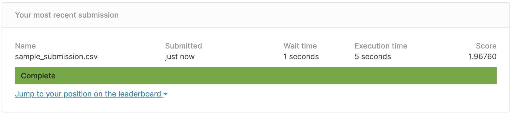

# suivi-du-data-camp-DeSantiago_Boulahfa_Akrout

Outil de réunion utilisé : Discord.
Lien : https://discord.gg/AdE39hSMD9

Semaine 1. 22 Janvier au 29 Janvier :
- Création de l'équipe
- Réflexion sur l'objectif du projet
- Premières manipulations de la base de données

Semaine 2. 29 Janvier au 05 Février :
- Récolte d'informations sur les variables de la base de données.
- Élaboration de pistes à explorer.
- Transformation du jeu de données pour les statistiques descriptives.
test.

**Samedi 06 Février** :

Kylliann -> Travail sur les statistiques descriptives sur les variables, création de la partie visualisation du GitHub, recherche de documentation sur le Multi-Target Regressor, structuration du code, tests d'exploitation de la piste de réflexion sur les prédictions successives, premiers essais de modèles naifs.

Jawad -> Travail sur la réorganisation et la visualisation des données (pie plots, density plots, ...), recherche d'informations sur le jeu de données (forum Kaggle, article: https://daslab.stanford.edu/site_data/pub_pdf/2014_Seetin_MIMB.pdf).

**Dimanche 07 Février** :

Kylliann -> poursuite du travail sur les modèles basiques, recodage de la base de données, MSE sur les modèles basiques pour le label 'reactivity'

Jawad -> Visualisation des données: ajout de scatter plots et d'histogrammes, recherche d'informations sur le jeu de données (https://www.kaggle.com/c/stanford-covid-vaccine/discussion/182320)

**Lundi 08 Février** :

Kylliann -> Ajout de la correlation entre les labels. Travail sur les modèles simple. Première soumission avec un modèle simple. Le score obtenu est 1.96760

**Jeudi 11 Février** :

Kylliann -> Modification des modèles + correction d'une erreur lors de la prédiction des labels. 2 soumissions ont été faites.
La première est la correction de la 1ère soumission, avec un score public de 0.54976 et un score privé de 0.46440.
La deuxième soumission avec un modèle légèrement plus complexe a obtenu un score public de 0.42532 et un score privé de 0.49538.

Jawad -> Ajout d'un pie plot pour les predicted_loop_type.
